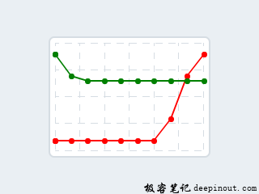
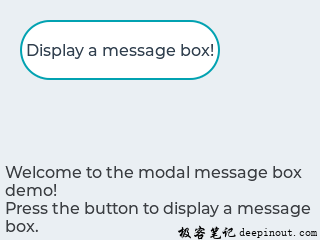

# lvgl笔记

[TOC]


## 1 lvgl教程

### 1.1  [LVGL 简介](https://deepinout.com/lvgl-tutorials/lvgl-getting-started/lvgl-intro.html)

LVGL(Light and Versatile Graphics Library），轻巧而多功能的图形库)是一个免费的开放源代码图形库，它提供创建具有易于使用的图形元素，精美的视觉效果和低内存占用的嵌入式GUI所需的一切。

#### LVGL主要特性

1. 功能强大的构建块，例如按钮，图表，列表，滑块，图像等。
2. 带有动画，抗锯齿，不透明，平滑滚动的高级图形
3. 各种输入设备，例如触摸板，鼠标，键盘，编码器等
4. 支持UTF-8编码的多语言
5. 多显示器支持，如TFT，单色显示器
6. 完全可定制的图形元素
7. 独立于任何微控制器或显示器使用的硬件
8. 可扩展以使用很少的内存(64 kB闪存，16 kB RAM)进行操作
9. 操作系统，支持外部存储器和GPU，但不是必需的
10. 单帧缓冲区操作，即使具有高级图形效果
11. 用C语言编写，以实现最大的兼容性(与C ++兼容)
12. 模拟器可在没有嵌入式硬件的PC上进行嵌入式GUI设计
13. 可移植到MicroPython
14. 可快速上手的教程、示例、主题
15. 丰富的文档教程
16. 在MIT许可下免费和开源

#### LVGL硬件要求

基本上，每个现代控制器(肯定必须要能够驱动显示器)都适合运行LVGL。LVGL的最低运行要求很低：

- 16、32或64位微控制器或处理器
- 最低 16 MHz 时钟频率
- Flash/ROM:：对于非常重要的组件要求 >64 kB(建议 > 180 kB)
- RAM
  - 静态 RAM 使用量：~2 kB，取决于所使用的功能和对象类型
  - 堆栈： > 2kB(建议 > 8 kB)
  - 动态数据(堆)：> 2 KB(如果使用多个对象，则建议 > 16 kB)。由 lv_conf.h 中的 LV_MEM_SIZE 宏进行设置。
  - 显示缓冲区：> “水平分辨率”像素(建议 > 10× “水平分辨率” )
  - MCU 或外部显示控制器中的一帧缓冲区
- C99或更高版本的编译器
- 具备基本的C(或C ++)知识：指针，结构，回调...

```shell
请注意，内存使用情况可能会因具体的体系结构、编译器和构建选项而异。
```

#### ==LVGL源码布局==

- **./lvgl** 库本身
- **./lv_drivers** 显示和输入设备驱动程序
- **./lv_examples** 示例和演示
- lvgl官方文档网站(https://docs.lvgl.io)
- lvgl官方博客博客站点(https://blog.lvgl.io)
- sim在线模拟器网站(https://sim.lvgl.io)
- lv_sim _... 适用于各种 IDE 和平台的模拟器项目
- lv_port _... 移植到其他开发板
- lv_binding _... 绑定到其他语言
- lv _...移植到其他平台

```shell
其中，lvgl，lv_examples和lv_drivers是最受维护、关注的核心存储库。
```


#### LVGL更新发行规则

- lvgl核心存储库遵循语义版本控制规则：
- 不兼容的API的主要版本更改。例如。 v5.0.0，v6.0.0
- 次要版本，用于新的但向后兼容的功能。例如。 v6.1.0，v6.2.0
- 修补程序版本，用于向后兼容的错误修复。例如。 v6.1.1，v6.1.2

### 1.2 LVGL 系统框架

应用程序创建 GUI 并处理特定任务的应用程序。

LVGL 本身是一个图形库。我们的应用程序通过调用 LVGL 库来创建 GUI 。它包含一个 HAL （硬件抽象层）接口，用于注册显示和输入设备驱动程序。

驱动程序除特定的驱动程序外，它还有其他的功能，可驱动显示器到 GPU (可选)、读取触摸板或按钮的输入。

根据 MCU ，有两种典型的硬件设置。 一个带有内置 LCD/TFT 驱动器的外围设备，而另一种是没有内置 LCD/TFT 驱动器的外围设备。 在这两种情况下，都需要一个 **帧缓冲区** 来存储屏幕的当前图像。

1. 集成了 TFT/LCD 驱动器的 MCU 如果 MCU 集成了 TFT/LCD 驱动器外围设备，则可以直接通过RGB接口连接显示器。 在这种情况下，帧缓冲区可以位于内部 RAM（如果MCU有足够的RAM）中，也可以位于外部RAM（如果MCU具有存储器接口）中。
2. 如果 MCU 没有集成 TFT/LCD 驱动程序接口，则必须使用外部显示控制器(例如 SSD1963、SSD1306、ILI9341 )。 在这种情况下，MCU 可以通过并行端口，SPI 或通过 I2C 与显示控制器进行通信。 帧缓冲区通常位于显示控制器中，从而为 MCU 节省了大量 RAM 。

### 1.3 [LVGL 建立一个lvgl项目](https://deepinout.com/lvgl-tutorials/lvgl-getting-started/lvgl-set-up-an-lvgl-project.html)

要在我们的项目中使用 lvgl ，我们起码需要获取到官方的这两个库：

- lvgl(lvgl)核心图形库的官方 GitHub 仓库地址：https://github.com/lvgl/lvgl。
- lvgl(lv_drivers)输入输出设备驱动官方 GitHub 仓库地址：https://github.com/lvgl/lv_drivers

我们可以克隆或下载这两个库的最新版本，将它们复制到我们的项目中，然后进行适配。

- 目录 lvgl 就是 lvgl 的官方图形库
- 目录 lv_drivers 是 lvgl 输入输出设备驱动官方示例配置
- 目录 [lv_examples](https://github.com/lvgl/lv_examples) 是 lvgl 的官方demo(可选，但不要直接使用到实际项目中)


#### LVGL配置文件

上面的三个库中有一个类似名为 **lv_conf_template.h** 的配置头文件(template就是模板的意思)。通过它可以设置库的基本行为，裁剪不需要模块和功能，在编译时调整内存缓冲区的大小等等。

1. 将 **lvgl/lv_conf_template.h** 复制到 lvgl 同级目录下，并将其重命名为 `lv_drv_conf.h` 。打开文件并将开头的 `#if 0` 更改为 `#if 1` 以使能其内容。
2. 将 **lv_drivers/lv_drv_conf_template.h** 复制到 lv_drivers 同级目录下，并将其重命名为 `lv_conf.h` 。打开文件并将开头的 `#if 0` 更改为 `#if 1` 以使能其内容。
3. (可选)将 **lv_examples/lv_ex_conf_template.h** 复制到 lv_examples 同级目录下，并将其重命名为 `lv_ex_conf.h` 。打开文件并将开头的 `#if 0` 更改为 `#if 1` 以使能其内容。


准备lvgl配置文件


使能配置文件

lv_conf.h 也可以复制到其他位置，但是应该在编译器选项中添加 `LV_CONF_INCLUDE_SIMPLE` 定义 (例如，对于 gcc 编译器为 `-DLV_CONF_INCLUDE_SIMPLE` ) 并手动设置包含路径。

在配置文件中，注释说明了各个选项的含义。我们在移植时至少要检查以下三个配置选项，其他配置根据具体的需要进行修改：

- `LV_HOR_RES_MAX` 显示器的水平分辨率。
- `LV_VER_RES_MAX` 显示器的垂直分辨率。
- `LV_COLOR_DEPTH` 颜色深度，其可以是：
- 8 - RG332
- 16 - RGB565
- 32 - (RGB888和ARGB8888)

#### 初始化lvgl

准备好这三个库：lvgl、lv_drivers、lv_examples 后，我们就要开始使用lvgl带给我们的功能了。使用 lvgl 图形库之前，我们还必须初始化 lvlg 以及相关其他组件。初始化的顺序为：

1. 调用 lv_init() 初始化 lvgl 库;
2. 初始化驱动程序；
3. 在 LVGL 中注册显示和输入设备驱动程序；
4. 在中断中每隔 `x毫秒` 调用 `lv_tick_inc(x)` 用以告知 lvgl 经过的时间；
5. 每隔 `x毫秒` 定期调用 `lv_task_handler()` 用以处理与 lvgl 相关的任务。

#### Windows初始化示例(Cdoe::Blocks)

如果你是基于 windows上的IDE模拟器(推荐) 进行学习，请先 配置好的项目工程 及 `windows上的IDE模拟器(Cdoe::Blocks)` 用于后面的学习。

```c
#if WIN32
int APIENTRY WinMain(HINSTANCE hInstance, HINSTANCE hPrevInstance, LPSTR szCmdLine, int nCmdShow)
#else
int main(int argc, char** argv)
{
        /*Initialize LittlevGL*/
        lv_init();

        /*Initialize the HAL for LittlevGL*/
        hal_init();

        /*Check the themes too*/
        lv_disp_set_default(lv_windows_disp);

        /*Run your APP here */


#if WIN32
        while(!lv_win_exit_flag) {
#else
        while(1) {
#endif // WIN32
                /* Periodically call the lv_task handler.
                 * It could be done in a timer interrupt or an OS task too.*/
                lv_task_handler();
                usleep(5*1000);       /*Just to let the system breath*/
                lv_tick_inc(5*1000)
        }
        return 0;
}
```

### 1.4 [LVGL 显示接口](https://deepinout.com/lvgl-tutorials/lvgl-getting-started/lvgl-display-interface.html)

要设置显示，必须初始化 `lv_disp_buf_t` 和 `lv_disp_drv_t` 变量。

- **lv_disp_buf_t** 保存显示缓冲区信息的结构体
- **lv_disp_drv_t** HAL要注册的显示驱动程序、与显示交互并处理与图形相关的结构体、回调函数。

#### LVGL显示缓冲区

`lv_disp_buf_t` 初始化示例：

```c
/*A static or global variable to store the buffers*/
static lv_disp_buf_t disp_buf;

/*Static or global buffer(s). The second buffer is optional*/
static lv_color_t buf_1[MY_DISP_HOR_RES * 10];
static lv_color_t buf_2[MY_DISP_HOR_RES * 10];

/*Initialize `disp_buf` with the buffer(s) */
lv_disp_buf_init(&disp_buf, buf_1, buf_2, MY_DISP_HOR_RES*10);
```

关于缓冲区大小，有 3 种情况：

1. **一个缓冲区** LVGL将屏幕的内保存到缓冲区中并将其发送到显示器。缓冲区可以小于屏幕。在这种情况下，较大的区域将被重画成多个部分。如果只有很小的区域发生变化(例如按下按钮)，则只会刷新该部分的区域。
2. **两个非屏幕大小的缓冲区** 具有两个缓冲区的 LVGL 可以将其中一个作为显示缓冲区，而另一缓冲区的内容发送到后台显示。应该使用 DMA 或其他硬件将数据传输到显示器，以让CPU同时绘图。这样，渲染和刷新并行处理。与 **一个缓冲区** 的情况类似，如果缓冲区小于要刷新的区域，LVGL将按块绘制显示内容
3. **两个屏幕大小的缓冲区** 与两个非屏幕大小的缓冲区相反，LVGL将始终提供整个屏幕的内容，而不仅仅是块。这样，驱动程序可以简单地将帧缓冲区的地址更改为从 LVGL 接收的缓冲区。因此，当MCU具有 LCD/TFT 接口且帧缓冲区只是 RAM 中的一个位置时，这种方法的效果很好。

#### LVGL显示驱动器

一旦缓冲区初始化准备就绪，就需要初始化显示驱动程序。在最简单的情况下，仅需要设置 `lv_disp_drv_t` 的以下两个字段：

- **buffer** 指向已初始化的 `lv_disp_buf_t` 变量的指针。
- **flush_cb** 回调函数，用于将缓冲区的内容复制到显示的特定区域。刷新准备就绪后，需要调用lv_disp_flush_ready()。 LVGL可能会以多个块呈现屏幕，因此多次调用flush_cb。使用 lv_disp_flush_is_last() 可以查看哪块是最后渲染的。

其中，有一些可选的数据字段：

- **hor_res** 显示器的水平分辨率。(默认为 lv_conf.h 中的 `LV_HOR_RES_MAX` )
- **ver_res** 显示器的垂直分辨率。 (默认为 lv_conf.h 中的 `LV_VER_RES_MAX` )
- **color_chroma_key** 在 chrome 键控图像上将被绘制为透明的颜色。(默认为 lv_conf.h 中的 `LV_COLOR_TRANSP` )
- **user_data** 驱动程序的自定义用户数据。可以在 lv_conf.h 中修改其类型。
- **anti-aliasing** 使用抗锯齿(anti-aliasing)(边缘平滑)。缺省情况下默认为 lv_conf.h 中的 `LV_ANTIALIAS` 。
- **rotated** 如果 `1` 交换 `hor_res` 和 `ver_res` 。两种情况下 LVGL 的绘制方向相同(从上到下的线条)，因此还需要重新配置驱动程序以更改显示器的填充方向。
- **screen_transp** 如果为 `1` ，则屏幕可以具有透明或不透明的样式。需要在 lv_conf.h 中启用 `LV_COLOR_SCREEN_TRANSP` 。

要使用GPU，可以使用以下回调：

- **gpu_fill_cb** 用颜色填充内存中的区域。
- **gpu_blend_cb** 使用不透明度混合两个内存缓冲区。
- **gpu_wait_cb** 如果在 GPU 仍在运行 LVGL 的情况下返回了任何 GPU 函数，则在需要确保GPU渲染就绪时将使用此函数。

> 注意，这些功能需要绘制到内存(RAM)中，而不是直接显示在屏幕上。

其他一些可选的回调，使单色、灰度或其他非标准RGB显示一起使用时更轻松、优化：

- **rounder_cb** 四舍五入要重绘的区域的坐标。例如。 2x2像素可以转换为2x8。如果显示控制器只能刷新特定高度或宽度的区域(对于单色显示器，通常为8 px高)，则可以使用它。
- **set_px_cb** 编写显示缓冲区的自定义函数。如果显示器具有特殊的颜色格式，则可用于更紧凑地存储像素。 (例如1位单色，2位灰度等)。这样，lv_disp_buf_t中使用的缓冲区可以较小，以仅保留给定区域大小所需的位数。 set_px_cb不能与两个屏幕大小的缓冲区一起显示缓冲区配置。
- **monitor_cb** 回调函数告诉在多少时间内刷新了多少像素。
- **clean_dcache_cb** 清除与显示相关的所有缓存的回调

要设置 lv_disp_drv_t 变量的字段，需要使用 lv_disp_drv_init(＆disp_drv) 进行初始化。最后，要为 LVGL 注册显示设备，需要调用lv_disp_drv_register(＆disp_drv)。

代码示例：

```c
lv_disp_drv_t disp_drv;                 /*A variable to hold the drivers. Can be local variable*/
lv_disp_drv_init(&disp_drv);            /*Basic initialization*/
disp_drv.buffer = &disp_buf;            /*Set an initialized buffer*/
disp_drv.flush_cb = my_flush_cb;        /*Set a flush callback to draw to the display*/
lv_disp_t * disp;
disp = lv_disp_drv_register(&disp_drv); /*Register the driver and save the created display objects*/
```

回调的一些简单示例：

```c
void my_flush_cb(lv_disp_drv_t * disp_drv, const lv_area_t * area, lv_color_t * color_p)
{
        /*The most simple case (but also the slowest) to put all pixels to the screen one-by-one*/
        int32_t x, y;
        for(y = area->y1; y <= area->y2; y++) {
                for(x = area->x1; x <= area->x2; x++) {
                        put_px(x, y, *color_p)
                        color_p++;
                }
        }

        /* IMPORTANT!!!
         * Inform the graphics library that you are ready with the flushing*/
        lv_disp_flush_ready(disp);
}

void my_gpu_fill_cb(lv_disp_drv_t * disp_drv, lv_color_t * dest_buf, const lv_area_t * dest_area, const lv_area_t * fill_area, lv_color_t color);
{
        /*It's an example code which should be done by your GPU*/
        uint32_t x, y;
        dest_buf += dest_width * fill_area->y1; /*Go to the first line*/

        for(y = fill_area->y1; y < fill_area->y2; y++) {
                for(x = fill_area->x1; x < fill_area->x2; x++) {
                        dest_buf[x] = color;
                }
                dest_buf+=dest_width;    /*Go to the next line*/
        }
}

void my_gpu_blend_cb(lv_disp_drv_t * disp_drv, lv_color_t * dest, const lv_color_t * src, uint32_t length, lv_opa_t opa)
{
        /*It's an example code which should be done by your GPU*/
        uint32_t i;
        for(i = 0; i < length; i++) {
                dest[i] = lv_color_mix(dest[i], src[i], opa);
        }
}

void my_rounder_cb(lv_disp_drv_t * disp_drv, lv_area_t * area)
{
  /* Update the areas as needed. Can be only larger.
   * For example to always have lines 8 px height:*/
   area->y1 = area->y1 & 0x07;
   area->y2 = (area->y2 & 0x07) + 8;
}

void my_set_px_cb(lv_disp_drv_t * disp_drv, uint8_t * buf, lv_coord_t buf_w, lv_coord_t x, lv_coord_t y, lv_color_t color, lv_opa_t opa)
{
        /* Write to the buffer as required for the display.
         * Write only 1-bit for monochrome displays mapped vertically:*/
 buf += buf_w * (y >> 3) + x;
 if(lv_color_brightness(color) > 128) (*buf) |= (1 << (y % 8));
 else (*buf) &= ~(1 << (y % 8));
}

void my_monitor_cb(lv_disp_drv_t * disp_drv, uint32_t time, uint32_t px)
{
  printf("%d px refreshed in %d ms\n", time, ms);
}

void my_clean_dcache_cb(lv_disp_drv_t * disp_drv, uint32)
{
  /* Example for Cortex-M (CMSIS) */
  SCB_CleanInvalidateDCache();
}
```

### 1.5 [LVGL 输入设备接口](https://deepinout.com/lvgl-tutorials/lvgl-getting-started/lvgl-input-device-interface.html)

#### LVGL输入设备的类型

要设置输入设备，必须初始化 `lv_indev_drv_t` 变量：

```c
lv_indev_drv_t indev_drv;
lv_indev_drv_init(&indev_drv);      /*Basic initialization*/
indev_drv.type =...                 /*See below.*/
indev_drv.read_cb =...              /*See below.*/

/*Register the driver in LVGL and save the created input device object*/
lv_indev_t * my_indev = lv_indev_drv_register(&indev_drv);
```

**类型** (indev_drv.type)可以是：

- **LV_INDEV_TYPE_POINTER** 触摸板或鼠标
- **LV_INDEV_TYPE_KEYPAD** 键盘或小键盘
- **LV_INDEV_TYPE_ENCODER** 带有左，右，推动选项的编码器
- **LV_INDEV_TYPE_BUTTON** 外部按钮按下屏幕

**read_cb** (indev_drv.read_cb)是一个函数指针，将定期调用该函数指针以报告输入设备的当前状态。它还可以缓冲数据并在没有更多数据要读取时返回 `false` ，或者在缓冲区不为空时返回 `true` 。

进一步了解有关 LVGL输入设备 的更多信息。

#### LVGL触摸板，鼠标或任何指针

可以单击屏幕点的输入设备属于此类别。

```c
indev_drv.type = LV_INDEV_TYPE_POINTER;
indev_drv.read_cb = my_input_read;

...

bool my_input_read(lv_indev_drv_t * drv, lv_indev_data_t*data)
{
        data->point.x = touchpad_x;
        data->point.y = touchpad_y;
        data->state = LV_INDEV_STATE_PR or LV_INDEV_STATE_REL;
        return false; /*No buffering now so no more data read*/
}
```

即使状态为 LV_INDEV_STATE_REL ，触摸板驱动程序也必须返回最后的 X/Y 坐标。

要设置鼠标光标，请使用 `lv_indev_set_cursor(my_indev,&img_cursor)` 。( `my_indev` 是 `lv_indev_drv_register` 的返回值)键盘或键盘

#### LVGL触摸板或键盘

带有所有字母的完整键盘或带有一些导航按钮的简单键盘均属于此处。

要使用键盘/触摸板：

- 注册具有 LV_INDEV_TYPE_KEYPAD 类型的 read_cb 函数。
- 在 lv_conf.h 中启用 LV_USE_GROUP
- 必须创建一个对象组：lv_group_t * g = lv_group_create()，并且必须使用 lv_group_add_obj(g，obj) 向其中添加对象
- 必须将创建的组分配给输入设备：lv_indev_set_group(my_indev，g)( my_indev 是 lv_indev_drv_register 的返回值)
- 使用 LV_KEY _... 在组中的对象之间导航。有关可用的密钥，请参见 lv_core/lv_group.h。

```c
indev_drv.type = LV_INDEV_TYPE_KEYPAD;
indev_drv.read_cb = keyboard_read;

...

bool keyboard_read(lv_indev_drv_t * drv, lv_indev_data_t*data){
  data->key = last_key();            /*Get the last pressed or released key*/

  if(key_pressed()) data->state = LV_INDEV_STATE_PR;
  else data->state = LV_INDEV_STATE_REL;

  return false; /*No buffering now so no more data read*/
}
```

#### LVGL编码器

可以通过下面四种方式使用编码器：

1. 按下按钮
2. 长按其按钮
3. 转左
4. 右转

简而言之，编码器输入设备的工作方式如下：

- 通过旋转编码器，可以专注于下一个/上一个对象。
- 在简单对象(如按钮)上按下编码器时，将单击它。
- 如果将编码器按在复杂的对象(如列表，消息框等)上，则该对象将进入编辑模式，从而转动编码器即可在对象内部导航。
- 长按按钮，退出编辑模式。

要使用编码器(类似于键盘)，应将对象添加到组中。

```c
indev_drv.type = LV_INDEV_TYPE_ENCODER;
indev_drv.read_cb = encoder_read;

...

bool encoder_read(lv_indev_drv_t * drv, lv_indev_data_t*data){
  data->enc_diff = enc_get_new_moves();

  if(enc_pressed()) data->state = LV_INDEV_STATE_PR;
  else data->state = LV_INDEV_STATE_REL;

  return false; /*No buffering now so no more data read*/
}
```

#### 使用带有编码器逻辑的按钮

除了标准的编码器行为外，您还可以利用其逻辑来使用按钮导航(聚焦)和编辑小部件。如果只有几个按钮可用，或者除编码器滚轮外还想使用其他按钮，这将特别方便。

需要有3个可用的按钮：

- **LV_KEY_ENTER** 将模拟按下或推动编码器按钮
- **LV_KEY_LEFT** 将向左模拟转向编码器
- **LV_KEY_RIGHT** 将正确模拟转向编码器
- 其他键将传递给焦点小部件

如果按住这些键，它将模拟indev_drv.long_press_rep_time中指定的时间段内的编码器单击。

```c
indev_drv.type = LV_INDEV_TYPE_ENCODER;
indev_drv.read_cb = encoder_with_keys_read;

...

bool encoder_with_keys_read(lv_indev_drv_t * drv, lv_indev_data_t*data){
  data->key = last_key();            /*Get the last pressed or released key*/
                                                                         /* use LV_KEY_ENTER for encoder press */
  if(key_pressed()) data->state = LV_INDEV_STATE_PR;
  else {
          data->state = LV_INDEV_STATE_REL;
          /* Optionally you can also use enc_diff, if you have encoder*/
          data->enc_diff = enc_get_new_moves();
  }

  return false; /*No buffering now so no more data read*/
```

#### LVGL按键

按钮是指屏幕旁边的外部“硬件”按钮，它们被分配给屏幕的特定坐标。如果按下按钮，它将模拟在指定坐标上的按下。 (类似于触摸板)

使用 lv_indev_set_button_points(my_indev, points_array) 将按钮分配给坐标。points_array应该看起来像const lv_point_t points_array [] = {{12,30}，{60,90}，...}

points_array不能超出范围。将其声明为全局变量或函数内部的静态变量。

```c
indev_drv.type = LV_INDEV_TYPE_BUTTON;
indev_drv.read_cb = button_read;

...

bool button_read(lv_indev_drv_t * drv, lv_indev_data_t*data){
        static uint32_t last_btn = 0;   /*Store the last pressed button*/
        int btn_pr = my_btn_read();     /*Get the ID (0,1,2...) of the pressed button*/
        if(btn_pr >= 0) {               /*Is there a button press? (E.g. -1 indicated no button was pressed)*/
           last_btn = btn_pr;           /*Save the ID of the pressed button*/
           data->state = LV_INDEV_STATE_PR;  /*Set the pressed state*/
        } else {
           data->state = LV_INDEV_STATE_REL; /*Set the released state*/
        }

        data->btn = last_btn;            /*Save the last button*/

        return false;                    /*No buffering now so no more data read*/
}
```

#### LVGL其它功能

除了 read_cb 之外，还可以在 lv_indev_drv_t 中指定 feedback_cb 回调。输入设备发送任何类型的事件时，都会调用feedback_cb。 (独立于其类型)。它允许为用户提供反馈，例如在LV_EVENT_CLICK上播放声音。

可以在lv_conf.h中设置以下参数的默认值，但可以在lv_indev_drv_t中覆盖默认值：

- **拖拽限制(drag_limit)** 实际拖动对象之前要滑动的像素数 drag_throw 拖曳速度降低[％]。更高的价值意味着更快的减速
- **(drag_throw)** 拖曳速度降低[％]。更高的价值意味着更快的减速
- **(long_press_time)** 按下时间发送 LV_EVENT_LONG_PRESSED (以毫秒为单位)
- **(long_press_rep_time)** 发送 LV_EVENT_LONG_PRESSED_REPEAT 的时间间隔(以毫秒为单位)
- **(read_task)** 指向读取输入设备的lv_task的指针。可以通过 `lv_task_...()` 函数更改其参数

每个输入设备都与一个显示器关联。默认情况下，新的输入设备将添加到最后创建的或显式选择的显示设备(使用lv_disp_set_default())。相关的显示已存储，并且可以在驱动程序的显示字段中更改。

### 1.6 [LVGL 心跳](https://deepinout.com/lvgl-tutorials/lvgl-getting-started/lvgl-heartbeat.html)

LVGL心跳，LVGL 需要系统滴答声才能知道动画和其他任务的经过时间。

为此我们需要定期调用 lv_tick_inc(tick_period) 函数，并以毫秒为单位告知调用周期。例如， lv_tick_inc(1) 用于每毫秒调用一次。

为了精确地知道经过的毫秒数，lv_tick_inc 应该在比 lv_task_handler() 更高优先级的例程中被调用(例如在中断中)，即使 lv_task_handler 的执行花费较长时间。

使用 FreeRTOS 时，可以在 vApplicationTickHook 中调用 lv_tick_inc 。

在基于 Linux 的设备上(例如在 Raspberry Pi 上)， lv_tick_inc 可以在如下所示的线程中调用，比如：

```c
void * tick_thread (void *args)
{
          while(1) {
                usleep(5*1000);   /*Sleep for 5 millisecond*/
                lv_tick_inc(5);      /*Tell LVGL that 5 milliseconds were elapsed*/
        }
}
```

### 1.7 [LVGL 任务处理器](https://deepinout.com/lvgl-tutorials/lvgl-getting-started/lvgl-task-handler.html)

**任务处理器(Task Handler)**要处理 LVGL 的任务，我们需要定期通过以下方式之一调用 lv_task_handler() ：

- mian 函数中设置 while(1) 调用
- 定期定时中断(低优先级然后是 lv_tick_inc()) 中调用
- 定期执行的 OS 任务中调用

计时并不严格，但应保持大约5毫秒以保持系统响应。

范例：

```c
while(1) {
  lv_task_handler();
  my_delay_ms(5);
}
```

### 1.8 [LVGL 睡眠管理](https://deepinout.com/lvgl-tutorials/lvgl-getting-started/lvgl-management-of-sleep.html)

**LVGL睡眠管理**，没有用户输入时，MCU 可以进入睡眠状态。在这种情况下，mian 函数中的 while(1) 应该看起来像这样：

```c
while(1) {
  /*Normal operation (no sleep) in < 1 sec inactivity*/
  if(lv_disp_get_inactive_time(NULL) < 1000) {
          lv_task_handler();
  }
  /*Sleep after 1 sec inactivity*/
  else {
          timer_stop();   /*Stop the timer where lv_tick_inc() is called*/
          sleep();                  /*Sleep the MCU*/
  }
  my_delay_ms(5);
}
```

如果发生唤醒(按，触摸或单击等)，还应该在输入设备读取功能中添加以下几行：

```c
lv_tick_inc(LV_DISP_DEF_REFR_PERIOD);  /*Force task execution on wake-up*/
timer_start();                         /*Restart the timer where lv_tick_inc() is called*/
lv_task_handler();                     /*Call `lv_task_handler()` manually to process the wake-up event*/
```

除了 lv_disp_get_inactive_time() 外，还可以调用 lv_anim_count_running() 来查看每个动画是否完成。

### 1.9 [LVGL 操作系统和中断](https://deepinout.com/lvgl-tutorials/lvgl-getting-started/lvgl-operating-system-and-interrupts.html)

LVGL默认情况下 **不是线程安全的** 。

但是，在以下情况中，调用 LVGL 相关函数是有效的：

- 在事件 (Events) 中。在 "事件" 中了解更多信息。
- 在 (lv_tasks) 中。在 "任务" 中了解更多信息。

#### 任务和线程

如果需要使用实际的任务或线程，则需要一个互斥锁，该互斥锁应在调用 lv_task_handler 之前被调用，并在其之后释放。同样，必须在与每个LVGL(lv _...)相关的函数调用和代码周围的其他任务和线程中使用相同的互斥锁。这样，就可以在真正的多任务环境中使用LVGL。只需使用互斥锁(mutex)即可避免同时调用 LVGL 函数。

#### 中断

避免从中断中调用 LVGL 函数( lv_tick_inc() 和 lv_disp_flush_ready() 除外)。但是，如果需要执行此操作，则必须在 lv_task_handler 运行时禁用 LVGL 函数的中断。设置标志或某个值并在 lv_task 中定期检查是一种不错的方法。

### 1.10 [LVGL 日志记录](https://deepinout.com/lvgl-tutorials/lvgl-getting-started/lvgl-logging.html)

LVGL 内置有日志模块，用于记录用户库中正在发生的事情。

#### LVGL日志级别

要启用日志记录，需要在 `lv_conf.h` 中将 **LV_USE_LOG** 设置为 `1` ，并将 **LV_LOG_LEVEL** 设置为以下值之一：

- **LV_LOG_LEVEL_TRACE** 记录所有信息
- **LV_LOG_LEVEL_INFO** 记录重要事件
- **LV_LOG_LEVEL_WARN** 记录是否发生了警告事件
- **LV_LOG_LEVEL_ERROR** 记录错误信息，当系统可能发生故障时或致命错误
- **LV_LOG_LEVEL_NONE** 不要记录任何东西

级别高于设置的日志级别的事件也将被记录。例如。如果使用 **LV_LOG_LEVEL_WARN** ，也会记录错误。

#### LVGL使用printf记录

如果您的系统支持printf，则只需在 `lv_conf.h` 中启用 **LV_LOG_PRINTF **即可发送带有 printf 的日志。

#### LVGL自定义日志功能

如果不能使用 printf 或想要使用自定义函数进行日志记录，可以使用 lv_log_register_print_cb() 注册 "logger" 回调。

例如：

```c
void my_log_cb(lv_log_level_t level, const char * file, int line, const char * fn_name, const char * dsc)
{
  /*Send the logs via serial port*/
  if(level == LV_LOG_LEVEL_ERROR) serial_send("ERROR: ");
  if(level == LV_LOG_LEVEL_WARN)  serial_send("WARNING: ");
  if(level == LV_LOG_LEVEL_INFO)  serial_send("INFO: ");
  if(level == LV_LOG_LEVEL_TRACE) serial_send("TRACE: ");

  serial_send("File: ");
  serial_send(file);

  char line_str[8];
  sprintf(line_str,"%d", line);
  serial_send("#");
  serial_send(line_str);

  serial_send(": ");
  serial_send(fn_name);
  serial_send(": ");
  serial_send(dsc);
  serial_send("\n");
}

...

lv_log_register_print_cb(my_log_cb);
```

#### LVGL添加日志

还可以通过 **LV_LOG_TRACE/INFO/WARN/ERROR(description)** 函数使用日志模块。

### 1.11 [LVGL 对象](https://deepinout.com/lvgl-tutorials/lvgl-getting-started/lvgl-objects.html)

在 LVGL 中，用户界面的基本构建块是对象，也称为小部件(widget)。例如，按钮，标签，图像，列表，图表或文本区域。

查看[极客笔记](https://deepinout.com/)中的 LVGL所有的对象类型(widget) 。

#### LVGL对象的属性(Attributes)

#### 对象的基本属性

所有对象类型都共享一些基本属性：

- Position (位置)
- Size (尺寸)
- Parent (父母)
- Drag enable (拖动启用)
- Click enable (单击启用)
- position (位置)
- 等等

我们可以使用 `lv_obj_set _...` 和 `lv_obj_get _...` 等前缀的函数设置或者获取这些属性。例如：

```c
/* 设置基础对象的属性 */
lv_obj_set_size(btn1, 100, 50);   /* 设置按键的大小 */
lv_obj_set_pos(btn1, 20,30);      /* 设置按键的位置 */
```

#### 对象的特殊属性

有些对象类型也具有特殊的属性。例如，滑块具有

- Min. max. values (最小最大值)
- Current value (当前值)
- Custom styles (自定义样式)

对于这些属性，每种对象类型都有唯一的 API 函数。例如一个滑块的 API 调用过程：

```c
/* 设置滑块的特殊属性 */
lv_slider_set_range(slider1, 0, 100);                   /* 设置滑块的最小值和最大值 */
lv_slider_set_value(slider1, 40, LV_ANIM_ON);   /* 设置当前值(屏幕坐标系位置) */
lv_slider_set_action(slider1, my_action);       /* 设置回调函数 */
```

要查看 API 的实现代码，可以检查相应的头文件（例如滑块对象的头文件 `lv_objx/lv_slider.h`）

#### LVGL对象的工作机制

亲子结构

父对象可以作为其子对象的容器。每个对象只能一个父对象（**屏幕除外**），但是一个父对象可以有无限多个子对象。父对象的类型没有限制，但是有特殊的父对象（例如，按钮）和特殊的子对象（例如，标签）。

#### LVGL追随原则

如果更改了父对象的位置，则子对象将与父对象一起移动，并且子对象的位置都保持相对于父对象位置不变。 例如，坐标 (0,0) 表示子对象将独立于父对象的位置保留在父对象的左上角，代码：


一个父子对象

```c
lv_obj_t * par = lv_obj_create(lv_scr_act(), NULL); /* 在当前屏幕中创建一个对象 */
lv_obj_set_size(par, 100, 80);                      /* 设置对象的大小 */

lv_obj_t * obj1 = lv_obj_create(par, NULL);         /* 基于前面创建的对象(par)创建一个子对象(obj1)，之前的对像成为父对象 */
lv_obj_set_pos(obj1, 10, 10);                       /* 设置子对象的位置 */
```

当我们修改父对象的位置，子对象也会一起移动，以保持和父对象的相对位置不变：


子对象跟随父对象

```c
lv_obj_set_pos(par, 50, 50);    /* 移动父对象，子对象也会跟着移动，以保持相对位置不变 */
```

#### 子对象仅在父对象的范围内可见

如果子对象的部分或全部不在其父级之内，则超出父对象的部分将不可见。


子对象超出父对象的部分不可见

```c
lv_obj_set_x(obj1, -30);        /* 将子对象移出一部分到从父对象的范围内之外 */
```

#### 创建-删除对象

在LVGL中，可以在运行时动态地创建和删除对象。这意味着仅当前创建的对象需要消耗RAM。例如，如果需要图表，我们可以在需要时创建它，并在不可见或不需要时将其删除。

每个对象类型都有各自的创建函数。它需要两个参数：

- 指向父对象的指针。创建屏幕时以 NULL 作为父级。
- 用于复制具有相同类型的对象的指针(可选)。如果不行进行复制操作为 NULL。

使用 lv_obj_t 指针作为句柄在 C 代码中引用所有对象。以后可以使用该指针设置或获取对象的属性。

创建函数如下所示：

```c
lv_obj_t * lv_ <type>_create(lv_obj_t * parent, lv_obj_t * copy);
```

所有对象类型都有一个通用的删除功能。它删除对象及其所有子对象。

```c
void lv_obj_del(lv_obj_t * obj);
```

`lv_obj_del` 将立即删除该对象。如果出于某种原因不能立即删除该对象，则可以使用 `lv_obj_del_async(obj)` ，例如，如果要删除子对象的 LV_EVENT_DELETE 信号中对象的父对象，这很有用。

我们可以使用 `lv_obj_clean` 删除对象的所有子对象（但不会删除对象本身）：

```c
void lv_obj_clean(lv_obj_t * obj);
```

#### LVGL屏幕对象

创建屏幕对象

屏幕是没有父对象的特殊对象。应该像这样创建它们：

```c
lv_obj_t * scr1 = lv_obj_create(NULL, NULL);
```

可以使用任何对象类型创建屏幕。例如：创建墙纸的基础对象或图像。

获取活动屏幕

这始终是每个显示屏上的活动屏幕。默认情况下，该库为每个显示创建并加载 “基础对象” 作为屏幕。

要获取当前活动的屏幕使用函数 `lv_scr_act()`

载入屏幕

调用函数 `lv_scr_load(scr1)` 加载屏幕。

加载屏幕动画

我们可以调用函数： `lv_scr_load_anim(scr, transition_type, time, delay, auto_del)` 加载屏幕动画。参数 `transition_type` 是动画过渡类型，该参数可设为：

- `LV_SCR_LOAD_ANIM_NONE` 延迟x毫秒后立即切换
- `LV_SCR_LOAD_ANIM_OVER_LEFT/RIGHT/TOP/BOTTOM` 将新屏幕移到给定方向上
- `LV_SCR_LOAD_ANIM_MOVE_LEFT/RIGHT/TOP/BOTTOM` 将旧屏幕和新屏幕都移至给定方向
- `LV_SCR_LOAD_ANIM_FADE_ON` 使新屏幕淡出旧屏幕

将 `auto_del` 设置为 `true` 会在动画结束时自动删除旧屏幕。

在延迟时间之后开始动画播放时，新屏幕将变为活动状态（由 `lv_scr_act()` 返回）。

处理多个显示

屏幕在当前选择的默认屏幕上创建。默认显示设备使用 `lv_disp_drv_register` 注册的最后一个屏幕作为显示，或者可以使用 `lv_disp_set_default(disp)` 显式选择新的默认显示屏幕。

`lv_scr_act()` , `lv_scr_load()` 和 `lv_scr_load_anim()` 将会在默认的屏幕上操作。

访问 多显示器支持 以了解更多信息。

#### LVGL零件(Parts)

widget 可以包含多个 Parts 。例如，按钮仅具有主要部分，而滑块则由背景，指示器和旋钮组成。

Parts 名称的构造类似于 `LV_ + <TYPE> _PART_ <NAME>` 。比如 `LV_BTN_PART_MAIN` 、 `LV_SLIDER_PART_KNOB` 。 通常在将样式添加到对象时使用 Parts。使用 Parts 可以将不同的样式分配给对象的不同 Parts 。

#### LVGL状态-States

对象可以处于以下状态的组合：

- **LV_STATE_DEFAULT** 默认或正常状态
- **LV_STATE_CHECKED** 选中或点击
- **LV_STATE_FOCUSED** 通过键盘或编码器聚焦或通过触摸板/鼠标单击
- **LV_STATE_EDITED** 由编码器编辑
- **LV_STATE_HOVERED** 鼠标悬停（现在还不支持）
- **LV_STATE_PRESSED** 按下
- **LV_STATE_DISABLED** 禁用或无效

当用户按下，释放，聚焦等对象时，状态通常由库自动检测更改。 当然状态也可以手动检测更改。 要完全覆盖当前状态，调用 `lv_obj_set_state(obj, part, LV_STATE...)` 要设置或清除某个状态(但不更改其他状态)，调用 `lv_obj_add/clear_state(obj, part, LV_STATE_...)` 可以组合使用状态值。例如： `lv_obj_set_state(obj, part, LV_STATE_PRESSED | LV_PRESSED_CHECKED)` .

要了解有关状态的更多信息，请阅读[极客笔记](https://deepinout.com/)中的 LVGL 样式(Styles) 概述的相关部分。

### 1.12 [LVGL 对象层级](https://deepinout.com/lvgl-tutorials/lvgl-getting-started/lvgl-objects-layers.html)

#### LVGL创建对象层级顺序

默认情况下，LVGL在背景上绘制旧对象，在前景上绘制新对象。

例如，假设我们向父对象添加了一个名为 button1 的按钮，然后又添加了另一个名为button2的按钮。 由于先创建了 button1，所以 button1 会被 button2 及其子对象覆盖。


```c
/*Create a screen*/
lv_obj_t * scr = lv_obj_create(NULL, NULL);
lv_scr_load(scr);                                                               /*Load the screen*/

/*Create 2 buttons*/
lv_obj_t * btn1 = lv_btn_create(scr, NULL);         /*Create a button on the screen*/
lv_btn_set_fit(btn1, true, true);                   /*Enable to automatically set the size according to the content*/
lv_obj_set_pos(btn1, 60, 40);                                   /*Set the position of the button*/

lv_obj_t * btn2 = lv_btn_create(scr, btn1);         /*Copy the first button*/
lv_obj_set_pos(btn2, 180, 80);                          /*Set the position of the button*/

/*Add labels to the buttons*/
lv_obj_t * label1 = lv_label_create(btn1, NULL);        /*Create a label on the first button*/
lv_label_set_text(label1, "Button 1");                  /*Set the text of the label*/

lv_obj_t * label2 = lv_label_create(btn2, NULL);        /*Create a label on the second button*/
lv_label_set_text(label2, "Button 2");                  /*Set the text of the label*/

/*Delete the second label*/
lv_obj_del(label2);
```

#### LVGL将图层设到前台(foreground)展示

有几种方法可以将对象置于前台：

- 使用 `lv_obj_set_top(obj，true)` 。如果 obj 或它的任何子对象被点击，那么 LVGL 将自动将该对象带到前台。它的工作原理类似于PC机上典型的GUI，当点击背景中的窗口时，它会在前台展示。
- 使用lv_obj_move_foreground(obj) 显式地告诉库将对象带到前台。类似地，使用 `lv_obj_move_background(obj)` 将对象 obj 移动到背台。
- 当使用 `lv_obj_set_parent(obj，new_parent)` 时， obj 将在 `new_parent` 的前面。

#### LVGL顶层和系统层

LVGL 有两个特殊的图层； `layer_top` 和 `layer_sys` 。两者在显示器的所有屏幕上都是可见且通用的。 **但是，它们不会在多个物理显示器之间共享。** `layer_top` 始终位于默认屏幕 ( `lv_scr_act()` )的顶部， `layer_sys` 则位于 `layer_top` 的顶部。用户可以使用 `layer_top` 来创建一些随处可见的内容。例如，菜单栏，弹出窗口等。如果启用了 `click` 属性，那么 `layer_top` 将吸收所有用户单击并充当模态。

```c
lv_obj_set_click(lv_layer_top(), true);
```

`layer_sys` 也用于LVGL。例如，它将鼠标光标放在那里以确保它始终可见。

### 1.13 [LVGL 事件](https://deepinout.com/lvgl-tutorials/lvgl-getting-started/lvgl-events.html)

LVGL中可触发事件，用于与用户进行交互。例如一个对应对象的事件可以有：

- 被点击
- 被拖拽
- 被更改了数值
- 等等

我们可以将回调函数分配给对象以处理这些事件。例如：

```c
lv_obj_t * btn = lv_btn_create(lv_scr_act(), NULL);
lv_obj_set_event_cb(btn, my_event_cb);      /* 指定一个事件回调函数 */

    ...

    static void my_event_cb(lv_obj_t * obj, lv_event_t event)
    {
            switch(event) {
                    case LV_EVENT_PRESSED:              /* 对象被按下 */
                            printf("Pressed\n");
                            break;

                    case LV_EVENT_SHORT_CLICKED:        /* 对象被点击 */
                            printf("Short clicked\n");
                            break;

                    case LV_EVENT_CLICKED:              /* 对象被短点击 */
                            printf("Clicked\n");
                            break;

                    case LV_EVENT_LONG_PRESSED:         /* 对象被长按 */
                            printf("Long press\n");
                            break;

                    case LV_EVENT_LONG_PRESSED_REPEAT:  /* 对象被重复长按 */
                            printf("Long press repeat\n");
                            break;

                    case LV_EVENT_RELEASED:             /* 对象被释放 */
                            printf("Released\n");
                            break;
            }

               /*Etc.*/
    }
```

注意：多个对象可以使用同一回调函数。

#### LVGL事件类型

事件类型有如下几种：

通用事件

所有对象（例如 Buttons/Labels/Sliders 等）都可以接收这些通用事件。

与输入设备有关的事件

当用户按下/释放对象时，将发送这些消息。它们不仅用于指针，还可以用于键盘，编码器和按钮输入设备。访问输入设备概述部分以了解有关它们的更多信息。

- **LV_EVENT_PRESSED** 该对象被按下
- **LV_EVENT_PRESSING** 按下对象（按下时连续发送）
- **LV_EVENT_PRESS_LOST** 输入设备仍在按，但不再在对象上
- **LV_EVENT_SHORT_CLICKED** 在 `LV_INDEV_LONG_PRESS_TIME` 时间之前发布。如果拖动则不调用。
- **LV_EVENT_LONG_PRESSED** 按下 `LV_INDEV_LONG_PRESS_TIME` 时间。如果拖动则不调用。
- **LV_EVENT_LONG_PRESSED_REPEAT** 在每 `LV_INDEV_LONG_PRESS_REP_TIME` 毫秒的 `LV_INDEV_LONG_PRESS_TIME` 之后调用。如果拖动则不调用。
- **LV_EVENT_CLICKED** 如果未拖动则调用释放（无论长按）
- **LV_EVENT_RELEASED** 在上面每种情况下都被调用，即使对象已被拖动也被释放。如果在按下并从对象外部释放时从对象上滑出，则不会调用。在这种情况下，将发送 `LV_EVENT_PRESS_LOST` 。

指针相关的事件

这些事件仅由类似指针的输入设备（例如鼠标或触摸板）触发

- **LV_EVENT_DRAG_BEGIN** 开始拖动对象
- **LV_EVENT_DRAG_END** 拖动完成（包括拖动）
- **LV_EVENT_DRAG_THROW_BEGIN** 拖动开始（用“动量”拖动后释放）

与键盘和编码器相关的事件

这些事件由键盘和编码器输入设备发送。在[极客笔记](https://deepinout.com/)中的LVGL 输入设备部分中了解有关组的更多信息。

- **LV_EVENT_KEY** 键值发送到对象。通常在按下它或在长按之后重复时。可以通过以下方式检索键值 `uint32_t * key = lv_event_get_data()`
- **LV_EVENT_FOCUSED** 该对象集中在其组中
- **LV_EVENT_DEFOCUSED** 该对象在其组中散焦

一般事件

LVGL库发送的其他一般事件。

- **LV_EVENT_DELETE** 该对象正在被删除。释放相关的用户分配数据。

特殊事件

这些事件特定于特定的对象类型。

- **LV_EVENT_VALUE_CHANGED** 对象值已更改（例如，对于滑块）
- **LV_EVENT_INSERT** 有内容插入到对象中。 （通常到文本区域）
- **LV_EVENT_APPLY** 单击“确定”，“应用”或类似的特定按钮。 （通常来自键盘对象）
- **LV_EVENT_CANCEL** 单击“关闭”，“取消”或类似的特定按钮。 （通常来自键盘对象）
- **LV_EVENT_REFRESH** 查询以刷新对象。永远不会由库发送，但可以由用户发送。

请访问特定对象类型的文档，以了解对象类型使用了哪些事件。

#### LVGL自定义事件包含的数据

一些事件可能包含自定义数据。 例如，在某些情况下， `LV_EVENT_VALUE_CHANGED` 会告知新值。有关更多信息，请参见特定对象类型的文档。 要在事件回调中获取自定义数据，请使用 `lv_event_get_data()` 。

自定义数据的类型取决于发送对象，但如果是下面两种情况需要特殊对待：

- 数值，则为 uint32_t * 或 int32_t * 类型
- 字符，则为 char * 或 const char * 类型

#### LVGL手动发送事件

任意事件

要将事件手动发送到对象，请使用 `lv_event_send(obj, LV_EVENT_..., &custom_data)` 。

例如，它可以通过模拟按钮按下来手动关闭消息框（尽管有更简单的方法）：

```c
/*Simulate the press of the first button (indexes start from zero)*/
uint32_t btn_id = 0;
lv_event_send(mbox, LV_EVENT_VALUE_CHANGED, &btn_id);
```

刷新事件

`LV_EVENT_REFRESH` 是特殊事件，因为它旨在供用户用来通知对象刷新自身。一些例子：

- 通知标签根据一个或多个变量（例如当前时间）刷新其文本
- 语言更改时刷新标签
- 如果满足某些条件，请启用按钮（例如，输入正确的PIN）
- 如果超出限制，则向对象添加样式/从对象删除样式等

处理类似情况的最简单方法是利用以下函数：

`lv_event_send_refresh(obj)` 只是 `lv_event_send(obj, LV_EVENT_REFRESH, NULL)` 的包装。因此，它仅向对象发送 `LV_EVENT_REFRESH` 。

`lv_event_send_refresh_recursive(obj)` 将 `LV_EVENT_REFRESH` 事件发送给对象及其所有子对象。如果将 `NULL` 作为参数传递，则将刷新所有显示的所有对象。

### 1.14 [LVGL 样式](https://deepinout.com/lvgl-tutorials/lvgl-getting-started/lvgl-styles.html)

#### LVGL 样式简介

样式用于设置对象的外观。 lvgl 中的样式在很大程度上受到 CSS 的启发。简而言之，概念如下：

- 样式是 `lv_style_t` 变量，可以保存属性，例如边框宽度，文本颜色等。它类似于 CSS 中的类。
- 并非必须指定所有属性。未指定的属性将使用默认值。
- 可以将样式分配给对象以更改其外观。
- 样式可以被任意数量的对象使用。
- 样式可以级联，也就是可以将多个样式分配给一个对象，并且每种样式可以具有不同的属性。例如，style_btn 可能会导致默认的灰色按钮，并且 style_btn_red 只能添加一个 background-color=red 以覆盖背景色
- 后面添加的样式具有更高的优先级。这意味着，如果以两种样式指定属性，则将使用后面添加的样式。
- 如果未在当前对象中指定样式，则某些属性(例如，文本颜色)默认从父对象继承。
- 对象具有比“普通”样式更高优先级的局部样式。
- 与 CSS (伪类描述不同的状态，例如： hover )不同，在 lvgl 中，将属性分配给给定的状态。(即“类”与状态无关，但是每个属性都有一个状态)
- 当对象更改状态时可以使用转场过渡效果。

#### LVGL 样式的状态(States)

- **LV_STATE_DEFAULT** (0x00)：正常，已释放
- **LV_STATE_CHECKED** (0x01)：切换或选中
- **LV_STATE_FOCUSED** (0x02)：通过键盘或编码器聚焦或通过触摸板/鼠标单击
- **LV_STATE_EDITED** (0x04)：由编码器编辑
- **LV_STATE_HOVERED** (0x08)：鼠标悬停(现在不支持)
- **LV_STATE_PRESSED** (0x10)：已按下
- **LV_STATE_DISABLED** (0x20)：禁用或 void

可以将状态进行组合使用，如： `LV_STATE_FOCUSED | LV_STATE_PRESSED`

可以在每种状态和状态组合中定义样式的属性。例如，为默认和按下状态设置不同的背景颜色。如果未在状态中定义属性，则将使用最佳匹配状态的属性。通常，它表示带有 `LV_STATE_DEFAULT` 状态的属性。如果即使对于默认状态也未设置该属性，则将使用默认值。

但是，“最佳匹配状态的属性”到底是什么意思？优先级由其值显示(请阅读上面：”样式的状态(States)“)。 **值越大，优先级越高** 。 为了确定要使用哪个属性，我们举一个例子。让我们来看看背景色是怎样定义的：

- `LV_STATE_DEFAULT` : white
- `LV_STATE_PRESSED` : gray
- `LV_STATE_FOCUSED` : red

1. 默认情况下，对象处于默认状态，因此很简单：该属性在对象的当前状态中定义为白色
2. 按下对象时，有2个相关属性：默认为白色(默认与每个状态有关)和按下为灰色。按下状态的优先级为0x10，高于默认状态的0x00优先级，因此将使用灰色。
3. 当物体聚焦时，会发生与按下状态相同的事情，并且将使用红色。(焦点状态的优先级高于默认状态)。
4. 聚焦并按下对象时，灰色和红色都可以使用，但是按下状态的优先级高于聚焦，因此将使用灰色。
5. 可以为设置例如玫瑰色。在这种情况下，此组合状态的优先级为0x02 + 0x10 = 0x12，该优先级高于按下状态的优先级，因此将使用玫瑰色。LV_STATE_PRESSED | LV_STATE_FOCUSED
6. 选中对象后，没有属性可以设置此状态的背景色。因此，在缺少更好的选择的情况下，对象在默认状态的属性中仍为白色。

注意事项：

- 如果要为所有状态设置属性(例如红色背景色)，只需将其设置为默认状态即可。如果对象找不到其当前状态的属性，它将回退到默认状态的属性。
- 使用ORed状态来描述复杂情况的属性。(例如，按+选中+集中)
- 对不同的状态使用不同的样式元素可能是一个好主意。例如，很难找到释放，按下，选中+按下，聚焦，聚焦+按下，聚焦+按下+选中 等状态的背景颜色。相反，例如，将背景色用于按下和选中状态，并使用不同的边框颜色指示聚焦状态。

#### LVGL 级联样式

不需要将所有属性设置为一种样式。可以向对象添加更多样式，然后让后来添加的样式修改或扩展其他样式的属性。例如，创建常规的灰色按钮样式，并为仅设置新的背景色的红色按钮创建新的样式。

在CSS中，所有使用的类都像 `<div class=".btn .btn-red">` 一样列出，这是相同的概念。

**较晚添加的样式优先于较早的样式。** 因此，在上面的灰色/红色按钮示例中，应首先添加常规按钮样式，然后再添加红色样式。 但是，仍然要优先考虑优先级问题。因此，让我们研究以下情况：

- 基本的按钮样式定义了默认状态为深灰色和按下状态为浅灰色
- 红色按钮样式仅在默认状态下将背景色定义为红色

在这种情况下，释放按钮时(它处于默认状态)它将是红色的，因为在最后添加的样式(红色样式)中找到了完美的匹配。按下按钮时，浅灰色是更好的搭配，因为它完美地描述了当前状态，因此按钮将是浅灰色的。

#### LVGL 样式继承

某些属性(通常与文本相关)可以从父对象的样式继承。仅当未以对象的样式(即使在默认状态下)设置给定属性时，才应用继承。

在这种情况下，如果该属性是可继承的，则该属性的值也将在父级中搜索，直到一部分可以告诉该属性的值为止。父母会用自己的状态来说明价值。按下按钮后，文字颜色就从这里来，将使用按下的文字颜色。

#### LVGL 零件(Parts)的样式

对象可以具有自己样式的零件。例如，页面包含四个部分(Parts)：

- 背景(Background)
- 可卷动(Scrollable)
- 滚动条(Scrollable)
- 边缘闪光(Edge flash)

对象零件有三种类型：主要(main)，虚拟(virtual)和真实(real)。

主要(main)部分通常是对象的背景和最大部分。某些对象只有一个主要部分。例如，一个按钮只有一个背景。

虚拟(virtual)小部件是实时绘制到主体小部件的其他小部件。它们后面没有“真实”对象。例如，页面的滚动条不是真实的对象，仅在绘制页面背景时才绘制。虚拟小部件始终具有与主要小部件相同的状态。如果可以继承该属性，则在转到父级之前还将考虑主体部分。

真实(real)小部件是由主对象创建和管理的真实对象。例如，页面的可滚动部分是真实对象。实际小部件的状态可能与主要小部件的状态不同。

#### LVGL 初始化样式并设置、获取属性

样式存储在 `lv_style_t` 变量中。样式变量应为 **static** 、 **全局** 或 **动态分配** 。 也就是说，它们不能是函数中的局部变量，在函数存在时销毁。 在使用样式之前，应使用 `lv_style_init(&my_style)` 进行初始化 。 初始化后，我们就可以设置样式的属性。 属性集函数如下所示：`lv_style_set_<property_name>(&style, <state>, <value>);` 例如，上面提到的示例如下所示：

```c
static lv_style_t style1;
lv_style_init(&style1);
lv_style_set_size(&style1, LV_STATE_DEFAULT, 4);
lv_style_set_bg_opa(&style1, LV_STATE_DEFAULT, LV_OPA_COVER);
lv_style_set_bg_color(&style1, LV_STATE_DEFAULT, lv_color_hex3(0xeee));
lv_style_set_radius(&style1, LV_STATE_DEFAULT, LV_RADIUS_CIRCLE);
lv_style_set_pad_right(&style1, LV_STATE_DEFAULT, 4);
```

可以使用 lv_style_copy(＆style_destination，＆style_source) 复制样式。复制后，仍然可以自由添加属性。

要删除样式的属性，请使用：

```c
lv_style_remove_prop(&style, LV_STYLE_BG_COLOR | (LV_STATE_PRESSED << LV_STYLE_STATE_POS));
```

要从给定状态的样式中获取值，可以使用以下原型的功能：

```c
_lv_style_get_color/int/opa/ptr(&style, <prop>, <result buf>);
```

这样将选择最匹配的属性，并返回其优先级。如果找不到该属性，将返回 `-1` 。

函数的形式 (…color/int/opa/ptr) 应根据 `<prop>` 的类型使用。

例如：

```c
lv_color_t color;
int16_t res;
res = _lv_style_get_color(&style1,  LV_STYLE_BG_COLOR | (LV_STATE_PRESSED << LV_STYLE_STATE_POS), &color);
if(res >= 0) {
  //the bg_color is loaded into `color`
}
```

要重置样式(释放所有数据)，调用：

```c
lv_style_reset(&style);
```

#### LVGL 管理样式列表

样式本身不能发挥作用。只有将其分配给对象使用才能生效。对象的每个部分都存储一个样式列表，该列表是已分配样式的列表。

调用 `lv_obj_add_style(obj, <part>, &style);` 将样式添加到对象，例如：

```c
lv_obj_add_style(btn, LV_BTN_PART_MAIN, &btn);      /*Default button style*/
lv_obj_add_style(btn, LV_BTN_PART_MAIN, &btn_red);  /*Overwrite only a some colors to red*/
```

调用下面的函数重置对象样式列表：

```c
lv_obj_reset_style_list(obj, <part>);
```

如果已经分配给对象的样式发生更改(即，其属性之一设置为新值)，则应通过以下方式通知使用该样式的对象：

```c
lv_obj_refresh_style(obj)
```

要刷新所有零件和属性，调用：

```c
lv_obj_refresh_style(obj, LV_OBJ_PART_ALL, LV_STYLE_PROP_ALL)
```

要获取属性的最终值，包括级联，继承，局部样式和过渡(请参见下文)，可以使用以下类似的函数获取：

```c
lv_obj_get_style_<property_name>(obj, <part>);
```

这些函数使用对象的当前状态，如果没有更好的候选者，则返回默认值。例如：

```c
lv_color_t color = lv_obj_get_style_bg_color(btn, LV_BTN_PART_MAIN);
```

#### LVGL 本地风格

在对象的样式列表中，也可以存储所谓的局部属性。其与 CSS 的 `<div style="color:red">` 概念相同。局部样式与普通样式相同，但是它仅属于给定的对象， **不能与其他对象共享** 。要设置本地属性，请使用函数：

```c
lv_obj_set_style_local_<property_name>(obj, <part>, <state>, <value>);
```

例如

```c
lv_obj_set_style_local_bg_color(btn, LV_BTN_PART_MAIN, LV_STATE_DEFAULT, LV_COLOR_RED);
```

#### LVGL 样式过渡

默认情况下，当对象更改状态(例如，按下状态)时，会立即设置新状态下的新属性。但是，通过过渡，可以在状态改变时播放过渡动画。例如：在按下按钮后，可以在300毫秒内将其背景色设置为所按下的颜色。

过渡的参数存储在样式中。可以设置：

- 过渡时间
- 开始过渡之前的延迟
- 动画路径(也称为计时功能)
- 要设置动画的属性

可以为每个状态定义过渡属性。例如，将500 ms过渡时间设置为默认状态将意味着当对象进入默认状态时，将应用500 ms过渡时间。在按下状态下设置100 ms过渡时间将意味着在进入按下状态时100 ms过渡时间。因此，此示例配置将导致快速进入印刷机状态而缓慢回到默认状态。

#### LVGL 样式属性

样式中可以使用以下属性：

混合属性

- **radius(lv_style_int_t)**： 设置背景的半径。0：无半径，LV_RADIUS_CIRCLE：最大半径。默认值：0。
- **clip_corner(bool)**： 为true可以将溢出的内容剪切到圆角(半径> 0)上。默认值：false。
- **size(lv_style_int_t)**： 小部件内部元素的大小。是否使用此属性，请参见窗口小部件的文档。默认值：。LV_DPI / 20
- **transform_width (lv_style_int_t)**： 使用此值使对象在两侧更宽。默认值：0。
- **transform_height (lv_style_int_t)**：使用此值使对象在两侧都较高。默认值：0。
- **transform_angle (lv_style_int_t)**： 旋转类似图像的对象。它的uinit为0.1度，对于45度使用450。默认值：0。
- **transform_zoom (lv_style_int_t)**： 缩放类似图像的对象。LV_IMG_ZOOM_NONE正常大小为256(或)，一半为128，一半为512，等等。默认值：LV_IMG_ZOOM_NONE。
- **opa_scale(lv_style_int_t)**： 继承。按此比例缩小对象的所有不透明度值。由于继承了子对象，因此也会受到影响。默认值：LV_OPA_COVER。

#### 填充和边距属性

填充可在边缘的内侧设置空间。意思是“我不要我的孩子们离我的身体太近，所以要保留这个空间”。填充内部设置了孩子之间的“差距”。 边距在边缘的外侧设置空间。意思是“我想要我周围的空间”。 如果启用了布局或 自动调整，则这些属性通常由Container对象使用。但是，其他小部件也使用它们来设置间距。有关详细信息，请参见[极客笔记](https://deepinout.com/)中的 小部件(widgets) 的文档。

- **pad_top(lv_style_int_t)**： 在顶部设置填充。默认值：0。
- **pad_bottom(lv_style_int_t)**： 在底部设置填充。默认值：0。
- **pad_left(lv_style_int_t)**： 在左侧设置填充。默认值：0。
- **pad_right(lv_style_int_t)**： 在右侧设置填充。默认值：0。
- **pad_inner(lv_style_int_t)**： 设置子对象之间对象内部的填充。默认值：0。
- **margin_top(lv_style_int_t)**： 在顶部设置边距。默认值：0。
- **margin_bottom(lv_style_int_t)**： 在底部设置边距。默认值：0。
- **margin_left(lv_style_int_t)**： 在左边设置边距。默认值：0。
- **margin_right(lv_style_int_t)**： 在右边设置边距。默认值：0。

#### 背景属性

背景是一个简单的矩形，可以具有渐变和半径舍入。

- **bg_color** ( `lv_color_t` )： 指定背景的颜色。默认值：**LV_COLOR_WHITE**。
- **bg_opa** ( `lv_opa_t` )： 指定背景的不透明度。默认值：**LV_OPA_TRANSP**。
- **bg_grad_color** ( `lv_color_t` )： 指定背景渐变的颜色。右侧或底部的颜色是： **bg_grad_dir != LV_GRAD_DIR_NONE**。默认值： **LV_COLOR_WHITE**
- **bg_main_stop** ( `uint8_t` )： 指定渐变应从何处开始。0：最左/最上位置，255：最右/最下位置。默认值：0。
- **bg_grad_stop** ( `uint8_t` )： 指定渐变应在何处停止。0：最左/最上位置，255：最右/最下位置。预设值：255。
- **bg_grad_dir** ( `lv_grad_dir_t` )： 指定渐变的方向。可以是 **LV_GRAD_DIR_NONE/HOR/VER**。默认值：**LV_GRAD_DIR_NONE**。
- **bg_blend_mode** ( `lv_blend_mode_t` )： 将混合模式设置为背景。可以是 **LV_BLEND_MODE_NORMAL/ADDITIVE/SUBTRACTIVE)**。默认值：**LV_BLEND_MODE_NORMAL**。


渐变的矩形背景

上述效果的示例代码：

```c
#include "../../lv_examples.h"

/**
 * Using the background style properties
 */
void lv_ex_style_1(void)
{
        static lv_style_t style;
        lv_style_init(&style);
        lv_style_set_radius(&style, LV_STATE_DEFAULT, 5);

        /*Make a gradient*/
        lv_style_set_bg_opa(&style, LV_STATE_DEFAULT, LV_OPA_COVER);
        lv_style_set_bg_color(&style, LV_STATE_DEFAULT, LV_COLOR_SILVER);
        lv_style_set_bg_grad_color(&style, LV_STATE_DEFAULT, LV_COLOR_BLUE);
        lv_style_set_bg_grad_dir(&style, LV_STATE_DEFAULT, LV_GRAD_DIR_VER);

        /*Shift the gradient to the bottom*/
        lv_style_set_bg_main_stop(&style, LV_STATE_DEFAULT, 128);
        lv_style_set_bg_grad_stop(&style, LV_STATE_DEFAULT, 192);


        /*Create an object with the new style*/
        lv_obj_t * obj = lv_obj_create(lv_scr_act(), NULL);
        lv_obj_add_style(obj, LV_OBJ_PART_MAIN, &style);
        lv_obj_align(obj, NULL, LV_ALIGN_CENTER, 0, 0);
}
```

#### 边框属性

边框绘制在背景顶部。它具有圆角 `半径` 。

- **border_color** ( `lv_color_t` )： 指定边框的颜色。默认值：**LV_COLOR_BLACK**。
- **border_opa** ( `lv_opa_t` )： 指定边框的不透明度。默认值：**LV_OPA_COVER**。
- **border_width** ( `lv_style_int_t` )： 设置边框的宽度。默认值：**0**。
- **border_side** ( `lv_border_side_t` )： 指定要绘制边框的哪一侧。可以是 **LV_BORDER_SIDE_NONE/LEFT/RIGHT/TOP/BOTTOM/FULL** 。ORed值也是可能的。默认值： **LV_BORDER_SIDE_FULL** 。
- **border_post** ( `bool` )： 如果true在绘制完所有子级之后绘制边框。默认值：**false**。
- **border_blend_mode** ( `lv_blend_mode_t` )： 设置边框的混合模式。可以是 **LV_BLEND_MODE_NORMAL/ADDITIVE/SUBTRACTIVE**。默认值： **LV_BLEND_MODE_NORMAL**


设置圆角边框

上述效果的示例代码：

```c
#include "../../lv_examples.h"

/**
 * Using the border style properties
 */
void lv_ex_style_2(void)
{
        static lv_style_t style;
        lv_style_init(&style);

        /*Set a background color and a radius*/
        lv_style_set_radius(&style, LV_STATE_DEFAULT, 20);
        lv_style_set_bg_opa(&style, LV_STATE_DEFAULT, LV_OPA_COVER);
        lv_style_set_bg_color(&style, LV_STATE_DEFAULT, LV_COLOR_SILVER);

        /*Add border to the bottom+right*/
        lv_style_set_border_color(&style, LV_STATE_DEFAULT, LV_COLOR_BLUE);
        lv_style_set_border_width(&style, LV_STATE_DEFAULT, 5);
        lv_style_set_border_opa(&style, LV_STATE_DEFAULT, LV_OPA_50);
        lv_style_set_border_side(&style, LV_STATE_DEFAULT, LV_BORDER_SIDE_BOTTOM | LV_BORDER_SIDE_RIGHT);

        /*Create an object with the new style*/
        lv_obj_t * obj = lv_obj_create(lv_scr_act(), NULL);
        lv_obj_add_style(obj, LV_OBJ_PART_MAIN, &style);
        lv_obj_align(obj, NULL, LV_ALIGN_CENTER, 0, 0);
}
```

#### 轮廓属性

轮廓类似于边框，但绘制在对象外部。

- **outline_color** ( `lv_color_t` )：指定轮廓的颜色。默认值： **LV_COLOR_BLACK** 。
- **outline_opa** ( `lv_opa_t` )：指定轮廓的不透明度。默认值：**LV_OPA_COVER**。
- **outline_width** ( `lv_style_int_t` )：设置轮廓的宽度。默认值：**0**。
- **outline_pad** ( `lv_style_int_t` )：设置对象和轮廓之间的空间。默认值：**0**。
- **outline_blend_mode** ( `lv_blend_mode_t` )：设置轮廓的混合模式。可以是 **LV_BLEND_MODE_NORMAL/ADDITIVE/SUBTRACTIVE**。默认值： **LV_BLEND_MODE_NORMAL** 。


设置轮廓

上述效果的示例代码：

```c
#include "../../lv_examples.h"

/**
 * Using the outline style properties
 */
void lv_ex_style_3(void)
{
        static lv_style_t style;
        lv_style_init(&style);

        /*Set a background color and a radius*/
        lv_style_set_radius(&style, LV_STATE_DEFAULT, 5);
        lv_style_set_bg_opa(&style, LV_STATE_DEFAULT, LV_OPA_COVER);
        lv_style_set_bg_color(&style, LV_STATE_DEFAULT, LV_COLOR_SILVER);

        /*Add outline*/
        lv_style_set_outline_width(&style, LV_STATE_DEFAULT, 2);
        lv_style_set_outline_color(&style, LV_STATE_DEFAULT, LV_COLOR_BLUE);
        lv_style_set_outline_pad(&style, LV_STATE_DEFAULT, 8);

        /*Create an object with the new style*/
        lv_obj_t * obj = lv_obj_create(lv_scr_act(), NULL);
        lv_obj_add_style(obj, LV_OBJ_PART_MAIN, &style);
        lv_obj_align(obj, NULL, LV_ALIGN_CENTER, 0, 0);
}
```

#### 阴影属性

阴影是对象下方的模糊区域。

- **shadow_color** ( `lv_color_t` )：指定阴影的颜色。默认值： **LV_COLOR_BLACK**。
- **shadow_opa** ( `lv_opa_t` )：指定阴影的不透明度。默认值：**LV_OPA_TRANSP**。
- **shadow_width** ( `lv_style_int_t` )：设置轮廓的宽度(模糊大小)。默认值：**0**。
- **shadow_ofs_x** ( `lv_style_int_t` )：设置阴影的X偏移量。默认值：**0**。
- **shadow_ofs_y** ( `lv_style_int_t` )：设置阴影的Y偏移量。默认值：**0**。
- **shadow_spread** ( `lv_style_int_t` )：在每个方向上使阴影大于背景的值达到此值。默认值：**0**。
- **shadow_blend_mode** ( `lv_blend_mode_t` )：设置阴影的混合模式。可以是 **LV_BLEND_MODE_NORMAL/ADDITIVE/SUBTRACTIVE** 。默认值：**LV_BLEND_MODE_NOR**


设置阴影

上述效果的示例代码：

```c
#include "../../lv_examples.h"

/**
 * Using the Shadow style properties
 */
void lv_ex_style_4(void)
{
        static lv_style_t style;
        lv_style_init(&style);

        /*Set a background color and a radius*/
        lv_style_set_radius(&style, LV_STATE_DEFAULT, 5);
        lv_style_set_bg_opa(&style, LV_STATE_DEFAULT, LV_OPA_COVER);
        lv_style_set_bg_color(&style, LV_STATE_DEFAULT, LV_COLOR_SILVER);

        /*Add a shadow*/
        lv_style_set_shadow_width(&style, LV_STATE_DEFAULT, 8);
        lv_style_set_shadow_color(&style, LV_STATE_DEFAULT, LV_COLOR_BLUE);
        lv_style_set_shadow_ofs_x(&style, LV_STATE_DEFAULT, 10);
        lv_style_set_shadow_ofs_y(&style, LV_STATE_DEFAULT, 20);

        /*Create an object with the new style*/
        lv_obj_t * obj = lv_obj_create(lv_scr_act(), NULL);
        lv_obj_add_style(obj, LV_OBJ_PART_MAIN, &style);
        lv_obj_align(obj, NULL, LV_ALIGN_CENTER, 0, 0);
}
```

#### 图案属性

图案是在背景中间绘制或重复以填充整个背景的图像(或符号)。

- **pattern_image** (`const void *`)：指向 **lv_img_dsc_t** 变量的指针，图像文件或符号的路径。默认值：**NULL** 。
- **pattern_opa** (`lv_opa_t`) ：指定图案的不透明度。默认值： **LV_OPA_COVER** 。
- **pattern_recolor** (`lv_color_t`) ：将此颜色混合到图案图像中。如果是符号(文本)，它将是文本颜色。默认值： **LV_COLOR_BLACK** 。
- **pattern_recolor_opa** (`lv_opa_t`) ：重新着色的强度。默认值： **LV_OPA_TRANSP** (不重新着色)。
- **pattern_repeat** (`bool`)： `true` 图案将作为马赛克重复。 **false** ：将图案放置在背景中间。默认值： **false** 。
- **pattern_blend_mode** (`lv_blend_mode_t`) ：设置图案的混合模式。可以是 **LV_BLEND_MODE_NORMAL/ADDITIVE/SUBTRACTIVE**。默认值：**LV_BLEND_MODE_NORMAL**。


设置图案

上述效果的示例代码：

```c
#include "../../lv_examples.h"

/**
 * Using the pattern style properties
 */
void lv_ex_style_5(void)
{
        static lv_style_t style;
        lv_style_init(&style);

        /*Set a background color and a radius*/
        lv_style_set_radius(&style, LV_STATE_DEFAULT, 5);
        lv_style_set_bg_opa(&style, LV_STATE_DEFAULT, LV_OPA_COVER);
        lv_style_set_bg_color(&style, LV_STATE_DEFAULT, LV_COLOR_SILVER);

        /*Add a repeating pattern*/
        lv_style_set_pattern_image(&style, LV_STATE_DEFAULT, LV_SYMBOL_OK);
        lv_style_set_pattern_recolor(&style, LV_STATE_DEFAULT, LV_COLOR_BLUE);
        lv_style_set_pattern_opa(&style, LV_STATE_DEFAULT, LV_OPA_50);
        lv_style_set_pattern_repeat(&style, LV_STATE_DEFAULT, true);

        /*Create an object with the new style*/
        lv_obj_t * obj = lv_obj_create(lv_scr_act(), NULL);
        lv_obj_add_style(obj, LV_OBJ_PART_MAIN, &style);
        lv_obj_align(obj, NULL, LV_ALIGN_CENTER, 0, 0);
}
```

#### 数值属性

值是绘制到背景的任意文本。它可以是创建标签对象的轻量级替代。

- **value_str** ( `const char *` )：指向要显示的文本的指针。仅保存指针！(不要将局部变量与 lv_style_set_value_str 一起使用，而应使用静态，全局或动态分配的数据)。默认值： **NULL**
- **value_color** ( `lv_color_t` )：文本的颜色。默认值：**LV_COLOR_BLACK**。
- **value_opa** ( `lv_opa_t` )：文本的不透明度。默认值：**LV_OPA_COVER**。
- **value_font** ( `const lv_font_t *` )**：指向文本字体的指针。默认值：**NULL**
- **value_letter_space** ( `lv_style_int_t` )：文本的字母空间。默认值：**0**。
- **value_line_space** ( `lv_style_int_t` )：文本的行距。默认值：**0**。
- **value_align** ( `lv_align_t` )：文本的对齐方式。可以是 **LV_ALIGN_…** 。默认值：**LV_ALIGN_CENTER**。
- **value_ofs_x** ( `lv_style_int_t` )：与路线原始位置的X偏移量。默认值：**0**。
- **value_ofs_y** ( `lv_style_int_t` )：从路线的原始位置偏移Y。默认值：**0**。
- **value_blend_mode** ( `lv_blend_mode_t` )：设置文本的混合模式。可以是 **LV_BLEND_MODE_NORMAL/ADDITIVE/SUBTRACTIVE**。默认值：**LV_BLEND_MODE_NORMAL**。


设置图案

上述效果的示例代码：

```c
#include "../../lv_examples.h"

/**
 * Using the value style properties
 */
void lv_ex_style_6(void)
{
        static lv_style_t style;
        lv_style_init(&style);

        /*Set a background color and a radius*/
        lv_style_set_radius(&style, LV_STATE_DEFAULT, 5);
        lv_style_set_bg_opa(&style, LV_STATE_DEFAULT, LV_OPA_COVER);
        lv_style_set_bg_color(&style, LV_STATE_DEFAULT, LV_COLOR_SILVER);

        /*Add a value text properties*/
        lv_style_set_value_color(&style, LV_STATE_DEFAULT, LV_COLOR_BLUE);
        lv_style_set_value_align(&style, LV_STATE_DEFAULT, LV_ALIGN_IN_BOTTOM_RIGHT);
        lv_style_set_value_ofs_x(&style, LV_STATE_DEFAULT, 10);
        lv_style_set_value_ofs_y(&style, LV_STATE_DEFAULT, 10);

        /*Create an object with the new style*/
        lv_obj_t * obj = lv_obj_create(lv_scr_act(), NULL);
        lv_obj_add_style(obj, LV_OBJ_PART_MAIN, &style);
        lv_obj_align(obj, NULL, LV_ALIGN_CENTER, 0, 0);

        /*Add a value text to the local style. This way every object can have different text*/
        lv_obj_set_style_local_value_str(obj, LV_OBJ_PART_MAIN, LV_STATE_DEFAULT, "Text");
}
```

#### 文字属性

文本对象的属性。

- **text_color** ( `lv_color_t` )：文本的颜色。默认值：**LV_COLOR_BLACK** 。
- **text_opa** ( `lv_opa_t` )：文本的不透明度。默认值：**LV_OPA_COVER** 。
- **text_font** ( `const lv_font_t *` )：指向文本字体的指针。默认值：。**NULL**
- **text_letter_space** ( `lv_style_int_t` )：文本的字母空间。默认值：**0** 。
- **text_line_space** ( `lv_style_int_t` )：文本的行距。默认值：**0** 。
- **text_decor** ( `lv_text_decor_t` )：添加文字修饰。可以是 **LV_TEXT_DECOR_NONE/UNDERLINE/STRIKETHROUGH** 。默认值：**LV_TEXT_DECOR_NONE**。
- **text_sel_color** ( `lv_color_t` )：设置文本选择的背景色。默认值：**LV_COLOR_BLACK**
- **text_blend_mode** ( `lv_blend_mode_t` )：设置文本的混合模式。可以**LV_BLEND_MODE_NORMAL/ADDITIVE/SUBTRACTIVE** 。默认值：**LV_BLEND_MODE_NORMAL**。


设置文字

上述效果的示例代码：

```c
#include "../../lv_examples.h"

/**
 * Using the text style properties
 */
void lv_ex_style_7(void)
{
        static lv_style_t style;
        lv_style_init(&style);

        lv_style_set_radius(&style, LV_STATE_DEFAULT, 5);
        lv_style_set_bg_opa(&style, LV_STATE_DEFAULT, LV_OPA_COVER);
        lv_style_set_bg_color(&style, LV_STATE_DEFAULT, LV_COLOR_SILVER);
        lv_style_set_border_width(&style, LV_STATE_DEFAULT, 2);
        lv_style_set_border_color(&style, LV_STATE_DEFAULT, LV_COLOR_BLUE);

        lv_style_set_pad_top(&style, LV_STATE_DEFAULT, 10);
        lv_style_set_pad_bottom(&style, LV_STATE_DEFAULT, 10);
        lv_style_set_pad_left(&style, LV_STATE_DEFAULT, 10);
        lv_style_set_pad_right(&style, LV_STATE_DEFAULT, 10);

        lv_style_set_text_color(&style, LV_STATE_DEFAULT, LV_COLOR_BLUE);
        lv_style_set_text_letter_space(&style, LV_STATE_DEFAULT, 5);
        lv_style_set_text_line_space(&style, LV_STATE_DEFAULT, 20);
        lv_style_set_text_decor(&style, LV_STATE_DEFAULT, LV_TEXT_DECOR_UNDERLINE);

        /*Create an object with the new style*/
        lv_obj_t * obj = lv_label_create(lv_scr_act(), NULL);
        lv_obj_add_style(obj, LV_LABEL_PART_MAIN, &style);
        lv_label_set_text(obj, "Text of\n"
                                                        "a label");
        lv_obj_align(obj, NULL, LV_ALIGN_CENTER, 0, 0);
}
```

#### 线属性

线的属性。

- **line_color** ( `lv_color_t` )：线条的颜色。默认值：**LV_COLOR_BLACK**
- **line_opa** ( `lv_opa_t` )：直线的不透明度。默认值：**LV_OPA_COVER**
- **line_width** ( `lv_style_int_t` )：线的宽度。默认值：**0**。
- **line_dash_width** ( `lv_style_int_t` )：破折号的宽度。仅对水平或垂直线绘制虚线。**0**：禁用破折号。默认值：**0**。
- **line_dash_gap** ( `lv_style_int_t` )：两条虚线之间的间隙。仅对水平或垂直线绘制虚线。**0**：禁用破折号。默认值：**0**。
- **line_rounded** ( `bool` )：**true**：绘制圆角的线尾。默认值：**false**。
- **line_blend_mode** ( `lv_blend_mode_t` )：设置线条的混合模式。可以是 **LV_BLEND_MODE_NORMAL/ADDITIVE/SUBTRACTIVE**。默认值：**LV_BLEND_MODE_NORMAL**。


设置线条

上述效果的示例代码：

```c
#include "../../lv_examples.h"

/**
 * Using the line style properties
 */
void lv_ex_style_8(void)
{
        static lv_style_t style;
        lv_style_init(&style);

        lv_style_set_line_color(&style, LV_STATE_DEFAULT, LV_COLOR_GRAY);
        lv_style_set_line_width(&style, LV_STATE_DEFAULT, 6);
        lv_style_set_line_rounded(&style, LV_STATE_DEFAULT, true);
#if LV_USE_LINE
        /*Create an object with the new style*/
        lv_obj_t * obj = lv_line_create(lv_scr_act(), NULL);
        lv_obj_add_style(obj, LV_LINE_PART_MAIN, &style);

        static lv_point_t p[] = {{10, 30}, {30, 50}, {100, 0}};
        lv_line_set_points(obj, p, 3);

        lv_obj_align(obj, NULL, LV_ALIGN_CENTER, 0, 0);
#endif
}
```

#### 图象属性

图像的属性。

- **image_recolor** ( `lv_color_t` )：将此颜色混合到图案图像中。如果是符号(文本)，它将是文本颜色。默认值： **LV_COLOR_BLACK**
- **image_recolor_opa** ( `lv_opa_t` )：重新着色的强度。默认值：( **LV_OPA_TRANSP** 不重新着色)。默认值： **LV_OPA_TRANSP**
- **image_opa** ( `lv_opa_t` )：图像的不透明度。默认值：**LV_OPA_COVER**
- **image_blend_mode** ( `lv_blend_mode_t` )：设置图像的混合模式。可以是 **LV_BLEND_MODE_NORMAL/ADDITIVE/SUBTRACTIVE**。默认值：**LV_BLEND_MODE_NORMAL**。


设置图象

上述效果的示例代码：

```c
#include "../../lv_examples.h"

/**
 * Using the image style properties
 */
void lv_ex_style_9(void)
{
        static lv_style_t style;
        lv_style_init(&style);

        /*Set a background color and a radius*/
        lv_style_set_radius(&style, LV_STATE_DEFAULT, 5);
        lv_style_set_bg_opa(&style, LV_STATE_DEFAULT, LV_OPA_COVER);
        lv_style_set_bg_color(&style, LV_STATE_DEFAULT, LV_COLOR_SILVER);
        lv_style_set_border_width(&style, LV_STATE_DEFAULT, 2);
        lv_style_set_border_color(&style, LV_STATE_DEFAULT, LV_COLOR_BLUE);

        lv_style_set_pad_top(&style, LV_STATE_DEFAULT, 10);
        lv_style_set_pad_bottom(&style, LV_STATE_DEFAULT, 10);
        lv_style_set_pad_left(&style, LV_STATE_DEFAULT, 10);
        lv_style_set_pad_right(&style, LV_STATE_DEFAULT, 10);

        lv_style_set_image_recolor(&style, LV_STATE_DEFAULT, LV_COLOR_BLUE);
        lv_style_set_image_recolor_opa(&style, LV_STATE_DEFAULT, LV_OPA_50);

#if LV_USE_IMG
        /*Create an object with the new style*/
        lv_obj_t * obj = lv_img_create(lv_scr_act(), NULL);
        lv_obj_add_style(obj, LV_IMG_PART_MAIN, &style);
        LV_IMG_DECLARE(img_cogwheel_argb);
        lv_img_set_src(obj, &img_cogwheel_argb);
        lv_obj_align(obj, NULL, LV_ALIGN_CENTER, 0, 0);
#endif
}
```

#### 转换属性

用于描述状态更改动画的属性。

- **transition_time** ( `lv_style_int_t` )：过渡时间。默认值：**0**。
- **transition_delay** ( `lv_style_int_t` )：转换前的延迟。默认值：**0**。
- **transition_prop_1** ( `property name` )：应在其上应用过渡的属性。将属性名称与大写字母一起使用，例如：**LV_STYLE_LV_STYLE_BG_COLOR**。默认值：**0(none)**。
- **transition_prop_2** ( `property name` )：与transition_1相同，只是另一个属性。默认值：**0(none)**。
- **transition_prop_3** ( `property name` )：与transition_1相同，只是另一个属性。默认值：**0(none)**。
- **transition_prop_4** ( `property name` )：与transition_1相同，只是另一个属性。默认值：**0(none)**。
- **transition_prop_5** ( `property name` )：与transition_1相同，只是另一个属性。默认值：**0(none)**。
- **transition_prop_6** ( `property name` )：与transition_1相同，只是另一个属性。默认值：**0(none)**。
- **transition_path** ( `lv_anim_path_t` )：过渡的动画路径(path)。(需要为静态或全局变量，因为仅保存了其指针)。默认值： **lv_anim_path_def** (线性路径)。


转换属性

上述效果的示例代码：

```c
#include "../../lv_examples.h"

/**
 * Using the transitions style properties
 */
void lv_ex_style_10(void)
{
        static lv_style_t style;
        lv_style_init(&style);

        /*Set a background color and a radius*/
        lv_style_set_radius(&style, LV_STATE_DEFAULT, 5);
        lv_style_set_bg_opa(&style, LV_STATE_DEFAULT, LV_OPA_COVER);
        lv_style_set_bg_color(&style, LV_STATE_DEFAULT, LV_COLOR_SILVER);

        /*Set different background color in pressed state*/
        lv_style_set_bg_color(&style, LV_STATE_PRESSED, LV_COLOR_GRAY);

        /*Set different transition time in default and pressed state
         *fast press, slower revert to default*/
        lv_style_set_transition_time(&style, LV_STATE_DEFAULT, 500);
        lv_style_set_transition_time(&style, LV_STATE_PRESSED, 200);

        /*Small delay to make transition more visible*/
        lv_style_set_transition_delay(&style, LV_STATE_DEFAULT, 100);

        /*Add `bg_color` to transitioned properties*/
        lv_style_set_transition_prop_1(&style, LV_STATE_DEFAULT, LV_STYLE_BG_COLOR);

        /*Create an object with the new style*/
        lv_obj_t * obj = lv_obj_create(lv_scr_act(), NULL);
        lv_obj_add_style(obj, LV_OBJ_PART_MAIN, &style);
        lv_obj_align(obj, NULL, LV_ALIGN_CENTER, 0, 0);
}
```

#### 比例属性

鳞片状元素的辅助属性。体重秤具有正常区域和末端区域。顾名思义，结束区域是标度的结束，可以是临界值或void值。正常区域在结束区域之前。两个区域可能具有不同的属性。

- **scale_grad_color** ( `lv_color_t` )：在正常区域中，在比例尺线上对该颜色进行渐变。默认值：**LV_COLOR_BLACK**。
- **scale_end_color** ( `lv_color_t` )：结束区域中刻度线的颜色。默认值：**LV_COLOR_BLACK**。
- **scale_width** ( `lv_style_int_t` )：比例尺的宽度。默认值：。默认值：**LV_DPI/8**
- **scale_border_width** ( `lv_style_int_t` )：在标准区域的比例尺外侧绘制的边框的宽度。默认值：**0**。
- **scale_end_border_width** ( `lv_style_int_t` )：在结束区域的刻度外侧上绘制边框的宽度。默认值：**0**。
- **scale_end_line_width** ( `lv_style_int_t` )：结束区域中比例线的宽度。默认值：**0**。


轮盘比例效果

上述效果的示例代码：

```c
#include "../../lv_examples.h"

/**
 * Using the scale style properties
 */
void lv_ex_style_11(void)
{
        static lv_style_t style;
        lv_style_init(&style);

        /*Set a background color and a radius*/
        lv_style_set_radius(&style, LV_STATE_DEFAULT, 5);
        lv_style_set_bg_opa(&style, LV_STATE_DEFAULT, LV_OPA_COVER);
        lv_style_set_bg_color(&style, LV_STATE_DEFAULT, LV_COLOR_SILVER);

        /*Set some paddings*/
        lv_style_set_pad_inner(&style, LV_STATE_DEFAULT, 20);
        lv_style_set_pad_top(&style, LV_STATE_DEFAULT, 20);
        lv_style_set_pad_left(&style, LV_STATE_DEFAULT, 5);
        lv_style_set_pad_right(&style, LV_STATE_DEFAULT, 5);

        lv_style_set_scale_end_color(&style, LV_STATE_DEFAULT, LV_COLOR_RED);
        lv_style_set_line_color(&style, LV_STATE_DEFAULT, LV_COLOR_WHITE);
        lv_style_set_scale_grad_color(&style, LV_STATE_DEFAULT, LV_COLOR_BLUE);
        lv_style_set_line_width(&style, LV_STATE_DEFAULT, 2);
        lv_style_set_scale_end_line_width(&style, LV_STATE_DEFAULT, 4);
        lv_style_set_scale_end_border_width(&style, LV_STATE_DEFAULT, 4);

        /*Gauge has a needle but for simplicity its style is not initialized here*/
#if LV_USE_GAUGE
        /*Create an object with the new style*/
        lv_obj_t * obj = lv_gauge_create(lv_scr_act(), NULL);
        lv_obj_add_style(obj, LV_GAUGE_PART_MAIN, &style);
        lv_obj_align(obj, NULL, LV_ALIGN_CENTER, 0, 0);
#endif
}
```

在小部件的文档中，您将看到诸如“小部件使用典型的背景属性”之类的句子。 “典型背景”属性是：

- 背景
- 边境
- 大纲
- 阴影
- 模式
- 值

#### LVGL 主题

主题是样式的集合。始终有一个活动主题，在创建对象时会自动应用其样式。它为UI提供了默认外观，可以通过添加其他样式来对其进行修改。

默认的主题被设定在 `lv_conf.h` 与 `LV_THEME_...` 中定义。每个主题都具有以下属性：

- 原色
- 二次色
- 小字体
- 普通字体
- 字幕字体
- 标题字体
- 标志(特定于给定主题)

如何使用这些属性取决于主题。 有3个内置主题：

- **empty** 空：未添加默认样式
- **material** 材质：令人印象深刻的现代主题-单声道：用于黑白显示的简单黑白主题
- **template** 模板：一个非常简单的主题，可以将其复制以创建自定义主题

#### 扩展主题

内置主题可以通过自定义主题进行扩展。如果创建了自定义主题，则可以选择“基本主题”。基本主题的样式将添加到自定义主题之前。可以链接任何数量的主题。例如，材料主题->自定义主题->黑暗主题。

这是有关如何基于当前活动的内置主题创建自定义主题的示例。

```c
/*Get the current theme (e.g. material). It will be the base of the custom theme.*/
lv_theme_t * base_theme = lv_theme_get_act();

/*Initialize a custom theme*/
static lv_theme_t custom_theme;                         /*Declare a theme*/
lv_theme_copy(&custom_theme, )base_theme;               /*Initialize the custom theme from the base theme*/
lv_theme_set_apply_cb(&custom_theme, custom_apply_cb);  /*Set a custom theme apply callback*/
lv_theme_set_base(custom_theme, base_theme);            /*Set the base theme of the csutom theme*/

/*Initialize styles for the new theme*/
static lv_style_t style1;
lv_style_init(&style1);
lv_style_set_bg_color(&style1, LV_STATE_DEFAULT, custom_theme.color_primary);

...

/*Add a custom apply callback*/
static void custom_apply_cb(lv_theme_t * th, lv_obj_t * obj, lv_theme_style_t name)
{
        lv_style_list_t * list;

        switch(name) {
                case LV_THEME_BTN:
                        list = lv_obj_get_style_list(obj, LV_BTN_PART_MAIN);
                        _lv_style_list_add_style(list, &my_style);
                        break;
        }
}
```

#### LVGL 样式示例


造型按钮

上述效果的示例代码：

```c
#include "../../lv_examples.h"


/**
 * Create styles from scratch for buttons.
 */
void lv_ex_get_started_2(void)
{
        static lv_style_t style_btn;
        static lv_style_t style_btn_red;

        /*Create a simple button style*/
        lv_style_init(&style_btn);
        lv_style_set_radius(&style_btn, LV_STATE_DEFAULT, 10);
        lv_style_set_bg_opa(&style_btn, LV_STATE_DEFAULT, LV_OPA_COVER);
        lv_style_set_bg_color(&style_btn, LV_STATE_DEFAULT, LV_COLOR_SILVER);
        lv_style_set_bg_grad_color(&style_btn, LV_STATE_DEFAULT, LV_COLOR_GRAY);
        lv_style_set_bg_grad_dir(&style_btn, LV_STATE_DEFAULT, LV_GRAD_DIR_VER);

        /*Swap the colors in pressed state*/
        lv_style_set_bg_color(&style_btn, LV_STATE_PRESSED, LV_COLOR_GRAY);
        lv_style_set_bg_grad_color(&style_btn, LV_STATE_PRESSED, LV_COLOR_SILVER);

        /*Add a border*/
        lv_style_set_border_color(&style_btn, LV_STATE_DEFAULT, LV_COLOR_WHITE);
        lv_style_set_border_opa(&style_btn, LV_STATE_DEFAULT, LV_OPA_70);
        lv_style_set_border_width(&style_btn, LV_STATE_DEFAULT, 2);

        /*Different border color in focused state*/
        lv_style_set_border_color(&style_btn, LV_STATE_FOCUSED, LV_COLOR_BLUE);
        lv_style_set_border_color(&style_btn, LV_STATE_FOCUSED | LV_STATE_PRESSED, LV_COLOR_NAVY);

        /*Set the text style*/
        lv_style_set_text_color(&style_btn, LV_STATE_DEFAULT, LV_COLOR_WHITE);

        /*Make the button smaller when pressed*/
        lv_style_set_transform_height(&style_btn, LV_STATE_PRESSED, -5);
        lv_style_set_transform_width(&style_btn, LV_STATE_PRESSED, -10);
#if LV_USE_ANIMATION
        /*Add a transition to the size change*/
        static lv_anim_path_t path;
        lv_anim_path_init(&path);
        lv_anim_path_set_cb(&path, lv_anim_path_overshoot);

        lv_style_set_transition_prop_1(&style_btn, LV_STATE_DEFAULT, LV_STYLE_TRANSFORM_HEIGHT);
        lv_style_set_transition_prop_2(&style_btn, LV_STATE_DEFAULT, LV_STYLE_TRANSFORM_WIDTH);
        lv_style_set_transition_time(&style_btn, LV_STATE_DEFAULT, 300);
        lv_style_set_transition_path(&style_btn, LV_STATE_DEFAULT, &path);
#endif

        /*Create a red style. Change only some colors.*/
        lv_style_init(&style_btn_red);
        lv_style_set_bg_color(&style_btn_red, LV_STATE_DEFAULT, LV_COLOR_RED);
        lv_style_set_bg_grad_color(&style_btn_red, LV_STATE_DEFAULT, LV_COLOR_MAROON);
        lv_style_set_bg_color(&style_btn_red, LV_STATE_PRESSED, LV_COLOR_MAROON);
        lv_style_set_bg_grad_color(&style_btn_red, LV_STATE_PRESSED, LV_COLOR_RED);
        lv_style_set_text_color(&style_btn_red, LV_STATE_DEFAULT, LV_COLOR_WHITE);
#if LV_USE_BTN
        /*Create buttons and use the new styles*/
        lv_obj_t * btn = lv_btn_create(lv_scr_act(), NULL);     /*Add a button the current screen*/
        lv_obj_set_pos(btn, 10, 10);                            /*Set its position*/
        lv_obj_set_size(btn, 120, 50);                          /*Set its size*/
```

### 1.15 [LVGL 输入设备](https://deepinout.com/lvgl-tutorials/lvgl-getting-started/lvgl-input-devices.html)

**输入设备(Input devices)**，在 LVGL 中输入设备，有下面几种类型：

- 指针式输入设备，如触摸板或鼠标
- 键盘，如普通键盘或简单的数字键盘
- 带有左/右转向和推入选项的编码器
- 外部硬件按钮，分配给屏幕上的特定点

在进一步阅读本文之前，请先阅读 [输入设备接口](https://deepinout.com/lvgl-tutorials/lvgl-getting-started/lvgl-input-device-interface.html) 的部分内容

#### 指针

指针输入设备可以具有光标。(通常是鼠标)

```c
...
lv_indev_t * mouse_indev = lv_indev_drv_register(&indev_drv);

LV_IMG_DECLARE(mouse_cursor_icon);                          /*Declare the image file.*/
lv_obj_t * cursor_obj =  lv_img_create(lv_scr_act(), NULL); /*Create an image object for the cursor */
lv_img_set_src(cursor_obj, &mouse_cursor_icon);             /*Set the image source*/
lv_indev_set_cursor(mouse_indev, cursor_obj);               /*Connect the image  object to the driver*/
```

请注意，光标对象应设置为 `lv_obj_set_click(cursor_obj, false)` 。对于图像，默认情况下禁用单击。

#### 键盘和编码器

我们可以使用键盘或编码器完全控制用户界面，而无需触摸板或鼠标。它的作用类似于PC上的TAB键，可以在应用程序或网页中选择元素。

组

想要通过键盘或编码器控制的对象需要添加到Group中。在每个组中，只有一个集中的对象可以接收按下的键或编码器的动作。例如，如果将文本区域作为焦点，并且在键盘上按了某个字母，则将发送键并将其插入到文本区域中。同样，如果将滑块聚焦，然后按向左或向右箭头，则滑块的值将被更改。

需要将输入设备与组关联。一台输入设备只能将键发送到一组，但一组也可以从多个输入设备接收数据。

要创建组，请使用 `lv_group_t * g = lv_group_create()` ，然后将对象添加到组中，请使用 `lv_group_add_obj(g, obj)` 。

要将组与输入设备关联，请使用 `lv_indev_set_group(indev, g)` ，其中 `indev` 是 `lv_indev_drv_register()` 的返回值

#### 按键

有一些预定义的键具有特殊含义：

- **LV_KEY_NEXT** 专注于下一个对象
- **LV_KEY_PREV** 专注于上一个对象
- **LV_KEY_ENTER** 触发器 `LV_EVENT_PRESSED/CLICKED/LONG_PRESSED` 等事件
- **LV_KEY_UP** 增加值或向上移动
- **LV_KEY_DOWN** 减小值或向下移动
- **LV_KEY_RIGHT** 增加值或向右移动
- **LV_KEY_LEFT** 减小值或向左移动
- **LV_KEY_ESC** 关闭或退出(例如，关闭下拉列表)
- **LV_KEY_DEL** 删除(例如，“ 文本”区域中右侧的字符)
- **LV_KEY_BACKSPACE** 删除左侧的字符(例如，在文本区域中)
- **LV_KEY_HOME** 转到开头/顶部(例如，在“ 文本”区域中)
- **LV_KEY_END** 转到末尾(例如，在“ 文本”区域中)

最重要的特殊键是 `LV_KEY_NEXT/PREV` ， `LV_KEY_ENTER` 和 `LV_KEY_UP/DOWN/LEFT/RIGHT` 。在 `read_cb` 函数中，应将某些键转换为这些特殊键，以便在组中导航并与所选对象进行交互。

通常，仅使用 `LV_KEY_LEFT/RIGHT` 就足够了，因为大多数对象都可以用它们完全控制。

对于编码器，应仅使用 `LV_KEY_LEFT` ， `LV_KEY_RIGHT` 和 `LV_KEY_ENTER` 。

#### 编辑和浏览模式

由于键盘有很多键，因此很容易在对象之间导航并使用键盘进行编辑。但是，编码器的“键”数量有限，因此很难使用默认选项进行导航。创建导航和编辑是为了避免编码器出现此问题。

在导航模式下，编码器 `LV_KEY_LEFT/RIGHT` 转换为 `LV_KEY_NEXT/PREV` 。因此，将通过旋转编码器选择下一个或上一个对象。按 `LV_KEY_ENTER` 将更改为编辑模式。

在“ 编辑”模式下， `LV_KEY_NEXT/PREV` 通常用于编辑对象。根据对象的类型，短按或长按可将其 `LV_KEY_ENTER` 更改回导航模式。通常，无法按下的对象(如Slider)会在短按时离开“ 编辑”模式。但是，对于具有短单击含义的对象(例如Button)，需要长按。

#### 样式

如果通过触摸板单击对象或通过编码器或键盘将其聚焦，则转到 `LV_STATE_FOCUSED` 。因此，将重点应用样式。

如果对象进入编辑模式，它将进入 `LV_STATE_FOCUSED|LV_STATE_EDITED` 状态，因此将显示这些样式属性。

### 1.16 [LVGL 显示](https://deepinout.com/lvgl-tutorials/lvgl-getting-started/lvgl-displays.html)

**显示(Displays)**，LVGL中显示的基本概念在 [显示接口](https://deepinout.com/lvgl-tutorials/lvgl-getting-started/lvgl-display-interface.html) 部分中进行了说明。因此，在进一步阅读之前，请先阅读 [显示接口](https://deepinout.com/lvgl-tutorials/lvgl-getting-started/lvgl-display-interface.html) 部分。

#### 多种显示支持

在LVGL中，可以有多个显示，每个显示都有自己的驱动程序和对象。唯一的限制是，每个显示器都必须具有相同的色深（如中所述 `LV_COLOR_DEPTH` ）。如果在这方面显示有所不同，则可以在驱动程序中将渲染的图像转换为正确的格式 `flush_cb` 。

创建更多的显示很容易：只需初始化更多的显示缓冲区并为每个显示注册另一个驱动程序。创建UI时，用于 `lv_disp_set_default(disp)` 告诉库在其上创建对象的显示。

为什么要多显示器支持？这里有些例子：

- 具有带有本地UI的“常规” TFT显示屏，并根据需要在VNC上创建“虚拟”屏幕。（需要添加 VNC 驱动程序）。
- 具有大型TFT显示屏和小型单色显示屏。
- 在大型仪器或技术中具有一些较小且简单的显示器。
- 有两个大型TFT显示屏：一个用于客户，一个用于店员。

#### 仅使用一个显示器

使用更多显示器可能很有用，但在大多数情况下，并非必需。因此，如果仅注册一个显示器，则整个多显示器概念将被完全隐藏。默认情况下，最后创建的（唯一的）显示用作默认设置。

`lv_scr_act()` , `lv_scr_load(scr)` , `lv_layer_top()` , `lv_layer_sys()` , `LV_HOR_RES` 以及 `LV_VER_RES` 始终应用在最后创建的（默认）屏幕上。 如果将 `NULL` 作为 `disp` 参数传递给显示相关功能，通常将使用默认显示。 例如。 `lv_disp_trig_activity(NULL)` 将在默认屏幕上触发用户活动。（请参见下面的非活动状态）。

#### 镜面展示

要将显示器的图像镜像到另一台显示器，则无需使用多显示器支持。只需将在 `drv.flush_cb` 中接收的缓冲区也转移到另一个显示器。

#### 分割影像

可以从较小的显示创建较大的显示。可以如下创建它：

1. 将显示器的分辨率设置为大显示器的分辨率。
2. 在中 `drv.flush_cb` ，截断并修改 `area` 每个显示的参数。
3. 将缓冲区的内容发送到带有截断区域的每个显示。

#### 屏幕

每个显示器都有每组屏幕和屏幕上的对象。

确保不要混淆显示和屏幕：

- **显示** 是绘制像素的物理硬件。
- **屏幕** 是与特定显示器关联的高级根对象。一个显示器可以具有与其关联的多个屏幕，但反之则不然。

屏幕可以视为没有父级的最高级别的容器。屏幕的大小始终等于其显示，屏幕的大小始终为(0;0)。 因此，无法更改屏幕坐标，即，不能在屏幕上使用 lv_obj_set_pos(), lv_obj_set_size() 或类似功能。

可以从任何对象类型创建屏幕，但是，两种最典型的类型是 `基础对象`_ 和 `图像`_ （用于创建墙纸）。

要创建屏幕，请使用 `lv_obj_t * scr = lv_<type>_create(NULL, copy)` 。复制可以是另一个屏幕来复制它。

要加载屏幕，请使用 `lv_scr_load(scr)` 。要获取活动屏幕，请使用 `lv_scr_act()` 。这些功能在默认显示屏上起作用。如果要指定要处理的显示器，请使用 `lv_disp_get_scr_act(disp)` 和 `lv_disp_load_sc(disp，scr)` 。屏幕也可以加载动画。在这里阅读更多。

可以使用`lv_obj_del(scr)`删除屏幕，但请确保不删除当前加载的屏幕。

#### 透明屏幕

通常，屏幕的不透明度是 `LV_OPA_COVER` 为其子级提供坚实的背景。如果不是这种情况（不透明度<100％），则显示器的背景颜色或图像将可见。有关更多详细信息，请参见显示背景部分。如果显示器的背景不透明性也不是，则 `LV_OPA_COVERLVGL` 不会绘制纯色背景。

此配置（透明屏幕和显示器）可用于创建OSD菜单，例如在其中将视频播放到下层，并在上层创建菜单。

为了处理透明显示器，LVGL需要使用特殊（较慢）的颜色混合算法，因此需要使用LV_COLOR_SCREEN_TRANSPn 启用此功能lv_conf.h。由于此模式在像素的Alpha通道上运行，因此也是必需的。32位颜色的Alpha通道在没有对象的情况下将为0，在有实体对象的情况下将为255。LV_COLOR_DEPTH = 32

总而言之，要启用透明屏幕和显示以创建类似于OSD菜单的UI：

- 在 `lv_conf.h` 中启用 `LV_COLOR_SCREEN_TRANSP`
- 请务必使用 `LV_COLOR_DEPTH 32`
- 将屏幕的不透明度设置为 `LV_OPA_TRANSP` 例如 `lv_obj_set_style_local_bg_opa(lv_scr_act(), LV_OBJMASK_PART_MAIN, LV_STATE_DEFAULT, LV_OPA_TRANSP)`
- 使用 `lv_disp_set_bg_opa(NULL, LV_OPA_TRANSP);` 将显示不透明度设置为 `LV_OPA_TRANSP`

#### 显示器功能

#### 不活跃

在每个显示器上测量用户的不活动状态。每次使用输入设备（如果与显示器关联）都被视为一项活动。要获取自上一次活动以来经过的时间，请使用 `lv_disp_get_inactive_time(disp)` 。如果传递了 `NULL` ，则所有显示（不是默认显示）将返回整体最小的不活动时间。

可以使用手动触发活动 `lv_disp_trig_activity(disp)` 。如果 `disp` 为 `NULL` ，则将使用默认屏幕（并非所有显示）。

#### 背景

每个显示都有背景色，背景图像和背景不透明度属性。当当前屏幕是透明的或未定位为覆盖整个显示器时，它们将变为可见。

背景色是填充显示的一种简单颜色。可以使用 `lv_disp_set_bg_color(disp，color)` 进行调整；

背景图像是用作墙纸的文件路径或指向 `lv_img_dsc_t` 变量（转换后的图像）的指针。可以使用 `lv_disp_set_bg_color(disp，＆my_img);` 进行设置。如果设置了背景图片（非 `NULL` ），则背景将不会填充 `bg_color`。

可以使用 `lv_disp_set_bg_opa(disp，opa)` 调整背景颜色或图像的不透明度。

这些函数的`disp` 参数可以为 `NULL` ，以将其引用到默认显示。

#### 色彩

颜色模块处理所有与颜色相关的功能，例如更改颜色深度，从十六进制代码创建颜色，在颜色深度之间转换，混合颜色等。

颜色模块定义了以下变量类型：

- **lv_color1_t** 存储单色。为了兼容性，它也具有R，G，B字段，但它们始终是相同的值（1个字节）
- **lv_color8_t** 用于存储8位颜色（1字节）的R（3位），G（3位），B（2位）的结构体。
- **lv_color16_t** 用于存储16位颜色（2字节）的R（5位），G（6位），B（5位）的结构体。
- **lv_color32_t** 用于存储24位颜色（4字节）的R（8位），G（8位），B（8位）的结构体。
- **lv_color_t** 等于 `lv_color1/8/16/24_t` 根据颜色深度设置
- **lv_color_int_t** `uint8_t` ， `uint16_t` 或 `uint32_t` 根据颜色深度设置。用于从纯数字构建颜色阵列。
- **lv_opa_t** 一种简单的 `uint8_t` 类型，用于描述不透明度。

`lv_color_t` ， `lv_color1_t` ， `lv_color8_t` ， `lv_color16_t` 和 `lv_color32_t` 类型具有四个字段：

- **ch.red** 红色通道
- **ch.green** 绿色通道
- **ch.blue** 蓝色通道
- **full** 红+绿+蓝为一个数字

通过将 `LV_COLOR_DEPTH` 定义设置为1（单色），8、16或32，可以在lv_conf.h中设置当前颜色深度。

#### 转换颜色

可以将一种颜色从当前颜色深度转换为另一种颜色。转换器函数以数字返回，因此必须使用 `完整` 字段：

```c
lv_color_t c;
c.red   = 0x38;
c.green = 0x70;
c.blue  = 0xCC;

lv_color1_t c1;
c1.full = lv_color_to1(c);      /*Return 1 for light colors, 0 for dark colors*/

lv_color8_t c8;
c8.full = lv_color_to8(c);      /*Give a 8 bit number with the converted color*/

lv_color16_t c16;
c16.full = lv_color_to16(c); /*Give a 16 bit number with the converted color*/

lv_color32_t c24;
c32.full = lv_color_to32(c);    /*Give a 32 bit number with the converted color*/
```

#### 交换16种颜色

可以在lv_conf.h中设置 `LV_COLOR_16_SWAP` 以交换RGB565颜色的字节。如果通过SPI等面向字节的接口发送16位颜色，则很有用。

由于16位数字以Little Endian格式存储（低位地址的低位字节），因此接口将首先发送低位字节。但是，显示通常首先需要较高的字节。字节顺序不匹配会导致色彩严重失真。

#### 创建和混合颜色

可以使用LV_COLOR_MAKE宏以当前颜色深度创建颜色。它使用3个参数（红色，绿色，蓝色）作为8位数字。例如，创建浅红色： `my_color = COLOR_MAKE(0xFF,0x80,0x80)` .

颜色也可以从十六进制代码创建： `my_color = lv_color_hex(0x288ACF)` 或 `my_color = lv_folro_hex3(0x28C)` .

可以混合两种颜色：`mixed_color = lv_color_mix(color1, color2, ratio)` 。比例可以是 0..255。 0 表示全彩色 2，255 表示全彩色 1。

也可以使用 `lv_color_hsv_to_rgb(hue，saturation，value)` 从HSV空间创建颜色。色相应在 0..360 范围内，饱和度和值应在 0..100 范围内。

#### 不透明度

为了描述不透明度，创建了 `lv_opa_t` 类型作为 `uint8_t` 的包装。还介绍了一些定义：

- **LV_OPA_TRANSP** 值：0，表示不透明度使颜色完全透明
- **LV_OPA_10** 值：25，表示颜色仅覆盖一点
- **LV_OPA_20 … OPA_80** 比较常用
- **LV_OPA_90** 值：229，表示几乎完全覆盖的颜色
- **LV_OPA_COVER** 值：255，表示颜色完全覆盖

还可以将 `LV_OPA_*` 定义 `lv_color_mix()` 作为比率使用。

#### 内置颜色

颜色模块定义了最基本的颜色，例如：

- \#FFFFFF LV_COLOR_WHITE
- \#000000 LV_COLOR_BLACK
- \#808080 LV_COLOR_GRAY
- \#c0c0c0 LV_COLOR_SILVER
- \#ff0000 LV_COLOR_RED
- \#800000 LV_COLOR_MAROON
- \#00ff00 LV_COLOR_LIME
- \#008000 LV_COLOR_GREEN
- \#808000 LV_COLOR_OLIVE
- \#0000ff LV_COLOR_BLUE
- \#000080 LV_COLOR_NAVY
- \#008080 LV_COLOR_TEAL
- \#00ffff LV_COLOR_CYAN
- \#00ffff LV_COLOR_AQUA
- \#800080 LV_COLOR_PURPLE
- \#ff00ff LV_COLOR_MAGENTA
- \#ffa500 LV_COLOR_ORANGE
- \#ffff00 LV_COLOR_YELLOW

以及 `LV_COLOR_WHITE` （全白）。

### 1.17 [LVGL 字体](https://deepinout.com/lvgl-tutorials/lvgl-getting-started/lvgl-fonts.html)

**字体(Fonts)**，在LVGL中，字体是位图和呈现字母（字形）图像所需的其他信息的集合。字体存储在 `lv_font_t` 变量中，可以在样式的text_font字段中进行设置。例如：

```c
lv_style_set_text_font(&my_style, LV_STATE_DEFAULT, &lv_font_montserrat_28);  /*Set a larger font*/
```

体具有 **bpp（每像素位数）** 属性。它显示了多少位用于描述字体中的像素。为像素存储的值确定像素的不透明度。这样，如果bpp较高，则字母的边缘可以更平滑。可能的bpp值是1、2、4和8（值越高表示质量越好）。

bpp还会影响存储字体所需的内存大小。例如，bpp = 4使字体比bpp = 1大近4倍。

#### Unicode支持

LVGL支持 **UTF-8** 编码的Unicode字符。需要配置的编辑器，以将的代码/文本保存为 UTF-8 （通常是默认值），并确保在 lv_conf.h 中将 `LV_TXT_ENC` 其设置为： `LV_TXT_ENC_UTF8`。（这是默认值） 测试一下试试:

```c
lv_obj_t * label1 = lv_label_create(lv_scr_act(), NULL);
lv_label_set_text(label1, LV_SYMBOL_OK);
```

如果一切正常，则应显示一个 ✓ 字符。

#### 内置字体

有几种不同大小的内置字体，可以通过 LV_FONT _… 定义在 `lv_conf.h` 中启用。

#### 普通字体

包含所有ASCII字符，度数符号（U + 00B0），项目符号（U + 2022）和内置符号（请参见下文）。

- `LV_FONT_MONTSERRAT_12` 12 px font
- `LV_FONT_MONTSERRAT_14` 14 px font
- `LV_FONT_MONTSERRAT_16` 16 px font
- `LV_FONT_MONTSERRAT_18` 18 px font
- `LV_FONT_MONTSERRAT_20` 20 px font
- `LV_FONT_MONTSERRAT_22` 22 px font
- `LV_FONT_MONTSERRAT_24` 24 px font
- `LV_FONT_MONTSERRAT_26` 26 px font
- `LV_FONT_MONTSERRAT_28` 28 px font
- `LV_FONT_MONTSERRAT_30` 30 px font
- `LV_FONT_MONTSERRAT_32` 32 px font
- `LV_FONT_MONTSERRAT_34` 34 px font
- `LV_FONT_MONTSERRAT_36` 36 px font
- `LV_FONT_MONTSERRAT_38` 38 px font
- `LV_FONT_MONTSERRAT_40` 40 px font
- `LV_FONT_MONTSERRAT_42` 42 px font
- `LV_FONT_MONTSERRAT_44` 44 px font
- `LV_FONT_MONTSERRAT_46` 46 px font
- `LV_FONT_MONTSERRAT_48` 48 px font

#### 特殊字体

- `LV_FONT_MONTSERRAT_12_SUBPX` 与常规12像素字体相同，但具有亚像素渲染
- `LV_FONT_MONTSERRAT_28_COMPRESSED` 与普通的28 px字体相同，但压缩字体为3 bpp
- `LV_FONT_DEJAVU_16_PERSIAN_HEBREW` 正常范围内的16像素字体+希伯来语，阿拉伯语，Perisan字母及其所有形式
- `LV_FONT_SIMSUN_16_CJK` 16 px字体，具有正常范围+ 1000个最常见的CJK部首
- `LV_FONT_UNSCII_8` 仅包含ASCII字符的8 px像素完美字体

内置字体是全局变量，其名称像 `lv_font_montserrat_16` 一样，代表 16 px 高的字体。要以某种样式使用它们，只需添加一个指向如上所示的字体变量的指针。

内置字体的 bpp = 4，包含 ASCII 字符并使用 Montserrat 字体。

除了 ASCII 范围，以下符号也从 FontAwesome 字体添加到内置字体中。


LVGL的内置符号

这些符号可以这样使用：

```c
lv_label_set_text(my_label, LV_SYMBOL_OK);
```

或与字符串一起使用：

```c
lv_label_set_text(my_label, LV_SYMBOL_OK "Apply");
```

或更多个符号一起使用：

```c
lv_label_set_text(my_label, LV_SYMBOL_OK LV_SYMBOL_WIFI LV_SYMBOL_PLAY);
```

#### 特殊功能

#### 双向支持

大多数语言使用从左到右（简称LTR）的书写方向，但是某些语言（例如希伯来语，波斯语或阿拉伯语）使用从右到左（简称RTL）的书写方向。

LVGL不仅支持RTL文本，而且还支持混合（又称双向，BiDi）文本渲染。一些例子：


LVGL的双向文字范例

可以通过lv_conf.h中的 `LV_USE_BIDI` 启用 BiDi 支持

所有文本都有一个基本方向（LTR或RTL），该方向确定一些渲染规则和文本的默认对齐方式（左或右）。但是，在LVGL中，基本方向不仅适用于标签。这是可以为每个对象设置的常规属性。如果未设置，则它将从父级继承。因此，设置屏幕的基本方向就足够了，每个对象都会继承它。

屏幕的默认基本方向可以通过 lv_conf.h 中的 `LV_BIDI_BASE_DIR_DEF` 设置，其他对象从其父对象继承基本方向。

要设置对象的基本方向，请使用 `lv_obj_set_base_dir(obj, base_dir)` 。可能的基本方向是：

- **LV_BIDI_DIR_LTR**: 从左到右基本方向
- **LV_BIDI_DIR_RTL**: 从右到左基本方向
- **LV_BIDI_DIR_AUTO**: A自动检测基准方向
- **LV_BIDI_DIR_INHERIT**: 从父级继承基本方向（非屏幕对象的默认方向）

此列表总结了RTL基本方向对对象的影响：

默认情况下在右侧创建对象

- `lv_tabview` : displays tabs from right to left
- `lv_checkbox` : Show the box on the right
- `lv_btnmatrix`: Show buttons from right to left
- `lv_list`: Show the icon on the right
- `lv_dropdown` : Align the options to the right
- `lv_table` , `lv_btnmatrix` , `lv_keyboard` , `lv_tabview` , `lv_dropdown` , `lv_roller` 中的文本为“ BiDi处理”，可以正确显示

#### 阿拉伯语和波斯语支持

显示阿拉伯字符和波斯字符有一些特殊规则：字符的形式取决于它们在文本中的位置。如果隔离，开始，中间或结束位置，则需要使用同一字母的不同形式。除了这些合取规则外，还应考虑其他规则。

如果启用了 `LV_USE_ARABIC_PERSIAN_CHARS` ，则 LVGL 支持应用这些规则。

但是，存在一些限制：

- 仅支持显示文本（例如在标签上），文本输入（例如文本区域）不支持此功能
- 静态文本（即const）不会被处理。例如，由 `lv_label_set_text()` 设置的文本将被处理为“阿拉伯语”，但 `lv_lable_set_text_static()` 不会。
- 文本获取函数（例如 `lv_label_get_text()` ）将返回处理后的文本。

#### 亚像素渲染

亚像素渲染意味着通过在红色，绿色和蓝色通道而不是像素级别上渲染将水平分辨率提高三倍。它利用了每个像素的物理颜色通道的位置。这样可以产生更高质量的字母抗锯齿。在这里学习更多。 亚像素渲染需要生成具有特殊设置的字体：

- 在网络转换器勾选 `Subpixel` 框
- 在命令行工具中使用 `--lcd` 标志。请注意，生成的字体大约需要3倍的内存。

仅当像素的颜色通道具有水平布局时，子像素渲染才有效。也就是说，R，G，B通道彼此相邻而不位于彼此之上。颜色通道的顺序也需要与库设置匹配。默认情况下，LVGL 采用 `RGB` 顺序，但是可以通过在 lv_conf.h 中将 `LV_SUBPX_BGR` 设置为 **1** 来交换它。

#### 压缩字体

- 字体的位图可以通过以下方式压缩
- 勾选 `Compressed` 在线转换器中的复选框
- 不将 `--no-compress` 标志传递给脱机转换器（默认情况下应用压缩）

较大的字体和较高的bpp压缩更有效。但是，渲染压缩字体的速度要慢30％。因此，建议仅压缩用户界面的最大字体，因为  - 他们需要最多的内存 - 他们可以更好地压缩 - 并且它们的使用频率可能不如中等大小的字体。（因此性能成本较小）

#### 添加新字体

有几种方法可以向项目中添加新字体：

1. 最简单的方法是使用在线字体转换器(https://lvgl.io/tools/fontconverter)。只需设置参数，单击“转换”按钮，将字体复制到的项目中并使用它。**请务必仔细阅读该网站上提供的步骤，否则转换时会出错。**
2. 使用脱机字体转换器(https://github.com/lvgl/lv_font_conv)。 （需要安装Node.js）
3. 如果要创建类似内置字体（Roboto字体和符号）但大小和/或范围不同的东西，可以在 `lvgl/scripts/built_in_font` 文件夹中使用 `built_in_font_gen.py` 脚本。（它需要安装 `Python` 和 `lv_font_conv` ）

要在文件中声明字体，请使用 `LV_FONT_DECLARE(my_font_name)` 。

要使字体在全局范围内可用（如内置字体），请将它们添加到 lv_conf.h 中的 `LV_FONT_CUSTOM_DECLARE` 中。

#### 添加新符号

内置符号是从FontAwesome字体创建的。

1. 在https://fontawesome.com上搜索符号。例如USB符号。复制它的Unicode ID，在这种情况下为 `0xf287` 。
2. 打开在线字体转换器。添加添加FontAwesome.woff。 。
3. 设置名称，大小， BPP 等参数。将使用此名称在代码中声明和使用字体。
4. 将符号的 Unicode ID 添加到范围字段。例如。 USB 符号为 `0xf287` 。可以用，枚举更多符号。
5. 转换字体并将其复制到的项目。确保编译字体的.c文件。
6. 使用 `extern lv_font_t my_font_name11 声明字体；或者只是 ``LV_FONT_DECLARE(my_font_name)` ;。

#### 使用符号

1. 将Unicode值转换为UTF8。可以在此网站上进行操作。对于 `0xf287` ，十六进制 UTF-8 字节为 `EF 8A 87` 。
2. 根据UTF8值创建定义： `#define MY_USB_SYMBOL "\xEF\x8A\x87"`
3. 创建一个标签并设置文本。例如： `lv_label_set_text(label, MY_USB_SYMBOL)`

注- `lv_label_set_text(label, MY_USB_SYMBOL)` 使用 ``style.text.font`属性中定义的字体搜索此符号。要使用该符号，可能需要对其进行更改。例如`style.text.font = my_font_name`

#### 在运行时加载字体

`lv_font_load` 可用于从文件中加载字体。要加载的字体需要具有特殊的二进制格式。 （不是TTF或WOFF）。使用带有 `--format bin` 选项的 [lv_font_conv](https://github.com/lvgl/lv_font_conv/) 生成与LVGL兼容的字体文件。

请注意，要加载字体，需要启用 LVGL的文件系统，并需要添加驱动程序。

范例:

```c
lv_font_t * my_font;
my_font = lv_font_load(X/path/to/my_font.bin);

/*Use the font*/

/*Free the font if not required anymore*/
lv_font_free(my_font);
```

#### 添加新的字体引擎

LVGL的字体界面设计得非常灵活。不需要使用LVGL的内部字体引擎，但可以添加自己的字体。例如，使用 [FreeType](https://www.freetype.org/) 从TTF字体实时渲染字形，或使用外部闪存存储字体的位图，并在库需要它们时读取它们。

可以在 [lv_freetype库](https://github.com/lvgl/lv_lib_freetype) 中找到使用FreeType的传统。

为此，需要创建一个自定义 `lv_font_t` 变量：

```c
/*Describe the properties of a font*/
lv_font_t my_font;
my_font.get_glyph_dsc = my_get_glyph_dsc_cb;        /*Set a callback to get info about gylphs*/
my_font.get_glyph_bitmap = my_get_glyph_bitmap_cb;  /*Set a callback to get bitmap of a glyp*/
my_font.line_height = height;                       /*The real line height where any text fits*/
my_font.base_line = base_line;                      /*Base line measured from the top of line_height*/
my_font.dsc = something_required;                   /*Store any implementation specific data here*/
my_font.user_data = user_data;                      /*Optionally some extra user data*/

...

/* Get info about glyph of `unicode_letter` in `font` font.
 * Store the result in `dsc_out`.
 * The next letter (`unicode_letter_next`) might be used to calculate the width required by this glyph (kerning)
 */
bool my_get_glyph_dsc_cb(const lv_font_t * font, lv_font_glyph_dsc_t * dsc_out, uint32_t unicode_letter, uint32_t unicode_letter_next)
{
        /*Your code here*/

        /* Store the result.
         * For example ...
         */
        dsc_out->adv_w = 12;        /*Horizontal space required by the glyph in [px]*/
        dsc_out->box_h = 8;         /*Height of the bitmap in [px]*/
        dsc_out->box_w = 6;         /*Width of the bitmap in [px]*/
        dsc_out->ofs_x = 0;         /*X offset of the bitmap in [pf]*/
        dsc_out->ofs_y = 3;         /*Y offset of the bitmap measured from the as line*/
        dsc_out->bpp   = 2;         /*Bits per pixel: 1/2/4/8*/

        return true;                /*true: glyph found; false: glyph was not found*/
}

/* Get the bitmap of `unicode_letter` from `font`. */
const uint8_t * my_get_glyph_bitmap_cb(const lv_font_t * font, uint32_t unicode_letter)
{
        /* Your code here */

        /* The bitmap should be a continuous bitstream where
         * each pixel is represented by `bpp` bits */

        return bitmap;    /*Or NULL if not found*/
}
```

### 1.18 [LVGL 图片](https://deepinout.com/lvgl-tutorials/lvgl-getting-started/lvgl-images.html)

**图片(Images)**，图像可以是存储位图本身和一些元数据的文件或变量。

#### 储存图片

我们可以将图像存储在两个位置

- 作为内部存储器（RAM或ROM）中的变量
- 作为文件

#### 变量

内部存储在变量中的图像主要由具有以下字段的lv_img_dsc_t结构组成：

- 标头
  - cf 颜色格式。见下文
  - w 宽度（以像素为单位）（<= 2048）
  - h 高度（以像素为单位）（<= 2048）
  - 始终为零 3位需要始终为零
  - reserved 保留以备将来使用
- 指向存储图像本身的数组的数据指针
- data_size 数据的长度（以字节为单位）

这些通常作为C文件存储在项目中。它们像其他任何常量数据一样链接到生成的可执行文件中。

#### 文件

要处理文件，您需要将驱动器添加到LVGL。简而言之，驱动器是在LVGL中注册的用于文件操作的功能的集合（打开，读取，关闭等）。您可以向标准文件系统（SD卡上的FAT32）添加接口，也可以创建简单的文件系统以从SPI闪存读取数据。在每种情况下，驱动器都只是一种将数据读取和/或写入内存的抽象。请参阅文件系统部分以了解更多信息。

存储为文件的图像未链接到生成的可执行文件中，并且在绘制之前必须将其读取到RAM中。结果，它们不像可变图像那样对资源友好。但是，它们更容易替换，而无需重新编译主程序。

#### 色彩格式

lvgl支持多种内置颜色格式：

- **LV_IMG_CF_TRUE_COLOR** 只需存储RGB颜色（使用LVGL配置的任何颜色深度）。
- **LV_IMG_CF_TRUE_COLOR_ALPHA** 与LV_IMG_CF_TRUE_COLOR类似，但它还会为每个像素添加一个alpha（透明度）字节。
- **LV_IMG_CF_TRUE_COLOR_CHROMA_KEYED** 与LV_IMG_CF_TRUE_COLOR类似，但是如果像素具有LV_COLOR_TRANSP（在lv_conf.h中设置）颜色，则该像素将是透明的。
- **LV_IMG_CF_INDEXED_1/2/4/8BIT** 使用2、4、16或256色调色板，并以1、2、4或8位存储每个像素。
- **LV_IMG_CF_ALPHA_1/2/4/8BIT** **仅将Alpha值存储在1、2、4或8位上。** 像素采用style.image.color和设置的不透明度的颜色。源图像必须是Alpha通道。这对于类似于字体的位图是理想的（整个图像是一种颜色，但是您希望能够更改它）。

LV_IMG_CF_TRUE_COLOR图像的字节按以下顺序存储。

对于32位色深：

- Byte 0: 蓝色(Blue)
- Byte 1: 绿色(Green)
- Byte 2: 红色(Red)
- Byte 3: 透明度(Alpha)

对于16位色深：

- Byte 0: 绿色(Green )3位低位，蓝色(Blue)5位
- Byte 1: 红色(Red)5位，绿色(Green )3位
- Byte 2: 透明度(Alpha)字节（仅适用于LV_IMG_CF_TRUE_COLOR_ALPHA）

对于8位色深：

- Byte 0: Red 3 bit, Green 3 bit, Blue 2 bit
- Byte 2: Alpha byte (only with LV_IMG_CF_TRUE_COLOR_ALPHA)

我们可以将图像以Raw格式存储，以指示它不是内置的颜色格式，并且需要使用外部Image解码器来解码图像。

- **LV_IMG_CF_RAW** 表示基本的原始图像（例如PNG或JPG图像）。
- **LV_IMG_CF_RAW_ALPHA** 表示图像具有Alpha，并且为每个像素添加了Alpha字节。
- **LV_IMG_CF_RAW_CHROME_KEYED** 表示该图像已按chrome键锁定，如上文LV_IMG_CF_TRUE_COLOR_CHROMA_KEYED中所述。

#### 添加和使用图像

可以通过下面两种方式将图像添加到LVGL：

- 使用在线转换器
- 手动创建图像

#### 在线转换器

在线图像转换器可在这里找到：https：//lvgl.io/tools/imageconverter

通过在线转换器可以很容易地将图像转换并添加到LVGL。

1. 准备好要转换的BMP，PNG或JPG图像。
2. 给图像起一个将在LVGL中使用的名称。
3. 选择颜色格式。
4. 选择所需的图像类型。选择二进制文件将生成一个.bin文件，该文件必须单独存储并使用文件支持进行读取。选择一个变量将生成一个标准的C文件，该文件可以链接到您的项目中。
5. 点击转换按钮。转换完成后，浏览器将自动下载结果文件。

在转换器C数组（变量）中，所有颜色深度（1、8、16或32）的位图都包含在C文件中，但是只有与lv_conf.h中的LV_COLOR_DEPTH匹配的颜色深度才会实际链接到生成的可执行文件。

如果是二进制文件，则需要指定所需的颜色格式：

- RGB332用于8位色深
- RGB565用于16位色深
- RGB565交换为16位颜色深度（交换了两个字节）
- RGB888用于32位色深

#### 手动创建图像

如果要在运行时生成图像，则可以制作图像变量以使用LVGL显示它。例如：

```c
uint8_t my_img_data[] = {0x00, 0x01, 0x02, ...};

static lv_img_dsc_t my_img_dsc = {
        .header.always_zero = 0,
        .header.w = 80,
        .header.h = 60,
        .data_size = 80 * 60 * LV_COLOR_DEPTH / 8,
        .header.cf = LV_IMG_CF_TRUE_COLOR,          /*Set the color format*/
        .data = my_img_data,
};
```

如果颜色格式为LV_IMG_CF_TRUE_COLOR_ALPHA，则可以将data_size设置为80 * 60 * LV_IMG_PX_SIZE_ALPHA_BYTE。

在运行时创建和显示图像的另一个（可能更简单）的选项是使用Canvas对象。

#### 使用图片

在LVGL中使用图像的最简单方法是使用lv_img对象显示图像：

```c
lv_obj_t * icon = lv_img_create(lv_scr_act(), NULL);

/*From variable*/
lv_img_set_src(icon, &my_icon_dsc);

/*From file*/
lv_img_set_src(icon, "S:my_icon.bin");
```

如果图像是使用在线转换器转换的，则应使用LV_IMG_DECLARE（my_icon_dsc）在文件中声明要使用它的位置。

#### 图像解码器

如您在“颜色格式”部分中所见，LVGL支持多种内置图像格式。在许多情况下，这些都是您所需要的。 LVGL不直接支持通用图像格式，例如PNG或JPG。

要处理非内置图像格式，您需要使用外部库，并通过图像解码器接口将它们附加到LVGL。

图像解码器包含4个回调：

- **info** 获取有关图像的一些基本信息（宽度，高度和颜色格式）。
- **open** 打开图像：存储解码后的图像或将其设置为NULL以指示可以逐行读取图像。
- **read** 如果打开未完全打开图像，则此功能应从给定位置提供一些解码数据（最多1行）。
- **close** 关闭打开的图像，释放分配的资源。

#### 自定义图像格式

创建自定义图像的最简单方法是使用在线图像转换器，并将Raw，Raw设置为alpha或chrome键设置为Raw。它只会占用您上传的二进制文件的每个字节，并将其写为图像“位图”。然后，您需要连接一个图像解码器，它将解析该位图并生成真实的可渲染位图。

header.cf将分别为LV_IMG_CF_RAW，LV_IMG_CF_RAW_ALPHA或LV_IMG_CF_RAW_CHROME_KEYED。您应该根据需要选择正确的格式：完全不透明的图像，使用Alpha通道或使用色度键。

解码后，原始格式被库视为真彩色。换句话说，图像解码器必须根据[＃color-formats]（颜色格式）部分中所述的格式将Raw图像解码为True color。

如果要创建自定义图像，则应使用LV_IMG_CF_USER_ENCODED_0..7颜色格式。但是，该库只能以True color格式（或Raw，但最终应该以True color格式）绘制图像。 因此，库不知道LV_IMG_CF_USER_ENCODED _…格式，因此应从[＃color-formats]（颜色格式）部分将其解码为已知格式之一。 可以先将图像解码为非真彩色格式，例如LV_IMG_INDEXED_4BITS，然后调用内置的解码器函数将其转换为真彩色。

对于用户编码格式，应根据新格式更改打开功能（dsc-> header.cf）中的颜色格式。

#### 注册图像解码器

这是使LVGL与PNG图像配合使用的示例。

首先，需要先创建一个新的图像解码器并设置一些功能来打开/关闭PNG文件。它看起来应该像这样：

```c
    /*Create a new decoder and register functions */
    lv_img_decoder_t * dec = lv_img_decoder_create();
    lv_img_decoder_set_info_cb(dec, decoder_info);
    lv_img_decoder_set_open_cb(dec, decoder_open);
    lv_img_decoder_set_close_cb(dec, decoder_close);

    /**
     * Get info about a PNG image
     * @param decoder pointer to the decoder where this function belongs
     * @param src can be file name or pointer to a C array
     * @param header store the info here
     * @return LV_RES_OK: no error; LV_RES_INV: can't get the info
     */
    static lv_res_t decoder_info(lv_img_decoder_t * decoder, const void * src, lv_img_header_t * header)
    {
      /*Check whether the type `src` is known by the decoder*/
      if(is_png(src) == false) return LV_RES_INV;

      /* Read the PNG header and find `width` and `height` */
      ...

      header->cf = LV_IMG_CF_RAW_ALPHA;
      header->w = width;
      header->h = height;
    }

    /**
     * Open a PNG image and return the decided image
     * @param decoder pointer to the decoder where this function belongs
     * @param dsc pointer to a descriptor which describes this decoding session
     * @return LV_RES_OK: no error; LV_RES_INV: can't get the info
     */
    static lv_res_t decoder_open(lv_img_decoder_t * decoder, lv_img_decoder_dsc_t * dsc)
    {

      /*Check whether the type `src` is known by the decoder*/
      if(is_png(src) == false) return LV_RES_INV;

      /*Decode and store the image. If `dsc->img_data` is `NULL`, the `read_line` function will be called to get the image data line-by-line*/
      dsc->img_data = my_png_decoder(src);

      /*Change the color format if required. For PNG usually 'Raw' is fine*/
      dsc->header.cf = LV_IMG_CF_...

      /*Call a built in decoder function if required. It's not required if`my_png_decoder` opened the image in true color format.*/
      lv_res_t res = lv_img_decoder_built_in_open(decoder, dsc);

      return res;
    }

    /**
     * Decode `len` pixels starting from the given `x`, `y` coordinates and store them in `buf`.
     * Required only if the "open" function can't open the whole decoded pixel array. (dsc->img_data == NULL)
     * @param decoder pointer to the decoder the function associated with
     * @param dsc pointer to decoder descriptor
     * @param x start x coordinate
     * @param y start y coordinate
     * @param len number of pixels to decode
     * @param buf a buffer to store the decoded pixels
     * @return LV_RES_OK: ok; LV_RES_INV: failed
     */
    lv_res_t decoder_built_in_read_line(lv_img_decoder_t * decoder, lv_img_decoder_dsc_t * dsc, lv_coord_t x,
                                                                                                      lv_coord_t y, lv_coord_t len, uint8_t * buf)
    {
       /*With PNG it's usually not required*/

       /*Copy `len` pixels from `x` and `y` coordinates in True color format to `buf` */

    }

    /**
     * Free the allocated resources
     * @param decoder pointer to the decoder where this function belongs
     * @param dsc pointer to a descriptor which describes this decoding session
     */
    static void decoder_close(lv_img_decoder_t * decoder, lv_img_decoder_dsc_t * dsc)
    {
      /*Free all allocated data*/

      /*Call the built-in close function if the built-in open/read_line was used*/
      lv_img_decoder_built_in_close(decoder, dsc);

    }
```

因此，总而言之：

在解码器信息(decoder_info)中，您应该收集有关图像的一些基本信息，并将其存储在标头中。

在decoder_open中，应尝试打开dsc-> src指向的图像源。它的类型已经在dsc-> src_type == LV_IMG_SRC_FILE / VARIABLE中。如果解码器不支持此格式/类型，请返回LV_RES_INV。但是，如果可以打开图像，则应在dsc-> img_data中设置指向已解码的真彩色图像的指针。如果格式已知，但您不想在图像解码时（例如没有内存）将dsc-> img_data = NULL设置为调用read_line以获取像素。

在decoder_close中，您应该释放所有分配的资源。

coder_read是可选的。解码整个图像需要额外的内存和一些计算开销。但是，如果可以解码图像的一行而不解码整个图像，则可以节省内存和时间。为了表明这一点，应该使用行读取功能，在打开功能中设置dsc-> img_data = NULL。

#### 手动使用图像解码器

如果您尝试绘制原始图像（即使用lv_img对象），LVGL将自动使用注册的图像解码器，但是您也可以手动使用它们。创建一个lv_img_decoder_dsc_t变量来描述解码会话，然后调用lv_img_decoder_open（）。

```c
lv_res_t res;
lv_img_decoder_dsc_t dsc;
res = lv_img_decoder_open(&dsc, &my_img_dsc, LV_COLOR_WHITE);

if(res == LV_RES_OK) {
  /*Do something with `dsc->img_data`*/
  lv_img_decoder_close(&dsc);
}
```

#### 图像缓存

有时打开图像需要很多时间。连续解码PNG图像或从速度较慢的外部存储器加载图像会效率低下，并且不利于用户体验。

因此，LVGL缓存给定数量的图像。缓存意味着一些图像将保持打开状态，因此LVGL可以从dsc-> img_data快速访问它们，而无需再次对其进行解码。

当然，缓存图像会占用大量资源，因为它使用更多的RAM（用于存储解码的图像）。LVGL尝试尽可能地优化流程（请参见下文），但是您仍然需要评估这是否对您的平台有利。如果您有一个深度嵌入的目标，可以从相对较快的存储介质中解码小图像，则不建议使用图像缓存。

#### 缓存大小

可以在lv_conf.h的LV_IMG_CACHE_DEF_SIZE中定义高速缓存条目的数量。默认值为1，因此只有最近使用的图像将保持打开状态。

可以在运行时使用lv_img_cache_set_size（entry_num）更改缓存的大小。

#### 图片价值

当使用的图像多于缓存条目时，LVGL无法缓存所有图像。而是，库将关闭其中一个缓存的图像（以释放空间）。

为了决定关闭哪个图像，LVGL使用它先前对打开图像所花费的时间进行的测量。保存打开速度较慢的图像的高速缓存条目被认为更有价值，并尽可能长时间地保留在高速缓存中。

如果要或需要覆盖LVGL的测量值，则可以在dsc-> time_to_open = time_ms的解码器打开功能中手动设置打开时间的值，以提供更高或更低的值。 （将其保留以让LVGL对其进行设置。）

每个缓存条目都有一个“生命”值。每次通过缓存打开图像时，所有条目的寿命都会减少，从而使它们更旧。使用缓存的图像时，其使用寿命会随着打开值的时间增加而增加，从而使其更加生动。

如果缓存中没有更多空间，则始终关闭寿命最小的条目。

#### 内存使用情况

请注意，缓存的图像可能会不断消耗内存。例如，如果缓存了3个PNG图像，则它们在打开时将消耗内存。

因此，用户有责任确保有足够的RAM来缓存，即使同时是最大的图像。

#### 清理缓存

假设您已将PNG图片加载到lv_img_dsc_t my_png变量中，并在lv_img对象中使用了它。如果图像已被缓存，然后您更改了基础PNG文件，则需要通知LVGL重新缓存图像。否则，没有简单的方法可以检测到基础文件已更改并且LVGL仍会绘制旧图像。

为此，请使用lv_img_cache_invalidate_src（＆my_png）。如果将NULL作为参数传递，则将清除整个缓存。

### 1.19 [LVGL 文件系统](https://deepinout.com/lvgl-tutorials/lvgl-getting-started/lvgl-file-system.html)

**文件系统(File system)**，LVGL具有 “文件系统” (File system)抽象模块，使可以附加任何类型的文件系统。文件系统由驱动器号标识。例如，如果SD卡与字母 `S` 相关联，则可以访问 `"S:path/to/file.txt"` 之类的文件。

#### 添加驱动程序

要添加驱动程序， `lv_fs_drv_t` 需要这样初始化：

```c
lv_fs_drv_t drv;
lv_fs_drv_init(&drv);                     /*Basic initialization*/

drv.letter = 'S';                         /*An uppercase letter to identify the drive */
drv.file_size = sizeof(my_file_object);   /*Size required to store a file object*/
drv.rddir_size = sizeof(my_dir_object);   /*Size required to store a directory object (used by dir_open/close/read)*/
drv.ready_cb = my_ready_cb;               /*Callback to tell if the drive is ready to use */
drv.open_cb = my_open_cb;                 /*Callback to open a file */
drv.close_cb = my_close_cb;               /*Callback to close a file */
drv.read_cb = my_read_cb;                 /*Callback to read a file */
drv.write_cb = my_write_cb;               /*Callback to write a file */
drv.seek_cb = my_seek_cb;                 /*Callback to seek in a file (Move cursor) */
drv.tell_cb = my_tell_cb;                 /*Callback to tell the cursor position  */
drv.trunc_cb = my_trunc_cb;               /*Callback to delete a file */
drv.size_cb = my_size_cb;                 /*Callback to tell a file's size */
drv.rename_cb = my_rename_cb;             /*Callback to rename a file */

drv.dir_open_cb = my_dir_open_cb;         /*Callback to open directory to read its content */
drv.dir_read_cb = my_dir_read_cb;         /*Callback to read a directory's content */
drv.dir_close_cb = my_dir_close_cb;       /*Callback to close a directory */

drv.free_space_cb = my_free_space_cb;     /*Callback to tell free space on the drive */

drv.user_data = my_user_data;             /*Any custom data if required*/

lv_fs_drv_register(&drv);  
```

任何回调都可以为 `NULL` ，以指示不支持该操作。

作为使用回调的示例，如果使用 `lv_fs_open(&file, "S:/folder/file.txt", LV_FS_MODE_WR)`，LVGL会：

1. 验证是否存在带字母“ S”的已注册驱动器。
2. 检查是否实现了 `open_cb` （非 `NULL` ）。
3. 调用 `open_cb` 设置 `"folder/file.txt"` 路径。

#### 使用范例

下面的示例显示如何从文件读取：

```c
lv_fs_file_t f;
lv_fs_res_t res;
res = lv_fs_open(&f, "S:folder/file.txt", LV_FS_MODE_RD);
if(res != LV_FS_RES_OK) my_error_handling();

uint32_t read_num;
uint8_t buf[8];
res = lv_fs_read(&f, buf, 8, &read_num);
if(res != LV_FS_RES_OK || read_num != 8) my_error_handling();

lv_fs_close(&f);
```

lv_fs_open`中的模式可以是`LV_FS_MODE_WR`以打开以进行写入，也可以是`LV_FS_MODE_RD`。两者的`LV_FS_MODE_WR

本示例说明如何读取目录的内容。由驱动程序决定如何标记目录，但是在目录名称前面插入 `'/'` 可能是一个好习惯。

```c
lv_fs_dir_t dir;
lv_fs_res_t res;
res = lv_fs_dir_open(&dir, "S:/folder");
if(res != LV_FS_RES_OK) my_error_handling();

char fn[256];
while(1) {
        res = lv_fs_dir_read(&dir, fn);
        if(res != LV_FS_RES_OK) {
                my_error_handling();
                break;
        }

        /*fn is empty, if not more files to read*/
        if(strlen(fn) == 0) {
                break;
        }

        printf("%s\n", fn);
}

lv_fs_dir_close(&dir);
```

#### 使用图像驱动程序

图像对象也可以从文件中打开（除了存储在闪存中的变量）。

要初始化 图像 ，需要以下回调：

- open
- close
- read
- seek
- tell

### 1.20 [LVGL 动画效果](https://deepinout.com/lvgl-tutorials/lvgl-getting-started/lvgl-animations.html)

**动画效果(Animations)**，我们可以使用动画在开始值和结束值之间自动更改变量的值。动画将通过定期调用带有相应 value 参数的 “animator” 函数来发生。

动画功能函数具有以下原型：

```c
void func(void * var, lv_anim_var_t value);
```

该原型与 LVGL 的大多数设置功能兼容。例如 `lv_obj_set_x(obj，value)` 或 `lv_obj_set_width(obj，value)`

#### 创建动画

要创建动画，必须初始化 `lv_anim_t` 变量，并使用 `lv_anim_set _...()` 函数进行配置。

```c
/* 初始化动画
 *-----------------------*/

lv_anim_t a;
lv_anim_init(&a);

/* 必选设置
 *------------------*/

/* 设置“动画制作”功能 */
lv_anim_set_exec_cb(&a, (lv_anim_exec_xcb_t) lv_obj_set_x);

/* 设置“动画制作”功能 */
lv_anim_set_var(&a, obj);

/* 动画时长[ms] */
lv_anim_set_time(&a, duration);

/* 设置开始和结束值。例如。 0、150 */
lv_anim_set_values(&a, start, end);

/* 可选设置
 *------------------*/

/* 开始动画之前的等待时间[ms] */
lv_anim_set_delay(&a, delay);

/* 设置路径（曲线）。默认为线性 */
lv_anim_set_path(&a, &path);

/* 设置一个回调以在动画准备好时调用。 */
lv_anim_set_ready_cb(&a, ready_cb);

/* 设置在动画开始时（延迟后）调用的回调。 */
lv_anim_set_start_cb(&a, start_cb);

/* 在此持续时间内，也向后播放动画。默认值为0（禁用）[ms] */
lv_anim_set_playback_time(&a, wait_time);

/* 播放前延迟。默认值为0（禁用）[ms] */
lv_anim_set_playback_delay(&a, wait_time);

/* 重复次数。默认值为1。LV_ANIM_REPEAT_INFINIT用于无限重复 */
lv_anim_set_repeat_count(&a, wait_time);

/* 重复之前要延迟。默认值为0（禁用）[ms] */
lv_anim_set_repeat_delay(&a, wait_time);

/* true（默认）：立即应用开始值，false：延迟设置动画后再应用开始值。真正开始。 */
lv_anim_set_early_apply(&a, true/false);

/* 应用动画效果
 *------------------*/
lv_anim_start(&a);                 /* 应用动画效果 */
```

可以同时在同一变量上应用 **多个不同的动画** 。例如，用 `lv_obj_set_x` 和 `lv_obj_set_y` 设置x和y坐标的动画。但是，只有一个动画可以存在给定的变量和函数对。因此， `lv_anim_start()` 将删除已经存在的可变函数动画。

#### 动画路径(path)

可以设置 **动画的路径** 。在最简单的情况下，它是线性的，这意味着开始和结束之间的当前值线性变化。路径主要是根据动画的当前状态计算要设置的下一个值的功能。当前，有以下内置路径功能：

- **lv_anim_path_linear** 线性动画
- **lv_anim_path_step** 一步到位
- **lv_anim_path_ease_in** 渐进效果
- **lv_anim_path_ease_out** 渐退效果
- **lv_anim_path_ease_in_out** 渐进和渐退效果
- **lv_anim_path_overshoot** 超出最终值
- **lv_anim_path_bounce** 从最终值反弹一点(就像撞墙一样)

可以这样初始化路径：

```c
lv_anim_path_t path;
lv_anim_path_init(&path);
lv_anim_path_set_cb(&path, lv_anim_path_overshoot);
lv_anim_path_set_user_data(&path, &foo); /* 自定义数据(可选) */

/* 在动画中设置路径 */
lv_anim_set_path(&a, &path);
```

#### 速度与时间

默认情况下，可以设置动画时间。但是，在某些情况下，动画速度更加实用。

`lv_anim_speed_to_time(speed, start, end)` 函数以毫秒为单位计算从给定速度的起始值到结束值所需的时间。速度以单位/秒为单位进行解释。例如， `lv_anim_speed_to_time(20,0,100)` 将给出 5000 毫秒。例如，在 `lv_obj_set_x` 单位为像素的情况下，因此20表示20 px / sec的速度。

#### 删除动画

可以通过提供animation变量及其动画功能来删除 `lv_anim_del(var，func)` 的动画。

### 1.21 [LVGL 任务](https://deepinout.com/lvgl-tutorials/lvgl-getting-started/lvgl-task.html)

**任务(Task)**，LVGL具有内置的任务系统。您可以注册一个函数以使其定期被调用。在lv_task_handler（）中处理和调用任务，该任务需要每几毫秒定期调用一次。有关更多信息，请参见移植。

任务是非抢占式的，这意味着一个任务无法中断另一个任务。因此，您可以在任务中调用任何与LVGL相关的功能。

#### 创建一个任务

要创建新任务，请使用 `lv_task_create(task_cb, period_ms, LV_TASK_PRIO_OFF/LOWEST/LOW/MID/HIGH/HIGHEST, user_data)` 。它将创建一个lv_task_t *变量，以后可用于修改任务的参数。 lv_task_create_basic（）也可以使用。它允许您创建新任务而无需指定任何参数。

任务回调应具有void（* lv_task_cb_t）（lv_task_t *）;原型。

范例：

```c
void my_task(lv_task_t * task)
{
  /*Use the user_data*/
  uint32_t * user_data = task->user_data;
  printf("my_task called with user data: %d\n", *user_data);

  /*Do something with LVGL*/
  if(something_happened) {
        something_happened = false;
        lv_btn_create(lv_scr_act(), NULL);
  }
}

...

static uint32_t user_data = 10;
lv_task_t * task = lv_task_create(my_task, 500, LV_TASK_PRIO_MID, &user_data);
```

#### 准备并重置

lv_task_ready（task）使任务在lv_task_handler（）的下一次调用上运行。

lv_task_reset（task）重置任务的周期。在定义的毫秒周期过去后，它将再次调用。

#### 设定参数

您可以稍后修改任务的一些参数：

- `lv_task_set_cb(task, new_cb)`
- `lv_task_set_period(task, new_period)`
- `lv_task_set_prio(task, new_priority)`

#### 一次行的任务

通过调用lv_task_once（task），可以使任务仅运行一次。首次调用该任务后，该任务将自动删除。

#### 测量空闲时间

您可以使用lv_task_get_idle（）获得空闲百分比时间lv_task_handler。请注意，它不会衡量整个系统的空闲时间，只会衡量lv_task_handler。如果您使用操作系统并在任务中调用lv_task_handler，可能会产生误导，因为它实际上无法衡量OS在空闲线程中花费的时间。

#### 异步调用

在某些情况下，无法立即执行某些操作。例如，您不能立即删除对象，因为其他对象仍在使用它，或者您不想立即阻止执行。 对于这些情况，可以使用lv_async_call（my_function，data_p）在下一次调用lv_task_handler时调用my_function。调用data_p时会将其传递给函数。 请注意，仅保存了数据的指针，因此您需要确保在调用函数时变量将为“有效”。您可以使用静态，全局或动态分配的数据。

例如：

```c
void my_screen_clean_up(void * scr)
{
  /*Free some resources related to `scr`*/

  /*Finally delete the screen*/
  lv_obj_del(scr);
}

...

/*Do somethings with the object on the current screen*/

/*Delete screen on next call of `lv_task_handler`. So not now.*/
lv_async_call(my_screen_clean_up, lv_scr_act());

/*The screen is still valid so you can do other things with it*/
```

如果只想删除一个对象，而无需清除my_screen_cleanup中的任何内容，则可以使用lv_obj_del_async，它将在下一次调用lv_task_handler时删除该对象。

### 1.22 [LVGL 画画](https://deepinout.com/lvgl-tutorials/lvgl-getting-started/lvgl-drawing.html)

**画画(Drawing)**，使用 LVGL，无需手动绘制任何内容。只需创建对象(如按钮和标签)，移动并更改它们，LVGL 就会刷新并重新绘制所需的内容。

但是，对 LVGL 中的绘图方式有基本了解可能会很有用。

基本概念是不要直接绘制到屏幕上，而是先绘制到内部缓冲区，然后在渲染准备好后将其复制到屏幕上。它具有两个主要优点：

- **避免闪烁** 绘制用户界面的各层。例如，当绘制背景+按钮+文本时，每个“阶段”将在短时间内可见。
- **让动画更快一些** 修改RAM中的缓冲区并最终一次写入一个像素，而不是直接在每次像素访问时直接读取/写入显示器。(例如，通过具有SPI接口的显示控制器)因此，它适用于多次重绘的像素(例如背景+按钮+文字)。

#### 缓冲类型

共有3种类型的缓冲区：

1. **一个缓冲区** LVGL将屏幕的内容绘制到缓冲区中并将其发送到显示器。缓冲区可以小于屏幕。在这种情况下，较大的区域将被重画成多个部分。如果只有很小的区域发生变化(例如按下按钮)，则只会刷新那些区域。
2. **两个非屏幕大小的缓冲区** 具有两个缓冲区的LVGL可以吸引到一个缓冲区中，而另一缓冲区的内容发送到后台显示。应该使用DMA或其他硬件将数据传输到显示器，以让CPU同时绘图。这样，显示的渲染和刷新并行处理。与 **一个缓冲区** 的情况类似，如果缓冲区小于要刷新的区域，LVGL将按块绘制显示内容
3. **两个屏幕大小的缓冲区** 与两个非屏幕大小的缓冲区相反，LVGL将始终提供整个屏幕的内容，而不仅仅是块。这样，驱动程序可以简单地将帧缓冲区的地址更改为从LVGL接收的缓冲区。因此，当MCU具有 LCD/TFT 接口且帧缓冲区只是 RAM 中的一个位置时，此方法效果最佳。

#### 屏幕刷新机制

1. GUI上发生某些事情，需要重绘。例如，已按下按钮，更改了图表或发生了动画等。
2. LVGL将更改后的对象的旧区域和新区域保存到称为无效区域缓冲区的缓冲区中。为了优化，在某些情况下，对象不会添加到缓冲区中：

> - 隐藏的对象未添加。
> - 不添加完全超出其父对象的对象。
> - 父区之外的区域将裁剪到父区。
> - 未添加其他屏幕上的对象。

1. 在每个 `LV_DISP_DEF_REFR_PERIOD` 中(在lv_conf.h中设置)：

> - LVGL检查无效区域并加入相邻或相交的区域。
> - 获取第一个连接区域，如果它小于显示缓冲区，则只需将区域的内容绘制到显示缓冲区即可。如果该区域不适合缓冲区，请在显示缓冲区上绘制尽可能多的线。
> - 绘制区域后，从显示驱动程序调用flush_cb刷新显示。
> - 如果该区域大于缓冲区，则也重新绘制其余部分。
> - 对所有连接的区域执行相同的操作。

重绘区域时，库会搜索覆盖要重绘区域的最顶层对象，然后从该对象开始绘制。例如，如果按钮的标签已更改，则库将看到足以在文本下方绘制按钮，并且也不需要绘制背景。

关于绘制机制，缓冲区类型之间的差异如下：

1. **一个缓冲区** - LVGL需要等待 `lv_disp_flush_ready()` (在 `flush_cb` 末尾调用)，然后才能开始重画下一部分。
2. **两个非屏幕大小的缓冲区** - 当第一个缓冲区发送到 `flush_cb` 时，LVGL可以立即绘制到第二个缓冲区，因为刷新应由DMA(或类似硬件)在后台完成。
3. **两个屏幕大小的缓冲区** - 调用 `flush_cb` 之后，如果显示为帧缓冲区，则第一个缓冲区。它的内容被复制到第二个缓冲区，所有更改都绘制在其顶部。

#### 蒙版(遮罩)

蒙版是LVGL绘图引擎的基本概念。要使用LVGL，不需要了解这里描述的机制，但是可能会对了解图纸在引擎盖下的工作方式感兴趣。

要学习遮罩，让我们先学习绘画的步骤：

1. 根据对象的样式创建绘制描述符(例如 `lv_draw_rect_dsc_t` )。它告诉绘图的参数，例如颜色，宽度，不透明度，字体，半径等。
2. 使用初始化的描述符和其他一些参数调用draw函数。它将原始形状渲染到当前绘制缓冲区。
3. 如果形状非常简单并且不需要遮罩，请转到＃5。其他创建所需的蒙版(例如，圆角的矩形蒙版)
4. 将所有创建的蒙版应用一行或几行。它使用创建的遮罩的“形状”在遮罩缓冲区中创建0..255值。例如。如果根据掩码的参数设置为“线掩码”，则将缓冲区的一侧保持不变(默认为255)，并将其余部分设置为0以指示应将另一侧除去。
5. 将图像或矩形混合到屏幕上。在混合蒙版(使某些像素透明或不透明)，混合模式(加性，减性等)期间，将处理不透明性。
6. 从＃4开始重复。

使用 蒙版 可创建几乎所有基本图元：

- **字母** 从字母创建遮罩，并使用该遮罩绘制一个“字母色”矩形。
- **线** 由4个“线遮罩”创建的线，以遮盖该线的左，右，顶部和底部，以获得完美垂直的线尾
- **圆角矩形** 实时为圆角矩形的每一行创建一个遮罩，并根据该遮罩绘制一个普通的填充矩形。
- **剪辑角** 以剪辑圆角上的溢出内容，并应用圆角矩形蒙版。
- **矩形边框** 与圆角矩形相同，但内部也被遮罩
- **圆弧绘制** 绘制了圆形边框，但应用了弧形遮罩。
- **ARGB图像** 将alpha通道分离为一个蒙版，并且该图像被绘制为普通RGB图像。

如以上＃3所述，在某些情况下，不需要面具：

- 一个单色的，不是圆角的矩形
- RGB图像

LVGL 具有以下内置掩码类型，可以实时计算和应用：

- **LV_DRAW_MASK_TYPE_LINE** 删除线的一侧(顶部，底部，左侧或右侧)。 `lv_draw_line` 使用其中的4个。本质上，每条(倾斜)线都通过形成一个矩形以4个线罩为边界。
- **LV_DRAW_MASK_TYPE_RADIUS** 删除也可以具有半径的矩形的内部或外部。通过将半径设置为较大的值( `LV_RADIUS_CIRCLE` )，它还可用于创建圆
- **LV_DRAW_MASK_TYPE_ANGLE** 删除圆扇形。 `lv_draw_arc` 使用它删除“空”扇区。
- **LV_DRAW_MASK_TYPE_FADE** 创建垂直淡入淡出(更改不透明度)
- **LV_DRAW_MASK_TYPE_MAP** 遮罩存储在数组中，并应用了必要的部分

在绘制过程中会自动创建和删除蒙版，但是 lv_objmask 允许用户添加蒙版。这是一个例子：

#### 范例

#### 几个对象蒙版


几个对象蒙版

上述效果的示例代码：

```c
#include "../../../lv_examples.h"
#if LV_USE_OBJMASK

void lv_ex_objmask_1(void)
{

        /*Set a very visible color for the screen to clearly see what happens*/
        lv_obj_set_style_local_bg_color(lv_scr_act(), LV_OBJ_PART_MAIN, LV_STATE_DEFAULT, lv_color_hex3(0xf33));

        lv_obj_t * om = lv_objmask_create(lv_scr_act(), NULL);
        lv_obj_set_size(om, 200, 200);
        lv_obj_align(om, NULL, LV_ALIGN_CENTER, 0, 0);
        lv_obj_t * label = lv_label_create(om, NULL);
        lv_label_set_long_mode(label, LV_LABEL_LONG_BREAK);
        lv_label_set_align(label, LV_LABEL_ALIGN_CENTER);
        lv_obj_set_width(label, 180);
        lv_label_set_text(label, "This label will be masked out. See how it works.");
        lv_obj_align(label, NULL, LV_ALIGN_IN_TOP_MID, 0, 20);

        lv_obj_t * cont = lv_cont_create(om, NULL);
        lv_obj_set_size(cont, 180, 100);
        lv_obj_set_drag(cont, true);
        lv_obj_align(cont, NULL, LV_ALIGN_IN_BOTTOM_MID, 0, -10);

        lv_obj_t * btn = lv_btn_create(cont, NULL);
        lv_obj_align(btn, NULL, LV_ALIGN_CENTER, 0, 0);
        lv_obj_set_style_local_value_str(btn, LV_BTN_PART_MAIN, LV_STATE_DEFAULT, "Button");
        //uint32_t t;

        //lv_refr_now(NULL);
        //t = lv_tick_get();
        //while(lv_tick_elaps(t) < 1000);

        lv_area_t a;
        lv_draw_mask_radius_param_t r1;

        a.x1 = 10;
        a.y1 = 10;
        a.x2 = 190;
        a.y2 = 190;
        lv_draw_mask_radius_init(&r1, &a, LV_RADIUS_CIRCLE, false);
        lv_objmask_add_mask(om, &r1);

        //lv_refr_now(NULL);
        //t = lv_tick_get();
        //while(lv_tick_elaps(t) < 1000);

        a.x1 = 100;
        a.y1 = 100;
        a.x2 = 150;
        a.y2 = 150;
        lv_draw_mask_radius_init(&r1, &a, LV_RADIUS_CIRCLE, true);
        lv_objmask_add_mask(om, &r1);

        //lv_refr_now(NULL);
        //t = lv_tick_get();
        //while(lv_tick_elaps(t) < 1000);

        lv_draw_mask_line_param_t l1;
        lv_draw_mask_line_points_init(&l1, 0, 0, 100, 200, LV_DRAW_MASK_LINE_SIDE_TOP);
        lv_objmask_add_mask(om, &l1);

        //lv_refr_now(NULL);
        //t = lv_tick_get();
        //while(lv_tick_elaps(t) < 1000);

        lv_draw_mask_fade_param_t f1;
        a.x1 = 100;
        a.y1 = 0;
        a.x2 = 200;
        a.y2 = 200;
        lv_draw_mask_fade_init(&f1, &a, LV_OPA_TRANSP, 0, LV_OPA_COVER, 150);
        lv_objmask_add_mask(om, &f1);
}

#endif
```

#### 文字遮罩


文字遮罩

上述效果的示例代码：

```c
#include "../../../lv_examples.h"
#if LV_USE_OBJMASK

#define MASK_WIDTH 100
#define MASK_HEIGHT 50

void lv_ex_objmask_2(void)
{

        /* Create the mask of a text by drawing it to a canvas*/
        static lv_opa_t mask_map[MASK_WIDTH * MASK_HEIGHT];

        /*Create a "8 bit alpha" canvas and clear it*/
        lv_obj_t * canvas = lv_canvas_create(lv_scr_act(), NULL);
        lv_canvas_set_buffer(canvas, mask_map, MASK_WIDTH, MASK_HEIGHT, LV_IMG_CF_ALPHA_8BIT);
        lv_canvas_fill_bg(canvas, LV_COLOR_BLACK, LV_OPA_TRANSP);

        /*Draw a label to the canvas. The result "image" will be used as mask*/
        lv_draw_label_dsc_t label_dsc;
        lv_draw_label_dsc_init(&label_dsc);
        label_dsc.color = LV_COLOR_WHITE;
        lv_canvas_draw_text(canvas, 5, 5, MASK_WIDTH, &label_dsc, "Text with gradient", LV_LABEL_ALIGN_CENTER);

        /*The mask is reads the canvas is not required anymore*/
        lv_obj_del(canvas);

        /*Create an object mask which will use the created mask*/
        lv_obj_t * om = lv_objmask_create(lv_scr_act(), NULL);
        lv_obj_set_size(om, MASK_WIDTH, MASK_HEIGHT);
        lv_obj_align(om, NULL, LV_ALIGN_CENTER, 0, 0);

        /*Add the created mask map to the object mask*/
        lv_draw_mask_map_param_t m;
        lv_area_t a;
        a.x1 = 0;
        a.y1 = 0;
        a.x2 = MASK_WIDTH - 1;
        a.y2 = MASK_HEIGHT - 1;
        lv_draw_mask_map_init(&m, &a, mask_map);
        lv_objmask_add_mask(om, &m);

        /*Create a style with gradient*/
        static lv_style_t style_bg;
        lv_style_init(&style_bg);
        lv_style_set_bg_opa(&style_bg, LV_STATE_DEFAULT, LV_OPA_COVER);
        lv_style_set_bg_color(&style_bg, LV_STATE_DEFAULT, LV_COLOR_RED);
        lv_style_set_bg_grad_color(&style_bg, LV_STATE_DEFAULT, LV_COLOR_BLUE);
        lv_style_set_bg_grad_dir(&style_bg, LV_STATE_DEFAULT, LV_GRAD_DIR_HOR);

        /* Create and object with the gradient style on the object mask.
         * The text will be masked from the gradient*/
        lv_obj_t * bg = lv_obj_create(om, NULL);
        lv_obj_reset_style_list(bg, LV_OBJ_PART_MAIN);
        lv_obj_add_style(bg, LV_OBJ_PART_MAIN, &style_bg);
        lv_obj_set_size(bg, MASK_WIDTH, MASK_HEIGHT);

}

#endif
```

## 2 lvgl部件

### 2.1 [LVGL 基础对象](https://deepinout.com/lvgl-tutorials/lvgl-widgets/lvgl-lv_obj.html)

**基础对象(lv_obj)**， LVGL 基础对象 - 概述

**基础对象** 实现了屏幕上小部件的基本属性，例如：

- 座标
- 父对象
- 子对象
- 主要风格
- 属性，例如点击启用、拖动启用等。

在面向对象的思想中，它是继承 LVGL 中所有其他对象的基类。这尤其有助于减少代码重复。

Base 对象的功能也可以与其他小部件一起使用。例如 `lv_obj_set_width(slider，100)`

Base 对象可以直接用作简单的小部件。然后就是矩形。

#### LVGL 基础对象 - 坐标

#### 尺寸

可以使用 `lv_obj_set_width(obj，new_width)` 和 `lv_obj_set_height(obj，new_height)` 在单个坐标轴方向(横向、纵向)上修改对象的大小，或者可以使用 `lv_obj_set_size(obj，new_width，new_height)` 同时修改两个坐标轴方向(横向及纵向)的大小。

样式可以向对象添加边距。 Margin(边距)说 “我想要我周围的空间” 。那么我们可以设置对象的宽度： `lv_obj_set_width_margin(obj，new_width)` 或高度： `lv_obj_set_height_margin(obj，new_height)` 。更确切地讲是这样： `new_width = left_margin + object_width + right_margin` .

要获取包含边距的宽度或高度，请使用 `lv_obj_get_width/height_margin(obj)` 。

样式也可以向对象添加填充。填充的意思是 **我不要我的孩子们离我的身体太近，所以要保留这个空间** 。通过 `lv_obj_set_width_fit(obj，new_width)` 或 `lv_obj_set_height_fit(obj，new_height)` 设置需要填充减小的宽度或高度。

可以以更精确的方式： `new_width = left_pad + object_width + right_pad` 。 要获得通过填充减少的宽度或高度，请使用 `lv_obj_get_width/height_fit(obj)` 。可以将其视为 **对象的有用大小** 。

当其他窗口小部件使用布局或自动调整时，边距和填充变得很重要。

#### 位置

可以使用 `lv_obj_set_x(obj，new_x)` 和 `lv_obj_set_y(obj，new_y)` 设置对象相对于父级的x和y坐标，或者同时使用lv_obj_set_pos(obj，new_x，new_y)设置相对于父级的x和y坐标。

#### 对齐

可以使用 `lv_obj_align(obj, obj_ref, LV_ALIGN_..., x_ofs, y_ofs)` 将对象与另一个对象对齐。

- `obj` 是要对齐的对象。
- `obj_ref` 是参考对象。`obj` 将与其对齐。如果 `obj_ref = NULL` ，则将使用 `obj` 的父级。
- 第三个参数是对齐方式的类型。这些是可能的选项：


对齐类型的构建类似于LV_ALIGN_OUT_TOP_MID。 - 最后两个参数允许在对齐对象 **后** 将其移动指定数量的像素。

例如，要在图像下方对齐文本：`lv_obj_align(text, image, LV_ALIGN_OUT_BOTTOM_MID, 0, 10)` 。 或在父级中间对齐文本： `lv_obj_align(text, NULL, LV_ALIGN_CENTER, 0, 0)`

`lv_obj_align_origo` 的工作方式与 `lv_obj_align` 类似，但它使对象的中心对齐。

例如， `lv_obj_align_origo(btn, image, LV_ALIGN_OUT_BOTTOM_MID, 0, 0)` 将使按钮的中心与图像底部对齐。

如果在 `lv_conf.h` 中启用了 `LV_USE_OBJ_REALIGN` ，则路线的参数将保存在对象中。然后，只需调用 `lv_obj_realign(obj)` 即可重新对齐对象。等效于使用相同的参数再次调用 `lv_obj_align` 。

如果对齐是通过 `lv_obj_align_origo` 进行的，则在重新对齐对象时将使用它。

函数 `lv_obj_align_x/y` 和 `lv_obj_align_origo_x/y` 只能在一个轴上对齐。

如果使用 `lv_obj_set_auto_realign(obj, true)` ，并且对象的大小在 `lv_obj_set_width/height/size()` 函数中更改，则对象将自动重新对齐。当将尺寸动画应用于对象并且需要保留原始位置时，这非常有用。

(**请注意，屏幕的坐标无法更改。尝试在屏幕上使用这些功能将导致不确定的行为。**

#### 父子关系

可以使用 `lv_obj_set_parent(obj，new_parent)` 为对象设置新的父对象。要获取当前的父对象，请使用 `lv_obj_get_parent(obj)` 。

要获取对象的子代，请使用 `lv_obj_get_child(obj，child_prev)` ( **从最后到第一** )或 `lv_obj_get_child_back(obj，child_prev)` ( **从第一到最后** )。 **要获得第一个子代** ，请将 `NULL` 作为第二个参数传递，并使用返回值遍历子代。如果没有更多的子级，该函数将返回 `NULL` 。例如：

```c
lv_obj_t * child = lv_obj_get_child(parent, NULL);
while(child) {
        /*Do something with "child" */
        child = lv_obj_get_child(parent, child);
}
```

`lv_obj_count_children(obj)` 告知对象上的子代数。

`lv_obj_count_children_recursive(obj)` 也会告知子代数，使用递归计算子代数。

#### 屏幕

创建了 `lv_obj_t * screen = lv_obj_create(NULL，NULL)` 之类的屏幕后，可以使用 `lv_scr_load(screen)` 加载它。 `lv_scr_act()` 函数提供了指向当前屏幕的指针。

如果有更多的显示，那么我们就要知道这些功能，可以在最后创建的或明确选择的显示上运行(使用 `lv_disp_set_default` )。

要获取对象的屏幕，请使用 `lv_obj_get_screen(obj)` 函数。

#### 层次

有两个自动生成的层：

- 顶层 lv_layer_top()
- 系统层 lv_layer_sys()

它们独立于屏幕(lv_scr_act())，并且将显示在每个屏幕上。顶层位于屏幕上每个对象的上方，而系统层也位于顶层上方。可以将任何弹出窗口自由添加到顶层。但是，系统层仅限于 **系统级** 的内容(例如，鼠标光标将放在 `lv_indev_set_cursor()` 中)。

层级关系： lv_scr_act() < lv_layer_top() < lv_layer_sys()

`lv_layer_top()` 和 `lv_layer_sys()` 函数提供了指向顶层或系统层的指针。

可以使用 `lv_obj_move_foreground(obj)` 和 `lv_obj_move_background(obj)` 将对象置于前景或发送至背景。

阅读 [对象层级](https://deepinout.com/lvgl-tutorials/lvgl-getting-started/lvgl-objects-layers.html)(Layers) 部分，以了解有关图层的更多信息。

#### 事件处理

要为对象设置事件回调，请使用 `lv_obj_set_event_cb(obj, event_cb)` ，

要将事件手动发送到对象，请使用 `lv_event_send(obj, LV_EVENT _..., data)`

阅读 [事件概述](https://deepinout.com/lvgl-tutorials/lvgl-getting-started/lvgl-events.html) 以了解有关事件的更多信息。

#### 部件

小部件可以包含多个部分。例如，按钮仅具有主要部分，而滑块则由背景，指示器和旋钮组成。

零件名称的构造类似于 `LV_ + <TYPE> _PART_ <NAME>` 。例如 `LV_BTN_PART_MAIN` 或 `LV_SLIDER_PART_KNOB` 通常在将样式添加到对象时使用零件。使用零件可以将不同的样式分配给对象的不同零件。

要了解有关零件的更多信息，请阅读 [样式概述](https://deepinout.com/lvgl-tutorials/lvgl-getting-started/lvgl-styles.html) 的相关部分。

#### 状态

对象可以处于以下状态的组合：

- **LV_STATE_DEFAULT** 默认或正常状态
- **LV_STATE_CHECKED** 选中或点击
- **LV_STATE_FOCUSED** 通过键盘或编码器聚焦或通过触摸板/鼠标单击
- **LV_STATE_EDITED** 由编码器编辑
- **LV_STATE_HOVERED** 鼠标悬停(现在还不支持)
- **LV_STATE_PRESSED** 按下
- **LV_STATE_DISABLED** 禁用或无效

当用户按下、释放、聚焦等对象时，状态通常由库自动检测更改。当然状态也可以手动检测更改。

要完全覆盖当前状态，调用 `lv_obj_set_state(obj, part, LV_STATE...)`

要设置或清除某个状态(但不更改其他状态)，调用 `lv_obj_add/clear_state(obj, part, LV_STATE_...)`

可以组合使用状态值。例如： `lv_obj_set_state(obj, part, LV_STATE_PRESSED | LV_PRESSED_CHECKED)` .

要了解有关状态的更多信息，请阅读 [样式概述](https://deepinout.com/lvgl-tutorials/lvgl-getting-started/lvgl-styles.html) 的相关部分。

#### 风格

确保首先阅读了解了 [样式概述](https://deepinout.com/lvgl-tutorials/lvgl-getting-started/lvgl-styles.html) 部分内容。

要将样式添加到对象，请使用 `lv_obj_add_style(obj, part, &new_style)` 函数。基础对象使用所有类似矩形的样式属性。

要从对象中删除所有样式，请使用 `lv_obj_reset_style_list(obj, part)`

如果修改对象已使用的样式，为了刷新受影响的对象，可以使用每个对象在对象上使用 `lv_obj_refresh_style(obj)` 或使用 `lv_obj_report_style_mod(＆style)` 通知具有给定样式的所有对象。如果 `lv_obj_report_style_mod` 的参数为 `NULL` ，则将通知所有对象。

#### 属性

调用 `lv_obj_set_...(obj, true/false)` 可以启用/禁用一些属性：

- **hidden** - 隐藏对象。它不会被绘制，输入设备会将其视为不存在。它的子项也将被隐藏。
- **click** - 允许通过输入设备单击对象。如果禁用，则单击事件将传递到此事件后面的对象。 (默认情况下无法点击标签)
- **top** - 如果启用，则单击此对象或其任何子级时，该对象将进入前台。
- **drag** - 启用拖动(通过输入设备移动)
- **drag_dir** - 启用仅在特定方向上拖动。可以是LV_DRAG_DIR_HOR / VER / ALL。
- **drag_throw** - 通过拖动启用“投掷”，就像对象将具有动量一样
- **drag_parent** - 如果启用，则对象的父对象将在拖动过程中移动。看起来就像拖动父级。递归检查，因此也可以传播给祖父母。
- **parent_event** - 也将事件传播给父母。递归检查，因此也可以传播给祖父母。
- **opa_scale_enable** - 启用不透明度缩放。请参见＃opa-scale部分。

#### 保护

库中有一些自动发生的特定操作。为防止一种或多种此类行为，可以保护对象免受它们侵害。存在以下保护：

- **LV_PROTECT_NONE** 没有保护
- **LV_PROTECT_POS** 防止自动定位(例如容器中的布局)
- **LV_PROTECT_FOLLOW** 防止在自动排序(例如容器布局)中遵循该对象(“换行”)
- **LV_PROTECT_PARENT** 防止自动更改父母。 (例如，页面将在背景上创建的子代移动到可滚动页面)
- **LV_PROTECT_PRESS_LOST** 防止手指滑过对象时丢失。 (例如，如果按下某个按钮，则可以将其释放)
- **LV_PROTECT_CLICK_FOCUS** 如果对象在“组”中并且启用了单击焦点，则阻止其自动聚焦。
- **LV_PROTECT_CHILD_CHG** 禁用子对象更换信号。库内部使用

lv_obj_add/clear_protect(obj, LV_PROTECT_…) 设置/清除保护。也可以使用保护类型的“或”值。

#### 组

一旦将对象添加到具有 `lv_group_add_obj(group, obj)` 的组中，则可以通过 `lv_obj_get_group(obj)` 获得该对象的当前组。

lv_obj_is_focused(obj)告知对象当前是否集中在其组上。如果未将对象添加到组中，则将返回false。

阅读 [输入设备概述](https://deepinout.com/lvgl-tutorials/lvgl-getting-started/lvgl-input-devices.html) 以了解有关组的更多信息。

#### 扩展点击区域

默认情况下，只能在对象的坐标上单击对象，但是可以使用 `lv_obj_set_ext_click_area(obj, left, right, top, bottom)` 扩展该区域。左侧(left)/右侧(right)/顶部(top)/底部(bottom) 描述了可点击区域应在每个方向上超出默认范围的程度。

前提是要在 `lv_conf.h` 使能 `LV_USE_EXT_CLICK_AREA` 启用此功能。可能的值为：

- **LV_EXT_CLICK_AREA_FULL** 将所有 4 个坐标存储为 `lv_coord_t`
- **LV_EXT_CLICK_AREA_TINY** 仅将水平和垂直坐标(使用 左/右和上/下 的较大值)存储为 `uint8_t`
- **LV_EXT_CLICK_AREA_OFF** 禁用此功能

#### 事件

仅 通用事件 是按对象类型发送的。

了解有关 [事件](https://deepinout.com/lvgl-tutorials/lvgl-getting-started/lvgl-events.html) 的更多信息。

#### 按键

对象类型不处理任何输入按键。

进一步了解 按键 。

#### 范例

#### 具有自定义样式的基础对象


lvgl中基础对象演示

上述效果的示例代码：

```c
#include "../../../lv_examples.h"

void lv_ex_obj_1(void)
{
        lv_obj_t * obj1;
        obj1 = lv_obj_create(lv_scr_act(), NULL);
        lv_obj_set_size(obj1, 100, 50);
        lv_obj_align(obj1, NULL, LV_ALIGN_CENTER, -60, -30);

        /*Copy the previous object and enable drag*/
        lv_obj_t * obj2;
        obj2 = lv_obj_create(lv_scr_act(), obj1);
        lv_obj_align(obj2, NULL, LV_ALIGN_CENTER, 0, 0);
        lv_obj_set_drag(obj2, true);

        static lv_style_t style_shadow;
        lv_style_init(&style_shadow);
        lv_style_set_shadow_width(&style_shadow, LV_STATE_DEFAULT, 10);
        lv_style_set_shadow_spread(&style_shadow, LV_STATE_DEFAULT, 5);
        lv_style_set_shadow_color(&style_shadow, LV_STATE_DEFAULT, LV_COLOR_BLUE);

        /*Copy the previous object (drag is already enabled)*/
        lv_obj_t * obj3;
        obj3 = lv_obj_create(lv_scr_act(), obj2);
        lv_obj_add_style(obj3, LV_OBJ_PART_MAIN, &style_shadow);
        lv_obj_align(obj3, NULL, LV_ALIGN_CENTER, 60, 30);
}
```

#### 相关API

#### Typedefs

```c
    Typedefs uint8_t lv_design_mode_t
    Typedefs uint8_t lv_design_res_t
    /* 设计回调用于在屏幕上绘制对象。它接受对象,遮罩区域以及绘制对象的方式。*/
    Typedefs lv_design_res_t(* lv_design_cb_t)(struct _lv_obj_t * obj,constlv_area_t * clip_area,lv_design_mode_t mode)

    /* 发送到对象的事件类型。*/
    Typedefs uint8_t lv_event_t

    /* 事件回调。事件用于通知用户对该对象正在执行的某些操作。有关详细信息,请参见 lv_event_t。*/
    Typedefs void (* lv_event_cb_t)(struct _lv_obj_t * obj,lv_event_t event )


    Typedefs uint8_t lv_signal_t
    Typedefs lv_res_t(* lv_signal_cb_t)(struct _lv_obj_t * obj,lv_signal_t sign,void * param )
    Typedefs uint8_t lv_protect_t
    Typedefs uint8_t lv_state_t
    Typedefs struct _lv_obj_tlv_obj_t
    Typedefs uint8_t lv_obj_part_t
```

#### enums

```c
enum [anonymous]
设计模式

值：
enumerator LV_DESIGN_DRAW_MAIN /* 绘制对象的主要部分 */
enumerator LV_DESIGN_DRAW_POST /* 在对象上绘画 */
enumerator LV_DESIGN_COVER_CHK /* 检查对象是否完全覆盖“ mask_p”区域 */


enum [anonymous]
设计结果
值：
enumerator LV_DESIGN_RES_OK        /* 准备好 */
enumerator LV_DESIGN_RES_COVER     /* LV_DESIGN_COVER_CHK 如果区域完全覆盖,则返回 */
enumerator LV_DESIGN_RES_NOT_COVER /* LV_DESIGN_COVER_CHK 如果未覆盖区域,则返回 */
enumerator LV_DESIGN_RES_MASKED    /* LV_DESIGN_COVER_CHK 如果区域被遮盖,则返回(子类也不会遮盖)*/


enum [anonymous]
值：
enumerator LV_EVENT_PRESSED             /* 该对象已被按下 */
enumerator LV_EVENT_PRESSING            /* 按下对象(按下时连续调用)*/
enumerator LV_EVENT_PRESS_LOST          /* 用户仍在按,但将光标/手指滑离对象 */
enumerator LV_EVENT_SHORT_CLICKED       /* 用户在短时间内按下对象,然后释放它。如果拖动则不调用。*/
enumerator LV_EVENT_LONG_PRESSED        /* 对象已被按下至少LV_INDEV_LONG_PRESS_TIME。如果拖动则不调用。*/
enumerator LV_EVENT_LONG_PRESSED_REPEAT /* LV_INDEV_LONG_PRESS_TIME每LV_INDEV_LONG_PRESS_REP_TIME毫秒调用一次。如果拖动则不调用。*/
enumerator LV_EVENT_CLICKED             /* 如果未拖动则调用释放(无论长按) */
enumerator LV_EVENT_RELEASED            /* 在对象释放后的每种情况下调用 */
enumerator LV_EVENT_DRAG_BEGIN
enumerator LV_EVENT_DRAG_END
enumerator LV_EVENT_DRAG_THROW_BEGIN
enumerator LV_EVENT_GESTURE  /* 对象已被手势 */
enumerator LV_EVENT_KEY
enumerator LV_EVENT_FOCUSED
enumerator LV_EVENT_DEFOCUSED
enumerator LV_EVENT_LEAVE
enumerator LV_EVENT_VALUE_CHANGED /* 对象的值已更改(即,滑块已移动) */
enumerator LV_EVENT_INSERT
enumerator LV_EVENT_REFRESH
enumerator LV_EVENT_APPLY   /* 单击“确定”,“应用”或类似的特定按钮 */
enumerator LV_EVENT_CANCEL  /* 单击了“关闭”,“取消”或类似的特定按钮 */
enumerator LV_EVENT_DELETE  /* 对象被删除 */
enumerator _LV_EVENT_LAST   /* 活动数量 */


enum [anonymous]
信号供对象本身使用或扩展对象的功能。应用程序应使用lv_obj_set_event_cb来通知对象上发生的事件。
值：
enumerator LV_SIGNAL_CLEANUP   /* 对象被删除 */
enumerator LV_SIGNAL_CHILD_CHG /* 子项已删除/添加 */
enumerator LV_SIGNAL_COORD_CHG /* 对象坐标/大小已更改 */
enumerator LV_SIGNAL_PARENT_SIZE_CHG /* 父类的大小已更改 */
enumerator LV_SIGNAL_STYLE_CHG       /* 对象的样式已更改 */
enumerator LV_SIGNAL_BASE_DIR_CHG    /* 基本目录已更改 */
enumerator LV_SIGNAL_REFR_EXT_DRAW_PAD /* 对象的额外填充已更改 */
enumerator LV_SIGNAL_GET_TYPELVGL      /* 需要检索对象的类型 */
enumerator LV_SIGNAL_GET_STYLE         /* 获取对象的样式 */
enumerator LV_SIGNAL_GET_STATE_DSC     /* 获取对象的状态 */
enumerator LV_SIGNAL_HIT_TEST          /* 命中测试 */
enumerator LV_SIGNAL_PRESSED           /* 该对象已被按下 */
enumerator LV_SIGNAL_PRESSING          /* 按下对象(按下时连续调用) */
enumerator LV_SIGNAL_PRESS_LOST        /* 用户仍在按,但将光标/手指滑离对象 */
enumerator LV_SIGNAL_RELEASED          /* 用户在短时间内按下对象,然后释放它。如果拖动则不调用。 */
enumerator LV_SIGNAL_LONG_PRESS        /* 对象已被按下至少LV_INDEV_LONG_PRESS_TIME。如果拖动则不调用。 */
enumerator LV_SIGNAL_LONG_PRESS_REP    /* LV_INDEV_LONG_PRESS_TIME每LV_INDEV_LONG_PRESS_REP_TIME毫秒调用一次。如果拖动则不调用。 */
enumerator LV_SIGNAL_DRAG_BEGIN
enumerator LV_SIGNAL_DRAG_THROW_BEGIN
enumerator LV_SIGNAL_DRAG_END
enumerator LV_SIGNAL_GESTURE  /* 对象已被手势 */
enumerator LV_SIGNAL_LEAVE    /* 通过输入设备单击或选择另一个对象 */
enumerator LV_SIGNAL_FOCUS
enumerator LV_SIGNAL_DEFOCUS
enumerator LV_SIGNAL_CONTROL
enumerator LV_SIGNAL_GET_EDITABLE

enum [anonymous]
值：
enumerator LV_PROTECT_NONE
enumerator LV_PROTECT_CHILD_CHG /* 禁用子类更换信号。被库使用 */
enumerator LV_PROTECT_PARENT    /* 防止自动更改父级(例如,在lv_page中) */
enumerator LV_PROTECT_POS       /* 防止自动定位(例如,在lv_cont布局中) */
enumerator LV_PROTECT_FOLLOW    /* 防止在自动排序中遵循对象(例如,在lv_cont PRETTY布局中) */
enumerator LV_PROTECT_PRESS_LOST  /* 如果indev按的是该对象,但在按时却扫了出去,请勿搜索其他对象。 */
enumerator LV_PROTECT_CLICK_FOCUS /* 单击以防止聚焦对象 */
enumerator LV_PROTECT_EVENT_TO_DISABLED /* 甚至将事件传递给禁用的对象 */


enum [anonymous]
值：
enumerator LV_STATE_DEFAULT  /* 默认 */
enumerator LV_STATE_CHECKED  /* 选中 */
enumerator LV_STATE_FOCUSED  /* 聚焦 */
enumerator LV_STATE_EDITED   /* 编辑 */
enumerator LV_STATE_HOVERED  /* 盘旋 */
enumerator LV_STATE_PRESSED  /* 按下 */
enumerator LV_STATE_DISABLED /* 禁用 */

enum [anonymous]
值：
enumerator LV_OBJ_PART_MAIN
enumerator _LV_OBJ_PART_VIRTUAL_LAST
enumerator _LV_OBJ_PART_REAL_LAST
enumerator LV_OBJ_PART_ALL
```

#### 函数

```c
void lv_init( void )   /* LVGL初始化 */
void lv_deinit( void ) /*取消初始化“ lv”库当前仅在不使用自定义分配器或启用GC时实现。*/
lv_obj_t * lv_obj_create(lv_obj_t *parent,constlv_obj_t * copy)
功能：创建一个基本对象
返回：指向新对象的指针
形参：
parent：指向父对象的指针。如果为NULL,则将创建一个屏幕
copy：  指向基础对象的指针,如果不为NULL,则将从其复制新对象


lv_res_t lv_obj_del(lv_obj_t * obj )
功能：删除“ obj”及其所有子项
返回：LV_RES_INV,因为对象已删除
形参：
obj：指向要删除的对象的指针


void lv_obj_del_anim_ready_cb(lv_anim_t * a )
功能：动画就绪回调中易于使用的函数,可在动画就绪时删除对象
形参：
a：指向动画的指针


void lv_obj_del_async(struct _lv_obj_t * obj )
功能：辅助函数,用于异步删除对象。在无法直接在LV_EVENT_DELETE处理程序(即父级)中删除对象的情况下很有用。
形参：
obj：要删除的对象


void lv_obj_clean(lv_obj_t * obj )
功能：删除对象的所有子对象
形参：
obj：指向对象的指针


void lv_obj_invalidate_area(constlv_obj_t * obj,constlv_area_t *area)
功能：将对象的区域标记为void 。此区域将由“ lv_refr_task”重绘
形参：
obj：指向对象的指针
area：要重绘的区域


void lv_obj_invalidate(constlv_obj_t * obj )
功能：将对象标记为void ,因此将通过“ lv_refr_task”重绘其当前位置
形参：
obj：指向对象的指针


bool lv_obj_area_is_visible(constlv_obj_t * obj,lv_area_t * area )
判断对象的某个区域现在是否可见(甚至部分可见)
返回:true：可见；假：不可见(隐藏,在父母之外,在其他屏幕上等)
形参：
obj：指向对象的指针
area：检查。该区域的可见部分将写回到这里。


bool lv_obj_is_visible(constlv_obj_t * obj )
功能：判断一个对象现在是否可见(甚至部分可见)
返回:true：可见；假：不可见(隐藏,在父母之外,在其他屏幕上等)
形参：
obj：指向对象的指针


void lv_obj_set_parent(lv_obj_t * obj,lv_obj_t *parent)
功能：为对象设置一个新的父对象。其相对位置将相同。
形参：
obj：指向对象的指针。不能是屏幕。
parent：指向新父对象的指针。(不能为NULL)


void lv_obj_move_foreground(lv_obj_t * obj )
功能：移动并反对前景
形参：
obj：指向对象的指针
```

### 2.2 [LVGL 弧](https://deepinout.com/lvgl-tutorials/lvgl-widgets/lvgl-lv_arc.html)

**弧(lv_arc)**， 弧由背景弧和前景弧组成。两者都可以具有起始角度和终止角度以及厚度。

#### 零件和样式

弧的主要部分称为 `LV_ARC_PART_MAIN` 。它使用典型的背景样式属性绘制背景，并使用线型属性绘制圆弧。圆弧的大小和位置将遵守填充样式的属性。

`LV_ARC_PART_INDIC` 是虚拟零件，它使用线型属性绘制另一个弧。它的填充值是相对于背景弧线解释的。指示器圆弧的半径将根据最大填充值进行修改。

`LV_ARC_PART_KNOB` 是虚拟零件，它绘制在弧形指示器的末端。它使用所有背景属性和填充值。使用零填充时，旋钮的大小与指示器的宽度相同。较大的填充使其较大，较小的填充使其较小。

##### 用法

#### 角度

要设置背景角度，请使用 `lv_arc_set_bg_angles(arc, start_angle, end_angle)` 函数或 `lv_arc_set_bg_start/end_angle(arc, start_angle)` 。零度位于对象的右中间(3点钟)，并且度沿顺时针方向增加。角度应在[0; 360]范围内。

同样， `lv_arc_set_angles(arc, start_angle, end_angle)` 函数或 `lv_arc_set_start/end_angle(arc, start_angle)` 函数设置指示器弧的角度。

#### 回转

可以使用 `lv_arc_set_rotation(arc, deg)` 添加到0度位置的偏移量。

#### 范围和值

除了手动设置角度外，弧还可以具有范围和值。要设置范围，请使用 `lv_arc_set_range(arc, min, max)` ，并设置一个值，请使用 `lv_arc_set_value(arc, value)` 。使用范围和值，指示器的角度将在背景角度之间映射。

**注意**，设置角度和值是独立的。应该使用值和角度设置。两者混合可能会导致意外的效果。

#### 类型

弧可以具有不同的“类型”。它们用 `lv_arc_set_type` 设置。存在以下类型：

- `LV_ARC_TYPE_NORMAL` 指示器弧顺时针绘制（最小电流）
- `LV_ARC_TYPE_REVERSE` 指示器弧沿逆时针方向绘制（最大电流）
- `LV_ARC_TYPE_SYMMETRIC` 从中间点绘制到当前值的指示弧。

#### 事件

除 通用事件 外，弧还发送以下特殊事件：

- `LV_EVENT_VALUE_CHANGED` 在按下/拖动弧以设置新值时发送。

了解有关 [事件](https://deepinout.com/lvgl-tutorials/lvgl-getting-started/lvgl-events.html) 的更多信息。

#### 按键

对象类型不处理任何输入按键。

#### 范例

#### 简单弧


简单弧

上述效果的示例代码：

```c
#include "../../../lv_examples.h"

#if LV_USE_ARC

void lv_ex_arc_1(void)
{
  /*Create an Arc*/
  lv_obj_t * arc = lv_arc_create(lv_scr_act(), NULL);
  lv_arc_set_end_angle(arc, 200);
  lv_obj_set_size(arc, 150, 150);
  lv_obj_align(arc, NULL, LV_ALIGN_CENTER, 0, 0);
}

#endif
```

#### 圆弧加载进度条


圆弧加载进度条

上述效果的示例代码：

```c
#include "../../../lv_examples.h"
#if LV_USE_ARC

/**
 * An `lv_task` to call periodically to set the angles of the arc
 * @param t
 */
static void arc_loader(lv_task_t * t)
{
        static int16_t a = 270;

        a+=5;

        lv_arc_set_end_angle(t->user_data, a);

        if(a >= 270 + 360) {
                lv_task_del(t);
                return;
        }
}

/**
 * Create an arc which acts as a loader.
 */
void lv_ex_arc_2(void)
{
  /*Create an Arc*/
  lv_obj_t * arc = lv_arc_create(lv_scr_act(), NULL);
  lv_arc_set_bg_angles(arc, 0, 360);
  lv_arc_set_angles(arc, 270, 270);
  lv_obj_align(arc, NULL, LV_ALIGN_CENTER, 0, 0);

  /* Create an `lv_task` to update the arc.
   * Store the `arc` in the user data*/
  lv_task_create(arc_loader, 20, LV_TASK_PRIO_LOWEST, arc);
}

#endif
```

#### 相关API

#### Typedefs

```c
typedef uint8_t lv_arc_type_t;
typedef uint8_t lv_arc_part_t;

/* 弧的数据 */
typedef struct {
        /* 此类型的新数据 */
        uint16_t rotation_angle;  /* 旋转角度 */
        uint16_t arc_angle_start; /* 开始角度 */
        uint16_t arc_angle_end;   /* 结束角度 */
        uint16_t bg_angle_start;  /* 背景开始角度 */
        uint16_t bg_angle_end;    /* 背景结束角度 */
        lv_style_list_t style_arc; /* 样式 */
        lv_style_list_t style_knob; /* 旋钮样式 */

        int16_t cur_value; /* 弧当前值 */
        int16_t min_value; /* 弧的最小值 */
        int16_t max_value; /* 弧的最大值 */
        uint16_t dragging    : 1;
        uint16_t type        : 2;
        uint16_t adjustable  : 1;
        uint16_t min_close   : 1;  /* 1:最后一个压角更接近最小端 */
        uint16_t chg_rate; /* 阻力角圆弧变化率(度/秒) */
        uint32_t last_tick; /* 弧的最后拖拽事件时间戳 */
        int16_t last_angle; /* 弧的最后拖曳角 */
} lv_arc_ext_t;
```

#### enums

```c
enum {
        LV_ARC_TYPE_NORMAL,    /* 正常类型 */
        LV_ARC_TYPE_SYMMETRIC, /* 对称类型 */
        LV_ARC_TYPE_REVERSE    /* 逆向类型 */
};


/* 弧的部分 */
enum {
        LV_ARC_PART_BG = LV_OBJ_PART_MAIN,
        LV_ARC_PART_INDIC,
        LV_ARC_PART_KNOB,
        _LV_ARC_PART_VIRTUAL_LAST,
        _LV_ARC_PART_REAL_LAST = _LV_OBJ_PART_REAL_LAST,
};
```

#### 函数

```c
    lv_obj_t * lv_arc_create(lv_obj_t * par，constlv_obj_t *copy)
    功能：创建弧对象
    返回：指向创建的弧的指针
    形参:
    par：指向对象的指针，它将是新弧的父对象
    copy：指向弧对象的指针，如果不为NULL，则将从其复制新对象

    void lv_arc_set_start_angle(lv_obj_t * arc，uint16_t start)
    功能：设置圆弧的起始角度。0度：右，90底等。
    形参:
    arc：指向弧对象的指针
    start：起始角度

    void lv_arc_set_end_angle(lv_obj_t * arc，uint16_t end ）
    功能：设置圆弧的起始角度。0度：右，90底等。
    形参:
    arc：指向弧对象的指针
    end：结束角度

    void lv_arc_set_angles(lv_obj_t * arc，uint16_t start，uint16_t end)
    功能：设置开始和结束角度
    形参:
    arc：指向弧对象的指针
    start：起始角度
    end：结束角度

    void lv_arc_set_bg_start_angle(lv_obj_t * arc，uint16_t start)
    功能：设置弧形背景的起始角度。0度：右，90底等。
    形参:
    arc：指向弧对象的指针
    start：起始角度

    void lv_arc_set_bg_end_angle(lv_obj_t * arc，uint16_t end)
    功能：设置弧形背景的起始角度。0度：右，90底等。
    形参:
    arc：指向弧对象的指针
    end：结束角度

    void lv_arc_set_bg_angles(lv_obj_t * arc，uint16_t start，uint16_t end)
    功能：设置弧形背景的开始和结束角度
    形参:
    arc：指向弧对象的指针
    start：起始角度
    end：结束角度

    void lv_arc_set_rotation(lv_obj_t * arc，uint16_t rotation_angle)
    功能：设置整个圆弧的旋转
    形参:
    arc：指向弧对象的指针
    rotation_angle：旋转角度

    void lv_arc_set_type(lv_obj_t * arc，lv_arc_type_t type)
    功能：设置圆弧的类型。
    形参:
    arc：指向弧对象的指针
    type：圆弧型

    void lv_arc_set_value(lv_obj_t * arc，int16_t值)
    功能：在圆弧上设置一个新值
    形参:
    arc：指向弧对象的指针
    value：新价值

    void lv_arc_set_range(lv_obj_t * arc，int16_t min，int16_t max)
    功能：设置圆弧的最小值和最大值
    形参:
    arc：指向弧对象的指针
    min：最小值
    max：最大值

    void lv_arc_set_chg_rate(lv_obj_t * arc，uint16_t threshold)
    功能：设置圆弧旋钮增量位置的阈值。
    形参
    arc：指向弧对象的指针
    threshold：增量阈值

    void lv_arc_set_adjustable(lv_obj_t * arc，bool adjustable)
    功能：设置圆弧是否可调。
```

### 2.3 [LVGL 进度条](https://deepinout.com/lvgl-tutorials/lvgl-widgets/lvgl-lv_bar.html)

**进度条(lv_bar)**

条对象上有一个背景和一个指示器。指示器的宽度根据条的当前值进行设置。

如果对象的宽度小于其高度，则可以创建垂直条。

不仅可以结束，还可以设置条的起始值，从而改变指示器的起始位置。

#### 零件和样式

进度条的主要部分称为 `LV_BAR_PART_BG` ，它使用典型的背景样式属性。

`LV_BAR_PART_INDIC` 是一个虚拟部件，还使用了所有典型的背景属性。默认情况下，指示器的最大尺寸与背景的尺寸相同，但是在其中设置正的填充值 `LV_BAR_PART_BG` 将使指示器变小。（负值会使它变大）如果在指标上使用了值样式属性，则将根据指标的当前大小来计算对齐方式。例如，中心对齐的值始终显示在指示器的中间，而不管其当前大小如何。

#### 用法

#### 值和范围

可以通过 `lv_bar_set_value(bar, new_value, LV_ANIM_ON/OFF)` 设置新值。该值以一个范围（最小值和最大值）解释，可以使用 `lv_bar_set_range(bar, min, max)` 进行修改。默认范围是 1..100。

`lv_bar_set_value` 中的新值可以根据最后一个参数 `(LV_ANIM_ON/OFF)` 设置是否带有动画。动画的时间可以通过 `lv_bar_set_anim_time(bar, 100)` 进行调整。时间以毫秒为单位。

也可以使用 `lv_bar_set_start_value(bar, new_value, LV_ANIM_ON/OFF)` 设置进度条的起始值

#### 模式

如果已通过 `lv_bar_set_type(bar, LV_BAR_TYPE_SYMMETRICAL)` 启用，则条形可以对称地绘制为零（从零开始，从左至右绘制）。

#### 事件

仅 [通用事件](https://deepinout.com/lvgl-tutorials/lvgl-getting-started/lvgl-events.html) 是按对象类型发送的。

了解有关`事件`_ 的更多信息。

#### 按键

对象类型不处理任何输入按键。

#### 范例

#### 简单的进度条


进度条简单演示

上述效果的示例代码：

```c
#include "../../../lv_examples.h"
#if LV_USE_BAR

void lv_ex_bar_1(void)
{
        lv_obj_t * bar1 = lv_bar_create(lv_scr_act(), NULL);
        lv_obj_set_size(bar1, 200, 20);
        lv_obj_align(bar1, NULL, LV_ALIGN_CENTER, 0, 0);
        lv_bar_set_anim_time(bar1, 2000);
        lv_bar_set_value(bar1, 100, LV_ANIM_ON);
}

#endif
```

### 2.4 [LVGL 按钮](https://deepinout.com/lvgl-tutorials/lvgl-widgets/lvgl-lv_btn.html)

**按钮(lv_btn)**按钮是简单的矩形对象。它们源自容器，因此也可以提供布局和配合。此外，可以启用它以在单击时自动进入检查状态。

#### 零件和样式

这些按钮仅具有一种主要样式，称为 `LV_BTN_PART_MAIN` ，并且可以使用以下组中的所有属性：

- 背景(background)
- 边界(border)
- 边框(outline)
- 阴影(shadow)
- 数值(value)
- 模式(pattern)
- 过渡(transitions)

启用布局或适合时，它还将使用padding属性。

#### 用法

为了简化按钮的使用，可以使用 `lv_btn_get_state(btn)` 来获取按钮的状态。它返回以下值之一：

- **LV_BTN_STATE_RELEASED** 松开
- **LV_BTN_STATE_PRESSED** 被点击
- **LV_BTN_STATE_CHECKED_RELEASED** 点击后松开
- **LV_BTN_STATE_CHECKED_PRESSED** 重复点击
- **LV_BTN_STATE_DISABLED** 禁用
- **LV_BTN_STATE_CHECKED_DISABLED**

使用 `lv_btn_set_state(btn, LV_BTN_STATE_...)` 可以手动更改按钮状态。

如果需要状态的更精确描述（例如，重点突出），则可以使用常规 `lv_obj_get_state(btn)` 。

#### 可检查

可以使用 `lv_btn_set_checkable(btn, true)` 将按钮配置为切换按钮。在这种情况下，单击时，按钮将自动进入 `LV_STATE_CHECKED` 状态，或再次单击时返回到LV_STATE_CHECKED状态。

#### 布局和适配

与容器类似，按钮也具有布局和适合属性。

- `lv_btn_set_layout(btn, LV_LAYOUT_...)` 设置布局。默认值为 `LV_LAYOUT_CENTER` 。因此，如果添加标签，则标签将自动与中间对齐，并且无法通过 `lv_obj_set_pos()` 移动。您可以使用 `lv_btn_set_layout(btn, LV_LAYOUT_OFF)` 禁用布局。
- `lv_btn_set_fit/fit2/fit4(btn, LV_FIT_..)` 允许根据子代，父代和适合类型自动设置按钮的宽度和/或高度。

#### 事件

除了 [通用事件](https://deepinout.com/lvgl-tutorials/lvgl-getting-started/lvgl-events.html) 外，按钮还发送以下特殊事件：

- **LV_EVENT_VALUE_CHANGED**-切换按钮时发送。

了解有关 [事件](https://deepinout.com/lvgl-tutorials/lvgl-getting-started/lvgl-events.html) 的更多信息。

#### 按键

以下按键由按钮处理：

- **LV_KEY_RIGHT/UP**-如果启用了切换，则进入切换状态。
- **LV_KEY_LEFT/DOWN**-如果启用了切换，则进入非切换状态。

请注意， `LV_KEY_ENTER` 的状态已转换为 `LV_EVENT_PRESSED/PRESSING/RELEASED` 等。

#### 范例

#### 简单的按钮


创建两个简单的按钮

上述效果的示例代码：

```c
#include "../../../lv_examples.h"
#include <stdio.h>
#if LV_USE_BTN

static void event_handler(lv_obj_t * obj, lv_event_t event)
{
        if(event == LV_EVENT_CLICKED) {
                printf("Clicked\n");
        }
        else if(event == LV_EVENT_VALUE_CHANGED) {
                printf("Toggled\n");
        }
}

void lv_ex_btn_1(void)
{
        lv_obj_t * label;

        lv_obj_t * btn1 = lv_btn_create(lv_scr_act(), NULL);
        lv_obj_set_event_cb(btn1, event_handler);
        lv_obj_align(btn1, NULL, LV_ALIGN_CENTER, 0, -40);

        label = lv_label_create(btn1, NULL);
        lv_label_set_text(label, "Button");

        lv_obj_t * btn2 = lv_btn_create(lv_scr_act(), NULL);
        lv_obj_set_event_cb(btn2, event_handler);
        lv_obj_align(btn2, NULL, LV_ALIGN_CENTER, 0, 40);
        lv_btn_set_checkable(btn2, true);
        lv_btn_toggle(btn2);
        lv_btn_set_fit2(btn2, LV_FIT_NONE, LV_FIT_TIGHT);

        label = lv_label_create(btn2, NULL);
        lv_label_set_text(label, "Toggled");
}
#endif
```

#### 按钮样式


按钮样式

上述效果的示例代码：

```c
#include "../../../lv_examples.h"
#include <stdio.h>
#if LV_USE_BTN

/**
 * Advanced button transition examples
 */
void lv_ex_btn_2(void)
{
        static lv_anim_path_t path_overshoot;
        lv_anim_path_init(&path_overshoot);
        lv_anim_path_set_cb(&path_overshoot, lv_anim_path_overshoot);

        static lv_anim_path_t path_ease_out;
        lv_anim_path_init(&path_ease_out);
        lv_anim_path_set_cb(&path_ease_out, lv_anim_path_ease_out);

        static lv_anim_path_t path_ease_in_out;
        lv_anim_path_init(&path_ease_in_out);
        lv_anim_path_set_cb(&path_ease_in_out, lv_anim_path_ease_in_out);

        /*Gum-like button*/
        static lv_style_t style_gum;
        lv_style_init(&style_gum);
        lv_style_set_transform_width(&style_gum, LV_STATE_PRESSED, 10);
        lv_style_set_transform_height(&style_gum, LV_STATE_PRESSED, -10);
        lv_style_set_value_letter_space(&style_gum, LV_STATE_PRESSED, 5);
        lv_style_set_transition_path(&style_gum, LV_STATE_DEFAULT, &path_overshoot);
        lv_style_set_transition_path(&style_gum, LV_STATE_PRESSED, &path_ease_in_out);
        lv_style_set_transition_time(&style_gum, LV_STATE_DEFAULT, 250);
        lv_style_set_transition_delay(&style_gum, LV_STATE_DEFAULT, 100);
        lv_style_set_transition_prop_1(&style_gum, LV_STATE_DEFAULT, LV_STYLE_TRANSFORM_WIDTH);
        lv_style_set_transition_prop_2(&style_gum, LV_STATE_DEFAULT, LV_STYLE_TRANSFORM_HEIGHT);
        lv_style_set_transition_prop_3(&style_gum, LV_STATE_DEFAULT, LV_STYLE_VALUE_LETTER_SPACE);

        lv_obj_t * btn1 = lv_btn_create(lv_scr_act(), NULL);
        lv_obj_align(btn1, NULL, LV_ALIGN_CENTER, 0, -80);
        lv_obj_add_style(btn1, LV_BTN_PART_MAIN, &style_gum);

        /*Instead of creating a label add a values string*/
        lv_obj_set_style_local_value_str(btn1, LV_BTN_PART_MAIN, LV_STATE_DEFAULT, "Gum");

        /*Halo on press*/
        static lv_style_t style_halo;
        lv_style_init(&style_halo);
        lv_style_set_transition_time(&style_halo, LV_STATE_PRESSED, 400);
        lv_style_set_transition_time(&style_halo, LV_STATE_DEFAULT, 0);
        lv_style_set_transition_delay(&style_halo, LV_STATE_DEFAULT, 200);
        lv_style_set_outline_width(&style_halo, LV_STATE_DEFAULT, 0);
        lv_style_set_outline_width(&style_halo, LV_STATE_PRESSED, 20);
        lv_style_set_outline_opa(&style_halo, LV_STATE_DEFAULT, LV_OPA_COVER);
        lv_style_set_outline_opa(&style_halo, LV_STATE_FOCUSED, LV_OPA_COVER);   /*Just to be sure, the theme might use it*/
        lv_style_set_outline_opa(&style_halo, LV_STATE_PRESSED, LV_OPA_TRANSP);
        lv_style_set_transition_prop_1(&style_halo, LV_STATE_DEFAULT, LV_STYLE_OUTLINE_OPA);
        lv_style_set_transition_prop_2(&style_halo, LV_STATE_DEFAULT, LV_STYLE_OUTLINE_WIDTH);

        lv_obj_t * btn2 = lv_btn_create(lv_scr_act(), NULL);
        lv_obj_align(btn2, NULL, LV_ALIGN_CENTER, 0, 0);
        lv_obj_add_style(btn2, LV_BTN_PART_MAIN, &style_halo);
        lv_obj_set_style_local_value_str(btn2, LV_BTN_PART_MAIN, LV_STATE_DEFAULT, "Halo");

        /*Ripple on press*/
        static lv_style_t style_ripple;
        lv_style_init(&style_ripple);
        lv_style_set_transition_time(&style_ripple, LV_STATE_PRESSED, 300);
        lv_style_set_transition_time(&style_ripple, LV_STATE_DEFAULT, 0);
        lv_style_set_transition_delay(&style_ripple, LV_STATE_DEFAULT, 300);
        lv_style_set_bg_opa(&style_ripple, LV_STATE_DEFAULT, 0);
        lv_style_set_bg_opa(&style_ripple, LV_STATE_PRESSED, LV_OPA_80);
        lv_style_set_border_width(&style_ripple, LV_STATE_DEFAULT, 0);
        lv_style_set_outline_width(&style_ripple, LV_STATE_DEFAULT, 0);
        lv_style_set_transform_width(&style_ripple, LV_STATE_DEFAULT, -20);
        lv_style_set_transform_height(&style_ripple, LV_STATE_DEFAULT, -20);
        lv_style_set_transform_width(&style_ripple, LV_STATE_PRESSED, 0);
        lv_style_set_transform_height(&style_ripple, LV_STATE_PRESSED, 0);

        lv_style_set_transition_path(&style_ripple, LV_STATE_DEFAULT, &path_ease_out);
        lv_style_set_transition_prop_1(&style_ripple, LV_STATE_DEFAULT, LV_STYLE_BG_OPA);
        lv_style_set_transition_prop_2(&style_ripple, LV_STATE_DEFAULT, LV_STYLE_TRANSFORM_WIDTH);
        lv_style_set_transition_prop_3(&style_ripple, LV_STATE_DEFAULT, LV_STYLE_TRANSFORM_HEIGHT);

        lv_obj_t * btn3 = lv_btn_create(lv_scr_act(), NULL);
        lv_obj_align(btn3, NULL, LV_ALIGN_CENTER, 0, 80);
        lv_obj_add_style(btn3, LV_BTN_PART_MAIN, &style_ripple);
        lv_obj_set_style_local_value_str(btn3, LV_BTN_PART_MAIN, LV_STATE_DEFAULT, "Ripple");
}
#endif
```

#### 相关API

#### Typedefs

```c
typedefuint8_tlv_btn_state_t
typedefuint8_tlv_btn_part_t
```

#### enums

```c
/** Possible states of a button.
 * It can be used not only by buttons but other button-like objects too*/
enum {
        LV_BTN_STATE_RELEASED,
        LV_BTN_STATE_PRESSED,
        LV_BTN_STATE_DISABLED,
        LV_BTN_STATE_CHECKED_RELEASED,
        LV_BTN_STATE_CHECKED_PRESSED,
        LV_BTN_STATE_CHECKED_DISABLED,
        _LV_BTN_STATE_LAST, /* Number of states*/
};

/**Styles*/
enum {
        LV_BTN_PART_MAIN = LV_OBJ_PART_MAIN,
        _LV_BTN_PART_VIRTUAL_LAST,
        _LV_BTN_PART_REAL_LAST = _LV_OBJ_PART_REAL_LAST,
};
```

#### 函数

```c
lv_obj_t * lv_btn_create(lv_obj_t * par，constlv_obj_t *copy)
功能：创建一个按钮对象
返回：
指向创建的按钮的指针
形参：
par：指向对象的指针，它将是新按钮的父对象
copy：指向按钮对象的指针，如果不为NULL，则将从其复制新对象


void lv_btn_set_checkable(lv_obj_t * btn，bool tgl )
启用切换状态。释放时，按钮将从/切换到切换状态。
形参：
btn：指向按钮对象的指针
tgl：true：启用切换状态，false：禁用


void lv_btn_set_state(lv_obj_t * btn，lv_btn_state_t state)
功能：设置按钮的状态
形参：
btn：指向按钮对象的指针
state：按钮的新状态(来自lv_btn_state_t enum)


void lv_btn_toggle(lv_obj_t * btn )
功能：切换按钮的状态(ON-> OFF，OFF-> ON)
形参：
btn：指向按钮对象的指针


void lv_btn_set_layout(lv_obj_t * btn，lv_layout_t layout)
功能：在按钮上设置布局
形参：
btn：指向按钮对象的指针
layout：来自“ lv_cont_layout_t”的布局


void lv_btn_set_fit4(lv_obj_t * BTN，lv_fit_t left，lv_fit_t right，lv_fit_t top，lv_fit_t bottom)
功能：分别在所有四个方向上设置适合策略。它告诉您如何自动更改按钮大小。
形参：
btn：指向按钮对象的指针
left：从左适合策略 lv_fit_t
right：合适的策略来自 lv_fit_t
top：最适合的策略，来自 lv_fit_t
bottom：自下而上的策略 lv_fit_t


void lv_btn_set_fit2(lv_obj_t * btn，lv_fit_t hor，lv_fit_t ver )
功能：分别水平和垂直设置适合策略。它告诉您如何自动更改按钮大小。
形参：
btn：指向按钮对象的指针
hor：来自的水平拟合策略 lv_fit_t
ver：垂直适合策略，来自 lv_fit_t


void lv_btn_set_fit(lv_obj_t * btn，lv_fit_t fit )
功能：一次在所有4个方向上设置拟合策略。它告诉您如何自动更改按钮的大小。
形参：
btn：指向按钮对象的指针
fit：符合策略 lv_fit_t


lv_btn_state_t lv_btn_get_state(constlv_obj_t * btn )
功能：获取按钮的当前状态
返回：
按钮的状态(来自lv_btn_state_t枚举)如果按钮处于禁用状态，LV_BTN_STATE_DISABLED则将其与其他按钮状态进行“或”运算。
形参：
btn：指向按钮对象的指针


bool lv_btn_get_checkable(constlv_obj_t * btn )
功能：获取按钮的切换启用属性
返回：
true：启用检查，false：停用
形参：
btn：指向按钮对象的指针
```

### 2.5 [LVGL 按钮矩阵](https://deepinout.com/lvgl-tutorials/lvgl-widgets/lvgl-lv_btnmatrix.html)

按钮矩阵(lv_btnmatrix)：Button Matrix对象可以在行和列中显示多个按钮。

想要使用按钮矩阵而不是容器和单个按钮对象的主要原因是：

- 对于基于网格的按钮布局，按钮矩阵更易于使用。
- 每个按钮矩阵消耗的内存少得多。

#### 零件和样式

Button矩阵的主要部分称为 `LV_BTNMATRIX_PART_BG` 。它使用典型的背景样式属性绘制背景。

`LV_BTNMATRIX_PART_BTN` 是虚拟部件，它引用按钮矩阵上的按钮。它还使用所有典型的背景属性。

背景中的 顶部/底部/左侧/右侧 填充值用于在侧面保留一些空间。在按钮之间应用内部填充。

#### 用法

#### 按钮的文字

每个按钮上都有一个文本。要指定它们，需要使用称为map的描述符字符串数组。可以使用 `lv_btnmatrix_set_map(btnm, my_map)` 设置地图。映射的声明应类似于 `const char * map[] = {"btn1", "btn2", "btn3", ""}` 。请注意，最后一个元素必须为空字符串！

在按钮矩阵中使用 `"\n"` 进行 **换行** 。例如。 `{"btn1", "btn2", "\n", "btn3", ""}` 。每行按钮的宽度自动计算。

#### 控制按钮

可以使用 `lv_btnmatrix_set_btn_width(btnm, btn_id, width)` 相对于同一行中的另一个按钮设置按钮宽度。例如。在带有两个按钮的行中：btnA，width = 1和btnB，width = 2，btnA将具有33％的宽度，btnB将具有66％的宽度。这类似于 `flex-grow` 属性在CSS中的工作方式。

除了宽度，每个按钮都可以使用以下参数进行自定义：

- **LV_BTNMATRIX_CTRL_HIDDEN** - 将按钮设为隐藏（隐藏的按钮仍会占用布局中的空间，它们只是不可见或不可单击）
- **LV_BTNMATRIX_CTRL_NO_REPEAT** - 长按按钮时禁用重复
- **LV_BTNMATRIX_CTRL_DISABLED** - 禁用按钮
- **LV_BTNMATRIX_CTRL_CHECKABLE** - 启用按钮切换
- **LV_BTNMATRIX_CTRL_CHECK_STATE** - 设置切换状态
- **LV_BTNMATRIX_CTRL_CLICK_TRIG** - 如果为0，则按钮将在按下时作出反应；如果为1，则将在释放时作出反应

设置或清除按钮的控件属性，分别使用 `lv_btnmatrix_set_btn_ctrl(btnm, btn_id, LV_BTNM_CTRL_...)` 和 `lv_btnmatrix_clear_btn_ctrl(btnm, btn_id, LV_BTNM_CTRL_...)` 。可以对更多 `LV_BTNM_CTRL _...` 值进行排序

为按钮矩阵的所有按钮设置/清除相同的控件属性，使用 `lv_btnmatrix_set_btn_ctrl_all(btnm, btn_id, LV_BTNM_CTRL_...)` 和 `lv_btnmatrix_clear_btn_ctrl_all(btnm, btn_id, LV_BTNM_CTRL_...)` 。

设置按钮矩阵的控制映射（类似于文本映射），请使用 `lv_btnmatrix_set_ctrl_map(btnm, ctrl_map)` 。 `ctrl_map` 的元素应类似于 `ctrl_map[0] = width | LV_BTNM_CTRL_NO_REPEAT | LV_BTNM_CTRL_TGL_ENABLE` 。元素的数量应等于按钮的数量（不包括换行符）。

#### 一次检查

可以通过 `lv_btnmatrix_set_one_check(btnm, true)` 启用 “一次检查” 功能，以仅一次检查（切换）一个按钮。

#### 重新着色

可以对标签上的文本重新着色，类似于Label对象的重新着色功能。要启用它，请使用 `lv_btnmatrix_set_recolor(btnm, true)` 。之后，带有 `＃FF0000` 红色＃文本的按钮将变为红色。

#### 对齐按钮的文字

要对齐按钮上的文本，请使用 `lv_btnmatrix_set_align(roller, LV_LABEL_ALIGN_LEFT/CENTER/RIGHT)` 。按钮矩阵中的所有文本项都将符合设置后的对齐属性。

#### 注意事项

Button矩阵对象的权重非常轻，因为按钮不是在虚拟飞行中绘制的。这样，一个按钮仅使用8个额外的字节，而不是普通Button对象 的〜100-150字节大小（加上其容器的大小和每个按钮的标签）。

此设置的缺点是，将各个按钮的样式设置为与其他按钮不同的功能受到限制（除了切换功能之外）。如果您需要该功能，则使用单个按钮很有可能是一种更好的方法。

#### 事件

除了 [通用事件](https://deepinout.com/lvgl-tutorials/lvgl-getting-started/lvgl-events.html) 之外，按钮矩阵还发送以下特殊事件：

- **LV_EVENT_VALUE_CHANGED** - 在按下/释放按钮时或在长按之后重复时发送。事件数据设置为按下/释放按钮的ID。

了解有关 [事件](https://deepinout.com/lvgl-tutorials/lvgl-getting-started/lvgl-events.html) 的更多信息。

#### 按钮

以下按键由按钮处理：

- **LV_KEY_RIGHT/UP/LEFT/RIGHT** - 在按钮之间导航以选择一个
- **LV_KEY_ENTER** - 按下/释放所选按钮

进一步了解 [按键](https://deepinout.com/lvgl-tutorials/lvgl-getting-started/lvgl-events.html) 。

#### 范例

#### 简单按钮矩阵


简单按钮矩阵示例

上述效果的示例代码：

```c
#include "../../../lv_examples.h"
#include <stdio.h>
#if LV_USE_BTNMATRIX

static void event_handler(lv_obj_t * obj, lv_event_t event)
{
        if(event == LV_EVENT_VALUE_CHANGED) {
                const char * txt = lv_btnmatrix_get_active_btn_text(obj);

                printf("%s was pressed\n", txt);
        }
}


static const char * btnm_map[] = {"1", "2", "3", "4", "5", "\n",
                                                                  "6", "7", "8", "9", "0", "\n",
                                                                  "Action1", "Action2", ""};

void lv_ex_btnmatrix_1(void)
{
        lv_obj_t * btnm1 = lv_btnmatrix_create(lv_scr_act(), NULL);
        lv_btnmatrix_set_map(btnm1, btnm_map);
        lv_btnmatrix_set_btn_width(btnm1, 10, 2);        /*Make "Action1" twice as wide as "Action2"*/
        lv_btnmatrix_set_btn_ctrl(btnm1, 10, LV_BTNMATRIX_CTRL_CHECKABLE);
        lv_btnmatrix_set_btn_ctrl(btnm1, 11, LV_BTNMATRIX_CTRL_CHECK_STATE);
        lv_obj_align(btnm1, NULL, LV_ALIGN_CENTER, 0, 0);
        lv_obj_set_event_cb(btnm1, event_handler);
}

#endif
```

#### 相关API

#### Typedefs

```c
typedef uint16_t lv_btnmatrix_ctrl_t
typedef uint8_t lv_btnmatrix_part_t
```

#### enums

```c
enum [anonymous ]
键入以存储按钮控制位(禁用，隐藏等)。前3位用于存储宽度
值：

enumerator LV_BTNMATRIX_CTRL_HIDDEN     /* 隐藏按钮 */


enumerator LV_BTNMATRIX_CTRL_NO_REPEAT  /* 不要重复按此按钮。*/


enumerator LV_BTNMATRIX_CTRL_DISABLED   /* 禁用此按钮。*/


enumerator LV_BTNMATRIX_CTRL_CHECKABLE  /* 可以切换按钮。*/


enumerator LV_BTNMATRIX_CTRL_CHECK_STATE/* 当前已切换按钮(例如，选中)。*/

/* 1：在CLICK上发送LV_EVENT_SELECTED，0：在PRESS上发送LV_EVENT_SELECTED */
enumerator LV_BTNMATRIX_CTRL_CLICK_TRIG


enum [anonymous ]
值：
enumerator LV_BTNMATRIX_PART_BG
enumerator LV_BTNMATRIX_PART_BTN
```

#### 函数

```c
LV_EXPORT_CONST_INT( LV_BTNMATRIX_BTN_NONE )
lv_obj_t * lv_btnmatrix_create(lv_obj_t * par，constlv_obj_t *copy)
功能：创建一个按钮矩阵对象
返回：
指向创建的按钮矩阵的指针
形参：
par：指向对象的指针，它将是新按钮矩阵的父对象
copy：指向按钮矩阵对象的指针，如果不为NULL，则将从其复制新对象


void lv_btnmatrix_set_map(lv_obj_t * btnm，constchar *map[] )
功能：设置新地图。将根据地图创建/删除按钮。按钮矩阵保留对地图的引用，因此在矩阵有效期内不得释放 char 串数组。
形参：
btnm：指向按钮矩阵对象的指针
map：指针的 char 串数组。最后一个 char 串必须是：“”。使用“ \ n”进行换行。


void lv_btnmatrix_set_ctrl_map(lv_obj_t * btnm，constlv_btnmatrix_ctrl_t ctrl_map [] )
功能：设置按钮矩阵的按钮控制图(隐藏，禁用等)。控制图数组将被复制，因此在此函数返回：后可以将其释放。
形参：
btnm：指向按钮矩阵对象的指针
ctrl_map：指向lv_btn_ctrl_t控制字节数组的指针。数组的长度和元素的位置必须与单个按钮的数量和顺序匹配(即，不包括换行符)。地图的元素应类似于：ctrl_map[0] = width | LV_BTNMATRIX_CTRL_NO_REPEAT | LV_BTNMATRIX_CTRL_TGL_ENABLE


void lv_btnmatrix_set_focused_btn(lv_obj_t * btnm，uint16_t id )
功能：设置焦点按钮，即在视觉上突出显示它。
形参：
btnm：指向按钮矩阵对象的指针
id：要聚焦的按钮的索引(LV_BTNMATRIX_BTN_NONE以除去焦点)


void lv_btnmatrix_set_recolor(constlv_obj_t * btnm，bool en )
功能：启用按钮文本的重新着色
形参：
btnm：指向按钮矩阵对象的指针
en：true：启用重新着色；false：禁用


void lv_btnmatrix_set_btn_ctrl(lv_obj_t * btnm，uint16_t btn_id，lv_btnmatrix_ctrl_t ctrl )
功能：设置按钮矩阵的按钮属性
形参：
btnm：指向按钮矩阵对象的指针
btn_id：基于0的按钮索引进行修改。(不计算新行)


void lv_btnmatrix_clear_btn_ctrl(constlv_obj_t * btnm，uint16_t btn_id，lv_btnmatrix_ctrl_t ctrl )
功能：清除按钮矩阵的按钮属性
形参：
btnm：指向按钮矩阵对象的指针
btn_id：基于0的按钮索引进行修改。(不计算新行)


void lv_btnmatrix_set_btn_ctrl_all(lv_obj_t * btnm，lv_btnmatrix_ctrl_t ctrl )
功能：设置按钮矩阵中所有按钮的属性
形参：
btnm：指向按钮矩阵对象的指针
ctrl：要从中设置的属性lv_btnmatrix_ctrl_t。值可以进行或运算。


void lv_btnmatrix_clear_btn_ctrl_all(lv_obj_t * btnm，lv_btnmatrix_ctrl_t ctrl )
功能：清除按钮矩阵中所有按钮的属性
形参：
btnm：指向按钮矩阵对象的指针
ctrl：要从中设置的属性lv_btnmatrix_ctrl_t。值可以进行或运算。
en：true：设置属性；false：清除属性


void lv_btnmatrix_set_btn_width(lv_obj_t * btnm，uint16_t btn_id，uint8_t width )
功能：设置单个按钮的相对宽度。该方法将导致矩阵再生并且是相对昂贵的操作。建议使用来指定初始宽度，lv_btnmatrix_set_ctrl_map并且此方法仅用于动态更改。
形参：
btnm：指向按钮矩阵对象的指针
btn_id：基于0的按钮索引进行修改。
width：相对宽度(与同一行中的按钮相比)。[1..7]


void lv_btnmatrix_set_one_check(lv_obj_t * btnm，bool one_chk )
功能：使按钮矩阵像选择器小部件一样(一次只能切换一个按钮)。Checkable必须在要使用lv_btnmatrix_set_ctrl或选择的按钮上启用lv_btnmatrix_set_btn_ctrl_all。
形参：
btnm：按钮矩阵对象
one_chk：是否启用“一次检查”模式


void lv_btnmatrix_set_align(lv_obj_t * btnm，lv_label_align_t align )
功能：设置地图文字的对齐方式(向左，向右或居中)
形参：
btnm：指向btnmatrix对象的指针
align：LV_LABEL_ALIGN_LEFT，LV_LABEL_ALIGN_RIGHT或LV_LABEL_ALIGN_CENTER


const char ** lv_btnmatrix_get_map_array(constlv_obj_t * btnm )
功能：获取按钮矩阵的当前图
返回：
当前地图
形参：
btnm：指向按钮矩阵对象的指针


bool lv_btnmatrix_get_recolor(constlv_obj_t * btnm )
功能：检查按钮的文本是否可以使用重新着色
返回：
true：启用文本重新着色；false：禁用
形参：
btnm：指向按钮矩阵对象的指针


uint16_t lv_btnmatrix_get_active_btn(constlv_obj_t * btnm )
功能：获取用户最后按下的按钮的索引(按下，释放等)。在event_cb获取按钮的文本，检查是否隐藏等方面很有用。
返回：
最后释放按钮的索引(LV_BTNMATRIX_BTN_NONE：如果未设置)
形参：
btnm：指向按钮矩阵对象的指针


const char * lv_btnmatrix_get_active_btn_text(constlv_obj_t * btnm )
功能：获取用户最后一次“激活”按钮的文本(按下，释放等) event_cb
返回：
最后释放的按钮的文本(NULL：如果未设置)
形参：
btnm：指向按钮矩阵对象的指针


uint16_t lv_btnmatrix_get_focused_btn(constlv_obj_t * btnm )
功能：获取焦点按钮的索引。
返回：
焦点按钮的索引(LV_BTNMATRIX_BTN_NONE：如果未设置)
形参：
btnm：指向按钮矩阵对象的指针


const char * lv_btnmatrix_get_btn_text(constlv_obj_t * btnm，uint16_t btn_id )
功能：获取按钮的文字
返回：
btn_index`按钮的文本
形参：
btnm：指向按钮矩阵对象的指针
btn_id：索引一个不计算换行符的按钮。(lv_btnmatrix_get_pressed / released的返回：值)


bool lv_btnmatrix_get_btn_ctrl(lv_obj_t * btnm，uint16_t btn_id，lv_btnmatrix_ctrl_t ctrl )
功能：获取按钮矩阵的按钮的控制值是启用还是禁用
返回：
true：禁用长按重复；false：长按重复启用
形参：
btnm：指向按钮矩阵对象的指针
btn_id：索引一个不计算换行符的按钮。(例如lv_btnmatrix_get_pressed / released的返回：值)
ctrl：要检查的控制值(可以使用ORed值)


bool lv_btnmatrix_get_one_check(constlv_obj_t * btnm )
功能：查找是否启用了“一次切换”模式。
返回：
是否启用“一次切换”模式
形参：
btnm：按钮矩阵对象


lv_label_align_t lv_btnmatrix_get_align(constlv_obj_t * btnm )
功能：获取align属性
返回：
LV_LABEL_ALIGN_LEFT，LV_LABEL_ALIGN_RIGHT或LV_LABEL_ALIGN_CENTER
形参：
btnm：指向btnmatrix对象的指针
```

### 2.6 [LVGL 日历](https://deepinout.com/lvgl-tutorials/lvgl-widgets/lvgl-lv_calendar.html)

**日历(lv_calendar)**，Calendar对象是经典的日历，可以：

- 突出显示当天
- 突出显示任何用户定义的日期
- 显示日期名称
- 单击按钮进入下一个/上一个月
- 突出显示点击的日子

#### 零件和样式

日历的主要部分称为 `LV_CALENDAR_PART_BG` 。它使用典型的背景样式属性绘制背景。

除以下虚拟部分外：

- `LV_CALENDAR_PART_HEADER` 显示当前年和月名称的上部区域。它还具有用于移动下一个/上个月的按钮。它使用典型的背景属性以及填充来调整其大小和边距，以设置距日历顶部的距离和日历下方的日期。

- `LV_CALENDAR_PART_DAY_NAMES` 在标题下方显示日期名称。它使用文本样式属性填充来与背景（左，右），标题（上）和日期（下）保持一定距离。

- ```
  LV_CALENDAR_PART_DATES
  ```

   

  显示从1..28 / 29/30/31开始的日期数字（取决于当月）。根据本部分中定义的状态来绘制状态的不同“状态”：

  - 正常日期：以 `LV_STATE_DEFAULT` 样式绘制
  - 按日期范围：以 `LV_STATE_PRESSED` 样式绘制
  - 今天：以 `LV_STATE_FOCUSED` 样式绘制
  - 高亮显示的日期：以 `LV_STATE_CHECKED` 样式绘制

#### 用法

#### 概述

要在日历中设置和获取日期，使用 `lv_calendar_date_t` 类型，该类型是具有 `年` ， `月` 和 `日` 字段的结构。

#### 当前日期

要设置当前日期（今天），请使用 `lv_calendar_set_today_date(calendar, &today_date)` 函数。

#### 显示日期

要设置显示日期，请使用 `lv_calendar_set_shown_date(calendar, &shown_date)` ;

#### 高亮日期

高亮显示的日期列表应存储在由 `lv_calendar_set_highlighted_dates(calendar, &highlighted_dates)` 加载的 `lv_calendar_date_t` 数组中。

仅将保存数组指针，因此数组应为静态或全局变量。

#### 日期名称

可以使用 `lv_calendar_set_day_names(calendar, day_names)` 来调整日期的名称，其中 `day_names` 类似于 `const char * day_names[7] = {"Su", "Mo", ...};`

#### 月份名称

与 `day_names` 相似，可以使用 `lv_calendar_set_month_names(calendar, month_names_array)` 设置月份名称。

#### 事件

除了 [通用事件](https://deepinout.com/lvgl-tutorials/lvgl-getting-started/lvgl-events.html) 外，日历还会发送以下特殊事件：当当前月份更改时，还会发送 **LV_EVENT_VALUE_CHANGED** 。

在与输入设备相关的事件中， `lv_calendar_get_pressed_date(calendar)` 指示当前正在按下的日期，如果没有按下任何日期，则返回 `NULL` 。

了解有关 [事件](https://deepinout.com/lvgl-tutorials/lvgl-getting-started/lvgl-events.html) 的更多信息。

#### 范例

#### 简单日历示例


可以选择日期的日历

上述效果的示例代码：

```c
#include "../../../lv_examples.h"
#include <stdio.h>

#if LV_USE_CALENDAR

static void event_handler(lv_obj_t * obj, lv_event_t event)
{
        if(event == LV_EVENT_VALUE_CHANGED) {
                lv_calendar_date_t * date = lv_calendar_get_pressed_date(obj);
                if(date) {
                        printf("Clicked date: %02d.%02d.%d\n", date->day, date->month, date->year);
                }
        }
}

void lv_ex_calendar_1(void)
{
        lv_obj_t  * calendar = lv_calendar_create(lv_scr_act(), NULL);
        lv_obj_set_size(calendar, 235, 235);
        lv_obj_align(calendar, NULL, LV_ALIGN_CENTER, 0, 0);
        lv_obj_set_event_cb(calendar, event_handler);

        /*Make the date number smaller to be sure they fit into their area*/
        lv_obj_set_style_local_text_font(calendar, LV_CALENDAR_PART_DATE, LV_STATE_DEFAULT, lv_theme_get_font_small());

        /*Set today's date*/
        lv_calendar_date_t today;
        today.year = 2018;
        today.month = 10;
        today.day = 23;

        lv_calendar_set_today_date(calendar, &today);
        lv_calendar_set_showed_date(calendar, &today);

        /*Highlight a few days*/
        static lv_calendar_date_t highlighted_days[3];       /*Only its pointer will be saved so should be static*/
        highlighted_days[0].year = 2018;
        highlighted_days[0].month = 10;
        highlighted_days[0].day = 6;

        highlighted_days[1].year = 2018;
        highlighted_days[1].month = 10;
        highlighted_days[1].day = 11;

        highlighted_days[2].year = 2018;
        highlighted_days[2].month = 11;
        highlighted_days[2].day = 22;

        lv_calendar_set_highlighted_dates(calendar, highlighted_days, 3);
}

#endif
```

### 2.7 [LVGL 画布](https://deepinout.com/lvgl-tutorials/lvgl-widgets/lvgl-lv_canvas.html)

**画布(lv_canvas)**，画布继承自 图像 ，用户可以在其中绘制任何内容。可以使用lvgl的绘图引擎在此处绘制矩形，文本，图像，线弧。除了一些“效果”，还可以应用，例如旋转，缩放和模糊。

#### 零件和样式

画布的一个主要部分称为 `LV_CANVAS_PART_MAIN` ，只有image_recolor属性用于为 `LV_IMG_CF_ALPHA_1/2/4/8BIT` 图像赋予颜色。

#### 用法

#### 缓冲区

画布需要一个缓冲区来存储绘制的图像。要将缓冲区分配给画布，请使用 `lv_canvas_set_buffer(canvas, buffer, width, height, LV_IMG_CF_...)` 。其中 `buffer` 是用于保存画布图像的静态缓冲区（而不仅仅是局部变量）。例如， `static lv_color_t buffer[LV_CANVAS_BUF_SIZE_TRUE_COLOR(width, height)]` 。 `LV_CANVAS_BUF_SIZE_...` 宏有助于确定不同颜色格式的缓冲区大小。

画布支持所有内置的颜色格式，例如 `LV_IMG_CF_TRUE_COLOR` 或 `LV_IMG_CF_INDEXED_2BIT` 。请参阅 颜色格式 部分中的完整列表。

#### 调色板

对于 `LV_IMG_CF_INDEXED_...` 颜色格式，需要使用 `lv_canvas_set_palette(canvas, 3, LV_COLOR_RED)` 初始化调色板。它将 index=3 的像素设置为红色。

#### 画画

要在画布上设置像素，请使用 `lv_canvas_set_px(canvas, x, y, LV_COLOR_RED)` 。对于 `LV_IMG_CF_INDEXED _...` 或 `LV_IMG_CF_ALPHA _...` ，需要将颜色的索引或alpha值作为颜色传递。例如： `lv_color_t c; c.full = 3` ;

`lv_canvas_fill_bg(canvas, LV_COLOR_BLUE, LV_OPA_50)` 将整个画布填充为蓝色，不透明度为50％。请注意，如果当前的颜色格式不支持颜色（例如 `LV_IMG_CF_ALPHA_2BIT` ），则会忽略颜色。同样，如果不支持不透明度（例如 `LV_IMG_CF_TRUE_COLOR` ），则会将其忽略。

可以使用 `lv_canvas_copy_buf(canvas, buffer_to_copy, x, y, width, height)` 将像素数组复制到画布。缓冲区和画布的颜色格式需要匹配。

画一些东西到画布上使用

- `lv_canvas_draw_rect(canvas, x, y, width, heigth, &draw_dsc)`
- `lv_canvas_draw_text(canvas, x, y, max_width, &draw_dsc, txt, LV_LABEL_ALIGN_LEFT/CENTER/RIGHT)`
- `lv_canvas_draw_img(canvas, x, y, &img_src, &draw_dsc)`
- `lv_canvas_draw_line(canvas, point_array, point_cnt, &draw_dsc)`
- `lv_canvas_draw_polygon(canvas, points_array, point_cnt, &draw_dsc)`
- `lv_canvas_draw_arc(canvas, x, y, radius, start_angle, end_angle, &draw_dsc)`

`draw_dsc` 是 `lv_draw_rect/label/img/line_dsc_t` 变量，应首先使用 `lv_draw_rect/label/img/line_dsc_init()` 函数初始化，然后使用所需的颜色和其他值对其进行修改。

绘制功能可以绘制为任何颜色格式。例如，可以在 `LV_IMG_VF_ALPHA_8BIT` 画布上绘制文本，然后将结果图像用作lv_objmask中的蒙版。

#### 旋转和缩放

`lv_canvas_transform()` 可用于旋转和/或缩放图像的图像并将结果存储在画布上。该函数需要以下参数：

- `canvas` 指向画布对象以存储转换结果的指针。
- `img pointer` 转换为图像描述符。也可以是其他画布的图像描述符（ `lv_canvas_get_img()` ）。
- `angle` 旋转角度（0..3600），0.1度分辨率
- `zoom` 缩放系数（256不缩放，512倍大小，128个一半大小）；
- `offset_x` 偏移量X，以指示将结果数据放在目标画布上的位置
- `offset_y` 偏移量Y，以指示将结果数据放在目标画布上的位置
- `pivot_x` 旋转的X轴。相对于源画布。设置为 `源宽度/ 2` 以围绕中心旋转
- `pivot_y` 旋转的枢轴Y。相对于源画布。设置为 `源高度/ 2` 以围绕中心旋转
- `antialias` true：在转换过程中应用抗锯齿。看起来更好，但速度较慢。

请注意，画布无法自身旋转。您需要源和目标画布或图像。

#### 模糊效果

画布的给定区域可以使用 `lv_canvas_blur_hor(canvas, &area, r)` 水平模糊，垂直使用 `lv_canvas_blur_ver(canvas, &area, r)` 模糊。r是模糊的半径（值越大表示毛刺强度越大）。 `area` 是应该应用模糊的区域（相对于画布进行解释）

#### 事件

默认情况下，画布的单击被禁用（由Image继承），因此不生成任何事件。

如果启用了单击（lv_obj_set_click（canvas，true）），则仅 [通用事件](https://deepinout.com/lvgl-tutorials/lvgl-getting-started/lvgl-events.html) 由对象类型发送。

了解有关 [事件](https://deepinout.com/lvgl-tutorials/lvgl-getting-started/lvgl-events.html) 的更多信息。

#### 按键

画布对象类型不处理任何键。

进一步了解 [按键](https://deepinout.com/lvgl-tutorials/lvgl-getting-started/lvgl-events.html) 。

#### 范例

#### 在画布上绘图并旋转


在画布上绘图并旋转

上述效果的示例代码：

```c
#include "../../../lv_examples.h"
#if LV_USE_CANVAS


#define CANVAS_WIDTH  200
#define CANVAS_HEIGHT  150

void lv_ex_canvas_1(void)
{
        lv_draw_rect_dsc_t rect_dsc;
        lv_draw_rect_dsc_init(&rect_dsc);
        rect_dsc.radius = 10;
        rect_dsc.bg_opa = LV_OPA_COVER;
        rect_dsc.bg_grad_dir = LV_GRAD_DIR_HOR;
        rect_dsc.bg_color = LV_COLOR_RED;
        rect_dsc.bg_grad_color = LV_COLOR_BLUE;
        rect_dsc.border_width = 2;
        rect_dsc.border_opa = LV_OPA_90;
        rect_dsc.border_color = LV_COLOR_WHITE;
        rect_dsc.shadow_width = 5;
        rect_dsc.shadow_ofs_x = 5;
        rect_dsc.shadow_ofs_y = 5;

        lv_draw_label_dsc_t label_dsc;
        lv_draw_label_dsc_init(&label_dsc);
        label_dsc.color = LV_COLOR_YELLOW;

        static lv_color_t cbuf[LV_CANVAS_BUF_SIZE_TRUE_COLOR(CANVAS_WIDTH, CANVAS_HEIGHT)];

        lv_obj_t * canvas = lv_canvas_create(lv_scr_act(), NULL);
        lv_canvas_set_buffer(canvas, cbuf, CANVAS_WIDTH, CANVAS_HEIGHT, LV_IMG_CF_TRUE_COLOR);
        lv_obj_align(canvas, NULL, LV_ALIGN_CENTER, 0, 0);
        lv_canvas_fill_bg(canvas, LV_COLOR_SILVER, LV_OPA_COVER);

        lv_canvas_draw_rect(canvas, 70, 60, 100, 70, &rect_dsc);

        lv_canvas_draw_text(canvas, 40, 20, 100, &label_dsc, "Some text on text canvas", LV_LABEL_ALIGN_LEFT);

        /* Test the rotation. It requires an other buffer where the orignal image is stored.
         * So copy the current image to buffer and rotate it to the canvas */
        static lv_color_t cbuf_tmp[CANVAS_WIDTH * CANVAS_HEIGHT];
        memcpy(cbuf_tmp, cbuf, sizeof(cbuf_tmp));
        lv_img_dsc_t img;
        img.data = (void *)cbuf_tmp;
        img.header.cf = LV_IMG_CF_TRUE_COLOR;
        img.header.w = CANVAS_WIDTH;
        img.header.h = CANVAS_HEIGHT;

        lv_canvas_fill_bg(canvas, LV_COLOR_SILVER, LV_OPA_COVER);
        lv_canvas_transform(canvas, &img, 30, LV_IMG_ZOOM_NONE, 0, 0, CANVAS_WIDTH / 2, CANVAS_HEIGHT / 2, true);
}

#endif
```

#### 色度键控的透明画布


色度键控的透明画布

上述效果的示例代码：

```c
#include "../../../lv_examples.h"
#if LV_USE_CANVAS

#define CANVAS_WIDTH  50
#define CANVAS_HEIGHT  50

/**
 * Create a transparent canvas with Chroma keying and indexed color format (palette).
 */
void lv_ex_canvas_2(void)
{
        /*Create a button to better see the transparency*/
        lv_btn_create(lv_scr_act(), NULL);

        /*Create a buffer for the canvas*/
        static lv_color_t cbuf[LV_CANVAS_BUF_SIZE_INDEXED_1BIT(CANVAS_WIDTH, CANVAS_HEIGHT)];

        /*Create a canvas and initialize its the palette*/
        lv_obj_t * canvas = lv_canvas_create(lv_scr_act(), NULL);
        lv_canvas_set_buffer(canvas, cbuf, CANVAS_WIDTH, CANVAS_HEIGHT, LV_IMG_CF_INDEXED_1BIT);
        lv_canvas_set_palette(canvas, 0, LV_COLOR_TRANSP);
        lv_canvas_set_palette(canvas, 1, LV_COLOR_RED);

        /*Create colors with the indices of the palette*/
        lv_color_t c0;
        lv_color_t c1;

        c0.full = 0;
        c1.full = 1;

        /*Transparent background*/
        lv_canvas_fill_bg(canvas, c1, LV_OPA_TRANSP);

        /*Create hole on the canvas*/
        uint32_t x;
        uint32_t y;
        for( y = 10; y < 30; y++) {
                for( x = 5; x < 20; x++) {
                        lv_canvas_set_px(canvas, x, y, c0);
                }
        }

}
#endif
```

#### 相关API

#### Typedefs

```c
typedef uint8_t lv_canvas_part_t
```

#### enums

```c
enum [anonymous]
值：
enumerator LV_CANVAS_PART_MAIN
```

#### 函数

```c
lv_obj_t * lv_canvas_create(lv_obj_t * par，constlv_obj_t *copy)
功能：创建一个画布对象
返回：
指向创建的画布的指针
形参：
par：指向对象的指针，它将是新画布的父对象
copy：指向画布对象的指针，如果不为NULL，则将从其复制新对象


void lv_canvas_set_buffer(lv_obj_t * canvas，void * buf，lv_coord_t w，lv_coord_t h，lv_img_cf_t cf )
功能：为画布设置缓冲区。
形参：
buf：画布内容所在的缓冲区。所需的大小为(lv_img_color_format_get_px_size(cf)* w)/ 8 * h)
可以使用它分配lv_mem_alloc()或可以是静态分配的数组(例如，静态lv_color_t buf [100 * 50])，
也可以是RAM中的地址或外部地址SRAM
canvas：指向画布对象的指针
w：画布的宽度
h：画布的高度
cf：颜色格式。LV_IMG_CF_...


void lv_canvas_set_px(lv_obj_t * canvas，lv_coord_t x，lv_coord_t y，lv_color_t c )
功能：设置画布上像素的颜色
形参：
canvas：
x：要设置点的x坐标
y：要设置点的x坐标
c：点的颜色


void lv_canvas_set_palette(lv_obj_t * canvas，uint8_t id，lv_color_t c )
功能：使用索引格式设置画布的调色板颜色。仅对LV_IMG_CF_INDEXED1/2/4/8
形参：
canvas：指向画布对象的指针
id：要设置的调色板颜色：
为LV_IMG_CF_INDEXED1：0..1
为LV_IMG_CF_INDEXED2：0..3
为LV_IMG_CF_INDEXED4：0..15
为LV_IMG_CF_INDEXED8：0..255
c：要设置的颜色


lv_color_t lv_canvas_get_px(lv_obj_t * canvas，lv_coord_t x，lv_coord_t y )
功能：获取画布上像素的颜色
返回：
点的颜色
形参：
canvas：
x：要设置点的x坐标
y：要设置点的x坐标


lv_img_dsc_t * lv_canvas_get_img(lv_obj_t * canvas )
功能：获取画布的图像作为指向lv_img_dsc_t变量的指针。
返回：
指向图像描述符的指针。
形参：
canvas：指向画布对象的指针


void lv_canvas_copy_buf(lv_obj_t *canvas，constvoid * to_copy，lv_coord_t x，lv_coord_t y，lv_coord_t w，lv_coord_t h )
功能：将缓冲区复制到画布
形参：
canvas：指向画布对象的指针
to_copy：要复制的缓冲区。颜色格式必须与画布的缓冲区颜色格式匹配
x：目标位置的左侧
y：目标位置的顶部
w：要复制的缓冲区的宽度
h：要复制的缓冲区的高度


void lv_canvas_transform(lv_obj_t * canvas，lv_img_dsc_t * img，int16_t angle，uint16_t zoom，lv_coord_t offset_x，lv_coord_t offset_y，int32_tivot_x，int32_tivot_y，bool antialias )
功能：转换并成像并将结果存储在画布上。
形参：
canvas：指向画布对象的指针，以存储转换结果。
img：指向要转换的图像描述符的指针。也可以是其他画布的图像描述符(lv_canvas_get_img())。
angle：旋转角度(0..3600)，0.1度分辨率
zoom：变焦倍数(256无变焦)；
offset_x：偏移X以告知将结果数据放在目标画布上的位置
offset_y：偏移X以告知将结果数据放在目标画布上的位置
pivot_x：旋转X轴。相对于源画布设置为围绕中心旋转source width / 2
pivot_y：旋转的枢轴Y。相对于源画布设置为围绕中心旋转source height / 2
antialias：在转换过程中应用抗锯齿。看起来更好，但速度较慢。


void lv_canvas_blur_hor(lv_obj_t *canvas，constlv_area_t * area，uint16_t r )
功能：在画布上应用水平模糊
形参：
canvas：指向画布对象的指针
area：要模糊的区域。如果NULL整个画布会模糊。
r：模糊半径


void lv_canvas_blur_ver(lv_obj_t *canvas，constlv_area_t * area，uint16_t r )
功能：在画布上应用垂直模糊
形参：
canvas：指向画布对象的指针
area：要模糊的区域。如果NULL整个画布会模糊。
r：模糊半径


void lv_canvas_fill_bg(lv_obj_t *canvas，lv_color_t color，lv_opa_t opa )
功能：用颜色填充画布
形参：
canvas：指向画布的指针
color：背景色
opa：所需的不透明度


void lv_canvas_draw_rect(lv_obj_t * canvas，lv_coord_t x，lv_coord_t y，lv_coord_t w，lv_coord_t h，constlv_draw_rect_dsc_t * rect_dsc )
功能：在画布上画一个矩形
形参：
canvas：指向画布对象的指针
x：矩形的左坐标
y：矩形的顶部坐标
w：矩形的宽度
h：矩形的高度
rect_dsc：矩形的描述符


void lv_canvas_draw_text(lv_obj_t *canvas，lv_coord_t x，lv_coord_t y，lv_coord_t max_w，lv_draw_label_dsc_t * label_draw_dsc，constchar * txt，lv_label_align_t align )
功能：在画布上绘制文本。
形参：
canvas：指向画布对象的指针
x：文本的左坐标
y：文本的顶部坐标
max_w：文字的最大宽度。文本将被包装以适合此大小
label_draw_dsc：指向有效标签描述符的指针 lv_draw_label_dsc_t
txt：要显示的文字
align：对齐文字(LV_LABEL_ALIGN_LEFT/RIGHT/CENTER)


void lv_canvas_draw_img(lv_obj_t * canvas，lv_coord_t x，lv_coord_t y，constvoid * src，constlv_draw_img_dsc_t * img_draw_dsc )
功能：在画布上绘制图像
形参：
canvas：指向画布对象的指针
x：图像的左坐标
y：图像的最高坐标
src：图像源。可以是lv_img_dsc_t变量的指针或图像的路径。
img_draw_dsc：指向有效标签描述符的指针 lv_draw_img_dsc_t


void lv_canvas_draw_line(lv_obj_t *canvas，constlv_point_t points[]，uint32_t point_cnt，constlv_draw_line_dsc_t * line_draw_dsc )
功能：在画布上画一条线
形参：
canvas：指向画布对象的指针
points：线的点
point_cnt：点数
line_draw_dsc：指向初始化lv_draw_line_dsc_t变量的指针


void lv_canvas_draw_polygon(lv_obj_t *canvas，constlv_point_t点[]，uint32_t point_cnt，constlv_draw_rect_dsc_t * poly_draw_dsc )
功能：在画布上绘制多边形
形参：
canvas：指向画布对象的指针
points：多边形的点
point_cnt：点数
poly_draw_dsc：指向初始化lv_draw_rect_dsc_t变量的指针


void lv_canvas_draw_arc(lv_obj_t * canvas，lv_coord_t x，lv_coord_t y，lv_coord_t r，int32_t start_angle，int32_t end_angle，constlv_draw_line_dsc_t * arc_draw_dsc )
功能：在画布上画圆弧
形参：
canvas：指向画布对象的指针
x：弧的origo x
y：弧线的起源
r：圆弧半径
start_angle：起始角度(度)
end_angle：结束角度(度)
arc_draw_dsc：指向初始化lv_draw_line_dsc_t变量的指针
```

### 2.8 [LVGL 复选框](https://deepinout.com/lvgl-tutorials/lvgl-widgets/lvgl-lv_cb.html)

**复选框(lv_cb)**,复选框(Checkbox)对象是从 Button 背景构建的，[Button](https://deepinout.com/lvgl-tutorials/lvgl-widgets/lvgl-lv_btn.html) 背景还包含Button项目符号和 Label ，以实现经典的复选框。

#### 零件和样式

该复选框的主要部分称为 `LV_CHECKBOX_PART_BG` 。它是“项目符号”及其旁边的文本的容器。背景使用所有典型的背景样式属性。

项目符号是真正的 [基础对象](https://deepinout.com/lvgl-tutorials/lvgl-widgets/lvgl-lv_obj.html)(lv_obj) ，可以用 `LV_CHECKBOX_PART_BULLET` 引用。项目符号会自动继承背景状态。因此，背景被按下时，项目符号也会进入按下状态。项目符号还使用所有典型的背景样式属性。

标签没有专用部分。因为文本样式属性始终是继承的，所以可以在背景样式中设置其样式。

#### 用法

#### 文本

可以通过 `lv_checkbox_set_text(cb, "New text")` 函数修改文本。它将动态分配文本。

要设置静态文本，请使用 `lv_checkbox_set_static_text(cb, txt)` 。这样，将仅存储 `txt` 指针，并且在存在复选框时不应释放该指针。

#### 选中/取消选中

可以通过 `lv_checkbox_set_checked(cb, true/false)` 手动选中/取消选中复选框。设置为 `true` 将选中该复选框，而设置为 `false` 将取消选中该复选框。

#### 禁用复选框

要禁用复选框，调用 `lv_checkbox_set_disabled(cb, true)` .

#### 获取/设置复选框状态

可以使用 `lv_checkbox_get_state(cb)` 函数获取Checkbox的当前状态，该函数返回当前状态。可以使用 `lv_checkbox_set_state(cb, state)` 设置复选框的当前状态。枚举 `lv_btn_state_t` 定义的可用状态为：

- **LV_BTN_STATE_RELEASED**
- **LV_BTN_STATE_PRESSED**
- **LV_BTN_STATE_DISABLED**
- **LV_BTN_STATE_CHECKED_RELEASED**
- **LV_BTN_STATE_CHECKED_PRESSED**
- **LV_BTN_STATE_CHECKED_DISABLED**

#### 事件

除了 [通用事件](https://deepinout.com/lvgl-tutorials/lvgl-getting-started/lvgl-events.html) ，复选框还支持以下 [特殊事件](https://deepinout.com/lvgl-tutorials/lvgl-getting-started/lvgl-events.html) ：

- **LV_EVENT_VALUE_CHANGED** - 切换复选框时发送。

请注意，与通用输入设备相关的事件（如LV_EVENT_PRESSED）也以非活动状态发送。需要使用lv_cb_is_inactive（cb）检查状态，以忽略非活动复选框中的事件。

了解有关 [事件](https://deepinout.com/lvgl-tutorials/lvgl-getting-started/lvgl-events.html) 的更多内容。

#### 按键

复选框可处理以下按键：

- **LV_KEY_RIGHT/UP** - 如果启用了切换，则进入切换状态
- **LV_KEY_LEFT/DOWN** - 如果启用了切换，则进入非切换状态

请注意，与往常一样，LV_KEY_ENTER的状态会转换为LV_EVENT_PRESSED / PRESSING / RELEASED等。

了解有关 [按键](https://deepinout.com/lvgl-tutorials/lvgl-getting-started/lvgl-events.html) 的更多内容。

#### 范例

#### 简单复选框


一个简单的复选框

上述效果的示例代码：

```c
    #include "../../../lv_examples.h"
    #include <stdio.h>
    #if LV_USE_CHECKBOX

    static void event_handler(lv_obj_t * obj, lv_event_t event)
    {
            if(event == LV_EVENT_VALUE_CHANGED) {
                    printf("State: %s\n", lv_checkbox_is_checked(obj) ? "Checked" : "Unchecked");
            }
    }

    void lv_ex_checkbox_1(void)
    {
            lv_obj_t * cb = lv_checkbox_create(lv_scr_act(), NULL);
            lv_checkbox_set_text(cb, "I agree to terms and conditions.");
            lv_obj_align(cb, NULL, LV_ALIGN_CENTER, 0, 0);
            lv_obj_set_event_cb(cb, event_handler);
    }

    #endif
```

### 2.9 [LVGL 图表](https://deepinout.com/lvgl-tutorials/lvgl-widgets/lvgl-lv_chart.html)

**图表(lv_chart)**图表是可视化数据点的基本对象。它们支持折线图（将点与线连接和/或在其上绘制点）和柱形图。

图表还支持分隔线，2 y轴，刻度线和刻度线文本。

#### 零件和样式

图表的主要部分称为 `LV_CHART_PART_BG` ，它使用所有典型的背景属性。文本样式属性确定轴文本的样式，而线属性确定刻度线的样式。填充值在侧面增加了一些空间，因此使序列区域更小。填充也可用于为轴文本和刻度线留出空间。

该系列的背景称为 `LV_CHART_PART_SERIES_BG` ，它位于主要背景上。在此部分上绘制了分隔线和系列数据。除典型的背景样式属性外，分割线还使用线型属性。填充值指示此零件与轴文本之间的间隔。

`LV_CHART_PART_SERIES` 可以引用该系列的样式。对于列类型，使用以下属性：

#### 用法

#### 数据系列

您可以通过 `lv_chart_add_series(chart, color)` 向图表添加任意数量的系列。它为包含所选颜色的 `lv_chart_u series_t` 结构分配数据，如果不使用外部数组，如果分配了外部数组，则与该系列关联的任何内部点都将被释放，而序列指向外部数组。

#### 系列类型

存在以下数据显示类型：

- **LV_CHART_TYPE_NONE** - 不显示任何数据。它可以用来隐藏系列。
- **LV_CHART_TYPE_LINE** - 在两点之间画线。
- **LV_CHART_TYPE_COLUMN** - 绘制列。

可以使用 `lv_chart_set_type(chart, LV_CHART_TYPE_...)` 指定显示类型。可以对类型进行“或”运算（例如 `LV_CHART_TYPE_LINE` ）。

#### 修改数据

有几个选项可以设置系列数据：

1. 在数组中手动设置值，例如 `ser1->points[3] = 7` ，然后使用 `lv_chart_refresh(chart)` 刷新图表。
2. 使用 `lv_chart_set_point_id(chart, ser, value, id)` ，其中id是您要更新的点的索引。
3. 使用 `lv_chart_set_next(chart, ser, value)` 。
4. 使用 `lv_chart_init_points(chart, ser, value)` 将所有点初始化为给定值。
5. 使用 `lv_chart_set_points(chart, ser, value_array)` 设置数组中的所有点。

使用 `LV_CHART_POINT_DEF` 作为值可使库跳过该点，列或线段的绘制。

#### 覆盖系列的默认起点

如果希望绘图从默认点（序列的点[0]）之外的其他点开始，则可以使用 `lv_chart_set_x_start_point(chart, ser, id)` 函数设置替代索引，其中id是要开始的新索引位置从。

#### 设置外部数据源

可以使用以下函数从外部数据源更新图表系列： `lv_chart_set_ext_array(chart, ser, array, point_cnt )` ，其中array是lv_coord_t与point_cnt元素的外部数组。注意：更新外部数据源后，应调用 `lv_chart_refresh(chart)` 来更新图表。

#### 获取当前图表信息

有四个功能可获取有关图表的信息：

- `lv_chart_get_type(chart)` 返回当前图表类型。
- `lv_chart_get_point_count(chart)` 返回当前图表点数。
- `lv_chart_get_x_start_point(ser)` 返回指定系列的当前绘图索引。
- `lv_chart_get_point_id(chart, ser, id)` 返回指定系列的特定索引处的数据值。

#### 更新模式

`lv_chart_set_next` 可以以两种方式运行，具体取决于更新模式：

- **LV_CHART_UPDATE_MODE_SHIFT** - 将旧数据向左移动，然后向右添加新数据。
- **LV_CHART_UPDATE_MODE_CIRCULAR** - 循环添加新数据（如ECG图）。

可以使用 `lv_chart_set_update_mode(chart, LV_CHART_UPDATE_MODE_...)` 更改更新模式。

#### 浮标个数

可以通过 `lv_chart_set_point_count(chart, point_num)` 修改系列中的点数。默认值为10。注意：当将外部缓冲区分配给序列时，这也会影响处理的点数。

#### 垂直范围

可以使用 `lv_chart_set_range(chart, y_min, y_max)` 在y方向上指定最小值和最大值。点的值将按比例缩放。默认范围是：0..100。

#### 分割线

水平和垂直分隔线的数量可以通过 `lv_chart_set_div_line_count(chart, hdiv_num, vdiv_` 进行修改。默认设置为3条水平分割线和5条垂直分割线。

#### 刻度线和标签

刻度和标签可以添加到轴上。

`lv_chart_set_x_tick_text(chart, list_of_values, num_tick_marks, LV_CHART_AXIS_...)` 设置x轴上的刻度和文本。 `list_of_values` 是一个字符串，带有 `'\n'` 终止文本（期望最后一个），其中包含用于刻度的文本。 `list_of_values` 是一个字符串，带有 `'\n'` 终止文本（期望最后一个），其中包含用于刻度的文本。例如。 `const char * list_of_values = "first\nsec\nthird"` 。 `list_of_values` 可以为 `NULL` 。 如果设置了 `list_of_values` ，则 `num_tick_marks` 告诉两个标签之间的刻度数。如果 `list_of_values` 为 `NULL` ，则它指定滴答声的总数。

主刻度线绘制在放置文本的位置，次刻度线绘制在其他位置。 `lv_chart_set_x_tick_length(chart, major_tick_len, minor_tick_len)` 设置x轴上刻度线的长度。

y轴也存在相同的功能： `lv_chart_set_y_tick_text` 和 `lv_chart_set_y_tick_length` 。

#### 光标

可以使用 `lv_chart_cursor_t * c1 = lv_chart_add_cursor(chart, color, dir);` 添加光标。 `dir` `LV_CHART_CURSOR_NONE/RIGHT/UP/LEFT/DOWN` 的可能值或它们的OR-ed值，用于指示应在哪个方向上绘制光标。

`lv_chart_set_cursor_point(chart, cursor, &point)` 设置光标的位置。 `point` 是指向 `lv_poin_t` 变量的指针。例如。`lv_point_t point = {10, 20};` 。该点相对于图表的序列区域。

`lv_coord_t p_index = lv_chart_get_nearest_index_from_coord(chart, x)` 告诉哪个点索引最接近X坐标（相对于序列区域）。例如，当单击图表时，它可用于将光标捕捉到一个点。

`lv_chart_get_x_from_index(chart, series, id)` 和 `lv_chart_get_y_from_index(chart, series, id)` 告诉给定点的X和Y坐标。将光标放置到给定点很有用。

可以使用 `lv_chart_get_series_area(chart, &area)` 检索当前系列区域，其中 `area` 是指向 `lv_area_t` 变量的指针，用于存储结果。该区域具有绝对坐标。

#### 事件

仅通用事件是按对象类型发送的。

了解有关 [事件](https://deepinout.com/lvgl-tutorials/lvgl-getting-started/lvgl-events.html) 的更多信息。

#### 按键

对象类型不处理任何键。

进一步了解 [按键](https://deepinout.com/lvgl-tutorials/lvgl-getting-started/lvgl-events.html) 。

#### 范例

#### 折线图



折线图

上述效果的示例代码：

```c
#include "../../../lv_examples.h"
#if LV_USE_CHART

void lv_ex_chart_1(void)
{
        /*Create a chart*/
        lv_obj_t * chart;
        chart = lv_chart_create(lv_scr_act(), NULL);
        lv_obj_set_size(chart, 200, 150);
        lv_obj_align(chart, NULL, LV_ALIGN_CENTER, 0, 0);
        lv_chart_set_type(chart, LV_CHART_TYPE_LINE);   /*Show lines and points too*/

        /*Add two data series*/
        lv_chart_series_t * ser1 = lv_chart_add_series(chart, LV_COLOR_RED);
        lv_chart_series_t * ser2 = lv_chart_add_series(chart, LV_COLOR_GREEN);

        /*Set the next points on 'ser1'*/
        lv_chart_set_next(chart, ser1, 10);
        lv_chart_set_next(chart, ser1, 10);
        lv_chart_set_next(chart, ser1, 10);
        lv_chart_set_next(chart, ser1, 10);
        lv_chart_set_next(chart, ser1, 10);
        lv_chart_set_next(chart, ser1, 10);
        lv_chart_set_next(chart, ser1, 10);
        lv_chart_set_next(chart, ser1, 30);
        lv_chart_set_next(chart, ser1, 70);
        lv_chart_set_next(chart, ser1, 90);

        /*Directly set points on 'ser2'*/
        ser2->points[0] = 90;
        ser2->points[1] = 70;
        ser2->points[2] = 65;
        ser2->points[3] = 65;
        ser2->points[4] = 65;
        ser2->points[5] = 65;
        ser2->points[6] = 65;
        ser2->points[7] = 65;
        ser2->points[8] = 65;
        ser2->points[9] = 65;

        lv_chart_refresh(chart); /*Required after direct set*/
}

#endif
```

#### 折线图添加褪色区域效果


折线图添加褪色区域效果

上述效果的示例代码：

```c
#include "../../../lv_examples.h"
#if LV_USE_CHART

/**
 * Add a faded area effect to the line chart
 */
void lv_ex_chart_2(void)
{
        /*Create a chart*/
        lv_obj_t * chart;
        chart = lv_chart_create(lv_scr_act(), NULL);
        lv_obj_set_size(chart, 200, 150);
        lv_obj_align(chart, NULL, LV_ALIGN_CENTER, 0, 0);
        lv_chart_set_type(chart, LV_CHART_TYPE_LINE);   /*Show lines and points too*/

        /*Add a faded are effect*/
        lv_obj_set_style_local_bg_opa(chart, LV_CHART_PART_SERIES, LV_STATE_DEFAULT, LV_OPA_50); /*Max. opa.*/
        lv_obj_set_style_local_bg_grad_dir(chart, LV_CHART_PART_SERIES, LV_STATE_DEFAULT, LV_GRAD_DIR_VER);
        lv_obj_set_style_local_bg_main_stop(chart, LV_CHART_PART_SERIES, LV_STATE_DEFAULT, 255);    /*Max opa on the top*/
        lv_obj_set_style_local_bg_grad_stop(chart, LV_CHART_PART_SERIES, LV_STATE_DEFAULT, 0);      /*Transparent on the bottom*/


        /*Add two data series*/
        lv_chart_series_t * ser1 = lv_chart_add_series(chart, LV_COLOR_RED);
        lv_chart_series_t * ser2 = lv_chart_add_series(chart, LV_COLOR_GREEN);

        /*Set the next points on 'ser1'*/
        lv_chart_set_next(chart, ser1, 31);
        lv_chart_set_next(chart, ser1, 66);
        lv_chart_set_next(chart, ser1, 10);
        lv_chart_set_next(chart, ser1, 89);
        lv_chart_set_next(chart, ser1, 63);
        lv_chart_set_next(chart, ser1, 56);
        lv_chart_set_next(chart, ser1, 32);
        lv_chart_set_next(chart, ser1, 35);
        lv_chart_set_next(chart, ser1, 57);
        lv_chart_set_next(chart, ser1, 85);

        /*Directly set points on 'ser2'*/
        ser2->points[0] = 92;
        ser2->points[1] = 71;
        ser2->points[2] = 61;
        ser2->points[3] = 15;
        ser2->points[4] = 21;
        ser2->points[5] = 35;
        ser2->points[6] = 35;
        ser2->points[7] = 58;
        ser2->points[8] = 31;
        ser2->points[9] = 53;

        lv_chart_refresh(chart); /*Required after direct set*/
}

#endif
```

#### 相关API

#### Typedefs

```c
typedef uint8_t lv_chart_type_t
typedef uint8_t lv_chart_update_mode_t
typedef uint8_t lv_chart_axis_t
typedef uint8_t lv_cursor_direction_t
typedef uint8_t lv_chart_axis_options_t
```

#### enums

```c
enum [anonymous]
图表类型
值：
enumerator LV_CHART_TYPE_NONE
不要画系列
enumerator LV_CHART_TYPE_LINE
用线连接点
enumerator LV_CHART_TYPE_COLUMN
绘制列


enum [anonymous]
图表更新模式 lv_chart_set_next
值：
enumerator LV_CHART_UPDATE_MODE_SHIFT
向左移动旧数据，向右添加新数据
enumerator LV_CHART_UPDATE_MODE_CIRCULAR
循环添加新数据


enum [anonymous]
值：
enumerator LV_CHART_AXIS_PRIMARY_Y
enumerator LV_CHART_AXIS_SECONDARY_Y
enumerator _LV_CHART_AXIS_LAST


enum [anonymous]
值：
enumerator LV_CHART_CURSOR_NONE
enumerator LV_CHART_CURSOR_RIGHT
enumerator LV_CHART_CURSOR_UP
enumerator LV_CHART_CURSOR_LEFT
enumerator LV_CHART_CURSOR_DOWN


enum [anonymous]
轴数据
值：
enumerator LV_CHART_AXIS_SKIP_LAST_TICK
不要画最后的刻度
enumerator LV_CHART_AXIS_DRAW_LAST_TICK
画最后一个刻度
enumerator LV_CHART_AXIS_INVERSE_LABELS_ORDER
以倒序绘制刻度标签


enum [anonymous]
值：
enumerator LV_CHART_PART_BG
enumerator LV_CHART_PART_SERIES_BG
enumerator LV_CHART_PART_SERIES
enumerator LV_CHART_PART_CURSOR
```

#### 函数

```c
LV_EXPORT_CONST_INT( LV_CHART_POINT_DEF )
LV_EXPORT_CONST_INT( LV_CHART_TICK_LENGTH_AUTO )
lv_obj_t * lv_chart_create(lv_obj_t * par，constlv_obj_t *copy)
功能：创建图表背景对象
返回：
指向创建的图表背景的指针
形参：
par：指向对象的指针，它将是新图表背景的父对象
copy：指向图表背景对象的指针，如果不为NULL，则将从其复制新对象


lv_chart_series_t * lv_chart_add_series(lv_obj_t *chart，lv_color_t color)
功能：分配数据系列并将其添加到图表
返回：
指向已分配数据系列的指针
形参：
chart：指向图表对象的指针
color：数据系列的颜色


void lv_chart_clear_series(lv_obj_t *chart，lv_chart_series_t *series)
功能：明确系列的要点
形参：
chart：指向图表对象的指针
series：指向要清除的图表系列的指针


void lv_chart_set_div_line_count(lv_obj_t *chart，uint8_t hdiv，uint8_t vdiv )
功能：设置水平和垂直分割线的数量
形参：
chart：指向图形背景对象的指针
hdiv：水平分割线数
vdiv：垂直分割线数


void lv_chart_set_y_range(lv_obj_t *chart，lv_chart_axis_t axis，lv_coord_t ymin，lv_coord_t ymax )
功能：在轴上设置最小和最大y值
形参：
chart：指向图形背景对象的指针
axis：LV_CHART_AXIS_PRIMARY_Y或LV_CHART_AXIS_SECONDARY_Y
ymin：y最小值
ymax：y最大值


void lv_chart_set_type(lv_obj_t *chart，lv_chart_type_t type)
功能：设置图表的新类型
形参：
chart：指向图表对象的指针
type：图表的新类型(来自“ lv_chart_type_t”enum )


void lv_chart_set_point_count(lv_obj_t *chart，uint16_t point_cnt )
功能：设置图表上数据线上的点数
形参：
chart：指向图表对象的指针r
point_cnt：数据线上的新点数


void lv_chart_init_points(lv_obj_t *chart，lv_chart_series_t * ser，lv_coord_t y )
功能：用一个值初始化所有数据点
形参：
chart：指向图表对象的指针
ser：指向“图表”上的数据系列的指针
y：所有点的新值


void lv_chart_set_points(lv_obj_t *chart，lv_chart_series_t * ser，lv_coord_t y_array [] )
功能：设置数组中的点的值
形参：
chart：指向图表对象的指针
ser：指向“图表”上的数据系列的指针
y_array：'lv_coord_t'点的数组(带有'points count'元素)


void lv_chart_set_next(lv_obj_t *chart，lv_chart_series_t * ser，lv_coord_t y )
功能：向右移动所有数据并在数据线上设置最右边的数据
形参：
chart：指向图表对象的指针
ser：指向“图表”上的数据系列的指针
y：最正确数据的新价值


void lv_chart_set_update_mode(lv_obj_t *chart，lv_chart_update_mode_t update_mode )
功能：设置图表对象的更新模式。
形参：
chart：指向图表对象的指针
update：模式


void lv_chart_set_x_tick_length(lv_obj_t *chart，uint8_t major_tick_len，uint8_t minor_tick_len )
功能：设置x轴上刻度线的长度
形参：
chart：指向图表的指针
major_tick_len：主要刻度的长度或LV_CHART_TICK_LENGTH_AUTO自动设置(添加标签的位置)
minor_tick_len：次刻度的长度，LV_CHART_TICK_LENGTH_AUTO可自动设置(不添加标签)


void lv_chart_set_y_tick_length(lv_obj_t *chart，uint8_t major_tick_len，uint8_t minor_tick_len )
功能：设置y轴上刻度线的长度
形参：
chart：指向图表的指针
major_tick_len：主要刻度的长度或LV_CHART_TICK_LENGTH_AUTO自动设置(添加标签的位置)
minor_tick_len：次刻度的长度，LV_CHART_TICK_LENGTH_AUTO可自动设置(不添加标签)


void lv_chart_set_secondary_y_tick_length(lv_obj_t *chart，uint8_t major_tick_len，uint8_t minor_tick_len )
功能：设置次要y轴上刻度线的长度
形参：
chart：指向图表的指针
major_tick_len：主要刻度的长度或LV_CHART_TICK_LENGTH_AUTO自动设置(添加标签的位置)
minor_tick_len：次刻度的长度，LV_CHART_TICK_LENGTH_AUTO可自动设置(不添加标签)


void lv_chart_set_x_tick_texts(lv_obj_t *chart，constchar * list_of_values，uint8_t num_tick_marks，lv_chart_axis_options_t options )
功能：设置图表的X轴刻度计数和标签

形参：
chart：指向图表对象的指针
list_of_values：字符串值列表，以终止，除了最后一个
num_tick_marks：如果list_of_values为NULL：每个轴的总刻度数，否则两个值标签之间的刻度数
options：额外的选择


void lv_chart_set_secondary_y_tick_texts(lv_obj_t *chart，constchar * list_of_values，uint8_t num_tick_marks，lv_chart_axis_options_t options )
功能：设置次要y轴刻度计数和图表标签
形参：
chart：指向图表对象的指针
list_of_values：字符串值列表，以终止，除了最后一个
num_tick_marks：如果list_of_values为NULL：每个轴的总刻度数，否则两个值标签之间的刻度数
options：额外的选择


void lv_chart_set_y_tick_texts(lv_obj_t *chart，constchar * list_of_values，uint8_t num_tick_marks，lv_chart_axis_options_t options )
功能：设置图表的Y轴刻度计数和标签
形参：
chart：指向图表对象的指针
list_of_values：字符串值列表，以终止，除了最后一个
num_tick_marks：如果list_of_values为NULL：每个轴的总刻度数，否则两个值标签之间的刻度数
options：额外的选择


void lv_chart_set_x_start_point(lv_obj_t *chart，lv_chart_series_t * ser，uint16_t id )
功能：设置数据数组中x轴起点的索引
形参：
chart：指向图表对象的指针
ser：指向“图表”上的数据系列的指针
id：数据数组中x点的索引


void lv_chart_set_ext_array(lv_obj_t *chart，lv_chart_series_t * ser，lv_coord_t array[]，uint16_t point_cnt )
功能：设置要用于图表的外部数据点阵列注意：用户有责任确保point_cnt与外部阵列大小匹配。
形参：
chart：指向图表对象的指针
ser：指向“图表”上的数据系列的指针
array：图表的外部点数组


void lv_chart_set_point_id(lv_obj_t *chart，lv_chart_series_t * ser，lv_coord_t value，uint16_t id )
功能：直接基于索引在图表系列中设置单个点值
形参：
chart：指向图表对象的指针
ser：指向“图表”上的数据系列的指针
value：分配给数组点的值
id：数组中x点的索引


void lv_chart_set_series_axis(lv_obj_t *chart，lv_chart_series_t * ser，lv_chart_axis_t axis)
功能：设置系列的Y轴
形参：
chart：指向图表对象的指针
ser：指向系列的指针
axis：LV_CHART_AXIS_PRIMARY_Y或LV_CHART_AXIS_SECONDARY_Y


lv_chart_type_t lv_chart_get_type(constlv_obj_t *chart)
获取图表类型
返回：
图表类型(来自“ lv_chart_t”enum )
形参：
chart：指向图表对象的指针


uint16_t lv_chart_get_point_count(constlv_obj_t *chart)
功能：获取图表上每条数据线的数据点编号
返回：
每条数据线上的点号
形参：
chart：指向图表对象的指针


uint16_t lv_chart_get_x_start_point(lv_chart_series_t * ser )
功能：获取数据数组中x轴起点的当前索引
返回：
数据数组中当前x起点的索引
形参：
ser：指向“图表”上的数据系列的指针


lv_coord_t lv_chart_get_point_id(lv_obj_t *chart，lv_chart_series_t * ser，uint16_t id )
功能：直接基于索引获取图表系列中的单个点值
返回：
索引ID处数组点的值
形参：
chart：指向图表对象的指针
ser：指向“图表”上的数据系列的指针
id：数组中x点的索引


lv_chart_axis_t lv_chart_get_series_axis(lv_obj_t *chart，lv_chart_series_t * ser )
功能：获取系列的Y轴
返回：
LV_CHART_AXIS_PRIMARY_Y 要么 LV_CHART_AXIS_SECONDARY_Y
形参：
chart：指向图表对象的指针
ser：指向系列的指针


void lv_chart_refresh(lv_obj_t *chart)
功能：如果其数据线已更改，则刷新图表
形参：
chart：指向图表对象的指针
```

### 2.10 [LVGL 容器](https://deepinout.com/lvgl-tutorials/lvgl-widgets/lvgl-lv_cont.html)

**容器(lv_cont)**容器本质上是具有布局和自动调整大小功能的 **基本对象** 。

#### 零件和样式

容器只有一个主要样式称为 `LV_CONT_PART_MAIN` ，它可以使用所有通常的bacground属性和填充来自动调整布局大小。

#### 用法

#### 布局

可以在容器上应用布局以自动订购其子代。布局间距来自样式的 `填充(pad)` 属性。可能的布局选项：

- **LV_LAYOUT_OFF** - 不要对齐子代。
- **LV_LAYOUT_CENTER** - 将子项与列中的中心对齐，并 `padd_inner` 在它们之间保持间距。
- **LV_LAYOUT_COLUMN_LEFT** - 在左对齐的列中对齐子级。请 `padd_left` 在左边，空间 `pad_top` 空间的顶部和 `pad_inner` 孩子之间的空间。
- **LV_LAYOUT_COLUMN_MID** - 在中心列中对齐子代。 `padd_top` 在顶部和 `pad_inner` 孩子之间保持空间。
- **LV_LAYOUT_COLUMN_RIGHT** - 在右对齐的列中对齐子代。保持 `padd_right` 右边的 `pad_top` 空间，顶部的 `pad_inner` 空间和孩子之间的空间。
- **LV_LAYOUT_ROW_TOP** - 在顶部对齐的行中对齐子级。请pad_left在左边，空间pad_top空间的顶部和pad_inner`` 孩子之间的空间。
- **LV_LAYOUT_ROW_MID** - 在居中的行中对齐子级。 `pad_left` 在左边和 `pad_inner` 孩子之间保持空间。
- **LV_LAYOUT_ROW_BOTTOM** - 在底部对齐的行中对齐子级。请 `pad_left` 在左边，空间 `pad_bottom` 空间的底部和 `pad_inner` 孩子之间的空间。
- **LV_LAYOUT_PRETTY_TOP** - 将作为连续多的对象可能（至少 `pad_inner` 空间和 `pad_left/right` 空间两侧）。在孩子之间的每一行中平均分配空间。如果这是连续不同身高的孩子，请对齐其上边缘。
- **LV_LAYOUT_PRETTY_MID** - 与 `LV_LAYOUT_PRETTY_MID` 相同，但是如果此处的孩子连续排成不同的高度，则对齐他们的中线。
- **LV_LAYOUT_PRETTY_BOTTOM** - 与 ··LV_LAYOUT_PRETTY_BOTTOM·· 相同， ··但是如果这是连续高度不同的子项，请对齐其底线。
- **LV_LAYOUT_GRID** - 类似于 `LV_LAYOUT_PRETTY` 但不能平均划分水平空间，只是让它们之间的 `pad_left/right` 边缘和 `pad_inner` 空间分开。

#### 自动调整

容器具有自动适应功能，可以根据其子代和/或父代自动更改容器的大小。存在以下选项：

- **LV_FIT_NONE** - 不要自动更改大小。
- **LV_FIT_TIGHT** - 将容器收缩包装在其所有子容器周围，同时 `pad_top/bottom/left/right` 在边缘保留空间。
- **LV_FIT_PARENT** - 将大小设置为父项的大小减去 `pad_top/bottom/left/right` （来自父项的样式）空间。
- **LV_FIT_MAX** - 使用 `LV_FIT_PARENT` 而不是父小， `LV_FIT_TIGHT` 时大。它将确保该容器至少是其父容器的大小。

要为所有方向设置自动适合模式，请使用。要在水平和垂直方向上使用不同的自动拟合，请使用。要在所有四个方向上使用不同的自动拟合，请使用。lv_cont_set_fit(cont, LV_FIT_…)lv_cont_set_fit2(cont, hor_fit_type, ver_fit_type)lv_cont_set_fit4(cont, left_fit_type, right_fit_type, top_fit_type, bottom_fit_type)

#### 事件

仅 通用事件 是按对象类型发送的。

了解有关 事件 的更多信息。

#### 按键

对象类型不处理任何键。

进一步了解 按键 。

#### 范例

#### 容器示例


简单的容器示例

上述效果的示例代码：

```c
#include "../../../lv_examples.h"
#if LV_USE_CONT

void lv_ex_cont_1(void)
{
    lv_obj_t * cont;

    cont = lv_cont_create(lv_scr_act(), NULL);
    lv_obj_set_auto_realign(cont, true);                    /*Auto realign when the size changes*/
    lv_obj_align_origo(cont, NULL, LV_ALIGN_CENTER, 0, 0);  /*This parametrs will be sued when realigned*/
    lv_cont_set_fit(cont, LV_FIT_TIGHT);
    lv_cont_set_layout(cont, LV_LAYOUT_COLUMN_MID);

    lv_obj_t * label;
    label = lv_label_create(cont, NULL);
    lv_label_set_text(label, "Short text");

    /*Refresh and pause here for a while to see how `fit` works*/
    uint32_t t;
    lv_refr_now(NULL);
    t = lv_tick_get();
    while(lv_tick_elaps(t) < 500);

    label = lv_label_create(cont, NULL);
    lv_label_set_text(label, "It is a long text");

    /*Wait here too*/
    lv_refr_now(NULL);
    t = lv_tick_get();
    while(lv_tick_elaps(t) < 500);

    label = lv_label_create(cont, NULL);
    lv_label_set_text(label, "Here is an even longer text");
}

#endif
```

### 2.11 [LVGL 颜色选择器](https://deepinout.com/lvgl-tutorials/lvgl-widgets/lvgl-lv_cpicker.html)

**颜色选择器(lv_cpicker)**顾名思义，拾色器允许选择颜色。可以依次选择颜色的色相，饱和度和值。

小部件有两种形式：圆形（圆盘）和矩形。

在这两种形式中，长按对象，颜色选择器将更改为颜色的下一个参数（色相，饱和度或值）。此外，双击将重置当前参数。

#### 零件和样式

拾色器的主要部分称为 `LV_CPICKER_PART_BG` 。以圆形形式，它使用scale_width设置圆的宽度，并使用pad_inner在圆和内部预览圆之间填充。在矩形模式下，半径可以用于在矩形上应用半径。

该对象具有称为的虚拟部分 `LV_CPICKER_PART_KNOB` ，它是在当前值上绘制的矩形（或圆形）。它使用所有矩形（如样式属性和填充）使其大于圆形或矩形背景的宽度。

#### 用法

#### 类型

可以使用 `lv_cpicker_set_type(cpicker, LV_CPICKER_TYPE_RECT/DISC)` 更改颜色选择器的类型

#### 设定颜色

可以使用 `lv_cpicker_set_hue/saturation/value(cpicker, x)` 手动设置color，或者使用 `lv_cpicker_set_hsv(cpicker, hsv)` 或 `lv_cpicker_set_color(cpicker, rgb)` 一次全部设置

#### 色彩模式

可以使用 `lv_cpicker_set_color_mode(cpicker, LV_CPICKER_COLOR_MODE_HUE/SATURATION/VALUE)` 手动选择当前颜色。

使用 `lv_cpicker_set_color_mode_fixed(cpicker, true)` 固定颜色（不要长按更改）

#### 旋钮颜色

`lv_cpicker_set_knob_colored(cpicker, true)` 使旋钮自动将所选颜色显示为背景色。

#### 事件

仅 通用事件 是按对象类型发送的。

了解有关 事件 的更多信息。

#### 按键

- **LV_KEY_UP, LV_KEY_RIGHT** 将当前参数的值增加1
- **LV_KEY_DOWN, LV_KEY_LEFT** 将当前参数减1
- **LV_KEY_ENTER** 长按将显示下一个模式。通过双击将重置当前参数。

进一步了解 按键 。

#### 范例

#### 光盘颜色选择器


光盘颜色选择器

上述效果的示例代码：

```c
#include "../../../lv_examples.h"
#if LV_USE_CPICKER

void lv_ex_cpicker_1(void)
{
    lv_obj_t * cpicker;

    cpicker = lv_cpicker_create(lv_scr_act(), NULL);
    lv_obj_set_size(cpicker, 200, 200);
    lv_obj_align(cpicker, NULL, LV_ALIGN_CENTER, 0, 0);
}

#endif
```

#### 相关API

#### 函数

```c
lv_obj_t * lv_cpicker_create(lv_obj_t * par，constlv_obj_t *copy)
功能：创建一个颜色选择器对象
返回：
指向创建的颜色选择器的指针
形参：
par：指向对象的指针，它将是新colorpicker的父对象
copy：指向颜色选择器对象的指针，如果不为NULL，则将从其复制新对象


void lv_cpicker_set_type(lv_obj_t * cpicker，lv_cpicker_type_t type)
功能：为选色器设置新类型
形参：
cpicker：指向颜色选择器对象的指针
type：新型的颜色选择器(来自“ lv_cpicker_type_t”枚举)


bool lv_cpicker_set_hue(lv_obj_t * cpicker，uint16_t hue)
功能：设置颜色选择器的当前色相。
返回：
如果更改，则为true，否则为false
形参：
cpicker：指向colorpicker对象的指针
hue：当前选择的色相[0..360]


bool lv_cpicker_set_saturation(lv_obj_t * cpicker，uint8_t saturation)
功能：设置颜色选择器的当前饱和度。
返回：
如果更改，则为true，否则为false
形参：
cpicker：指向colorpicker对象的指针
saturation：当前选择的饱和度[0..100]


bool lv_cpicker_set_value(lv_obj_t * cpicker，uint8_t val )
功能：设置颜色选择器的当前值。
返回：
如果更改，则为true，否则为false
形参：
cpicker：指向colorpicker对象的指针
val：当前选择的值[0..100]


bool lv_cpicker_set_hsv(lv_obj_t * cpicker，lv_color_hsv_t hsv )
功能：设置颜色选择器的当前hsv。
返回：
如果更改，则为true，否则为false
形参：
cpicker：指向colorpicker对象的指针
hsv：当前选择的hsv


bool lv_cpicker_set_color(lv_obj_t * cpicker，lv_color_t color)
功能：设置颜色选择器的当前颜色。
返回：
如果更改，则为true，否则为false
形参：
cpicker：指向colorpicker对象的指针
color：当前选择的颜色


void lv_cpicker_set_color_mode(lv_obj_t * cpicker，lv_cpicker_color_mode_t mode)
功能：设置当前的色彩模式。
形参：
cpicker：指向colorpicker对象的指针
mode：色彩模式(色相/饱和度/色度)


void lv_cpicker_set_color_mode_fixed(lv_obj_t * cpicker，bool fixed)
功能：长时间按中心更改颜色模式时设置
形参：
cpicker：指向colorpicker对象的指针
fixed：长按时无法更改色彩模式


void lv_cpicker_set_knob_colored(lv_obj_t * cpicker，bool en )
功能：使旋钮上色为当前颜色
```

### 2.12 [LVGL 下拉列表](https://deepinout.com/lvgl-tutorials/lvgl-widgets/lvgl-lv_dropdown.html)

**下拉列表(lv_dropdown)**下拉列表允许用户从列表中选择一个值。

下拉列表默认情况下处于关闭状态，并显示单个值或预定义的文本。激活后（通过单击下拉列表），将创建一个列表，用户可以从中选择一个选项。当用户选择新值时，该列表将被删除。

#### 小部件和样式

调用下拉列表的主要部分， `LV_DROPDOWN_PART_MAIN` 它是一个简单的 lv_obj 对象。它使用所有典型的背景属性。按下，聚焦，编辑等阶梯也照常应用。

单击主对象时创建的列表是Page。它的背景部分可以被引用， `LV_DROPDOWN_PART_LIST` 并为矩形本身使用所有典型的背景属性，并为选项使用文本属性。要调整选项之间的间距，请使用text_line_space样式属性。填充值可用于在边缘上留出一些空间。

页面的可滚动部分被隐藏，其样式始终为空（透明，无填充）。

滚动条可以被引用 `LV_DROPDOWN_PART_SCRLBAR` 并使用所有典型的背景属性。

可以 `LV_DROPDOWN_PART_SELECTED` 使用所有典型的背景属性引用并使用所选的选项。它将以其默认状态在所选选项上绘制一个矩形，并在按下状态下在被按下的选项上绘制一个矩形。

#### 用法

#### 设定选项

选项作为带有 `lv_dropdown_set_options(dropdown, options)` 的字符串传递到下拉列表。选项应用 `\n` 分隔。例如： `"First\nSecond\nThird"` 。该字符串将保存在下拉列表中，因此也可以保存在本地变量中。

`lv_dropdown_add_option(dropdown, "New option", pos)` 函数向 `pos` 索引插入一个新选项。

为了节省内存，还可以使用 `lv_dropdown_set_static_options(dropdown, options)` 从静态（常量）字符串设置选项。在这种情况下，当存在下拉列表且不能使用 `lv_dropdown_add_option` 时，options字符串应处于活动状态

可以使用 `lv_dropdown_set_selected(dropdown, id)` 手动选择一个选项，其中id是选项的索引。

#### 获取选择的选项

使用获取当前选择的选项 `lv_dropdown_get_selected(dropdown)` 。它将返回所选选项的索引。 `lv_dropdown_get_selected_str(dropdown, buf, buf_size)` 将所选选项的名称复制到 `buf` 。

#### 方向

该列表可以在任何一侧创建。默认值 `LV_DROPDOWN_DOWN` 可以通过功能进行修改。 `lv_dropdown_set_dir(dropdown, LV_DROPDOWN_DIR_LEFT/RIGHT/UP/DOWN)`

如果列表垂直于屏幕之外，它将与边缘对齐。

#### 符号

可以使用 `lv_dropdown_set_symbol(dropdown, LV_SYMBOL_...)` 将符号（通常是箭头）添加到下拉列表中

如果下拉列表的方向为 `LV_DROPDOWN_DIR_LEFT` ，则该符号将显示在左侧，否则显示在右侧。

#### 最大高度

可以通过 `lv_dropdown_set_max_height(dropdown, height)` 设置下拉列表的最大高度。默认情况下，它设置为3/4垂直分辨率。

#### 显示所选

主要部分可以显示所选选项或静态文本。可以使用 `lv_dropdown_set_show_selected(sropdown, true/false)` 进行控制。

可以使用 `lv_dropdown_set_text(dropdown, "Text")` 设置静态文本。仅保存文本指针。

如果也不想突出显示所选选项，则可以将自定义透明样式用于 `LV_DROPDOWN_PART_SELECTED` 。

#### 动画时间

下拉列表的打开/关闭动画时间由 `lv_dropdown_set_anim_time(ddlist, anim_time)` 调整。动画时间为零表示没有动画。

#### 手动打开/关闭

要手动打开或关闭下拉列表，可以使用 `lv_dropdown_open/close(dropdown, LV_ANIM_ON/OFF)` 功能。

#### 事件

除了 通用事件 外，下拉列表还发送以下 特殊事件 ：

- **LV_EVENT_VALUE_CHANGED** - 选择新选项时发送。

了解有关 事件 的更多信息。

#### 按键

以下按键由按钮处理：

- **LV_KEY_RIGHT/DOWN** - 选择下一个选项。
- **LV_KEY_LEFT/UP** - 选择上一个选项。
- **LY_KEY_ENTER** - 应用选定的选项（发送LV_EVENT_VALUE_CHANGED事件并关闭下拉列表）。

进一步了解 按键 。

#### 范例

#### 简单的下拉列表


简单的下拉列表

上述效果的示例代码：

```c
#include "../../../lv_examples.h"
#include <stdio.h>
#if LV_USE_DROPDOWN


static void event_handler(lv_obj_t * obj, lv_event_t event)
{
    if(event == LV_EVENT_VALUE_CHANGED) {
        char buf[32];
        lv_dropdown_get_selected_str(obj, buf, sizeof(buf));
        printf("Option: %s\n", buf);
    }
}

void lv_ex_dropdown_1(void)
{

    /*Create a normal drop down list*/
    lv_obj_t * ddlist = lv_dropdown_create(lv_scr_act(), NULL);
    lv_dropdown_set_options(ddlist, "Apple\n"
            "Banana\n"
            "Orange\n"
            "Melon\n"
            "Grape\n"
            "Raspberry");

    lv_obj_align(ddlist, NULL, LV_ALIGN_IN_TOP_MID, 0, 20);
    lv_obj_set_event_cb(ddlist, event_handler);
}

#endif
```

#### 删除“上”列表


删除“上”列表

上述效果的示例代码：

```c
#include "../../../lv_examples.h"
#include <stdio.h>
#if LV_USE_DROPDOWN


/**
 * Create a drop LEFT menu
 */
void lv_ex_dropdown_2(void)
{
    /*Create a drop down list*/
    lv_obj_t * ddlist = lv_dropdown_create(lv_scr_act(), NULL);
    lv_dropdown_set_options(ddlist, "Apple\n"
            "Banana\n"
            "Orange\n"
            "Melon\n"
            "Grape\n"
            "Raspberry");

    lv_dropdown_set_dir(ddlist, LV_DROPDOWN_DIR_LEFT);
    lv_dropdown_set_symbol(ddlist, NULL);
    lv_dropdown_set_show_selected(ddlist, false);
    lv_dropdown_set_text(ddlist, "Fruits");
    /*It will be called automatically when the size changes*/
    lv_obj_align(ddlist, NULL, LV_ALIGN_IN_TOP_RIGHT, 0, 20);

    /*Copy the drop LEFT list*/
    ddlist = lv_dropdown_create(lv_scr_act(), ddlist);
    lv_obj_align(ddlist, NULL, LV_ALIGN_IN_TOP_RIGHT, 0, 100);
}

#endif
```

### 2.13 [LVGL 量规](https://deepinout.com/lvgl-tutorials/lvgl-widgets/lvgl-lv_gauge.html)

**量规(lv_gauge)**量规是一种带有刻度标签和一根或多根针的仪表。

#### 小部件和样式

量规的主要部分称为 `LV_GAUGE_PART_MAIN` 。它使用典型的背景样式属性绘制背景，并使用线和比例样式属性绘制“较小”比例线。它还使用text属性设置比例标签的样式。pad_inner用于设置刻度线和刻度标签之间的空间。

`LV_GAUGE_PART_MAJOR` 是一个虚拟小部件，它使用line和scale样式属性描述了主要的比例尺线（添加了标签）。

`LV_GAUGE_PART_NEEDLE` 也是虚拟小部件，它通过线型属性来描述针。的大小和典型的背景属性用于描述在所述针（多个）的枢转点的矩形（或圆形）。 pad_inner用于使针比刻度线的外半径小。

#### 用法

#### 设定值和针

量规可以显示多于一根针。使用 `lv_gauge_set_needle_count(gauge, needle_num, color_array)` 函数设置针数和每根针具有颜色的数组。数组必须是静态或全局变量，因为仅存储其指针。

可以使用 `lv_gauge_set_value(gauge, needle_id, value)` 来设置针的值。

#### 规模

可以使用 `lv_gauge_set_scale(gauge, angle, line_num, label_cnt)` 函数来调整刻度角度以及刻度线和标签的数量。默认设置为220度，6个比例标签和21条线。

量表的刻度可以偏移。可以通过 `lv_gauge_set_angle_offset(gauge, angle)` 进行调整。

#### 范围

量规的范围可以通过 `lv_gauge_set_range(gauge, min, max)` 指定。默认范围是0..100。

#### 针图

图像也可用作针。图像应指向右侧（如==>）。要设置图像，请使用 `lv_gauge_set_needle_img(gauge1, &img, pivot_x, pivot_y)` 。 `ivot_x` 和 `pivot_y` 是旋转中心距左上角的偏移量。图像将使用来自 `LV_GAUGE_PART_NEEDLE` 中的样式的 `image_recolor_opa` 强度重新着色为针的颜色。

#### 临界值

要设置临界值，请使用 `lv_gauge_set_critical_value(gauge, value)` 。此值之后，比例尺颜色将更改为scale_end_color。默认临界值为80。

#### 事件

仅 通用事件 是按对象类型发送的。

了解有关 事件 的更多内容。

#### 按键

对象类型不处理任何键。

了解有关 按键 的更多内容。

#### 范例

#### 简易量规


简单按钮矩阵示例

上述效果的示例代码：

```c
#include "../../../lv_examples.h"
#if LV_USE_GAUGE


void lv_ex_gauge_1(void)
{
    /*Describe the color for the needles*/
    static lv_color_t needle_colors[3];
    needle_colors[0] = LV_COLOR_BLUE;
    needle_colors[1] = LV_COLOR_ORANGE;
    needle_colors[2] = LV_COLOR_PURPLE;

    /*Create a gauge*/
    lv_obj_t * gauge1 = lv_gauge_create(lv_scr_act(), NULL);
    lv_gauge_set_needle_count(gauge1, 3, needle_colors);
    lv_obj_set_size(gauge1, 200, 200);
    lv_obj_align(gauge1, NULL, LV_ALIGN_CENTER, 0, 0);

    /*Set the values*/
    lv_gauge_set_value(gauge1, 0, 10);
    lv_gauge_set_value(gauge1, 1, 20);
    lv_gauge_set_value(gauge1, 2, 30);
}

#endif
```

#### 自定义量规指针样式


自定义量规指针样式

上述效果的示例代码：

```c
#include "../../../lv_examples.h"
#if LV_USE_GAUGE


void lv_ex_gauge_2(void)
{
    /*Describe the color for the needles*/
    static lv_color_t needle_colors[3];
    needle_colors[0] = LV_COLOR_BLUE;
    needle_colors[1] = LV_COLOR_ORANGE;
    needle_colors[2] = LV_COLOR_PURPLE;

    LV_IMG_DECLARE(img_hand);

    /*Create a gauge*/
    lv_obj_t * gauge1 = lv_gauge_create(lv_scr_act(), NULL);
    lv_gauge_set_needle_count(gauge1, 3, needle_colors);
    lv_obj_set_size(gauge1, 200, 200);
    lv_obj_align(gauge1, NULL, LV_ALIGN_CENTER, 0, 0);
    lv_gauge_set_needle_img(gauge1, &img_hand, 4, 4);
    /*Allow recoloring of the images according to the needles' color*/
    lv_obj_set_style_local_image_recolor_opa(gauge1, LV_GAUGE_PART_NEEDLE, LV_STATE_DEFAULT, LV_OPA_COVER);

    /*Set the values*/
    lv_gauge_set_value(gauge1, 0, 10);
    lv_gauge_set_value(gauge1, 1, 20);
    lv_gauge_set_value(gauge1, 2, 30);
}

#endif
```

### 2.14 [LVGL 图片](https://deepinout.com/lvgl-tutorials/lvgl-widgets/lvgl-lv_img.html)

**图片(lv_img)**图像是从Flash（作为数组）或从外部作为文件显示的基本对象。图像也可以显示符号（ `LV_SYMBOL_...` ）。

使用 图像解码器 接口，也可以支持自定义图像格式。

#### 零件和样式

图像只有一个称为 `LV_IMG_PART_MAIN` 的主要部分，该部分使用典型的背景样式属性绘制背景矩形和图像属性。填充值用于使背景实际变大。 （它不会更改图像的实际大小，但仅在绘图期间应用大小修改）

#### 用法

#### 图片来源

为了提供最大的灵活性，图像的来源可以是：

- 代码中的变量（带有像素的C数组）。
- 外部存储的文件（例如SD卡上的文件）。
- 符号 文字。

要设置图像的来源，调用 `lv_img_set_src(img, src)` 。

要从PNG，JPG或BMP图像生成像素阵列，请使用 [在线图像转换器工具](https://lvgl.io/tools/imageconverter) ，并使用其指针设置转换后的图像： `lv_img_set_src(img1, &converted_img_var)` ;要使变量在C文件中可见，需要使用 `LV_IMG_DECLARE(converted_img_var)` 进行声明。

要使用 **外部文件** ，还需要使用在线转换器工具转换图像文件，但是现在应该选择二进制输出格式。还需要使用LVGL的文件系统模块，并为基本文件操作注册具有某些功能的驱动程序。进入文件系统以了解更多信息。要设置来自文件的图像，请使用 `lv_img_set_src(img, "S:folder1/my_img.bin")` 。

可以类似于 `标签`_ 设置符号。在这种情况下，图像将根据样式中指定的字体呈现为文本。它可以使用轻量级的单色“字母”代替实际图像。可以设置符号，例如 `lv_img_set_src(img1, LV_SYMBOL_OK)` 。

#### 标签作为图片

图像和标签有时用于传达相同的内容。例如，描述按钮的作用。因此，图像和标签可以互换。为了处理这些图像，甚至可以使用 `LV_SYMBOL_DUMMY` 作为文本的前缀来显示文本。例如， `lv_img_set_src(img, LV_SYMBOL_DUMMY "Some text")` .

#### 透明度

内部（可变）和外部图像支持2种透明度处理方法：

- **Chrome keying** - 具有 `LV_COLOR_TRANSP` (lv_conf.h) 颜色的像素将是透明的。
- **Alpha byte** - 一个alpha字节被添加到每个像素。

#### 调色板和Alpha指数

除了本色（RGB）颜色格式外，还支持以下格式：

- **Indexed** - 索引，图像具有调色板。
- **Alpha indexed** - Alpha索引，仅存储Alpha值。

可以在字体转换器中选择这些选项。要了解有关颜色格式的更多信息，请阅读 `图像(images)` 部分。

#### 重新着色

根据像素的亮度，可以在运行时将图像重新着色为任何颜色。在不存储同一图像的更多版本的情况下，显示图像的不同状态（选中，未激活，按下等）非常有用。 可以通过在 `LV_OPA_TRANSP` （不重新着色，值：0）和 `LV_OPA_COVER` （完全重新着色，值：255）之间设置 `img.intense` 来启用该样式。默认值为 `LV_OPA_TRANSP` ，因此此功能被禁用。

#### 自动调整尺寸

调用 `lv_img_set_auto_size(image, true)` 函数，将设置图像对象的大小自动设置为图像源的宽度和高度。 如果启用了自动调整大小，则在设置新文件时，对象大小将自动更改。以后，可以手动修改大小。如果图像不是屏幕，默认情况下将启用自动调整大小。

#### 镶嵌

使用 `lv_img_set_offset_x(img, x_ofs) `` 和 ``lv_img_set_offset_y(img, y_ofs)` ，可以向显示的图像添加一些偏移。如果对象尺寸小于图像源尺寸，则很有用。使用offset参数，可以通过对x或y偏移量进行 动画 处理来创建 纹理图集 或“运行中的图像”效果。

#### 转换

使用 `lv_img_set_zoom(img, factor)` 图像将被缩放。将 `factor` 设置为 `256` 或 `LV_IMG_ZOOM_NONE` 以禁用缩放。较大的值将放大图像（例如512倍），较小的值将缩小图像（例如 `128` 倍）。分数刻度也适用。例如： `281` 为10％放大。

要旋转图像，请使用 `lv_img_set_angle(img, angle)` 。角度精度为0.1度，因此对于45.8°设置458。

默认情况下，旋转的枢轴点是图像的中心。可以使用 `lv_img_set_pivot(img, pivot_x, pivot_y)` 进行更改。 0;0是左上角。

可以使用 `lv_img_set_antialias(img, true/false)` 调整转换的质量。启用抗锯齿功能后，转换的质量更高，但速度较慢。

转换需要整个图像可用。因此，可以转换索引图像（ `LV_IMG_CF_INDEXED_...` ），仅alpha图像（ `LV_IMG_CF_ALPHA_...` ）或文件中的图像。换句话说，转换仅适用于存储为C数组的真彩色图像，或者自定义 图像解码器 返回整个图像。

注意，图像对象的真实坐标在变换期间不会改变。即 `lv_obj_get_width/height/x/y()` 将返回原始的非缩放坐标。

#### 旋转

图像可以旋转

#### 事件

默认情况下，禁用图像对象的单击，仅发送与非输入设备相关的常规事件。如果要捕获图像对象的所有一般事件，则应使用以下命令启用其单击： lv_obj_set_click(img, true)

了解有关 事件 的更多内容。

#### 按键

对象类型不处理任何键。

了解有关 按键 的更多内容。

#### 范例

#### 图片来自于数组


展示的图片来自于变量

上述效果的示例代码：

```c
#include "../../../lv_examples.h"
#if LV_USE_IMG

/* Find the image here: https://github.com/lvgl/lv_examples/tree/master/assets */
LV_IMG_DECLARE(img_cogwheel_argb);

void lv_ex_img_1(void)
{
    lv_obj_t * img1 = lv_img_create(lv_scr_act(), NULL);
    lv_img_set_src(img1, &img_cogwheel_argb);
    lv_obj_align(img1, NULL, LV_ALIGN_CENTER, 0, -20);

    lv_obj_t * img2 = lv_img_create(lv_scr_act(), NULL);
    lv_img_set_src(img2, LV_SYMBOL_OK "Accept");
    lv_obj_align(img2, img1, LV_ALIGN_OUT_BOTTOM_MID, 0, 20);
}

#endif
```

#### 给图像重新着色


给图像重新着色

上述效果的示例代码：

```c
#include "../../../lv_examples.h"
#if LV_USE_IMG

#define SLIDER_WIDTH 20

static void create_sliders(void);
static void slider_event_cb(lv_obj_t * slider, lv_event_t event);

static lv_obj_t * red_slider, * green_slider, * blue_slider, * intense_slider;
static lv_obj_t * img1;
LV_IMG_DECLARE(img_cogwheel_argb);

void lv_ex_img_2(void)
{
    /*Create 4 sliders to adjust RGB color and re-color intensity*/
    create_sliders();

    /* Now create the actual image */
    img1 = lv_img_create(lv_scr_act(), NULL);
    lv_img_set_src(img1, &img_cogwheel_argb);
    lv_obj_align(img1, NULL, LV_ALIGN_IN_RIGHT_MID, -20, 0);
}

static void slider_event_cb(lv_obj_t * slider, lv_event_t event)
{
    if(event == LV_EVENT_VALUE_CHANGED) {
        /* Recolor the image based on the sliders' values */
        lv_color_t color  = lv_color_make(lv_slider_get_value(red_slider), lv_slider_get_value(green_slider), lv_slider_get_value(blue_slider));
        lv_opa_t intense = lv_slider_get_value(intense_slider);
        lv_obj_set_style_local_image_recolor_opa(img1, LV_IMG_PART_MAIN, LV_STATE_DEFAULT, intense);
        lv_obj_set_style_local_image_recolor(img1, LV_IMG_PART_MAIN, LV_STATE_DEFAULT, color);
    }
}

static void create_sliders(void)
{
    /* Create a set of RGB sliders */
    /* Use the red one as a base for all the settings */
    red_slider = lv_slider_create(lv_scr_act(), NULL);
    lv_slider_set_range(red_slider, 0, 255);
    lv_obj_set_size(red_slider, SLIDER_WIDTH, 200); /* Be sure it's a vertical slider */
    lv_obj_set_style_local_bg_color(red_slider, LV_SLIDER_PART_INDIC, LV_STATE_DEFAULT, LV_COLOR_RED);
    lv_obj_set_event_cb(red_slider, slider_event_cb);

    /* Copy it for the other three sliders */
    green_slider = lv_slider_create(lv_scr_act(), red_slider);
    lv_obj_set_style_local_bg_color(green_slider, LV_SLIDER_PART_INDIC, LV_STATE_DEFAULT, LV_COLOR_LIME);

    blue_slider = lv_slider_create(lv_scr_act(), red_slider);
    lv_obj_set_style_local_bg_color(blue_slider, LV_SLIDER_PART_INDIC, LV_STATE_DEFAULT, LV_COLOR_BLUE);

    intense_slider = lv_slider_create(lv_scr_act(), red_slider);
    lv_obj_set_style_local_bg_color(intense_slider, LV_SLIDER_PART_INDIC, LV_STATE_DEFAULT, LV_COLOR_GRAY);
    lv_slider_set_value(intense_slider, 255, LV_ANIM_OFF);

    lv_obj_align(red_slider, NULL, LV_ALIGN_IN_LEFT_MID, 20, 0);
    lv_obj_align(green_slider, red_slider, LV_ALIGN_OUT_RIGHT_MID, 20, 0);
    lv_obj_align(blue_slider, green_slider, LV_ALIGN_OUT_RIGHT_MID, 20, 0);
    lv_obj_align(intense_slider, blue_slider, LV_ALIGN_OUT_RIGHT_MID, 20, 0);
}

#endif
```

### 2.15 [LVGL 图片按钮](https://deepinout.com/lvgl-tutorials/lvgl-widgets/lvgl-lv_imgbtn.html)

**图片按钮(lv_imgbtn)**图像按钮与简单的“按钮”对象非常相似。唯一的区别是，它在每种状态下显示用户定义的图像，而不是绘制矩形。在阅读本节之前，请先阅读 按钮 一节以更好地理解本节内容。

#### 零件和样式

图像按钮对象只有一个主要部分，称为 `LV_IMG_BTN_PART_MAIN` ，在其中使用了所有图像样式属性。可以使用image_recolor和image_recolor_opa属性在每种状态下为图像重新着色。例如，如果按下该按钮可使图像变暗。

#### 用法

#### 图片来源

调用 `lv_imgbtn_set_src(imgbtn, LV_BTN_STATE_..., &img_src)` 将图像设置为一种状态。除了“图像”按钮不支持“符号”之外，图像源的工作原理与 图像对象 中所述的相同。

如果在 lv_conf.h 中启用了 `LV_IMGBTN_TILED` ，则 `lv_imgbtn_set_src_tiled(imgbtn, LV_BTN_STATE_..., &img_src_left, &img_src_mid, &img_src_right)` 可用。使用平铺功能，将重复中间图像以填充对象的宽度。因此，对于 `LV_IMGBTN_TILED` ，可以使用 `lv_obj_set_width()` 设置图像按钮的宽度。但是，如果没有此选项，则宽度将始终与图像源的宽度相同。

#### 按钮功能

类似于普通按钮 `lv_imgbtn_set_checkable(imgbtn, true/false)` ，`lv_imgbtn_toggle(imgbtn)` 和 `lv_imgbtn_set_state(imgbtn, LV_BTN_STATE_...)` 也可以使用。

#### 事件

除了 通用事件 ，以下 特殊事件 也通过按钮发送：

- **LV_EVENT_VALUE_CHANGED** - 切换按钮时发送。

请注意，与通用输入设备相关的事件（如LV_EVENT_PRESSED）也以非活动状态发送。您需要使用lv_btn_get_state（btn）检查状态，以忽略非活动按钮中的事件。

了解有关 事件 的更多内容。

#### 按键

以下按键类型由按钮处理：

- **LV_KEY_RIGHT/UP** - 如果启用了切换，则进入切换状态。
- **LV_KEY_LEFT/DOWN** - 如果启用了切换，则进入非切换状态。

请注意，与往常一样，LV_KEY_ENTER的状态会转换为LV_EVENT_PRESSED / PRESSING / RELEASED等。

了解有关 按键 的更多内容。

#### 范例

#### 简单的图像按钮


简单的图像按钮

上述效果的示例代码：

```c
#include "../../../lv_examples.h"
#if LV_USE_IMGBTN

void lv_ex_imgbtn_1(void)
{
    LV_IMG_DECLARE(imgbtn_green);
    LV_IMG_DECLARE(imgbtn_blue);

    /*Darken the button when pressed*/
    static lv_style_t style;
    lv_style_init(&style);
    lv_style_set_image_recolor_opa(&style, LV_STATE_PRESSED, LV_OPA_30);
    lv_style_set_image_recolor(&style, LV_STATE_PRESSED, LV_COLOR_BLACK);
    lv_style_set_text_color(&style, LV_STATE_DEFAULT, LV_COLOR_WHITE);

    /*Create an Image button*/
    lv_obj_t * imgbtn1 = lv_imgbtn_create(lv_scr_act(), NULL);
    lv_imgbtn_set_src(imgbtn1, LV_BTN_STATE_RELEASED, &imgbtn_green);
    lv_imgbtn_set_src(imgbtn1, LV_BTN_STATE_PRESSED, &imgbtn_green);
    lv_imgbtn_set_src(imgbtn1, LV_BTN_STATE_CHECKED_RELEASED, &imgbtn_blue);
    lv_imgbtn_set_src(imgbtn1, LV_BTN_STATE_CHECKED_PRESSED, &imgbtn_blue);
    lv_imgbtn_set_checkable(imgbtn1, true);
    lv_obj_add_style(imgbtn1, LV_IMGBTN_PART_MAIN, &style);
    lv_obj_align(imgbtn1, NULL, LV_ALIGN_CENTER, 0, -40);

    /*Create a label on the Image button*/
    lv_obj_t * label = lv_label_create(imgbtn1, NULL);
    lv_label_set_text(label, "Button");
}

#endif
```

#### 相关API

#### Typedefs

```c
typedef uint16_t lv_btnmatrix_ctrl_t
typedef uint8_t lv_btnmatrix_part_t
```

#### enums

```c
enum [anonymous ]
键入以存储按钮控制位(禁用，隐藏等)。前3位用于存储宽度
值：

enumerator LV_BTNMATRIX_CTRL_HIDDEN     /* 隐藏按钮 */


enumerator LV_BTNMATRIX_CTRL_NO_REPEAT  /* 不要重复按此按钮。*/


enumerator LV_BTNMATRIX_CTRL_DISABLED   /* 禁用此按钮。*/


enumerator LV_BTNMATRIX_CTRL_CHECKABLE  /* 可以切换按钮。*/


enumerator LV_BTNMATRIX_CTRL_CHECK_STATE/* 当前已切换按钮(例如，选中)。*/

/* 1：在CLICK上发送LV_EVENT_SELECTED，0：在PRESS上发送LV_EVENT_SELECTED */
enumerator LV_BTNMATRIX_CTRL_CLICK_TRIG


enum [anonymous ]
值：
enumerator LV_BTNMATRIX_PART_BG
enumerator LV_BTNMATRIX_PART_BTN
```

#### 函数

```c
LV_EXPORT_CONST_INT( LV_BTNMATRIX_BTN_NONE )
lv_obj_t * lv_btnmatrix_create(lv_obj_t * par，constlv_obj_t *copy)
功能：创建一个按钮矩阵对象
返回：
指向创建的按钮矩阵的指针
形参：
par：指向对象的指针，它将是新按钮矩阵的父对象
copy：指向按钮矩阵对象的指针，如果不为NULL，则将从其复制新对象


void lv_btnmatrix_set_map(lv_obj_t * btnm，constchar *map[] )
功能：设置新地图。将根据地图创建/删除按钮。按钮矩阵保留对地图的引用，因此在矩阵有效期内不得释放 char 串数组。
形参：
btnm：指向按钮矩阵对象的指针
map：指针的 char 串数组。最后一个 char 串必须是：“”。使用“ \ n”进行换行。


void lv_btnmatrix_set_ctrl_map(lv_obj_t * btnm，constlv_btnmatrix_ctrl_t ctrl_map [] )
功能：设置按钮矩阵的按钮控制图(隐藏，禁用等)。控制图数组将被复制，因此在此函数返回：后可以将其释放。
形参：
btnm：指向按钮矩阵对象的指针
ctrl_map：指向lv_btn_ctrl_t控制字节数组的指针。数组的长度和元素的位置必须与单个按钮的数量和顺序匹配(即，不包括换行符)。地图的元素应类似于：ctrl_map[0] = width | LV_BTNMATRIX_CTRL_NO_REPEAT | LV_BTNMATRIX_CTRL_TGL_ENABLE


void lv_btnmatrix_set_focused_btn(lv_obj_t * btnm，uint16_t id )
功能：设置焦点按钮，即在视觉上突出显示它。
形参：
btnm：指向按钮矩阵对象的指针
id：要聚焦的按钮的索引(LV_BTNMATRIX_BTN_NONE以除去焦点)


void lv_btnmatrix_set_recolor(constlv_obj_t * btnm，bool en )
功能：启用按钮文本的重新着色
形参：
btnm：指向按钮矩阵对象的指针
en：true：启用重新着色；false：禁用


void lv_btnmatrix_set_btn_ctrl(lv_obj_t * btnm，uint16_t btn_id，lv_btnmatrix_ctrl_t ctrl )
功能：设置按钮矩阵的按钮属性
形参：
btnm：指向按钮矩阵对象的指针
btn_id：基于0的按钮索引进行修改。(不计算新行)


void lv_btnmatrix_clear_btn_ctrl(constlv_obj_t * btnm，uint16_t btn_id，lv_btnmatrix_ctrl_t ctrl )
功能：清除按钮矩阵的按钮属性
形参：
btnm：指向按钮矩阵对象的指针
btn_id：基于0的按钮索引进行修改。(不计算新行)


void lv_btnmatrix_set_btn_ctrl_all(lv_obj_t * btnm，lv_btnmatrix_ctrl_t ctrl )
功能：设置按钮矩阵中所有按钮的属性
形参：
btnm：指向按钮矩阵对象的指针
ctrl：要从中设置的属性lv_btnmatrix_ctrl_t。值可以进行或运算。


void lv_btnmatrix_clear_btn_ctrl_all(lv_obj_t * btnm，lv_btnmatrix_ctrl_t ctrl )
功能：清除按钮矩阵中所有按钮的属性
形参：
btnm：指向按钮矩阵对象的指针
ctrl：要从中设置的属性lv_btnmatrix_ctrl_t。值可以进行或运算。
en：true：设置属性；false：清除属性


void lv_btnmatrix_set_btn_width(lv_obj_t * btnm，uint16_t btn_id，uint8_t width )
功能：设置单个按钮的相对宽度。该方法将导致矩阵再生并且是相对昂贵的操作。建议使用来指定初始宽度，lv_btnmatrix_set_ctrl_map并且此方法仅用于动态更改。
形参：
btnm：指向按钮矩阵对象的指针
btn_id：基于0的按钮索引进行修改。
width：相对宽度(与同一行中的按钮相比)。[1..7]


void lv_btnmatrix_set_one_check(lv_obj_t * btnm，bool one_chk )
功能：使按钮矩阵像选择器小部件一样(一次只能切换一个按钮)。Checkable必须在要使用lv_btnmatrix_set_ctrl或选择的按钮上启用lv_btnmatrix_set_btn_ctrl_all。
形参：
btnm：按钮矩阵对象
one_chk：是否启用“一次检查”模式


void lv_btnmatrix_set_align(lv_obj_t * btnm，lv_label_align_t align )
功能：设置地图文字的对齐方式(向左，向右或居中)
形参：
btnm：指向btnmatrix对象的指针
align：LV_LABEL_ALIGN_LEFT，LV_LABEL_ALIGN_RIGHT或LV_LABEL_ALIGN_CENTER


const char ** lv_btnmatrix_get_map_array(constlv_obj_t * btnm )
功能：获取按钮矩阵的当前图
返回：
当前地图
形参：
btnm：指向按钮矩阵对象的指针


bool lv_btnmatrix_get_recolor(constlv_obj_t * btnm )
功能：检查按钮的文本是否可以使用重新着色
返回：
true：启用文本重新着色；false：禁用
形参：
btnm：指向按钮矩阵对象的指针


uint16_t lv_btnmatrix_get_active_btn(constlv_obj_t * btnm )
功能：获取用户最后按下的按钮的索引(按下，释放等)。在event_cb获取按钮的文本，检查是否隐藏等方面很有用。
返回：
最后释放按钮的索引(LV_BTNMATRIX_BTN_NONE：如果未设置)
形参：
btnm：指向按钮矩阵对象的指针


const char * lv_btnmatrix_get_active_btn_text(constlv_obj_t * btnm )
功能：获取用户最后一次“激活”按钮的文本(按下，释放等) event_cb
返回：
最后释放的按钮的文本(NULL：如果未设置)
形参：
btnm：指向按钮矩阵对象的指针


uint16_t lv_btnmatrix_get_focused_btn(constlv_obj_t * btnm )
功能：获取焦点按钮的索引。
返回：
焦点按钮的索引(LV_BTNMATRIX_BTN_NONE：如果未设置)
形参：
btnm：指向按钮矩阵对象的指针


const char * lv_btnmatrix_get_btn_text(constlv_obj_t * btnm，uint16_t btn_id )
功能：获取按钮的文字
返回：
btn_index`按钮的文本
形参：
btnm：指向按钮矩阵对象的指针
btn_id：索引一个不计算换行符的按钮。(lv_btnmatrix_get_pressed / released的返回：值)


bool lv_btnmatrix_get_btn_ctrl(lv_obj_t * btnm，uint16_t btn_id，lv_btnmatrix_ctrl_t ctrl )
功能：获取按钮矩阵的按钮的控制值是启用还是禁用
返回：
true：禁用长按重复；false：长按重复启用
形参：
btnm：指向按钮矩阵对象的指针
btn_id：索引一个不计算换行符的按钮。(例如lv_btnmatrix_get_pressed / released的返回：值)
ctrl：要检查的控制值(可以使用ORed值)


bool lv_btnmatrix_get_one_check(constlv_obj_t * btnm )
功能：查找是否启用了“一次切换”模式。
返回：
是否启用“一次切换”模式
形参：
btnm：按钮矩阵对象


lv_label_align_t lv_btnmatrix_get_align(constlv_obj_t * btnm )
功能：获取align属性
返回：
LV_LABEL_ALIGN_LEFT，LV_LABEL_ALIGN_RIGHT或LV_LABEL_ALIGN_CENTER
形参：
btnm：指向btnmatrix对象的指针
```

### 2.16 [LVGL 键盘](https://deepinout.com/lvgl-tutorials/lvgl-widgets/lvgl-lv_keyboard.html)

**键盘(lv_keyboard)**Keyboard对象是特殊的 [按钮矩阵](https://deepinout.com/lvgl-tutorials/lvgl-widgets/lvgl-lv_btnmatrix.html)(lv_imgbtn) ，具有预定义的按键映射和其他功能，以实现虚拟键盘来编写文本。

#### 零件和样式

类似于按钮matices，键盘包括2部分：

- `LV_KEYBOARD_PART_BG` 这是主要部分，并使用了所有典型的背景属性
- `LV_KEYBOARD_PART_BTN` 这是按钮的虚拟部分。它还使用所有典型的背景属性和文本属性。

#### 用法

#### 模式

键盘具有以下模式：

- **LV_KEYBOARD_MODE_TEXT_LOWER** - 显示小写字母
- **LV_KEYBOARD_MODE_TEXT_UPPER** - 显示大写字母
- **LV_KEYBOARD_MODE_TEXT_SPECIAL** - 显示特殊字符
- **LV_KEYBOARD_MODE_NUM** - 显示数字，+ /-号和小数点。

文本模式( `TEXT` )的布局包含更改模式的按钮。

要手动设置模式，请使用 `lv_keyboard_set_mode(kb, mode)` 。默认更多是 `LV_KEYBOARD_MODE_TEXT_UPPER` 。

#### 分配文本区域

可以为键盘分配一个 文本区域(Text area) ，以将单击的字符自动放在此处。要分配文本区域，请使用 `lv_keyboard_set_textarea(kb, ta)` 。

分配的文本区域的光标可以通过键盘进行管理：分配了键盘后，上一个文本区域的光标将被隐藏，并且将显示新的文本区域。当通过“确定”或“关闭”按钮关闭键盘时，光标也将被隐藏。游标管理器功能由 `lv_keyboard_set_cursor_manage(kb, true)` 启用。默认为不管理。

#### 新的键盘布局

可以使用 `lv_keyboard_set_map(kb, map)` 和 `lv_keyboard_set_ctrl_map(kb, ctrl_map)` 为键盘指定新的地图（布局）。了解有关 [按钮矩阵](https://deepinout.com/lvgl-tutorials/lvgl-widgets/lvgl-lv_btnmatrix.html)(lv_imgbtn) 的更多信息。记住，使用以下关键字将具有与原始地图相同的效果：

- **LV_SYMBOL_OK** - 应用.
- LV_SYMBOL_CLOSE - 关闭.
- LV_SYMBOL_BACKSPACE - 从左侧删除。
- LV_SYMBOL_LEFT - 向左移动光标。
- LV_SYMBOL_RIGHT - 向右移动光标。
- **“ABC”** - 加载大写地图。
- **“abc”** - 加载小写地图。
- **“Enter”** - 换行.

#### 事件

除了 通用事件 ，键盘还支持以下 特殊事件 ：

- **LV_EVENT_VALUE_CHANGED** - 按下/释放按钮时发送，或长按后重复发送。事件数据设置为按下/释放按钮的ID。
- **LV_EVENT_APPLY** - OK按钮被点击
- **LV_EVENT_CANCEL** - 关闭按钮被点击

键盘具有一个默认的事件处理程序回调，称为lv_keyboard_def_event_cb。它处理按钮按下，地图更改，分配的文本区域等。可以将其完全替换为自定义事件处理程序，但是，可以在事件处理程序的开头调用lv_keyboard_def_event_cb来处理与以前相同的操作。

了解有关 事件 的更多内容。

#### 按键

键盘可处理一下以下按键：

- **LV_KEY_RIGHT/UP/LEFT/RIGHT** - 要在按钮之间导航并选择一个。
- **LV_KEY_ENTER** - 按下/释放所选按钮。

了解有关 按键 的更多内容。

#### 范例

#### 带文字区域的键盘


带文字区域的键盘

上述效果的示例代码：

```c
#include "../../../lv_examples.h"
#if LV_USE_KEYBOARD

static lv_obj_t * kb;
static lv_obj_t * ta;


static void kb_event_cb(lv_obj_t * keyboard, lv_event_t e)
{
    lv_keyboard_def_event_cb(kb, e);
    if(e == LV_EVENT_CANCEL) {
        lv_keyboard_set_textarea(kb, NULL);
        lv_obj_del(kb);
        kb = NULL;
    }
}

static void kb_create(void)
{
    kb = lv_keyboard_create(lv_scr_act(), NULL);
    lv_keyboard_set_cursor_manage(kb, true);
    lv_obj_set_event_cb(kb, kb_event_cb);
    lv_keyboard_set_textarea(kb, ta);

}

static void ta_event_cb(lv_obj_t * ta_local, lv_event_t e)
{
    if(e == LV_EVENT_CLICKED && kb == NULL) {
        kb_create();
    }
}

void lv_ex_keyboard_1(void)
{

    /*Create a text area. The keyboard will write here*/
    ta  = lv_textarea_create(lv_scr_act(), NULL);
    lv_obj_align(ta, NULL, LV_ALIGN_IN_TOP_MID, 0, LV_DPI / 16);
    lv_obj_set_event_cb(ta, ta_event_cb);
    lv_textarea_set_text(ta, "");
    lv_coord_t max_h = LV_VER_RES / 2 - LV_DPI / 8;
    if(lv_obj_get_height(ta) > max_h) lv_obj_set_height(ta, max_h);

    kb_create();
}
#endif
```

### 2.17 [LVGL 标签](https://deepinout.com/lvgl-tutorials/lvgl-widgets/lvgl-lv_label.html)

**标签(lv_label)**标签是用于显示文本的基本对象类型。

#### 零件和样式

标签只有一个主要部分，称为 `LV_LABEL_PART_MAIN` 。它使用所有典型的背景属性和文本属性。填充值可用于使文本的区域在相关方向上变小。

#### 用法

#### 设定文字

可以在运行时使用 `lv_label_set_text(label, "New text")` 在标签上设置文本。它将动态分配一个缓冲区，并将提供的字符串复制到该缓冲区中。因此，在该函数返回后，无需将传递给 `lv_label_set_text` 的文本保留在范围内。

使用 `lv_label_set_text_fmt(label, "Value: %d", 15)` ，可以使用printf格式设置文本。

标签能够显示来自0终止的静态字符缓冲区的文本。为此，请使用 `lv_label_set_static_text(label, "Text")` 。在这种情况下，文本不会存储在动态内存中，而是直接使用给定的缓冲区。这意味着数组不能是在函数退出时超出范围的局部变量。 常数字符串可以安全地与 `lv_label_set_static_text` 一起使用（除非与 `LV_LABEL_LONG_DOT` 一起使用，因为它可以就地修改缓冲区），因为它们存储在ROM存储器中，该存储器始终可以访问。

也可以使用原始数组作为标签文本。数组不必以 `\0` 终止。在这种情况下，文本将与 `lv_label_set_text` 一样保存到动态存储器中。要设置原始字符数组，请使用 `lv_label_set_array_text(label, char_array, size)` 函数。

#### 越线

换行符由标签对象自动处理。可以使用 `\n` 换行。例如： `"line1\nline2\n\nline4"`

#### 长模式

默认情况下，标签对象的宽度会自动扩展为文本大小。否则，可以根据几种长模式策略来操纵文本：

- **LV_LABEL_LONG_EXPAND** - 将对象大小扩展为文本大小（默认）
- **LV_LABEL_LONG_BREAK** - 保持对象宽度，断开（换行）过长的线条并扩大对象高度
- **LV_LABEL_LONG_DOT** - 保持对象大小，打断文本并在最后一行写点（使用 `lv_label_set_static_text` 时不支持）
- **LV_LABEL_LONG_SROLL** - 保持大小并来回滚动标签
- **LV_LABEL_LONG_SROLL_CIRC** - 保持大小并循环滚动标签
- **LV_LABEL_LONG_CROP** - 保持大小并裁剪文本

可以使用 `lv_label_set_long_mode(label, LV_LABEL_LONG_...)` 指定长模式

重要的是要注意，当创建标签并设置其文本时，标签的大小已扩展为文本大小。除了默认的 `LV_LABEL_LONG_EXPAND` ，长模式 `lv_obj_set_width/height/size()` 无效。

因此，需要更改长模式，首先设置新的长模式，然后使用 `lv_obj_set_width/height/size()` 设置大小。

另一个重要的注意事项是 `LV_LABEL_LONG_DOT` 在原地操纵文本缓冲区，以便添加/删除点。当使用 `lv_label_set_text` 或`lv_label_set_array_text` 时，将分配一个单独的缓冲区，并且该实现细节不会被注意。 `lv_label_set_static_text` 并非如此！如果打算使用 `LV_LABEL_LONG_DOT` ，则传递给 `lv_label_set_static_text` 的缓冲区必须可写。

#### 文字对齐

文本的行可以使用 `lv_label_set_align(label, LV_LABEL_ALIGN_LEFT/RIGHT/CENTER)` 左右对齐。请注意，它将仅对齐线，而不对齐标签对象本身。

标签本身不支持垂直对齐；应该将标签放在更大的容器中，然后将整个标签对象对齐。

#### 文字重新着色

在文本中，可以使用命令来重新着色部分文本。例如： `"Write a #ff0000 red# word"` 。可以通过 `lv_label_set_recolor()` 函数分别为每个标签启用此功能。

请注意，重新着色只能在一行中进行。因此， `\n` 不应在重新着色的文本中使用，或者用 `LV_LABEL_LONG_BREAK` 换行，否则，新行中的文本将不会重新着色。

#### 很长的文字

Lvgl通过保存一些额外的数据（~12个字节）来加快绘图速度，可以有效地处理很长的字符（> 40k 个字符）。要启用此功能，请在lv_conf.h中设置 `LV_LABEL_LONG_TXT_HINT 1`

#### 符号

标签可以在字母旁边显示符号（或单独显示）。阅读 字体(font) 部分以了解有关符号的更多信息。

#### 事件

仅 通用事件 是按对象类型发送的。

了解有关 事件 的更多内容。

#### 按键

对象类型不处理任何键。

了解有关 按键 的更多内容。

#### 范例

#### 给标签重新着色和滚动


上述效果的示例代码：

```c
#include "../../../lv_examples.h"
#if LV_USE_LABEL

void lv_ex_label_1(void)
{
    lv_obj_t * label1 = lv_label_create(lv_scr_act(), NULL);
    lv_label_set_long_mode(label1, LV_LABEL_LONG_BREAK);     /*Break the long lines*/
    lv_label_set_recolor(label1, true);                      /*Enable re-coloring by commands in the text*/
    lv_label_set_align(label1, LV_LABEL_ALIGN_CENTER);       /*Center aligned lines*/
    lv_label_set_text(label1, "#0000ff Re-color# #ff00ff words# #ff0000 of a# label "
                              "and  wrap long text automatically.");
    lv_obj_set_width(label1, 150);
    lv_obj_align(label1, NULL, LV_ALIGN_CENTER, 0, -30);

    lv_obj_t * label2 = lv_label_create(lv_scr_act(), NULL);
    lv_label_set_long_mode(label2, LV_LABEL_LONG_SROLL_CIRC);     /*Circular scroll*/
    lv_obj_set_width(label2, 150);
    lv_label_set_text(label2, "It is a circularly scrolling text. ");
    lv_obj_align(label2, NULL, LV_ALIGN_CENTER, 0, 30);
}

#endif
```

#### 文字阴影


上述效果的示例代码：

```c
#include "../../../lv_examples.h"
#if LV_USE_LABEL

void lv_ex_label_2(void)
{
    /* Create a style for the shadow*/
    static lv_style_t label_shadow_style;
    lv_style_init(&label_shadow_style);
    lv_style_set_text_opa(&label_shadow_style, LV_STATE_DEFAULT, LV_OPA_50);
    lv_style_set_text_color(&label_shadow_style, LV_STATE_DEFAULT, LV_COLOR_RED);

    /*Create a label for the shadow first (it's in the background) */
    lv_obj_t * shadow_label = lv_label_create(lv_scr_act(), NULL);
    lv_obj_add_style(shadow_label, LV_LABEL_PART_MAIN, &label_shadow_style);

    /* Create the main label */
    lv_obj_t * main_label = lv_label_create(lv_scr_act(), NULL);
    lv_label_set_text(main_label, "A simple method to create\n"
                                  "shadows on text\n"
                                  "It even works with\n\n"
                                  "newlines     and spaces.");

    /*Set the same text for the shadow label*/
    lv_label_set_text(shadow_label, lv_label_get_text(main_label));

    /* Position the main label */
    lv_obj_align(main_label, NULL, LV_ALIGN_CENTER, 0, 0);

    /* Shift the second label down and to the right by 2 pixel */
    lv_obj_align(shadow_label, main_label, LV_ALIGN_IN_TOP_LEFT, 1, 1);
}
```

#### 标签对齐


标签对齐

上述效果的示例代码：

```c
#include "../../../lv_examples.h"
#if LV_USE_LABEL

static void text_changer(lv_task_t * t);

lv_obj_t * labels[3];

/**
 * Create three labels to demonstrate the alignments.
 */
void lv_ex_label_3(void)
{
    /*`lv_label_set_align` is not required to align the object itslef.
     * It's used only when the text has multiple lines*/

    /* Create a label on the top.
     * No additional alignment so it will be the reference*/
    labels[0] = lv_label_create(lv_scr_act(), NULL);
    lv_obj_align(labels[0], NULL, LV_ALIGN_IN_TOP_MID, 0, 5);
    lv_label_set_align(labels[0], LV_LABEL_ALIGN_CENTER);

    /* Create a label in the middle.
     * `lv_obj_align` will be called every time the text changes
     * to keep the middle position */
    labels[1] = lv_label_create(lv_scr_act(), NULL);
    lv_obj_align(labels[1], NULL, LV_ALIGN_CENTER, 0, 0);
    lv_label_set_align(labels[1], LV_LABEL_ALIGN_CENTER);

    /* Create a label in the bottom.
     * Enable auto realign. */
    labels[2] = lv_label_create(lv_scr_act(), NULL);
    lv_obj_set_auto_realign(labels[2], true);
    lv_obj_align(labels[2], NULL, LV_ALIGN_IN_BOTTOM_MID, 0, -5);
    lv_label_set_align(labels[2], LV_LABEL_ALIGN_CENTER);

    lv_task_t * t = lv_task_create(text_changer, 1000, LV_TASK_PRIO_MID, NULL);
    lv_task_ready(t);
}

static void text_changer(lv_task_t * t)
{
    const char * texts[] = {"Text", "A very long text", "A text with\nmultiple\nlines", NULL};
    static uint8_t i = 0;

    lv_label_set_text(labels[0], texts[i]);
    lv_label_set_text(labels[1], texts[i]);
    lv_label_set_text(labels[2], texts[i]);

    /*Manually realaign `labels[1]`*/
    lv_obj_align(labels[1], NULL, LV_ALIGN_CENTER, 0, 0);

    i++;
    if(texts[i] == NULL) i = 0;
}

#endif
```

### 2.18 [LVGL LED](https://deepinout.com/lvgl-tutorials/lvgl-widgets/lvgl-lv_led.html)

**LED(lv_led)**LED是矩形（或圆形）对象。它的亮度可以调节。亮度降低时，LED的颜色会变暗。

#### 零件和样式

LED只有一个主要部分，称为 `LV_LED_PART_MAIN` ，它使用所有典型的背景样式属性。

#### 用法

#### 亮度

可以使用 `lv_led_set_bright(led, bright)` 设置它们的亮度。亮度应介于0（最暗）和255（最亮）之间。

#### 切换

使用 `lv_led_on(led)` 和 `lv_led_off(led)` 将亮度设置为预定义的ON或OFF值。 `lv_led_toggle(led)` 在ON和OFF状态之间切换。

#### 事件

仅支持通用事件

了解有关事件的更多内容。

#### 按键处理

对象类型不处理任何键。

了解有关 按键 的更多内容。

#### 范例

#### 自定义风格的LED


自定义风格的LED

上述效果的示例代码：

```c
#include "../../../lv_examples.h"
#if LV_USE_LED

void lv_ex_led_1(void)
{
    /*Create a LED and switch it OFF*/
    lv_obj_t * led1  = lv_led_create(lv_scr_act(), NULL);
    lv_obj_align(led1, NULL, LV_ALIGN_CENTER, -80, 0);
    lv_led_off(led1);

    /*Copy the previous LED and set a brightness*/
    lv_obj_t * led2  = lv_led_create(lv_scr_act(), led1);
    lv_obj_align(led2, NULL, LV_ALIGN_CENTER, 0, 0);
    lv_led_set_bright(led2, 190);

    /*Copy the previous LED and switch it ON*/
    lv_obj_t * led3  = lv_led_create(lv_scr_act(), led1);
    lv_obj_align(led3, NULL, LV_ALIGN_CENTER, 80, 0);
    lv_led_on(led3);
}

#endif
```

### 2.19 [LVGL 线](https://deepinout.com/lvgl-tutorials/lvgl-widgets/lvgl-lv_line.html)

**线(lv_line)**Line对象能够在一组点之间绘制直线。

#### 零件和样式

生产线只有一个主要部分，称为 `LV_LABEL_PART_MAIN` 。它使用所有线型属性。

#### 用法

#### 设置点

这些点必须存储在 `lv_point_t` 数组中，并通过 `lv_line_set_points(lines, point_array, point_cnt)` 函数传递给对象。

#### 自动大小

可以根据其点自动设置线对象的大小。可以使用 `lv_line_set_auto_size(line, true)` 函数启用它。如果启用，则在设置点后，将根据点之间的最大x和y坐标更改对象的宽度和高度。默认情况下，自动尺寸已启用。

#### 倒y

通过默认，y == 0点位于对象的顶部。在某些情况下可能是直觉的，因此可以使用 `lv_line_set_y_invert(line, true)` 反转y坐标。在这种情况下，y == 0将是对象的底部。默认情况下，禁用y反转。

#### 事件

仅支持 通用事件 。

了解有关 事件 的更多内容。

#### 按键处理

对象类型不处理任何键。

了解有关 按键 的更多内容。

#### 范例

#### 简单线


简单线

上述效果的示例代码：

```c
#include "../../../lv_examples.h"
#if LV_USE_LINE

void lv_ex_line_1(void)
{
    /*Create an array for the points of the line*/
    static lv_point_t line_points[] = { {5, 5}, {70, 70}, {120, 10}, {180, 60}, {240, 10} };

    /*Create style*/
    static lv_style_t style_line;
    lv_style_init(&style_line);
    lv_style_set_line_width(&style_line, LV_STATE_DEFAULT, 8);
    lv_style_set_line_color(&style_line, LV_STATE_DEFAULT, LV_COLOR_BLUE);
    lv_style_set_line_rounded(&style_line, LV_STATE_DEFAULT, true);

    /*Create a line and apply the new style*/
    lv_obj_t * line1;
    line1 = lv_line_create(lv_scr_act(), NULL);
    lv_line_set_points(line1, line_points, 5);     /*Set the points*/
    lv_obj_add_style(line1, LV_LINE_PART_MAIN, &style_line);     /*Set the points*/
    lv_obj_align(line1, NULL, LV_ALIGN_CENTER, 0, 0);
}

#endif
```

### 2.20 [LVGL 列表](https://deepinout.com/lvgl-tutorials/lvgl-widgets/lvgl-lv_list.html)

**列表(lv_list)**列表是从背景 页面(Page) 和其上的 按钮(Buttons) 构建的。按钮包含可选的类似图标的 `图像(Image)`_ （也可以是符号）和 `标签(Label)`_。当列表足够长时，可以滚动它。

#### 零件和样式

列表与 页面(Page) 具有相同的部分

- `LV_LIST_PART_BG`
- `LV_LIST_PART_SCRL`
- `LV_LIST_PART_SCRLBAR`
- `LV_LIST_PART_EDGE_FLASH`

有关详细信息，请参见 页面(Page) 部分。

列表上的按钮被视为普通按钮，它们只有一个主要部分，称为 `LV_BTN_PART_MAIN` 。

#### 用法

#### 添加按钮

可以使用 `lv_list_add_btn(list, &icon_img, "Text")` 或符号 `lv_list_add_btn(list, SYMBOL_EDIT, "Edit text")` 添加新的列表元素（按钮）。如果不想添加图像，请使用 `NULL` 作为图像源。该函数返回指向创建的按钮的指针，以允许进行进一步的配置。

按钮的宽度根据对象的宽度设置为最大。按钮的高度会根据内容自动调整。 （内容高度+ padding_top + padding_bottom）。

标签以 `LV_LABEL_LONG_SROLL_CIRC` 长模式创建，以自动循环滚动长标签。

`lv_list_get_btn_label(list_btn)` 和 `lv_list_get_btn_img(list_btn)` 可用于获取标签和列表按钮的图像。可以直接使用 `lv_list_get_btn_text(list_btn)` 来输入文本。

#### 删除按钮

要删除列表元素，请使用 `lv_list_remove(list, btn_index)` 。可以通过 `lv_list_get_btn_index(list, btn)` 获得btn_index，其中btn是 `lv_list_add_btn()` 的返回值。

要清除列表（删除所有按钮），请使用 `lv_list_clean(list)`

#### 手动导航

可以使用 `lv_list_up(list)` 和 `lv_list_down(list)` 在列表中手动导航。

可以使用 `lv_list_focus(btn, LV_ANIM_ON/OFF)` 直接关注按钮。

上/下/焦点移动的动画时间可以通过以下命令设置： `lv_list_set_anim_time(list, anim_time)` 。动画时间为零表示不是动画

#### 布局

默认情况下，列表是垂直的。要获取水平列表，请使用 `lv_list_set_layout(list, LV_LAYOUT_ROW_MID)` 。

#### 边缘闪烁

当列表到达最高或最低位置时，可以显示类似圆圈的效果。 `lv_list_set_edge_flash(list, true)` 启用此功能。

#### 滚动传播

如果列表是在其他可滚动元素（例如 页面(Page) ）上创建的，并且列表无法进一步滚动，则滚动可以传播到父级。这样，滚动将在父级上继续。可以通过lv_list_set_scroll_propagation（list，true）启用它

#### 事件

仅支持 通用事件 。

了解有关 事件 的更多内容。

#### 按键处理

列表处理以下按键：

- **LV_KEY_RIGHT/DOWN** 选择下一个按钮
- **LV_KEY_LEFT/UP** 选择上一个按钮

请注意，与往常一样， `LV_KEY_ENTER` 的状态会转换为 `LV_EVENT_PRESSED/PRESSING/RELEASED` 等。

所选按钮处于 `LV_BTN_STATE_PR/TG_PR` 状态。

要手动选择按钮，请使用 `lv_list_set_btn_selected(list, btn)` 。当列表散焦并再次聚焦时，它将恢复最后选择的按钮。

了解有关 按键 的更多内容。

#### 范例

#### 简单的列表


上述效果的示例代码：

```c
#include "../../../lv_examples.h"
#include <stdio.h>
#if LV_USE_LIST

static void event_handler(lv_obj_t * obj, lv_event_t event)
{
    if(event == LV_EVENT_CLICKED) {
        printf("Clicked: %s\n", lv_list_get_btn_text(obj));
    }
}

void lv_ex_list_1(void)
{
    /*Create a list*/
    lv_obj_t * list1 = lv_list_create(lv_scr_act(), NULL);
    lv_obj_set_size(list1, 160, 200);
    lv_obj_align(list1, NULL, LV_ALIGN_CENTER, 0, 0);

    /*Add buttons to the list*/
    lv_obj_t * list_btn;

    list_btn = lv_list_add_btn(list1, LV_SYMBOL_FILE, "New");
    lv_obj_set_event_cb(list_btn, event_handler);

    list_btn = lv_list_add_btn(list1, LV_SYMBOL_DIRECTORY, "Open");
    lv_obj_set_event_cb(list_btn, event_handler);

    list_btn = lv_list_add_btn(list1, LV_SYMBOL_CLOSE, "Delete");
    lv_obj_set_event_cb(list_btn, event_handler);

    list_btn = lv_list_add_btn(list1, LV_SYMBOL_EDIT, "Edit");
    lv_obj_set_event_cb(list_btn, event_handler);

    list_btn = lv_list_add_btn(list1, LV_SYMBOL_SAVE, "Save");
    lv_obj_set_event_cb(list_btn, event_handler);

    list_btn = lv_list_add_btn(list1, LV_SYMBOL_BELL, "Notify");
    lv_obj_set_event_cb(list_btn, event_handler);

    list_btn = lv_list_add_btn(list1, LV_SYMBOL_BATTERY_FULL, "Battery");
    lv_obj_set_event_cb(list_btn, event_handler);
}

#endif
```

### 2.21 [LVGL 仪表](https://deepinout.com/lvgl-tutorials/lvgl-widgets/lvgl-lv_lmeter.html)

**仪表(lv_lmeter)**线表对象由一些绘制比例的径向线组成。设置线表的值将按比例更改刻度线的颜色。

#### 零件和样式

线表只有一个主要部分，称为 `LV_LINEMETER_PART_MAIN` 。它使用所有典型的背景属性绘制矩形或圆形背景，并使用line和scale属性绘制比例线。活动行（与较小的值相关，即当前值）的颜色从line_color到scale_grad_color。最后（当前值之后）的行设置为scale_end_color color。

#### 用法

#### 设定数值

用 `lv_linemeter_set_value(linemeter, new_value)` 设置新值时，比例的比例部分将重新着色。

#### 范围和角度

`lv_linemeter_set_range(linemeter, min, max)` 函数设置线表的范围。

可以通过 `lv_linemeter_set_scale(linemeter, angle, line_num)` 设置比例尺的角度和行数。默认角度为240，默认行号为31。

#### 角度偏移

默认情况下，刻度角相对于y轴对称地解释。这导致“站立”线表。使用 `lv_linemeter_set_angle_offset` 可以添加缩放角度的偏移量。它可以用于例如将四分之一线表放到角落或将半线表放到右侧或左侧。

#### 镜像

默认情况下，线表的线路是顺时针激活的。可以使用 `lv_linemeter_set_mirror(linemeter, true/false)` 进行更改。

#### 事件

仅支持 通用事件 。

了解有关 事件 的更多内容。

#### 按键处理

对象类型不处理任何键。

了解有关 按键 的更多内容。

#### 范例

#### 简单的仪表


上述效果的示例代码：

```c
#include "../../../lv_examples.h"
#if LV_USE_LINEMETER

void lv_ex_linemeter_1(void)
{
    /*Create a line meter */
    lv_obj_t * lmeter;
    lmeter = lv_linemeter_create(lv_scr_act(), NULL);
    lv_linemeter_set_range(lmeter, 0, 100);                   /*Set the range*/
    lv_linemeter_set_value(lmeter, 80);                       /*Set the current value*/
    lv_linemeter_set_scale(lmeter, 240, 21);                  /*Set the angle and number of lines*/
    lv_obj_set_size(lmeter, 150, 150);
    lv_obj_align(lmeter, NULL, LV_ALIGN_CENTER, 0, 0);
}

#endif
```

### 2.22 [LVGL 消息框](https://deepinout.com/lvgl-tutorials/lvgl-widgets/lvgl-lv_msdbox.html)

**消息框(lv_msdbox)**消息框充当弹出窗口。它们由背景容器，标签和按钮的 [按钮矩阵](https://deepinout.com/lvgl-tutorials/lvgl-widgets/lvgl-lv_btnmatrix.html)(lv_imgbtn) 构建而成。

文本将自动分成多行（具有 `LV_LABEL_LONG_MODE_BREAK` ），高度将自动设置为包含文本和按钮（ `LV_FIT_TIGHT` 垂直放置）-

#### 零件和样式

消息框的主要部分称为 `LV_MSGBOX_PART_MAIN` ，它使用所有典型的背景样式属性。使用填充会增加侧面的空间。pad_inner将在文本和按钮之间添加空格。标签样式属性会影响文本样式。

按钮部分与 [按钮矩阵](https://deepinout.com/lvgl-tutorials/lvgl-widgets/lvgl-lv_btnmatrix.html)(lv_imgbtn) 的情况相同：

- `LV_MSGBOX_PART_BTN_BG` 按钮的背景
- `LV_MSGBOX_PART_BTN` 按钮

#### 用法

#### 设置文本

要设置文本，请使用 `lv_msgbox_set_text(msgbox, "My text")` 函数。不仅将保存文本指针，而且文本也可以位于局部变量中。

#### 添加按钮

要添加按钮，请使用 `lv_msgbox_add_btns(msgbox, btn_str)` 函数。需要指定按钮的文本，例如 `const char * btn_str[] = {"Apply", "Close", ""}` 。有关更多信息，请访问Button矩阵文档。

仅当首次调用 `lv_msgbox_add_btns()` 时，才会创建 [按钮矩阵](https://deepinout.com/lvgl-tutorials/lvgl-widgets/lvgl-lv_btnmatrix.html)(lv_imgbtn)。

#### 自动关闭

使用 `lv_msgbox_start_auto_close(mbox, delay)` 可以在动画 `延迟(delay)` 了几毫秒后自动关闭消息框。 `lv_mbox_stop_auto_close(mbox)` 函数停止启动的自动关闭。

关闭动画的持续时间可以通过 `lv_mbox_set_anim_time(mbox, anim_time)` 设置。

#### 事件

除了 通用事件 ，复选框还支持以下 特殊事件 ：

- **LV_EVENT_VALUE_CHANGED** 单击按钮时发送。事件数据设置为单击按钮的ID。

消息框具有一个默认的事件回调，当单击按钮时，该事件回调将自行关闭。

了解有关 事件 的更多内容。

#### 按键处理

消息框可处理以下按键：

- **LV_KEY_RIGHT/DOWN** 选择下一个按钮
- **LV_KEY_LEFT/TOP** 选择上一个按钮
- **LV_KEY_ENTER** 单击选定的按钮

了解有关 按键 的更多内容。

#### 范例

#### 简单消息框


简单消息框

上述效果的示例代码：

```c
#include "../../../lv_examples.h"
#include <stdio.h>
#if LV_USE_MSGBOX

static void event_handler(lv_obj_t * obj, lv_event_t event)
{
    if(event == LV_EVENT_VALUE_CHANGED) {
        printf("Button: %s\n", lv_msgbox_get_active_btn_text(obj));
    }
}

void lv_ex_msgbox_1(void)
{
    static const char * btns[] ={"Apply", "Close", ""};

    lv_obj_t * mbox1 = lv_msgbox_create(lv_scr_act(), NULL);
    lv_msgbox_set_text(mbox1, "A message box with two buttons.");
    lv_msgbox_add_btns(mbox1, btns);
    lv_obj_set_width(mbox1, 200);
    lv_obj_set_event_cb(mbox1, event_handler);
    lv_obj_align(mbox1, NULL, LV_ALIGN_CENTER, 0, 0); /*Align to the corner*/
}

#endif
```

#### 模态



模态

上述效果的示例代码：

```c
#include "../../../lv_examples.h"
#if LV_USE_MSGBOX

static void mbox_event_cb(lv_obj_t *obj, lv_event_t evt);
static void btn_event_cb(lv_obj_t *btn, lv_event_t evt);
static void opa_anim(void * bg, lv_anim_value_t v);

static lv_obj_t *mbox, *info;
static lv_style_t style_modal;

static const char welcome_info[] = "Welcome to the modal message box demo!\n"
        "Press the button to display a message box.";

static const char in_msg_info[] = "Notice that you cannot touch "
        "the button again while the message box is open.";

void lv_ex_msgbox_2(void)
{
    lv_style_init(&style_modal);
    lv_style_set_bg_color(&style_modal, LV_STATE_DEFAULT, LV_COLOR_BLACK);

    /* Create a button, then set its position and event callback */
    lv_obj_t *btn = lv_btn_create(lv_scr_act(), NULL);
    lv_obj_set_size(btn, 200, 60);
    lv_obj_set_event_cb(btn, btn_event_cb);
    lv_obj_align(btn, NULL, LV_ALIGN_IN_TOP_LEFT, 20, 20);

    /* Create a label on the button */
    lv_obj_t *label = lv_label_create(btn, NULL);
    lv_label_set_text(label, "Display a message box!");

    /* Create an informative label on the screen */
    info = lv_label_create(lv_scr_act(), NULL);
    lv_label_set_text(info, welcome_info);
    lv_label_set_long_mode(info, LV_LABEL_LONG_BREAK); /* Make sure text will wrap */
    lv_obj_set_width(info, LV_HOR_RES - 10);
    lv_obj_align(info, NULL, LV_ALIGN_IN_BOTTOM_LEFT, 5, -5);

}

static void mbox_event_cb(lv_obj_t *obj, lv_event_t evt)
{
    if(evt == LV_EVENT_DELETE && obj == mbox) {
        /* Delete the parent modal background */
        lv_obj_del_async(lv_obj_get_parent(mbox));
        mbox = NULL; /* happens before object is actually deleted! */
        lv_label_set_text(info, welcome_info);
    } else if(evt == LV_EVENT_VALUE_CHANGED) {
        /* A button was clicked */
        lv_msgbox_start_auto_close(mbox, 0);
    }
}

static void btn_event_cb(lv_obj_t *btn, lv_event_t evt)
{
    if(evt == LV_EVENT_CLICKED) {
        /* Create a full-screen background */

        /* Create a base object for the modal background */
        lv_obj_t *obj = lv_obj_create(lv_scr_act(), NULL);
        lv_obj_reset_style_list(obj, LV_OBJ_PART_MAIN);
        lv_obj_add_style(obj, LV_OBJ_PART_MAIN, &style_modal);
        lv_obj_set_pos(obj, 0, 0);
        lv_obj_set_size(obj, LV_HOR_RES, LV_VER_RES);

        static const char * btns2[] = {"Ok", "Cancel", ""};

        /* Create the message box as a child of the modal background */
        mbox = lv_msgbox_create(obj, NULL);
        lv_msgbox_add_btns(mbox, btns2);
        lv_msgbox_set_text(mbox, "Hello world!");
        lv_obj_align(mbox, NULL, LV_ALIGN_CENTER, 0, 0);
        lv_obj_set_event_cb(mbox, mbox_event_cb);

        /* Fade the message box in with an animation */
        lv_anim_t a;
        lv_anim_init(&a);
        lv_anim_set_var(&a, obj);
        lv_anim_set_time(&a, 500);
        lv_anim_set_values(&a, LV_OPA_TRANSP, LV_OPA_50);
        lv_anim_set_exec_cb(&a, (lv_anim_exec_xcb_t)opa_anim);
        lv_anim_start(&a);

        lv_label_set_text(info, in_msg_info);
        lv_obj_align(info, NULL, LV_ALIGN_IN_BOTTOM_LEFT, 5, -5);
    }
}

static void opa_anim(void * bg, lv_anim_value_t v)
{
    lv_obj_set_style_local_bg_opa(bg, LV_OBJ_PART_MAIN, LV_STATE_DEFAULT, v);
}

#endif
```

#### 相关API

#### 函数

```c
lv_obj_t * lv_objmask_create(lv_obj_t * par，constlv_obj_t *copy)
创建对象遮罩对象
返回：
指向创建的对象掩码的指针
形参：
par：指向对象的指针，它将是新对象蒙版的父对象
copy：指向对象掩码对象的指针，如果不为NULL，则将从其复制新对象


lv_objmask_mask_t * lv_objmask_add_mask(lv_obj_t * objmask，void *param)
添加面膜
返回：
指向添加的蒙版的指针
形参：
objmask：指向对象遮罩对象的指针
param：初始化的mask参数


void lv_objmask_update_mask(lv_obj_t * objmask，lv_objmask_mask_t * mask，void * param )
更新已创建的蒙版
形参：
objmask：指向对象遮罩对象的指针
mask：指向创建的遮罩的指针(由返回：lv_objmask_add_mask)
param：初始化的mask参数(由初始化lv_draw_mask_line/angle/.../_init)


void lv_objmask_remove_mask(lv_obj_t * objmask，lv_objmask_mask_t * mask )
取下口罩
形参：
objmask：指向对象遮罩对象的指针
mask：指向创建的遮罩的指针(由返回：lv_objmask_add_mask)如果NULL通过，则将删除所
```

### 2.23 [LVGL 对象蒙版](https://deepinout.com/lvgl-tutorials/lvgl-widgets/lvgl-lv_objmask.html)

**对象蒙版(lv_objmask)**绘制其子级时，对象蒙版能够向图形添加一些蒙版。

#### 零件和样式

对象蒙版只有一个主要部分称为 `LV_OBJMASK_PART_BG` ，它使用典型的背景样式属性。

#### 用法

#### 添加蒙版

在向对象蒙版添加蒙版之前，应先初始化蒙版：

```c
lv_draw_mask_<type>_param_t mask_param;
lv_draw_mask_<type>_init(&mask_param, ...);
lv_objmask_mask_t * mask_p = lv_objmask_add_mask(objmask, &mask_param);
```

Lvgl支持以下蒙版类型：

- **line** 剪裁线条左上/右下的像素。可以从两个点或一个点和一个角度初始化：
- **angle** 将像素仅保持在给定的开始角度和结束角度之间
- **radius** 将像素仅保留在可以具有半径的矩形内（也可以是一个圆形）。可以反转以将像素保持在矩形之外。
- **fade** 垂直淡入（根据像素的y位置更改像素的不透明度）
- **map** 使用Alpha遮罩（字节数组）描述像素的不透明度。

遮罩中的坐标是相对于对象的。也就是说，如果对象移动，则蒙版也随之移动。

#### 更新蒙版

可以使用 `lv_objmask_update_mask(objmask, mask_p, new_param)` 更新现有的掩码，其中 `mask_p` 是 `lv_objmask_add_mask` 的返回值。

#### 移除蒙版

可以使用 `lv_objmask_remove_mask(objmask, mask_p)` 删除蒙版

#### 事件

仅支持 通用事件

了解有关 事件 的更多内容。

#### 按键处理

对象类型不处理任何键。

了解有关 按键 的更多内容。

#### 范例

#### 创建几个对象蒙版


几个对象蒙版

上述效果的示例代码：

```c
#include "../../../lv_examples.h"
#if LV_USE_OBJMASK

void lv_ex_objmask_1(void)
{

    /*Set a very visible color for the screen to clearly see what happens*/
    lv_obj_set_style_local_bg_color(lv_scr_act(), LV_OBJ_PART_MAIN, LV_STATE_DEFAULT, lv_color_hex3(0xf33));

    lv_obj_t * om = lv_objmask_create(lv_scr_act(), NULL);
    lv_obj_set_size(om, 200, 200);
    lv_obj_align(om, NULL, LV_ALIGN_CENTER, 0, 0);
    lv_obj_t * label = lv_label_create(om, NULL);
    lv_label_set_long_mode(label, LV_LABEL_LONG_BREAK);
    lv_label_set_align(label, LV_LABEL_ALIGN_CENTER);
    lv_obj_set_width(label, 180);
    lv_label_set_text(label, "This label will be masked out. See how it works.");
    lv_obj_align(label, NULL, LV_ALIGN_IN_TOP_MID, 0, 20);

    lv_obj_t * cont = lv_cont_create(om, NULL);
    lv_obj_set_size(cont, 180, 100);
    lv_obj_set_drag(cont, true);
    lv_obj_align(cont, NULL, LV_ALIGN_IN_BOTTOM_MID, 0, -10);

    lv_obj_t * btn = lv_btn_create(cont, NULL);
    lv_obj_align(btn, NULL, LV_ALIGN_CENTER, 0, 0);
    lv_obj_set_style_local_value_str(btn, LV_BTN_PART_MAIN, LV_STATE_DEFAULT, "Button");
    uint32_t t;

    lv_refr_now(NULL);
    t = lv_tick_get();
    while(lv_tick_elaps(t) < 1000);

    lv_area_t a;
    lv_draw_mask_radius_param_t r1;

    a.x1 = 10;
    a.y1 = 10;
    a.x2 = 190;
    a.y2 = 190;
    lv_draw_mask_radius_init(&r1, &a, LV_RADIUS_CIRCLE, false);
    lv_objmask_add_mask(om, &r1);

    lv_refr_now(NULL);
    t = lv_tick_get();
    while(lv_tick_elaps(t) < 1000);

    a.x1 = 100;
    a.y1 = 100;
    a.x2 = 150;
    a.y2 = 150;
    lv_draw_mask_radius_init(&r1, &a, LV_RADIUS_CIRCLE, true);
    lv_objmask_add_mask(om, &r1);

    lv_refr_now(NULL);
    t = lv_tick_get();
    while(lv_tick_elaps(t) < 1000);

    lv_draw_mask_line_param_t l1;
    lv_draw_mask_line_points_init(&l1, 0, 0, 100, 200, LV_DRAW_MASK_LINE_SIDE_TOP);
    lv_objmask_add_mask(om, &l1);

    lv_refr_now(NULL);
    t = lv_tick_get();
    while(lv_tick_elaps(t) < 1000);

    lv_draw_mask_fade_param_t f1;
    a.x1 = 100;
    a.y1 = 0;
    a.x2 = 200;
    a.y2 = 200;
    lv_draw_mask_fade_init(&f1, &a, LV_OPA_TRANSP, 0, LV_OPA_COVER, 150);
    lv_objmask_add_mask(om, &f1);
}

#endif
```

#### 文字蒙版


文字蒙版

上述效果的示例代码：

```c
#include "../../../lv_examples.h"
#if LV_USE_OBJMASK

#define MASK_WIDTH 100
#define MASK_HEIGHT 50

void lv_ex_objmask_2(void)
{

    /* Create the mask of a text by drawing it to a canvas*/
    static lv_opa_t mask_map[MASK_WIDTH * MASK_HEIGHT];

    /*Create a "8 bit alpha" canvas and clear it*/
    lv_obj_t * canvas = lv_canvas_create(lv_scr_act(), NULL);
    lv_canvas_set_buffer(canvas, mask_map, MASK_WIDTH, MASK_HEIGHT, LV_IMG_CF_ALPHA_8BIT);
    lv_canvas_fill_bg(canvas, LV_COLOR_BLACK, LV_OPA_TRANSP);

    /*Draw a label to the canvas. The result "image" will be used as mask*/
    lv_draw_label_dsc_t label_dsc;
    lv_draw_label_dsc_init(&label_dsc);
    label_dsc.color = LV_COLOR_WHITE;
    lv_canvas_draw_text(canvas, 5, 5, MASK_WIDTH, &label_dsc, "Text with gradient", LV_LABEL_ALIGN_CENTER);

    /*The mask is reads the canvas is not required anymore*/
    lv_obj_del(canvas);

    /*Create an object mask which will use the created mask*/
    lv_obj_t * om = lv_objmask_create(lv_scr_act(), NULL);
    lv_obj_set_size(om, MASK_WIDTH, MASK_HEIGHT);
    lv_obj_align(om, NULL, LV_ALIGN_CENTER, 0, 0);

    /*Add the created mask map to the object mask*/
    lv_draw_mask_map_param_t m;
    lv_area_t a;
    a.x1 = 0;
    a.y1 = 0;
    a.x2 = MASK_WIDTH - 1;
    a.y2 = MASK_HEIGHT - 1;
    lv_draw_mask_map_init(&m, &a, mask_map);
    lv_objmask_add_mask(om, &m);

    /*Create a style with gradient*/
    static lv_style_t style_bg;
    lv_style_init(&style_bg);
    lv_style_set_bg_opa(&style_bg, LV_STATE_DEFAULT, LV_OPA_COVER);
    lv_style_set_bg_color(&style_bg, LV_STATE_DEFAULT, LV_COLOR_RED);
    lv_style_set_bg_grad_color(&style_bg, LV_STATE_DEFAULT, LV_COLOR_BLUE);
    lv_style_set_bg_grad_dir(&style_bg, LV_STATE_DEFAULT, LV_GRAD_DIR_HOR);

    /* Create and object with the gradient style on the object mask.
     * The text will be masked from the gradient*/
    lv_obj_t * bg = lv_obj_create(om, NULL);
    lv_obj_reset_style_list(bg, LV_OBJ_PART_MAIN);
    lv_obj_add_style(bg, LV_OBJ_PART_MAIN, &style_bg);
    lv_obj_set_size(bg, MASK_WIDTH, MASK_HEIGHT);

}

#endif
```

#### 相关API

#### 函数

```c
lv_obj_t * lv_objmask_create(lv_obj_t * par，constlv_obj_t *copy)
创建对象遮罩对象
返回：
指向创建的对象掩码的指针
形参：
par：指向对象的指针，它将是新对象蒙版的父对象
copy：指向对象掩码对象的指针，如果不为NULL，则将从其复制新对象


lv_objmask_mask_t * lv_objmask_add_mask(lv_obj_t * objmask，void *param)
添加面膜
返回：
指向添加的蒙版的指针
形参：
objmask：指向对象遮罩对象的指针
param：初始化的mask参数


void lv_objmask_update_mask(lv_obj_t * objmask，lv_objmask_mask_t * mask，void * param )
更新已创建的蒙版
形参：
objmask：指向对象遮罩对象的指针
mask：指向创建的遮罩的指针(由返回：lv_objmask_add_mask)
param：初始化的mask参数(由初始化lv_draw_mask_line/angle/.../_init)


void lv_objmask_remove_mask(lv_obj_t * objmask，lv_objmask_mask_t * mask )
取下口罩
形参：
objmask：指向对象遮罩对象的指针
mask：指向创建的遮罩的指针(由返回：lv_objmask_add_mask)如果NULL
```

### 2.24 [LVGL 页面](https://deepinout.com/lvgl-tutorials/lvgl-widgets/lvgl-lv_page.html)

**页面(lv_page)**页面彼此包含两个 容器(lv_cont) ：

- 背景
- 可滚动的顶部。

#### 零件和样式

页面的主要部分称为 `LV_PAGE_PART_BG` ，它是页面的背景。它使用所有典型的背景样式属性。使用填充会增加侧面的空间。

可以通过 `LV_PAGE_PART_SCRL` 部分引用可滚动对象。它还使用所有典型的背景样式属性和填充来增加侧面的空间。

`LV_LIST_PART_SCROLLBAR` 是绘制滚动条的背景的虚拟部分。使用所有典型的背景样式属性，使用size设置滚动条的宽度，并使用pad_right和pad_bottom设置间距。

`LV_LIST_PART_EDGE_FLASH` 还是背景的虚拟部分，当无法进一步沿该方向滚动列表时，将在侧面绘制半圆。使用所有典型的背景属性。

#### 用法

后台对象可以像页面本身一样被引用。例如。设置页面的宽度： `lv_obj_set_width(page, 100)` 。

如果在页面上创建了一个子代，它将被自动移动到可滚动容器中。如果可滚动容器变大，则可以通过拖动来滚动背景（如智能手机上的列表）。

默认情况下，可滚动控件的 `LV_FIT_MAX` 适合所有方向。这意味着当子代处于背景中时，可滚动大小将与背景大小相同（减去填充）。

但是，当将对象放置在背景之外时，可滚动大小将增加以使其包含其中。

#### 滚动条

可以根据以下四个策略显示滚动条：

- **LV_SCRLBAR_MODE_OFF** 一直都不显示滚动条
- **LV_SCRLBAR_MODE_ON** 一直都显示滚动条
- **LV_SCRLBAR_MODE_DRAG** 拖动页面时显示滚动条
- **LV_SCRLBAR_MODE_AUTO** 当可滚动容器的大小足以滚动时显示滚动条
- **LV_SCRLBAR_MODE_HIDE** 暂时隐藏滚动条
- **LV_SCRLBAR_MODE_UNHIDE** 取消隐藏以前隐藏的滚动条。也恢复原始模式

可以通过以下方式更改滚动条显示策略： `lv_page_set_scrlbar_mode(page, SB_MODE)` 。默认值为 `LV_SCRLBAR_MODE_AUTO` 。

#### 胶水对象

可以将孩子“粘”到页面上。在这种情况下，是否可以通过拖动该对象来滚动页面。可以通过 `lv_page_glue_obj(child, true)` 启用它。

#### 焦点对象

页面上的对象可以使用 `lv_page_focus(page, child, LV_ANIM_ONO/FF)` 进行聚焦。它将移动可滚动容器以显示一个孩子。 动画的时间可以通过 `lv_page_set_anim_time(page, anim_time)` 设置，以毫秒为单位。 child不必是页面的直接子级。如果可滚动对象也是该对象的祖父母，则此方法有效。

#### 手动导航

可以使用 `lv_page_scroll_hor(page, dist)` 和 `lv_page_scroll_ver(page, dist)` 手动移动可滚动对象

#### 滚动传播

如果列表是在另一个可滚动元素（如另一个页面）上创建的，并且Page无法进一步滚动，则滚动可以传播到父对象，以继续在父对象上滚动。 可以使用 lv_page_set_edge_flash(list, true) 启用它

#### 清除页面

页面上创建的所有对象都可以使用 `lv_page_clean(page)` 进行清理。请注意， `lv_page_clean(page)` 在这里不起作用，因为它也会删除可滚动对象。

#### 可滚动的API

有一些直接设置/获取可滚动属性的函数：

- `lv_page_get_scrl()`
- `lv_page_set_scrl_fit/fint2/fit4()`
- `lv_page_set_scrl_width()`
- `lv_page_set_scrl_height()`
- `lv_page_set_scrl_fit_width()`
- `lv_page_set_scrl_fit_height()`
- `lv_page_set_scrl_layout()`

#### 事件

仅支持 通用事件

可滚动对象具有默认的事件回调，该事件回调将以下事件传播到后台对象：

- `LV_EVENT_PRESSED`
- `LV_EVENT_PRESSING`
- `LV_EVENT_PRESS_LOST`
- `LV_EVENT_RELEASED`
- `LV_EVENT_SHORT_CLICKED`
- `LV_EVENT_CLICKED`
- `LV_EVENT_LONG_PRESSED`
- `LV_EVENT_LONG_PRESSED_REPEAT`

了解有关 事件 的更多内容。

#### 按键处理

页面处理以下键：

- **LV_KEY_RIGHT/LEFT/UP/DOWN** 滚动页面

了解有关 按键 的更多内容。

#### 范例

#### 带有滚动条的页面


带有滚动条的页面

上述效果的示例代码：

```c
#include "../../../lv_examples.h"
#if LV_USE_PAGE

void lv_ex_page_1(void)
{
    /*Create a page*/
    lv_obj_t * page = lv_page_create(lv_scr_act(), NULL);
    lv_obj_set_size(page, 150, 200);
    lv_obj_align(page, NULL, LV_ALIGN_CENTER, 0, 0);

    /*Create a label on the page*/
    lv_obj_t * label = lv_label_create(page, NULL);
    lv_label_set_long_mode(label, LV_LABEL_LONG_BREAK);            /*Automatically break long lines*/
    lv_obj_set_width(label, lv_page_get_width_fit(page));          /*Set the label width to max value to not show hor. scroll bars*/
    lv_label_set_text(label, "Lorem ipsum dolor sit amet, consectetur adipiscing elit,\n"
                             "sed do eiusmod tempor incididunt ut labore et dolore magna aliqua.\n"
                             "Ut enim ad minim veniam, quis nostrud exercitation ullamco\n"
                             "laboris nisi ut aliquip ex ea commodo consequat. Duis aute irure\n"
                             "dolor in reprehenderit in voluptate velit esse cillum dolore\n"
                             "eu fugiat nulla pariatur.\n"
                             "Excepteur sint occaecat cupidatat non proident, sunt in culpa\n"
                             "qui officia deserunt mollit anim id est laborum.");
}

#endif
```

#### 相关API

#### 函数

```c
lv_obj_t * lv_page_create(lv_obj_t * par，constlv_obj_t *copy)
创建页面对象
返回:
指向创建页面的指针
形参：
par：指向对象的指针，它将是新页面的父对象
copy：指向页面对象的指针，如果不为NULL，则将从其复制新对象


void lv_page_clean(lv_obj_t *page)
删除scrl对象的所有子级，而不删除scrl子级。
形参：
page：指向对象的指针


lv_obj_t * lv_page_get_scrollable(constlv_obj_t *page)
获取页面的可滚动对象
返回:
指向容器的指针，该容器是页面的可滚动部分
形参：
page：指向页面对象的指针


uint16_t lv_page_get_anim_time(constlv_obj_t *page)
获取动画时间
返回:
动画时间(以毫秒为单位)
形参：
page：指向页面对象的指针


void lv_page_set_scrollbar_mode(lv_obj_t *page，lv_scrollbar_mode_t sb_mode )
在页面上设置滚动条模式
形参：
page：指向页面对象的指针
sb_mode：来自“ lv_page_sb.mode_t”枚举的新模式


void lv_page_set_anim_time(lv_obj_t *page，uint16_t anim_time )
设置页面的动画时间
形参：
page：指向页面对象的指针
anim_time：动画时间(以毫秒为单位)


void lv_page_set_scroll_propagation(lv_obj_t * page，bool en )
启用滚动传播功能。如果启用，则如果没有更多滚动空间，页面将移动其父级。页面需要具有类似页面的父页面(例如lv_page，lv_tabview选项卡，lv_win内容区域等)。如果启用，则拖动方向将LV_DRAG_DIR_ONE自动更改，以允许一次仅在一个方向上滚动。
形参：
page：指向页面的指针
en：true或false启用/禁用滚动传播


void lv_page_set_edge_flash(lv_obj_t * page，bool en )
启用边缘闪光效果。(到达边缘时显示弧线)
形参：
page：指向页面的指针
en：true或false启用/禁用端闪


void lv_page_set_scrollable_fit4(lv_obj_t *page，lv_fit_t left，lv_fit_t right，lv_fit_t top，lv_fit_t bottom)
分别在所有四个方向上设置适合策略。它告诉如何自动更改页面大小。
形参：
page：指向页面对象的指针
left：从左适合政策 lv_fit_t
right：合适的政策来自 lv_fit_t
top：底部适合政策 lv_fit_t
bottom：底部适合政策 lv_fit_t


void lv_page_set_scrollable_fit2(lv_obj_t *page，lv_fit_t hor，lv_fit_t ver )
分别水平和垂直设置适合策略。它告诉如何自动更改页面大小。
形参：
page：指向页面对象的指针
hot：来自的水平拟合政策 lv_fit_t
ver：垂直适合政策，来自 lv_fit_t


void lv_page_set_scrollable_fit(lv_obj_t *page，lv_fit_t fit)
一次在所有4个方向上设置拟合策略。它告诉如何自动更改页面大小。
形参：
page：指向按钮对象的指针
fit：适合政策，来自 lv_fit_t


void lv_page_set_scrl_width(lv_obj_t *page，lv_coord_t w )
设置页面可滚动部分的宽度
形参：
page：指向页面对象的指针
w：新的可滚动宽度(没有启用水平对齐功能)


void lv_page_set_scrl_height(lv_obj_t *page，lv_coord_t h )
设置页面可滚动部分的高度
形参：
page：指向页面对象的指针
h：新的可滚动高度(启用垂直调整没有效果)


void lv_page_set_scrl_layout(lv_obj_t *page，lv_layout_t layout)
设置页面可滚动部分的布局
形参：
page：指向页面对象的指针
layout：来自“ lv_cont_layout_t”的布局


lv_scrollbar_mode_t lv_page_get_scrollbar_mode(constlv_obj_t *page)
在页面上设置滚动条模式
返回:
来自“ lv_page_sb.mode_t”枚举的模式
形参：
page：指向页面对象的指针


bool lv_page_get_scroll_propagation(lv_obj_t *page)
获取滚动传播属性
返回:
对或错
形参：
page：指向页面的指针


bool lv_page_get_edge_flash(lv_obj_t *page)
获取边缘闪光效果属性。
形参：
page：指向页面的指针返回:true或false


lv_coord_t lv_page_get_width_fit(lv_obj_t *page)
获得可以设置为子代仍不会导致溢出的宽度(显示滚动条)
返回:
仍然适合页面的宽度
形参：
page：指向页面对象的指针


lv_coord_t lv_page_get_height_fit(lv_obj_t *page)
获得可以设置为子代仍不会导致溢出的高度(显示滚动条)
返回:
仍然适合页面的高度
形参：
page：指向页面对象的指针


lv_coord_t lv_page_get_width_grid(lv_obj_t * page，uint8_t div，uint8_t span )
划分对象的宽度并获得给定列数的宽度。也要考虑背景的填充和可滚动。
返回:
根据给定参数的宽度
形参：
page：指向对象的指针
div：表示假设有多少列。如果为1，则宽度将设置为父级的宽度；如果为2，则只有父级宽度的一半-父级的内部填充；如果为3，则只有第三个父级宽度-2 *父级的内部填充
span：合并了多少列


lv_coord_t lv_page_get_height_grid(lv_obj_t * page，uint8_t div，uint8_t span )
划分对象的高度并获得给定列数的宽度。也要考虑背景的填充和可滚动。
返回:
根据给定参数的高度
形参：
page：指向对象的指针
div：表示假设有多少行。如果为1，则将设置父级的高度；如果为2，则只有父级的一半高度-父级的内部填充；如果只有3，则只有第三级父级的高度-2 *父级的内部填充
span：合并了多少行


lv_coord_t lv_page_get_scrl_width(constlv_obj_t *page)
获取页面可滚动部分的宽度
返回:
滚动条的宽度
形参：
page：指向页面对象的指针


lv_coord_t lv_page_get_scrl_height(constlv_obj_t *page)
获取页面可滚动部分的高度
返回:
滚动条的高度
形参：
page：指向页面对象的指针


lv_layout_t lv_page_get_scrl_layout(constlv_obj_t *page)
获取页面可滚动部分的布局
返回:
来自“ lv_cont_layout_t”的布局
形参：
page：指向页面对象的指针


lv_fit_t lv_page_get_scrl_fit_left(constlv_obj_t *page)
获取左合身模式
返回:
的元素 lv_fit_t
形参：
page：指向页面对象的指针


lv_fit_t lv_page_get_scrl_fit_right(constlv_obj_t *page)
获得合适的健身模式
返回:
的元素 lv_fit_t
形参：
page：指向页面对象的指针


lv_fit_t lv_page_get_scrl_fit_top(constlv_obj_t *page)
获取最适合的模式
返回:
的元素 lv_fit_t
形参：
page：指向页面对象的指针


lv_fit_t lv_page_get_scrl_fit_bottom(constlv_obj_t *page)
获取最合适的模式
返回:
的元素 lv_fit_t
形参：
page：指向页面对象的指针


bool lv_page_on_edge(lv_obj_t * page，lv_page_edge_t edge )
查找页面是否已滚动到特定边缘。
返回:
如果页面在指定的边缘，则为true
形参：
page：页面对象
edge：边缘检查


void lv_page_glue_obj(lv_obj_t * obj，bool glue)
将对象粘到页面上。之后，页面也可以与此对象一起移动(拖动)。
形参：
obj：指向页面上对象的指针
glue：true：启用胶水，false：禁用胶水


void lv_page_focus(lv_obj_t *page，constlv_obj_t * obj，lv_anim_enable_t anim_en )
专注于一个对象。它确保对象将在页面上可见。
形参：
page：指向页面对象的指针
obj：指向要聚焦的对象的指针(必须在页面上)
anim_en：LV_ANIM_ON聚焦动画；LV_ANIM_OFF无需动画即可对焦


void lv_page_scroll_hor(lv_obj_t *page，lv_coord_t dist )
水平滚动页面
形参：
page：指向页面对象的指针
dist：滚动距离(<0：向左滚动；> 0向右滚动)


void lv_page_scroll_ver(lv_obj_t *page，lv_coord_t dist )
垂直滚动页面
形参：
page：指向页面对象的指针
dist：滚动距离(<0：向下滚动；> 0向上滚动)


void lv_page_start_edge_flash(lv_obj_t *page，lv_page_edge_t edge)
不打算由用户直接使用，而是由内部的其他对象类型直接使用。开始边缘Flash动画。
形参：
page：
edge：要闪烁的边缘。可LV_PAGE_EDGE_LEFT/RIGHT/TOP/BOTTOM
```

### 2.25 [LVGL 滚筒](https://deepinout.com/lvgl-tutorials/lvgl-widgets/lvgl-lv_roller.html)

**滚筒(lv_roller)**滚筒允许通过滚动简单地从多个选项中选择一个选项。

#### 零件和样式

滚筒的主要部件称为 `LV_ROLLER_PART_BG` 。它是一个矩形，并使用所有典型的背景属性。 Roller标签的样式继承自背景的文本样式属性。 要调整选项之间的间距，请使用text_line_space样式属性。填充样式属性设置了侧面的空间。

中间的选定选项可以用 `LV_ROLLER_PART_SELECTED` 虚拟零件引用。除了典型的背景属性外，它还使用文本属性来更改所选区域中文本的外观。

#### 用法

#### 设定选项

这些选项作为带有 `lv_roller_set_options(roller, options, LV_ROLLER_MODE_NORMAL/INFINITE)` 的字符串传递给Roller。选项应用 `\n` 分隔。例如： `"First\nSecond\nThird"` 。

`LV_ROLLER_MODE_INFINITE` 使滚子呈圆形。

可以使用 `lv_roller_set_selected(roller, id, LV_ANIM_ON/OFF)` 手动选择选项，其中id是选项的索引。

#### 获取选择的选项

使用 `lv_roller_get_selected(roller)` 获取当前选定的选项，它将返回选定选项的索引。

`lv_roller_get_selected_str(roller, buf, buf_size)` 将所选选项的名称复制到 `buf` 。

#### 选项对齐

要水平对齐标签，请使用 `lv_roller_set_align(roller, LV_LABEL_ALIGN_LEFT/CENTER/RIGHT)` 水平对齐标签。

#### 可见行

可见行数可以通过 `lv_roller_set_visible_row_count(roller, num)` 进行调整

#### 动画时间

当滚轴滚动且未完全停在某个选项上时，它将自动滚动到最近的有效选项。可以通过 `lv_roller_set_anim_time(roller, anim_time)` 更改此滚动动画的时间。动画时间为零表示没有动画。

#### 事件

除了 通用事件 ，滚筒还支持以下 特殊事件 ：

- **LV_EVENT_VALUE_CHANGED** 选定新选项时发送

了解有关 事件 的更多内容。

#### 按键处理

以下按键由按钮处理：

- **LV_KEY_RIGHT/DOWN** 选择下一个选项
- **LV_KEY_LEFT/UP** 选择上一个选项
- **LY_KEY_ENTER** 应用选定的选项（发送LV_EVENT_VALUE_CHANGED事件）

了解有关 按键 的更多内容。

#### 范例

#### 简易滚筒


上述效果的示例代码：

```c
#include "../../../lv_examples.h"
#include <stdio.h>
#if LV_USE_ROLLER

static void event_handler(lv_obj_t * obj, lv_event_t event)
{
    if(event == LV_EVENT_VALUE_CHANGED) {
        char buf[32];
        lv_roller_get_selected_str(obj, buf, sizeof(buf));
        printf("Selected month: %s\n", buf);
    }
}


void lv_ex_roller_1(void)
{
    lv_obj_t *roller1 = lv_roller_create(lv_scr_act(), NULL);
    lv_roller_set_options(roller1,
                        "January\n"
                        "February\n"
                        "March\n"
                        "April\n"
                        "May\n"
                        "June\n"
                        "July\n"
                        "August\n"
                        "September\n"
                        "October\n"
                        "November\n"
                        "December",
                        LV_ROLLER_MODE_INFINITE);

    lv_roller_set_visible_row_count(roller1, 4);
    lv_obj_align(roller1, NULL, LV_ALIGN_CENTER, 0, 0);
    lv_obj_set_event_cb(roller1, event_handler);
}

#endif
```

### 2.26 [LVGL 滑杆](https://deepinout.com/lvgl-tutorials/lvgl-widgets/lvgl-lv_slider.html)

**滑杆(lv_slider)**滑杆对象看起来像是带有旋钮的 `进度条(lv_bar)` 。可以拖动该旋钮以设置一个值。滑块也可以是垂直或水平的。

#### 零件和样式

滑块的主要部分称为 `LV_SLIDER_PART_BG` ，它使用典型的背景样式属性。

`LV_SLIDER_PART_INDIC` 是一个虚拟部件，它也使用所有典型的背景属性。默认情况下，指标的最大大小与背景的大小相同，但在 `LV_SLIDER_PART_BG` 中设置正填充值将使指标变小。 （负值会使它变大） 如果在指示器上使用了值样式属性，则将根据指示器的当前大小来计算对齐方式。例如，中心对齐值始终显示在指示器的中间，无论其当前大小如何。

`LV_SLIDER_PART_KNOB` 是一个虚拟部件，使用所有典型的背景属性来描述旋钮。与指示器类似，值文本也与旋钮的当前位置和大小对齐。默认情况下，旋钮是正方形（具有半径），其边长等于滑块的较小边。 可以使用填充值使旋钮变大。填充值也可以是不对称的。

#### 用法

#### 值和范围

要设置初始值，请使用 `lv_slider_set_value(slider, new_value, LV_ANIM_ON/OFF)` 。 `lv_slider_set_anim_time(slider, anim_time)` 设置动画时间（以毫秒为单位）。

要指定范围（最小，最大值），可以使用 `lv_slider_set_range(slider, min , max)` 。

#### 对称范围

除普通类型外，滑块还可以配置为两种其他类型：

- **LV_SLIDER_TYPE_NORMAL** 普通型
- **LV_SLIDER_TYPE_SYMMETRICAL** 将指标对称地绘制为零（从零开始，从左到右）
- **LV_SLIDER_TYPE_RANGE** 允许为左（起始）值使用附加旋钮。 （可与 `lv_slider_set/get_left_value()` 一起使用）

可以使用 `lv_slider_set_type(slider, LV_SLIDER_TYPE_...)` 更改类型

#### 仅旋钮模式

通常，可以通过拖动旋钮或单击滑块来调整滑块。在后一种情况下，旋钮移动到所单击的点，并且滑块值相应地变化。在某些情况下，希望将滑块设置为仅在拖动旋钮时做出反应。

通过调用 `lv_obj_set_adv_hittest(slider, true);` 启用此功能。

#### 事件

除了 通用事件 ，滑杆还支持以下 特殊事件 ：

- **LV_EVENT_VALUE_CHANGED** 在使用键拖动或更改滑块时发送。拖动滑块时（仅当释放时）连续发送事件。使用lv_slider_is_dragged确定滑块是被拖动还是刚刚释放。

了解有关 事件 的更多内容。

#### 按键处理

滑杆可处理以下按键：

- **LV_KEY_UP, LV_KEY_RIGHT** 将滑块的值增加1
- **LV_KEY_DOWN, LV_KEY_LEFT** 将滑块的值减1

了解有关 按键 的更多内容。

#### 范例

#### 自定义样式的滑块


上述效果的示例代码：

```c
#include "../../../lv_examples.h"
#include <stdio.h>
#if LV_USE_SLIDER

static void event_handler(lv_obj_t * obj, lv_event_t event)
{
    if(event == LV_EVENT_VALUE_CHANGED) {
        printf("Value: %d\n", lv_slider_get_value(obj));
    }
}

void lv_ex_slider_1(void)
{
    /*Create a slider*/
    lv_obj_t * slider = lv_slider_create(lv_scr_act(), NULL);
    lv_obj_align(slider, NULL, LV_ALIGN_CENTER, 0, 0);
    lv_obj_set_event_cb(slider, event_handler);
}

#endif
```

#### 用滑块设定值


上述效果的示例代码：

```c
#include "../../../lv_examples.h"
#include <stdio.h>
#if LV_USE_SLIDER

static void slider_event_cb(lv_obj_t * slider, lv_event_t event);
static lv_obj_t * slider_label;

void lv_ex_slider_2(void)
{
    /* Create a slider in the center of the display */
    lv_obj_t * slider = lv_slider_create(lv_scr_act(), NULL);
    lv_obj_set_width(slider, LV_DPI * 2);
    lv_obj_align(slider, NULL, LV_ALIGN_CENTER, 0, 0);
    lv_obj_set_event_cb(slider, slider_event_cb);
    lv_slider_set_range(slider, 0, 100);

    /* Create a label below the slider */
    slider_label = lv_label_create(lv_scr_act(), NULL);
    lv_label_set_text(slider_label, "0");
    lv_obj_set_auto_realign(slider_label, true);
    lv_obj_align(slider_label, slider, LV_ALIGN_OUT_BOTTOM_MID, 0, 10);

    /* Create an informative label */
    lv_obj_t * info = lv_label_create(lv_scr_act(), NULL);
    lv_label_set_text(info, "Welcome to the slider+label demo!\n"
                            "Move the slider and see that the label\n"
                            "updates to match it.");
    lv_obj_align(info, NULL, LV_ALIGN_IN_TOP_LEFT, 10, 10);
}

static void slider_event_cb(lv_obj_t * slider, lv_event_t event)
{
    if(event == LV_EVENT_VALUE_CHANGED) {
        static char buf[4]; /* max 3 bytes for number plus 1 null terminating byte */
        snprintf(buf, 4, "%u", lv_slider_get_value(slider));
        lv_label_set_text(slider_label, buf);
    }
}

#endif
```

### 2.27 [LVGL 数字调整框](https://deepinout.com/lvgl-tutorials/lvgl-widgets/lvgl-lv_spinbox.html)

**数字调整框(lv_spinbox)**数字调整框包含一个数字文本，可通过按键或API函数增加或减少数字。 数字调整框的下面是修改后的 文本框(lv_textarea) 。

#### 零件和样式

数字调整框的主要部分称为 `LV_SPINBOX_PART_BG` ，它是使用所有典型背景样式属性的矩形背景。它还使用其文本样式属性描述标签的样式。

`LV_SPINBOX_PART_CURSOR` 是描述光标的虚拟部分。阅读文本区域文档以获取详细说明。

#### 用法

#### 设定格式

`lv_spinbox_set_digit_format(spinbox, digit_count, separator_position)` 设置数字的格式。 `digit_count` 设置位数。前导零被添加以填充左侧的空间。 `spacer_position` 设置小数点前的位数。 0表示没有小数点。

`lv_spinbox_set_padding_left(spinbox, cnt)` 在符号之间最左边的数字之间添加 `cnt` “空格”字符。

#### 值和范围

`lv_spinbox_set_range(spinbox, min, max)` 设置Spinbox的范围。

`lv_spinbox_set_value(spinbox, num)` 手动设置Spinbox的值。

`lv_spinbox_increment(spinbox)` 和 `lv_spinbox_decrement(spinbox)` 递增/递减Spinbox的值。

`lv_spinbox_set_step(spinbox, step)` 设置增量减量。

#### 事件

除了 通用事件 ，数字调整框还支持以下 特殊事件 ：

- **LV_EVENT_VALUE_CHANGED** 值更改时发送。 （将该值设置为int32_t作为事件数据）
- **LV_EVENT_INSERT** 由父“文本”区域发送，但不应使用。

了解有关 事件 的更多内容。

#### 按键处理

数字调整框支持一下按键：

- **LV_KEY_LEFT/RIGHT** 使用键盘向左/向右移动光标。使用编码器递减/递增所选数字。
- **LY_KEY_ENTER** 应用选定的选项（发送LV_EVENT_VALUE_CHANGED事件并关闭下拉列表）
- **LV_KEY_ENTER** 随着编码器得到的净数字。跳到最后一个之后的第一个。

了解有关 按键 的更多内容。

#### 范例

#### 简单的数字调整框


上述效果的示例代码：

```c
#include "../../../lv_examples.h"
#include <stdio.h>
#if LV_USE_SPINBOX

static lv_obj_t * spinbox;


static void lv_spinbox_increment_event_cb(lv_obj_t * btn, lv_event_t e)
{
    if(e == LV_EVENT_SHORT_CLICKED || e == LV_EVENT_LONG_PRESSED_REPEAT) {
        lv_spinbox_increment(spinbox);
    }
}

static void lv_spinbox_decrement_event_cb(lv_obj_t * btn, lv_event_t e)
{
    if(e == LV_EVENT_SHORT_CLICKED || e == LV_EVENT_LONG_PRESSED_REPEAT) {
        lv_spinbox_decrement(spinbox);
    }
}


void lv_ex_spinbox_1(void)
{
    spinbox = lv_spinbox_create(lv_scr_act(), NULL);
    lv_spinbox_set_range(spinbox, -1000, 90000);
    lv_spinbox_set_digit_format(spinbox, 5, 2);
    lv_spinbox_step_prev(spinbox);
    lv_obj_set_width(spinbox, 100);
    lv_obj_align(spinbox, NULL, LV_ALIGN_CENTER, 0, 0);

    lv_coord_t h = lv_obj_get_height(spinbox);
    lv_obj_t * btn = lv_btn_create(lv_scr_act(), NULL);
    lv_obj_set_size(btn, h, h);
    lv_obj_align(btn, spinbox, LV_ALIGN_OUT_RIGHT_MID, 5, 0);
    lv_theme_apply(btn, LV_THEME_SPINBOX_BTN);
    lv_obj_set_style_local_value_str(btn, LV_BTN_PART_MAIN, LV_STATE_DEFAULT, LV_SYMBOL_PLUS);
    lv_obj_set_event_cb(btn, lv_spinbox_increment_event_cb);

    btn = lv_btn_create(lv_scr_act(), btn);
    lv_obj_align(btn, spinbox, LV_ALIGN_OUT_LEFT_MID, -5, 0);
    lv_obj_set_event_cb(btn, lv_spinbox_decrement_event_cb);
    lv_obj_set_style_local_value_str(btn, LV_BTN_PART_MAIN, LV_STATE_DEFAULT, LV_SYMBOL_MINUS);
}

#endif
```

### 2.28 [LVGL 旋转器](https://deepinout.com/lvgl-tutorials/lvgl-widgets/lvgl-lv_spinner.html)

**旋转器(lv_spinner)**旋转器对象是边界上的旋转弧，实现旋转加载效果。

#### 零件和样式

旋转器包括一下部分：

- `LV_SPINNER_PART_BG`: 主要部分
- `LV_SPINNER_PART_INDIC`: 旋转弧（虚拟部分）

零件和样式的作用与 弧(lv_arc) 情况相同。

#### 用法

#### 弧长

圆弧的长度可以通过 `lv_spinner_set_arc_length(spinner, deg)` 进行调整。

#### 旋转速度

旋转速度可以通过 `lv_spinner_set_spin_time(preload, time_ms)` 进行调整。

#### 旋转类型

支持以下旋转类型

- **LV_SPINNER_TYPE_SPINNING_ARC** 旋转弧线，在顶部减速
- **LV_SPINNER_TYPE_FILLSPIN_ARC** 旋转弧线，在顶部放慢速度，但也伸展弧线
- **LV_SPINNER_TYPE_CONSTANT_ARC** 以恒定速度旋转

使用 `lv_spinner_set_type(preload, LV_SPINNER_TYPE_...)` 进行设置

#### 旋转方向

旋转方向可以通过 `lv_spinner_set_dir(preload, LV_SPINNER_DIR_FORWARD/BACKWARD)` 进行更改。

仅支持 通用事件

了解有关 事件 的更多内容。

#### 按键处理

对象类型不处理任何键。

了解有关 按键 的更多内容。

#### 范例

#### 简单的旋转效果


上述效果的示例代码：

```c
#include "../../../lv_examples.h"
#if LV_USE_SPINNER

void lv_ex_spinner_1(void)
{
    /*Create a Preloader object*/
    lv_obj_t * preload = lv_spinner_create(lv_scr_act(), NULL);
    lv_obj_set_size(preload, 100, 100);
    lv_obj_align(preload, NULL, LV_ALIGN_CENTER, 0, 0);
}

#endif
```

### 2.29 [LVGL 开关](https://deepinout.com/lvgl-tutorials/lvgl-widgets/lvgl-lv_switch.html)

**开关(lv_switch)**开关可用于打开/关闭某物。它看起来像一个小滑块。

#### 零件和样式

开关使用以下部分

- `LV_SWITCH_PART_BG` : 主要部分
- `LV_SWITCH_PART_INDIC` : 指标（虚拟部分）
- `LV_SWITCH_PART_KNOB` : 旋钮（虚拟部分）

零件和样式与 [滑杆](https://deepinout.com/lvgl-tutorials/lvgl-widgets/lvgl-lv_slider.html)(lv_slider) 情况相同。阅读其文档以获取详细说明。

#### 用法

#### 变更状态

可以通过单击或通过下面的函数更改开关的状态：

- `lv_switch_on(switch, LV_ANIM_ON/OFF)` 开
- `lv_switch_off(switch, LV_ANIM_ON/OFF)` 关
- `lv_switch_toggle(switch, LV_ANOM_ON/OFF)` 切换开关的位置

#### 动画时间

切换开关状态时的动画时间可以使用 `lv_switch_set_anim_time(switch, anim_time)` 进行调整。

#### 事件

除了 通用事件 ，开关还支持以下 特殊事件 ：

- **LV_EVENT_VALUE_CHANGED** 在开关更改状态时发送。

了解有关 事件 的更多内容。

#### 按键处理

开关可处理以下按键：

- **LV_KEY_UP, LV_KEY_RIGHT** 打开滑块
- **LV_KEY_DOWN, LV_KEY_LEFT** 关闭滑块

了解有关 按键 的更多内容。

#### 范例

#### 简单开关


上述效果的示例代码：

```c
#include "../../../lv_examples.h"
#include <stdio.h>
#if LV_USE_SWITCH

static void event_handler(lv_obj_t * obj, lv_event_t event)
{
    if(event == LV_EVENT_VALUE_CHANGED) {
        printf("State: %s\n", lv_switch_get_state(obj) ? "On" : "Off");
    }
}

void lv_ex_switch_1(void)
{
    /*Create a switch and apply the styles*/
    lv_obj_t *sw1 = lv_switch_create(lv_scr_act(), NULL);
    lv_obj_align(sw1, NULL, LV_ALIGN_CENTER, 0, -50);
    lv_obj_set_event_cb(sw1, event_handler);

    /*Copy the first switch and turn it ON*/
    lv_obj_t *sw2 = lv_switch_create(lv_scr_act(), sw1);
    lv_switch_on(sw2, LV_ANIM_ON);
    lv_obj_align(sw2, NULL, LV_ALIGN_CENTER, 0, 50);
}

#endif
```

### 2.30 [LVGL 表格](https://deepinout.com/lvgl-tutorials/lvgl-widgets/lvgl-lv_table.html)

**表格(lv_table)**像往常一样，表格是从包含文本的行，列和单元格构建的。

表格对象的权重非常轻，因为仅存储了文本。没有为单元创建任何实际对象，但它们是动态绘制的。

#### 零件和样式

表格的主要部分称为 `LV_TABLE_PART_BG` 。它是一个类似于背景的矩形，并使用所有典型的背景样式属性。

对于单元，有4个虚拟部分。每个单元格都有类型(1, 2, … 16)，该类型指示要在其上应用哪个部分的样式。单元格部分可以由 `LV_TABLE_PART_CELL1 + x` 引用，其中 `x` 在 `0..15` 之间。

可以在lv_conf.h中通过 `LV_TABLE_CELL_STYLE_CNT` 调整单元格类型的数量。默认情况下为4。默认的4种单元格类型部分也使用专用名称进行引用：

- `LV_TABLE_PART_CELL1`
- `LV_TABLE_PART_CELL2`
- `LV_TABLE_PART_CELL3`
- `LV_TABLE_PART_CELL4`

单元格还使用所有典型的背景样式属性。如果单元格内容中有换行符( `\n` )，则在换行符后将使用线条样式属性绘制水平分隔线。

单元格中的文本样式是从单元格部分或背景部分继承的。

#### 用法

#### 行(row)和列(column)

要设置行数和列数，请使用 `lv_table_set_row_cnt(table, row_cnt)` 和 `lv_table_set_col_cnt(table, col_cnt)`

#### 宽度(width)和高度(height)

列的宽度可以使用 `lv_table_set_col_width(table, col_id, width)` 设置。 Table对象的总宽度将设置为列宽的总和。

高度是根据单元格样式（字体，填充等）和行数自动计算的。

#### 设定单元格数值类型

单元格只能存储文本，因此在将数字显示在表格中之前，需要将数字转换为文本。

`lv_table_set_cell_value(table, row, col, "Content")` 。文本由表保存，因此它甚至可以是局部变量。

可以在 `"Value\n60.3"` 之类的文本中使用换行符。

#### 对齐

可以使用 `lv_table_set_cell_align(table, row, col, LV_LABEL_ALIGN_LEFT/CENTER/RIGHT)` 调整单元格中的文本对齐方式。

#### 单元格类型(cell_type)

可以使用4种不同的单元格类型。每个都有自己的风格。

单元格类型可用于添加不同的样式，例如：

- 表头
- 第一栏
- 突出显示一个单元格
- 等等

可以使用 `lv_table_set_cell_type(table, row, col, type)` 选择类型， `类型(type)` 可以为1、2、3或4，对应上面的四种类型。

#### 合并单元格

单元格可以与 `lv_table_set_cell_merge_right(table, col, row, true)` 水平合并。要合并更多相邻的单元格，请对每个单元格应用此功能。

#### 裁剪文字

默认情况下，文字会自动换行以适合单元格的宽度，并且单元格的高度会自动设置。要禁用此功能并保持文本原样，请启用 `lv_table_set_cell_crop(table, row, col, true)` 。

#### 滚动

使表格可滚动放置在 页面(lv_page) 上

#### 事件

仅支持 通用事件

了解有关 事件 的更多内容。

#### 按键处理

对象类型不处理任何键。

了解有关 按键 的更多内容。

#### 范例

#### 简单的表格


上述效果的示例代码：

```c
#include "../../../lv_examples.h"
#if LV_USE_TABLE

void lv_ex_table_1(void)
{
    lv_obj_t * table = lv_table_create(lv_scr_act(), NULL);
    lv_table_set_col_cnt(table, 2);
    lv_table_set_row_cnt(table, 4);
    lv_obj_align(table, NULL, LV_ALIGN_CENTER, 0, 0);

    /*Make the cells of the first row center aligned */
    lv_table_set_cell_align(table, 0, 0, LV_LABEL_ALIGN_CENTER);
    lv_table_set_cell_align(table, 0, 1, LV_LABEL_ALIGN_CENTER);

    /*Align the price values to the right in the 2nd column*/
    lv_table_set_cell_align(table, 1, 1, LV_LABEL_ALIGN_RIGHT);
    lv_table_set_cell_align(table, 2, 1, LV_LABEL_ALIGN_RIGHT);
    lv_table_set_cell_align(table, 3, 1, LV_LABEL_ALIGN_RIGHT);

    lv_table_set_cell_type(table, 0, 0, 2);
    lv_table_set_cell_type(table, 0, 1, 2);


    /*Fill the first column*/
    lv_table_set_cell_value(table, 0, 0, "Name");
    lv_table_set_cell_value(table, 1, 0, "Apple");
    lv_table_set_cell_value(table, 2, 0, "Banana");
    lv_table_set_cell_value(table, 3, 0, "Citron");

    /*Fill the second column*/
    lv_table_set_cell_value(table, 0, 1, "Price");
    lv_table_set_cell_value(table, 1, 1, "$7");
    lv_table_set_cell_value(table, 2, 1, "$4");
    lv_table_set_cell_value(table, 3, 1, "$6");

    lv_table_ext_t * ext = lv_obj_get_ext_attr(table);
    ext->row_h[0] = 20;
}

#endif
```

### 2.31 [LVGL 页签](https://deepinout.com/lvgl-tutorials/lvgl-widgets/lvgl-lv_tabview.html)

**页签(lv_tabview)**页签对象可用于组织选项卡中的内容。

#### 零件和样式

Tab视图对象包含几个部分。主要是 `LV_TABVIEW_PART_BG` 。它是一个矩形容器，用于容纳Tab视图的其他部分。

在背景上创建了2个重要的实际部分：

- `LV_TABVIEW_PART_BG_SCRL` 这是 页面(lv_page) 的可滚动部分。它使选项卡的内容彼此相邻。页面的背景始终是透明的，不能从外部访问。
- `LV_TABVIEW_PART_TAB_BG` 选项卡按钮是一个 [按钮矩阵](https://deepinout.com/lvgl-tutorials/lvgl-widgets/lvgl-lv_btnmatrix.html)(lv_btnmatrix) 。单击按钮将 `LV_TABVIEW_PART_BG_SCRL` 滚动到相关选项卡的内容。可以通过 `LV_TABVIEW_PART_TAB_BTN` 访问选项卡按钮。选择选项卡时，按钮处于选中状态，可以使用 `LV_STATE_CHECKED` 设置样式。选项卡的按钮矩阵的高度是根据字体高度加上背景和按钮样式的填充来计算的。

列出的所有部分均支持典型的背景样式属性和填充。

`LV_TABVIEW_PART_TAB_BG` 还有一个实际部分，即一个指标，称为 `LV_TABVIEW_PART_INDIC` 。它是当前选定选项卡下的一个类似矩形的细对象。当选项卡视图是动画到其它选项卡中的指示器也将被动画。它可以是使用典型背景样式属性的样式。 size样式属性将设置其厚度。

添加新选项卡后，将在 `LV_TABVIEW_PART_BG_SCRL` 上为其创建一个页面，并将新按钮添加到 `LV_TABVIEW_PART_TAB_BG` 按钮矩阵。创建的页面可以用作普通页面，它们具有通常的页面部分。

#### 用法

#### 添加标签

可以使用 `lv_tabview_add_tab(tabview, "Tab name")` 添加新标签。它将返回指向可以创建选项卡内容的 页面(lv_page) 对象的指针。

#### 选中标签

通过下面的方法选中一标签：

- 在按钮矩阵部分上单击它
- 滑动
- 使用 `lv_tabview_set_tab_act(tabview, id, LV_ANIM_ON/OFF)` 函数

#### 更改标签的名称

要在运行时更改选项卡ID的名称（底层按钮矩阵的显示文本），可以使用函数 `lv_tabview_set_tab_name(tabview, id, name)` 。

#### Tab按钮的位置

默认情况下，选项卡选择器按钮位于“选项卡”视图的顶部。可以使用 `lv_tabview_set_btns_pos(tabview, LV_TABVIEW_TAB_POS_TOP/BOTTOM/LEFT/RIGHT/NONE)` 进行更改

`LV_TABVIEW_TAB_POS_NONE` 将隐藏选项卡。

请注意，添加标签后，您无法将标签的位置从顶部或底部更改为左侧或右侧。

#### 动画时间

动画时间由 `lv_tabview_set_anim_time(tabview, anim_time_ms)` 调整。加载新选项卡时使用。

#### 滚动传播

由于选项卡的内容对象是一个Page，因此它可以从其他类似Page的对象接收滚动传播。 例如，如果在选项卡的内容上创建了一个文本区域，并且滚动了该文本区域，但到达末尾，则滚动可以传播到内容页面。可以使用`lv_page_set_scroll_propagation(tab_page, false)`启用它。

默认情况下，选项卡的内容页面已启用滚动传播，因此，当它们水平滚动时，滚动内容将传播到 `LV_TABVIEW_PART_BG_SCRL` ，这样页面将被滚动。

可以使用 `lv_page_set_scroll_propagation(tab_page, false)` 禁用手动滑动。

#### 事件

除了 通用事件 ，页签还支持以下 特殊事件 ：

- **LV_EVENT_VALUE_CHANGED** 通过滑动或单击选项卡按钮选择新选项卡时发送

了解有关 事件 的更多内容。

#### 按键处理

复选框可处理以下按键：

- **LV_KEY_RIGHT/LEFT** 选择一个标签
- **LV_KEY_ENTER Change** 更改为所选标签

了解有关 按键 的更多内容。

#### 范例

#### 简单的页签


上述效果的示例代码：

```c
#include "../../../lv_examples.h"
#if LV_USE_TABVIEW

void lv_ex_tabview_1(void)
{
    /*Create a Tab view object*/
    lv_obj_t *tabview;
    tabview = lv_tabview_create(lv_scr_act(), NULL);

    /*Add 3 tabs (the tabs are page (lv_page) and can be scrolled*/
    lv_obj_t *tab1 = lv_tabview_add_tab(tabview, "Tab 1");
    lv_obj_t *tab2 = lv_tabview_add_tab(tabview, "Tab 2");
    lv_obj_t *tab3 = lv_tabview_add_tab(tabview, "Tab 3");


    /*Add content to the tabs*/
    lv_obj_t * label = lv_label_create(tab1, NULL);
    lv_label_set_text(label, "This the first tab\n\n"
                             "If the content\n"
                             "of a tab\n"
                             "become too long\n"
                             "the it \n"
                             "automatically\n"
                             "become\n"
                             "scrollable.");

    label = lv_label_create(tab2, NULL);
    lv_label_set_text(label, "Second tab");

    label = lv_label_create(tab3, NULL);
    lv_label_set_text(label, "Third tab");
}
#endif
```

### 2.32 [LVGL 文本框](https://deepinout.com/lvgl-tutorials/lvgl-widgets/lvgl-lv_textarea.html)

**文本框(lv_textarea)**文本框是一个带有标签和光标的 页面(lv_page) 。可以在其中添加文本或字符。长行被换行，并且当文本变得足够长时，可以滚动文本区域。

#### 零件和样式

文本框与 页面(lv_page) 具有相同的部分。期望 `LV_PAGE_PART_SCRL` ，因为它不能被引用并且始终是透明的。请参阅该页面的详细文档。

除了Page部分之外，还存在虚拟 ``LV_TEXTAREA_PART_CURSOR`部分来绘制光标。光标的区域始终是当前字符的边界框。可以通过在`LV_TEXTAREA_PART_CURSOR` 的样式中添加背景色和背景色来创建块光标。创建行光标使光标透明并设置border_side属性。

#### 用法

#### 添加文字

可以使用以下命令将文本或字符插入当前光标的位置：

- `lv_textarea_add_char(textarea, 'c')`
- `lv_textarea_add_text(textarea, "insert this text")`

要添加宽字符，例如 `'á'` , `'ß'` 或 CJK 字符(中日韩统一表意文字)，请使用 `lv_textarea_add_text(ta, "á")` 。

`lv_textarea_set_text(ta, "New text")` 更改整个文本。

#### 占位符

可以使用 `lv_textarea_set_placeholder_text(ta, "Placeholder text")` 指定一个占位符文本-当“文本”区域为空时显示。

#### 删除字符

要从当前光标位置的左侧删除字符，请使用 `lv_textarea_del_char(textarea)`

要从右边删除，请使用 `lv_textarea_del_char(textarea)`

#### 移动光标

可以使用 `lv_textarea_set_cursor_pos(textarea, 10)` 直接修改光标位置。 `0` 位置表示“在第一个字符之前”， `LV_TA_CURSOR_LAST` 表示“在最后一个字符之后”

可以使用

- `lv_textarea_cursor_right(textarea)`
- `lv_textarea_cursor_left(textarea)`
- `lv_textarea_cursor_up(textarea)`
- `lv_textarea_cursor_down(textarea)`

如果调用 `lv_textarea_set_cursor_click_pos(textarea, true)` ，则光标将跳至单击“文本”区域的位置。

#### 隐藏光标

可以使用 `lv_textarea_set_cursor_hidden(textarea, true)` 隐藏光标。

#### 光标闪烁时间

光标的闪烁时间可以通过 `lv_textarea_set_cursor_blink_time(textarea, time_ms)` 进行调整。

#### 单行模式

可以将“文本”区域配置为以 `lv_textarea_set_one_line(ta, true)` 为一行。在此模式下，高度自动设置为仅显示一行，忽略换行符，并且禁用自动换行。

#### 密码模式

文本区域支持可以通过 `lv_textarea_set_pwd_mode(textarea, true)` 启用的密码模式。

如果字体中存在 ( Bullet,U+2022 ) 字符，则一段时间后或输入新字符后，输入的字符将转换为该字符。如果 `•` 不存在，将使用 `*` 。

在密码模式下 `lv_textarea_get_text(textarea)` 给出真实文本，而不是项目符号字符。

可见时间可以使用lv_textarea_set_pwd_show_time（textarea，time_ms）进行调整。

#### 文字对齐

可以使用 `lv_textarea_set_text_align(textarea, LV_LABEL_ALIGN_LET/CENTER/RIGHT)` 将文本左，中或右对齐。

在单行模式下，仅当文本保持对齐时才能水平滚动文本。

#### 字符过滤

可以使用 `lv_textarae_set_accepted_chars(ta, "0123456789.+-")` 设置可接受字符的列表。其他字符将被忽略。

#### 最大文字长度

最大字符数可以通过 `lv_textarea_set_max_length(textarea, max_char_num)` 进行限制

#### 长文本

如果“文本”区域中的文本很长（例如> 20k个字符），则其滚动和绘制速度可能会很慢。但是，通过在 lv_conf.h 中启用 `LV_LABEL_LONG_TXT_HINT 1` 可以极大地改善它。 它将保存一些有关标签的信息，以加快其绘制速度。使用 `LV_LABEL_LONG_TXT_HINT` ，滚动和绘图将与使用“普通”短文本一样快。

#### 选择文字

如果通过 `lv_textarea_set_text_sel(textarea, true)` 启用，则可以选择一部分文本。就像用鼠标在PC上选择文本时一样。

#### 滚动条

可以根据 `lv_textarea_set_scrollbar_mode(textarea, LV_SCRLBAR_MODE_...)` 设置的不同策略显示滚动条。在Page对象中了解更多信息。

#### 滚动传播

当“文本”区域在另一个可滚动对象（如“页面”）上滚动并且滚动已到达“文本”区域的边缘时，滚动可以传播到父对象。也就是说，当“文本”区域可以进一步滚动时，父级将被滚动。

可以使用 `lv_ta_set_scroll_propagation(ta, true)` 启用它。

在 页面(lv_page) 对象中了解更多信息。

#### 边缘闪烁

当“文本”区域滚动到边缘时，如果通过 `lv_ta_set_edge_flash(ta, true)` 启用，则可以显示类似Flash动画的圆圈

#### 事件

除了 通用事件 ，文本框还支持以下 特殊事件 ：

- **LV_EVENT_INSERT** 在插入字符或文本之前发送。事件数据是计划插入的文本。lv_ta_set_insert_replace（ta，“新文本”）替换要插入的文本。新文本不能位于局部变量中，该局部变量会在事件回调存在时被销毁。 “”表示请勿插入任何内容。
- **LV_EVENT_VALUE_CHANGED** 当文本区域的内容已更改时。
- **LV_EVENT_APPLY** 当LV_KEY_ENTER发送到处于单行模式的文本区域时。

了解有关 事件 的更多内容。

#### 按键处理

文本框可处理以下按键：

- **LV_KEY_UP/DOWN/LEFT/RIGHT** 移动光标
- **Any character** 将字符添加到当前光标位置

了解有关 按键 的更多内容。

#### 范例

#### 简单的文本框


上述效果的示例代码：

```c
#include "../../../lv_examples.h"
#include <stdio.h>
#if LV_USE_TEXTAREA

lv_obj_t * ta1;

static void event_handler(lv_obj_t * obj, lv_event_t event)
{
    if(event == LV_EVENT_VALUE_CHANGED) {
        printf("Value: %s\n", lv_textarea_get_text(obj));
    }
    else if(event == LV_EVENT_LONG_PRESSED_REPEAT) {
        /*For simple test: Long press the Text are to add the text below*/
        const char  * txt = "\n\nYou can scroll it if the text is long enough.\n";
        static uint16_t i = 0;
        if(txt[i] != '\0') {
            lv_textarea_add_char(ta1, txt[i]);
            i++;
        }
    }
}

void lv_ex_textarea_1(void)
{
    ta1 = lv_textarea_create(lv_scr_act(), NULL);
    lv_obj_set_size(ta1, 200, 100);
    lv_obj_align(ta1, NULL, LV_ALIGN_CENTER, 0, 0);
    lv_textarea_set_text(ta1, "A text in a Text Area");    /*Set an initial text*/
    lv_obj_set_event_cb(ta1, event_handler);
}

#endif
```

#### 密码模式的文本区域


上述效果的示例代码：

```c
#include "../../../lv_examples.h"
#include <stdio.h>
#if LV_USE_TEXTAREA && LV_USE_KEYBOARD

static void ta_event_cb(lv_obj_t * ta, lv_event_t event);

static lv_obj_t * kb;

void lv_ex_textarea_2(void)
{
    /* Create the password box */
    lv_obj_t * pwd_ta = lv_textarea_create(lv_scr_act(), NULL);
    lv_textarea_set_text(pwd_ta, "");
    lv_textarea_set_pwd_mode(pwd_ta, true);
    lv_textarea_set_one_line(pwd_ta, true);
    lv_textarea_set_cursor_hidden(pwd_ta, true);
    lv_obj_set_width(pwd_ta, LV_HOR_RES / 2 - 20);
    lv_obj_set_pos(pwd_ta, 5, 20);
    lv_obj_set_event_cb(pwd_ta, ta_event_cb);

    /* Create a label and position it above the text box */
    lv_obj_t * pwd_label = lv_label_create(lv_scr_act(), NULL);
    lv_label_set_text(pwd_label, "Password:");
    lv_obj_align(pwd_label, pwd_ta, LV_ALIGN_OUT_TOP_LEFT, 0, 0);

    /* Create the one-line mode text area */
    lv_obj_t * oneline_ta = lv_textarea_create(lv_scr_act(), pwd_ta);
    lv_textarea_set_pwd_mode(oneline_ta, false);
    lv_textarea_set_cursor_hidden(oneline_ta, true);
    lv_obj_align(oneline_ta, NULL, LV_ALIGN_IN_TOP_RIGHT, -5, 20);


    /* Create a label and position it above the text box */
    lv_obj_t * oneline_label = lv_label_create(lv_scr_act(), NULL);
    lv_label_set_text(oneline_label, "Text:");
    lv_obj_align(oneline_label, oneline_ta, LV_ALIGN_OUT_TOP_LEFT, 0, 0);

    /* Create a keyboard */
    kb = lv_keyboard_create(lv_scr_act(), NULL);
    lv_obj_set_size(kb,  LV_HOR_RES, LV_VER_RES / 2);

    lv_keyboard_set_textarea(kb, pwd_ta); /* Focus it on one of the text areas to start */
    lv_keyboard_set_cursor_manage(kb, true); /* Automatically show/hide cursors on text areas */
}

static void ta_event_cb(lv_obj_t * ta, lv_event_t event)
{
    if(event == LV_EVENT_CLICKED) {
        /* Focus on the clicked text area */
        if(kb != NULL)
            lv_keyboard_set_textarea(kb, ta);
    }

    else if(event == LV_EVENT_INSERT) {
        const char * str = lv_event_get_data();
        if(str[0] == '\n') {
            printf("Ready\n");
        }
    }
}

#endif
```

#### 文字自动格式化


上述效果的示例代码：

```c
#include "../../../lv_examples.h"
#include <stdio.h>
#if LV_USE_TEXTAREA && LV_USE_KEYBOARD

static void ta_event_cb(lv_obj_t * ta, lv_event_t event);

static lv_obj_t * kb;

/**
 * Automatically format text like a clock. E.g. "12:34"
 * Add the ':' automatically.
 */
void lv_ex_textarea_3(void)
{
    /* Create the text area */
    lv_obj_t * ta = lv_textarea_create(lv_scr_act(), NULL);
    lv_obj_set_event_cb(ta, ta_event_cb);
    lv_textarea_set_accepted_chars(ta, "0123456789:");
    lv_textarea_set_max_length(ta, 5);
    lv_textarea_set_one_line(ta, true);
    lv_textarea_set_text(ta, "");


    /*Create a custom map for the keyboard*/

    static const char * kb_map[] = {
              "1","2", "3", " ","\n",
              "4", "5", "6", " ", "\n",
              "7", "8", "9", LV_SYMBOL_BACKSPACE ,"\n",
              "0",LV_SYMBOL_LEFT,LV_SYMBOL_RIGHT," ",""
    };

    static const lv_btnmatrix_ctrl_t kb_ctrl[] = {
           LV_BTNMATRIX_CTRL_NO_REPEAT, LV_BTNMATRIX_CTRL_NO_REPEAT, LV_BTNMATRIX_CTRL_NO_REPEAT, LV_BTNMATRIX_CTRL_HIDDEN,
           LV_BTNMATRIX_CTRL_NO_REPEAT, LV_BTNMATRIX_CTRL_NO_REPEAT, LV_BTNMATRIX_CTRL_NO_REPEAT, LV_BTNMATRIX_CTRL_HIDDEN,
           LV_BTNMATRIX_CTRL_NO_REPEAT, LV_BTNMATRIX_CTRL_NO_REPEAT, LV_BTNMATRIX_CTRL_NO_REPEAT, LV_BTNMATRIX_CTRL_NO_REPEAT,
           LV_BTNMATRIX_CTRL_NO_REPEAT, LV_BTNMATRIX_CTRL_NO_REPEAT, LV_BTNMATRIX_CTRL_NO_REPEAT, LV_BTNMATRIX_CTRL_HIDDEN,
    };

    /* Create a keyboard*/
    kb = lv_keyboard_create(lv_scr_act(), NULL);
    lv_obj_set_size(kb,  LV_HOR_RES, LV_VER_RES / 2);
    lv_keyboard_set_mode(kb, LV_KEYBOARD_MODE_NUM);
    lv_keyboard_set_map(kb, LV_KEYBOARD_MODE_NUM, kb_map);
    lv_keyboard_set_ctrl_map(kb, LV_KEYBOARD_MODE_NUM,kb_ctrl);
    lv_keyboard_set_textarea(kb, ta);
}

static void ta_event_cb(lv_obj_t * ta, lv_event_t event)
{
    if(event == LV_EVENT_VALUE_CHANGED) {
        const char * txt = lv_textarea_get_text(ta);
        if(txt[3] == ':') {
            lv_textarea_del_char(ta);
        }
        else if(txt[0] >= '0' && txt[0] <= '9' &&
            txt[1] >= '0' && txt[1] <= '9' &&
            txt[2] != ':')
        {
            lv_textarea_set_cursor_pos(ta, 2);
            lv_textarea_add_char(ta, ':');
        }
    }
}

#endif
```

### 2.33 [LVGL 平铺视图](https://deepinout.com/lvgl-tutorials/lvgl-widgets/lvgl-lv_tileview.html)

**平铺视图(lv_tileview)**平铺视图(Tileview)是一个容器对象，其中的元素（称为图块）可以以网格形式排列。通过滑动，用户可以在图块之间导航。

如果Tileview是屏幕尺寸的，它将提供可能已经在智能手表上看到的用户界面。

#### 零件和样式

Tileview与 页面(lv_page) 具有相同的部分。期望 `LV_PAGE_PART_SCRL` ，因为它不能被引用并且始终是透明的。请参阅该页面的详细文档。

#### 用法

##### 有效区域

磁贴不必在每个元素都存在的地方形成完整的网格。网格中可以有孔，但必须是连续的，即不能有空的行或列。

使用 `lv_tileview_set_valid_positions(tileview, valid_pos_array, array_len)` 可以设置有效位置。仅可以滚动到该位置。 `0,0` 索引表示左上方的图块。 例如。 `lv_point_t valid_pos_array[] = {{0,0}, {0,1}, {1,1}, {{LV_COORD_MIN, LV_COORD_MIN}}` 给出了 “L” 形的图块视图。它指示 `{1,1}` 中没有图块，因此用户无法在此处滚动。

换句话说， `valid_pos_array` 告诉磁贴在哪里。可以即时更改它以禁用特定图块上的某些位置。 例如，可能存在一个2x2网格，其中添加了所有图块，但第一行（y = 0）作为“主行”，第二行（y = 1）包含其上方图块的选项。 假设水平滚动只能在主行中进行，而在第二行中的选项之间则不可能进行。在这种情况下， `valid_pos_array` 需要改变时，选择一个新的主瓦：

- 对于第一个主磁贴： `{0,0}，{0,1}，{1,0}` 以禁用 `{1,1}` 选项磁贴
- 对于第二个主磁贴： `{0,0}，{1,0}，{1,1}` 以禁用 `{0,1}` 选项磁贴

##### 设置瓷砖

设置当前可见的图块使用： `lv_tileview_set_tile_act(tileview, x_id, y_id, LV_ANIM_ON/OFF)`

##### 添加元素

要添加元素，只需在Tileview上创建一个对象并将其手动定位到所需位置即可。

`lv_tileview_add_element(tielview, element)` 应该用来使Tileview滚动（拖动）其元素一个。例如，如果图块上有一个按钮，则需要将该按钮显式添加到Tileview中，以使用户也可以使用该按钮滚动Tileview。

##### 滚动传播

页面状对象（如 `列表(lv_list)` ）的滚动传播功能在这里可以很好地使用。例如，可以有一个完整的 `列表(lv_list)` ，当列表到达最顶部或最底部时，用户将改为滚动图块视图。

##### 动画时间

平铺视图的动画时间可以使用 `lv_tileview_set_anim_time(tileview, anim_time)` 进行调整。

在以下情况下应用动画

- 使用 `lv_tileview_set_tile_act` 选择一个新图块
- 当前磁贴稍微滚动然后释放（还原原始标题）
- 当前磁贴滚动超过一半大小，然后释放（移至下一个磁贴）

##### 边缘闪光

当滚动到达的图块视图击中无效位置或图块视图的末尾时，可以添加 “边缘闪光” 效果。

使用 `lv_tileview_set_edge_flash(tileview, true)` 启用此功能。

------

#### 事件

除了 通用事件 ，平铺视图还支持以下 特殊事件 ：

- **LV_EVENT_VALUE_CHANGED ** 当加载了带有滚动或 `lv_tileview_set_act` 的新图块时发送。将事件数据设置为 `valid_pos_array` 中新图块的索引（其类型为 `uint32_t *` ）

了解有关 事件 的更多内容。

#### 按键处理

平铺视图可处理以下按键：

- **LV_KEY_UP, LV_KEY_RIGHT** 将滑块的值增加1
- **LV_KEY_DOWN, LV_KEY_LEFT** 将滑块的值减1

了解有关 按键 的更多内容。

#### 范例

##### 包含内容的平铺视图


上述效果的示例代码：

```c
#include "../../../lv_examples.h"
#if LV_USE_TILEVIEW

void lv_ex_tileview_1(void)
{
    static lv_point_t valid_pos[] = {{0,0}, {0, 1}, {1,1}};
    lv_obj_t *tileview;
    tileview = lv_tileview_create(lv_scr_act(), NULL);
    lv_tileview_set_valid_positions(tileview, valid_pos, 3);
    lv_tileview_set_edge_flash(tileview, true);

    lv_obj_t * tile1 = lv_obj_create(tileview, NULL);
    lv_obj_set_size(tile1, LV_HOR_RES, LV_VER_RES);
    lv_tileview_add_element(tileview, tile1);

    /*Tile1: just a label*/
    lv_obj_t * label = lv_label_create(tile1, NULL);
    lv_label_set_text(label, "Scroll down");
    lv_obj_align(label, NULL, LV_ALIGN_CENTER, 0, 0);

    /*Tile2: a list*/
    lv_obj_t * list = lv_list_create(tileview, NULL);
    lv_obj_set_size(list, LV_HOR_RES, LV_VER_RES);
    lv_obj_set_pos(list, 0, LV_VER_RES);
    lv_list_set_scroll_propagation(list, true);
    lv_list_set_scrollbar_mode(list, LV_SCROLLBAR_MODE_OFF);

    lv_list_add_btn(list, NULL, "One");
    lv_list_add_btn(list, NULL, "Two");
    lv_list_add_btn(list, NULL, "Three");
    lv_list_add_btn(list, NULL, "Four");
    lv_list_add_btn(list, NULL, "Five");
    lv_list_add_btn(list, NULL, "Six");
    lv_list_add_btn(list, NULL, "Seven");
    lv_list_add_btn(list, NULL, "Eight");

    /*Tile3: a button*/
    lv_obj_t * tile3 = lv_obj_create(tileview, tile1);
    lv_obj_set_pos(tile3, LV_HOR_RES, LV_VER_RES);
    lv_tileview_add_element(tileview, tile3);

    lv_obj_t * btn = lv_btn_create(tile3, NULL);
    lv_obj_align(btn, NULL, LV_ALIGN_CENTER, 0, 0);
    lv_tileview_add_element(tileview, btn);
    label = lv_label_create(btn, NULL);
    lv_label_set_text(label, "No scroll up");
}

#endif
```

### 2.34 [LVGL 窗口](https://deepinout.com/lvgl-tutorials/lvgl-widgets/lvgl-lv_win.html)

**窗口(lv_win)**是类似 容器(lv_cont) 的对象，由带有标题和按钮的标题以及内容区域构建而成。

#### 零件和样式

主要部分是 `LV_WIN_PART_BG` ，它包含另外两个实际部分：

- `LV_WIN_PART_HEADER` 顶部的标题容器，带有标题和控制按钮
- `LV_WIN_PART_CONTENT_SCRL` 页眉下方内容的页面可滚动部分。

除此之外， `LV_WIN_PART_CONTENT_SCRL` 还有一个滚动条，称为 `LV_WIN_PART_CONTENT_SCRL` 。阅读 页面(lv_page) 的文档以获取有关滚动条的更多详细信息。

所有部分均支持典型的背景属性。标题使用标题部分的Text属性。

控制按钮的高度为：标头高度-标头padding_top-标头padding_bottom。

##### 窗口标题

窗口上有一个标题，可以通过以下方式修改 `lv_win_set_title(win, "New title")`

##### 控制按钮

可以使用以下命令将控制按钮添加到窗口标题的右侧： `lv_win_add_btn_right(win, LV_SYMBOL_CLOSE)` ，要在窗口标题的左侧添加按钮，请使用lv_win_add_btn_left（win，LV_SYMBOL_CLOSE）。第二个参数是图像源，因此它可以是符号，指向lv_img_dsc_t变量的指针或文件的路径。

可以使用 `lv_win_add_btn_left(win, LV_SYMBOL_CLOSE)` 设置按钮的宽度。如果 `w == 0` ，则按钮将为正方形。

`lv_win_close_event_cb` 可以用作关闭窗口的事件回调。

##### 滚动条

可以通过 `lv_win_set_scrlbar_mode(win, LV_SCRLBAR_MODE_...)` 设置滚动条行为。有关详细信息，请参见 。

##### 手动滚动和聚焦

要直接滚动窗口，可以使用 `lv_win_scroll_hor(win, dist_px)` 或 `lv_win_scroll_ver(win, dist_px)` 。

要使窗口在其上显示对象，请使用 `lv_win_focus(win, child, LV_ANIM_ON/OFF)` 。

滚动和焦点动画的时间可以使用 `lv_win_set_anim_time(win, anim_time_ms)` 进行调整

#### 布局

要设置内容的布局，请使用 `lv_win_set_layout(win, LV_LAYOUT_...)` 。有关详细信息，请参见 容器(lv_cont) 。

#### 事件

仅支持 通用事件

了解有关 事件 的更多内容。

#### 按键处理

窗口可处理以下按键：

- **LV_KEY_RIGHT/LEFT/UP/DOWN** 滚动页面

了解有关 按键 的更多内容。

#### 范例

##### 简单的窗口


上述效果的示例代码：

```c
#include "../../../lv_examples.h"
#if LV_USE_WIN

void lv_ex_win_1(void)
{
    /*Create a window*/
    lv_obj_t * win = lv_win_create(lv_scr_act(), NULL);
    lv_win_set_title(win, "Window title");                        /*Set the title*/


    /*Add control button to the header*/
    lv_obj_t * close_btn = lv_win_add_btn(win, LV_SYMBOL_CLOSE);           /*Add close button and use built-in close action*/
    lv_obj_set_event_cb(close_btn, lv_win_close_event_cb);
    lv_win_add_btn(win, LV_SYMBOL_SETTINGS);        /*Add a setup button*/

    /*Add some dummy content*/
    lv_obj_t * txt = lv_label_create(win, NULL);
    lv_label_set_text(txt, "This is the content of the window\n\n"
                           "You can add control buttons to\n"
                           "the window header\n\n"
                           "The content area becomes\n"
                           "automatically scrollable is it's \n"
                           "large enough.\n\n"
                           " You can scroll the content\n"
                           "See the scroll bar on the right!");
}

#endif
```